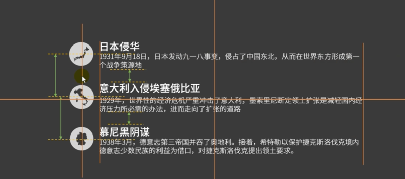
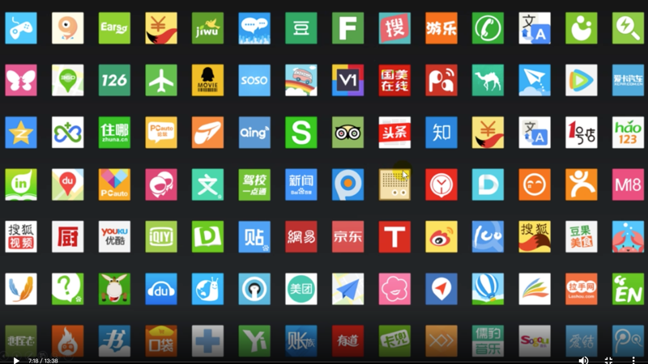
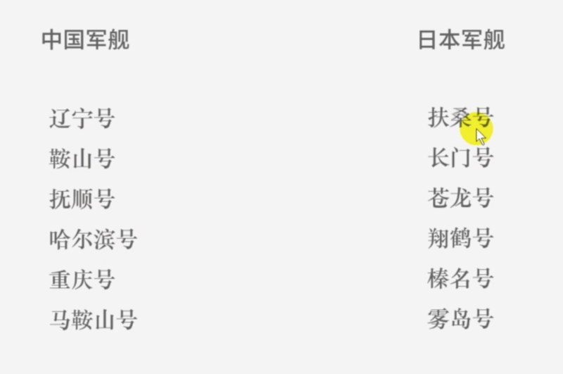

# 01设计篇

## 01. 设计思维

### 05. 排版 —— less is more

1、现代审美：1）字数不多的情况下，用细黑代替粗黑和衬线字体。2）图形一般不要描边。3）版式简单，背景简单。4）用扁平化的素材而不是立体、3D 素材。

2、删掉每一个和核心目的无关的像素。1）所有素材必须和核心目的有关系。2）杜绝错用和滥用英文，要么别写，要写就写对。

### 06. 秩序感和陌生感

1、对齐。

对齐1，对齐一切可以对齐的东西。不对齐的元素会让画面显得很杂乱。对齐2，别把图片歪着放，除非你的 PPT 是歪的。

2、亲密性：意思相近的东西近一些，否则会让信息看上去很费解。

3、一致性：重复的、大量的素材保证一致性。

4、陌生感。

1『人对陌生的东西会觉得高大上。中国看对方的，如同对方看自己的。』

你的素材和设计越是不常见，看上去就越是厉害。

2『平时注意去收集不常见的素材。』

一些体现：黑色背景好像比白色更厉害一些。黑色背景好像比白色更厉害一些。繁体好像比简体更牛逼一些（不建议）。

### 07. PPT 形状

右键，编辑顶点。

排列、分布和对齐。全选，格式，对齐。

组合与取消组合。建组 Ctr+G。

PPT 里的元素很多是矢量图，所以 PPT 其实是可以把它当做矢量图编辑软件用的。

### 08. 文字方面

文字跟图框元素可以 control+G 组合成块，但缩放组块的时候文字不会跟着组块一起缩放，可以选中文本框，右键另存为图片，然后组块来实现。

### 09. 颜色

颜色代码

RGB 颜色模式：适合电子设备；十六进制色彩值：适合前端代码；CMYK 颜色模式：适合印刷品。

渐变 1：左右两个滑块，两端的滑块设置 2 个颜色（默认是从上到下，旋转角度改为 0 度的话就改成了从左到右渐变）。

渐变 2：3 个滑块，3 个滑块颜色设为灰色，左右 2 个滑块的透明设为 100%，中间滑块的透明度设为 30-50%。

取色器的使用。

### 10. 图片

PPT 背景，常见的 3 种：纯色填充、渐变填充和图片填充。

渐变填充，一般用从上到下渐变，设 2 个滑块，左边滑块比较浅的颜色，右边比较深的颜色。

图片的裁剪：图片右键可以直接选「裁剪」功能。

图片突出。一般图片与背景边界处要有一个分离，有 2 种方式实现：加边框，图片格式里可以直接加边框，可以改边框的粗细、颜色等信息；直接给图片上一个阴影，也是在图片格式里设置。图片格式里有个「效果」选项，这里可以改阴影相关的设置。图片跟背景有了边界分割后给人的感觉就比较舒服了。

