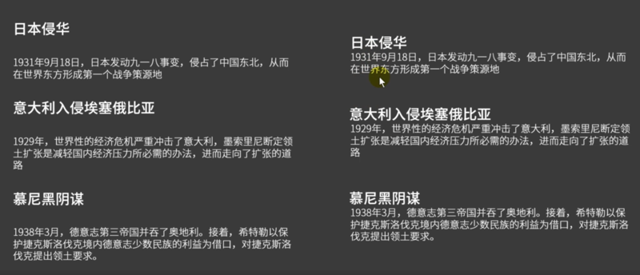
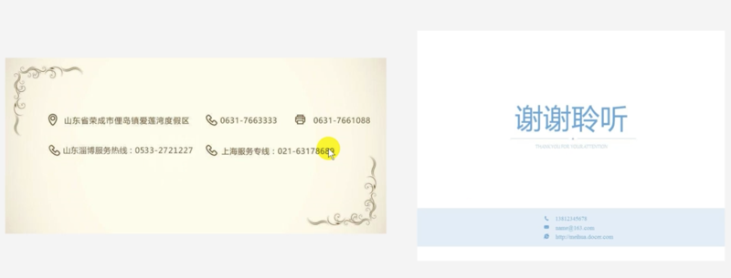
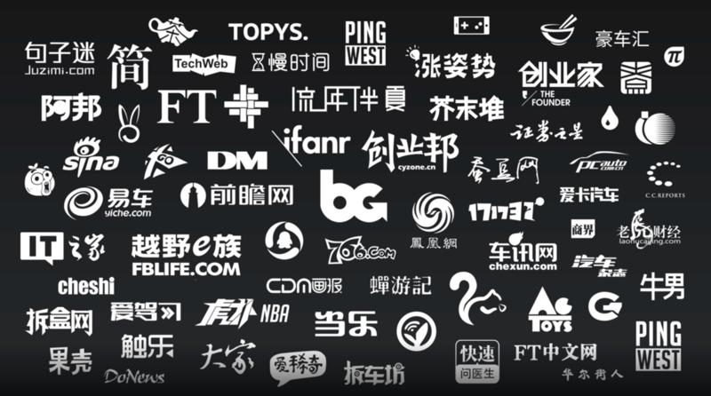
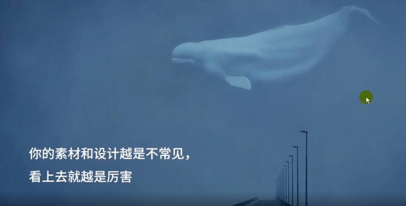
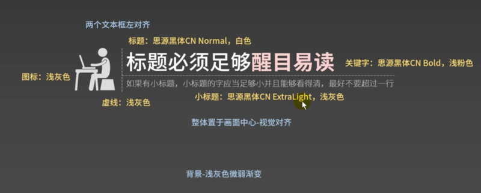
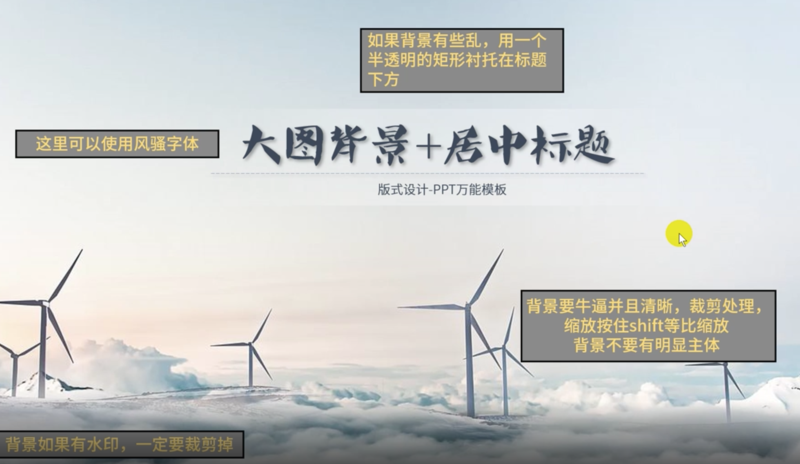
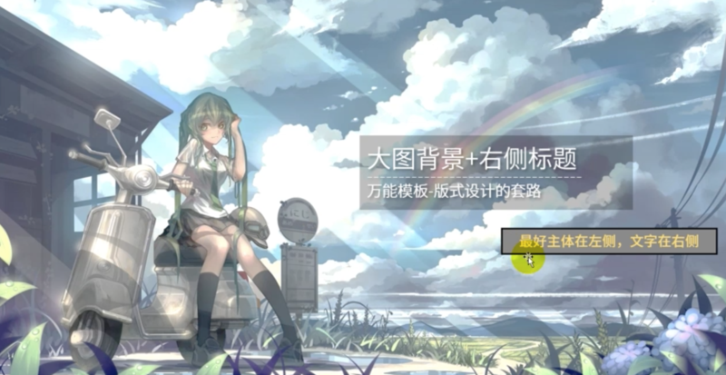
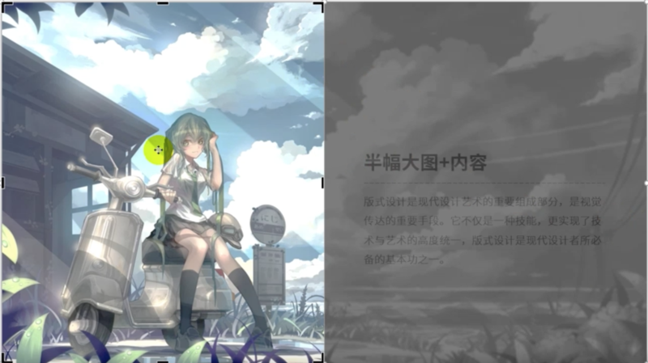
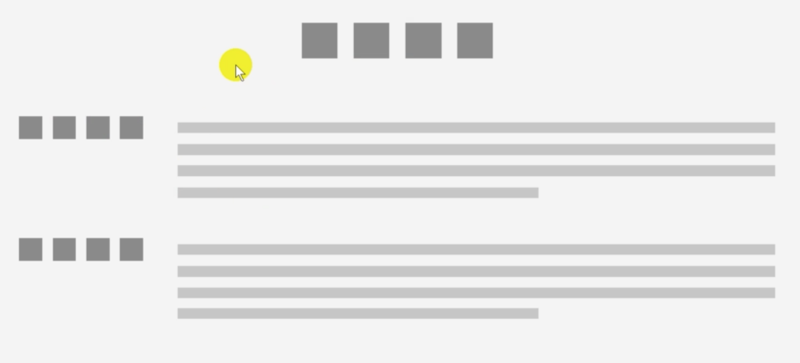
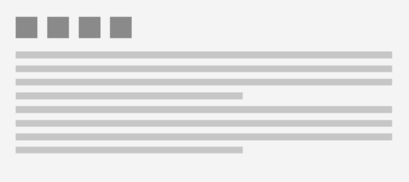

# 0101. 设计篇

## 05. 排版 —— less is more

1、现代审美：1）字数不多的情况下，用细黑代替粗黑和衬线字体。2）图形一般不要描边。3）版式简单，背景简单。4）用扁平化的素材而不是立体、3D 素材。

2、删掉每一个和核心目的无关的像素。1）所有素材必须和核心目的有关系。2）杜绝错用和滥用英文，要么别写，要写就写对。

## 06. 秩序感和陌生感

1、对齐。

对齐1，对齐一切可以对齐的东西。不对齐的元素会让画面显得很杂乱。对齐2，别把图片歪着放，除非你的 PPT 是歪的。

2、亲密性：意思相近的东西近一些，否则会让信息看上去很费解。

3、一致性：重复的、大量的素材保证一致性。

4、陌生感。

1『人对陌生的东西会觉得高大上。中国看对方的，如同对方看自己的。』

你的素材和设计越是不常见，看上去就越是厉害。

2『平时注意去收集不常见的素材。』

一些体现：黑色背景好像比白色更厉害一些。黑色背景好像比白色更厉害一些。繁体好像比简体更牛逼一些（不建议）。

## 07. PPT 形状

右键，编辑顶点。

排列、分布和对齐。全选，格式，对齐。

组合与取消组合。建组 Ctr+G。

PPT 里的元素很多是矢量图，所以 PPT 其实是可以把它当做矢量图编辑软件用的。

## 08. 文字方面

文字跟图框元素可以 control+G 组合成块，但缩放组块的时候文字不会跟着组块一起缩放，可以选中文本框，右键另存为图片，然后组块来实现。

## 09. 颜色

颜色代码

RGB 颜色模式：适合电子设备；十六进制色彩值：适合前端代码；CMYK 颜色模式：适合印刷品。

渐变 1：左右两个滑块，两端的滑块设置 2 个颜色（默认是从上到下，旋转角度改为 0 度的话就改成了从左到右渐变）。

渐变 2：3 个滑块，3 个滑块颜色设为灰色，左右 2 个滑块的透明设为 100%，中间滑块的透明度设为 30-50%。

取色器的使用。

## 10. 图片

PPT 背景，常见的 3 种：纯色填充、渐变填充和图片填充。

渐变填充，一般用从上到下渐变，设 2 个滑块，左边滑块比较深的颜色，右边比较浅的颜色。

图片的裁剪：图片右键可以直接选「裁剪」功能。

图片突出。一般图片与背景边界处要有一个分离，有 2 种方式实现：加边框，图片格式里可以直接加边框，可以改边框的粗细、颜色等信息；直接给图片上一个阴影，也是在图片格式里设置。图片格式里有个「效果」选项，这里可以改阴影相关的设置。图片跟背景有了边界分割后给人的感觉就比较舒服了。

## 11. 纯标题设计

适合：1、演讲环境，观众注意力在演讲者。 2、章节封面。

标题必须足够醒目易读。如果有小标题，小标题的字应当足够小并且能够看得清，最好不要超过一行。

字体要下载成套的。

对其一定是视觉对其，而不是物理对齐。

除了竖线，如何做另一种辅助工具（修饰）：插入一个矩形，格式设为无线条、渐变填充。第一个滑块选择白色（透明度 60-70%）、第二个滑块还是选择白色（透明度 100%）。角度选择 0 度。矩形置于底层。

注意点总结：1）视觉对齐，而不是物理对齐。2）耐心处理细节，越是简单的 PPT 美观程度越是取决于这些细节。 3）黑底白字比白底黑字更加醒目。

## 12. 大图的专业版式

常见的 3 模式：1）大图无中心元素，标题居中。2）大图中心元素在左侧，标题在右侧。3）右侧内容加半幅大图。

核心思想是一定要学会裁剪图片，裁剪成我们想要达到的效果。

纯色背景的图片编辑空间更大。比如一张竖着的图，右边可以插入个矩形跟它拼接成一张完整的大图，拾取图中的背景色作为插入矩形的填充色。

半幅图是通过裁剪获得的。

总结：

1、居中标题。1）图要牛逼，图要牛逼，图要牛逼，重要的事情说八遍。2）图不要有明显主体。

2、右侧标题。1）图要牛逼，图要牛逼，图要牛逼，重要的事情说八遍。2）图左侧有明显主体。

3、半幅大图。1）图要牛逼，图要牛逼，图要牛逼，重要的事情说八遍。2）有明显主体。

反例：大图对比不能太强烈；图片质量不高；图片色彩不行。

适合：大多数情況，前两个多用于封面、章节封面或需要强调的内容，半幅大图适合用于章节封面与需要强调的内容，但页数不要太多。

要点：1）图要牛通，图要牛通，图要牛逼，重要的事情说八遍。2）图是否牛逼直接决定你的 PPT 看上去是否牛。3）如果你觉得你做的没那么好看，很可能是图不够牛逼。4）图片搜索关键词：场景、摄影、壁纸、背景、高清大图、海报、原画、移轴摄影。5）大图 + 标题的原则是让大图和文字「融为一体」，在有空间的地方放标题，所以理想的图片素材应当留有空间。6）多看看优秀电影的海报（花瓣网），能给你很多版式设计的灵感。

1『用大图的目的是要把 PPT 做的跟海报一样。』

## 13. 多图片版式

好多图的标志：图片是一致的。

一般用长条形排列。

处理的一般手段：1）大小一致。2）配色一致。3）图片加边框（一般原则，大的图片边框细一点，小的粗一点），边框颜色可以用浅灰色，再加阴影。阴影和边框的目的都是为了加强一致性。

要点：1）一般来说，能不用就别用。2）给图片加上边框和阴影。3）尽量保证图片的一致性，一致性决定了这一页 PPT 的质最。4）图片多了说明我们的工作到位了，是误区。

## 14. 大段文字

衬线字体和非衬线字体不能混用。比如不靠谱的宋体，汉字是衬线的，而里面的西文又是非衬线字体，西文手动改成 new times。楷体也是衬线字体，而衬线字体非常适合这种大段大段文字的场合。

3『

衬线字体和非衬线字体。

』

要点：1）能不用尽量别用。2）正文使用村线字体，全英文的 PPT 不要使用中文字体。3）段落拉开间隔。4）不论内容如何，标题一定要有。5）白底黑字，少加装饰（白底黑字是保证大段文字可读性的一个重要原则，本身字多难集中注意力，再加装饰更分散注意力了）。
