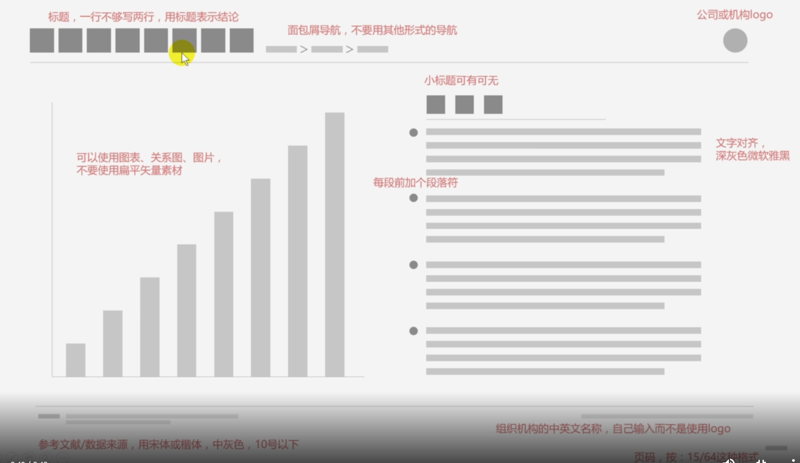
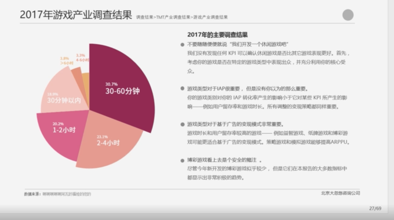
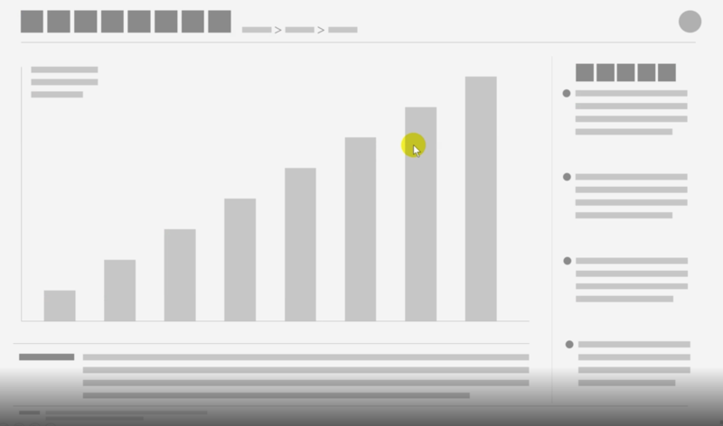
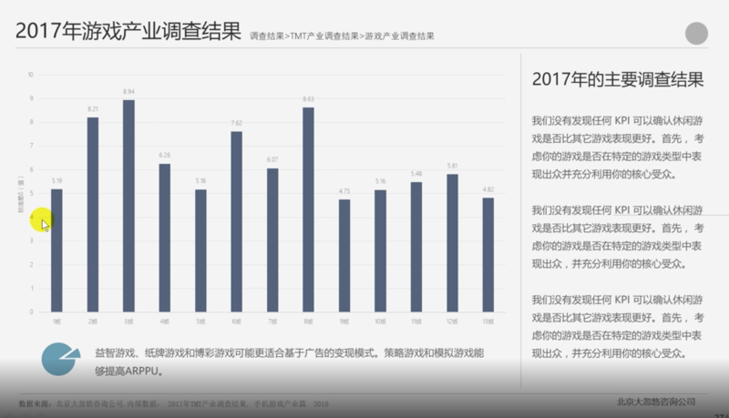
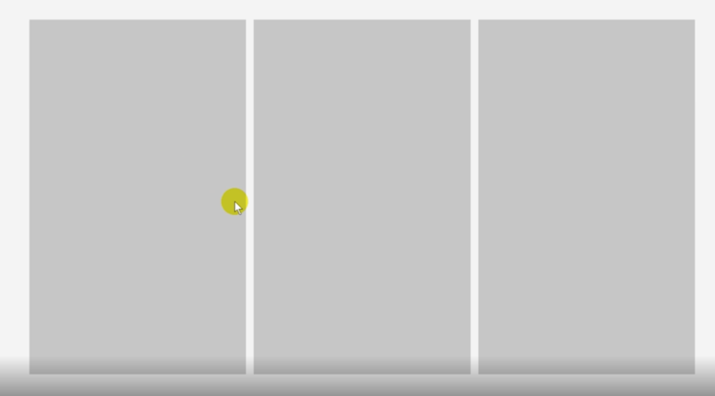
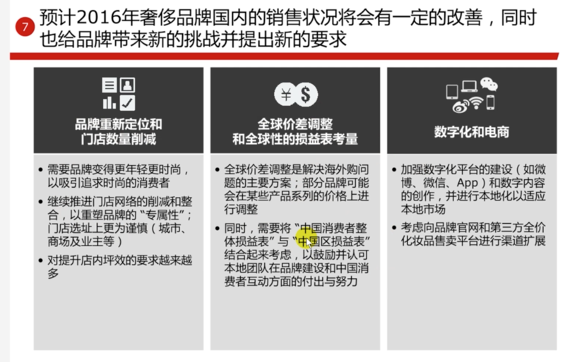

# 0201. 排版篇

## 15. 平衡型排版

工作式 PPT。

段落前面的小圆点，建议自己绘制一个圆形填充。

最后可以 ctrl + G，全部元素组合起来。

## 16. 网页式排版

布局里的图片可以用白底的，是为了抠图，对其进行删除背景操作，格式 > 删除背景。

学会多用取色器取这张 PPT 的主题颜色。

## 17. 三分式排版

所有工作式 PPT 的基本思路都是拿矩形把页面分割开，目标是把整个版面填充起来让其看着十分详实。

1）几乎所有排版都是用矩形区域把画面占满。2）排版很容易，处理细节比较难。3）你越是耐心，你的 PPT 质量就越高。

