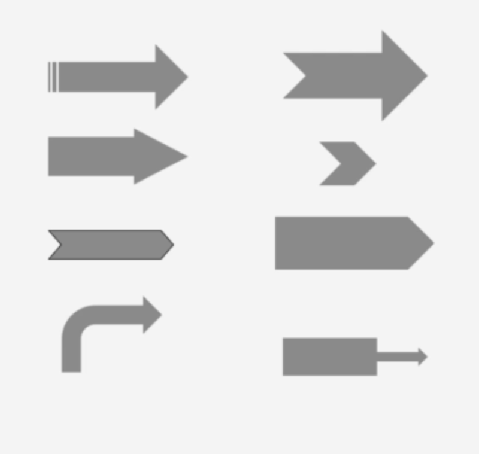
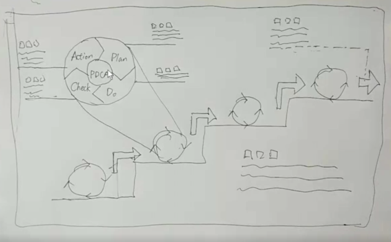
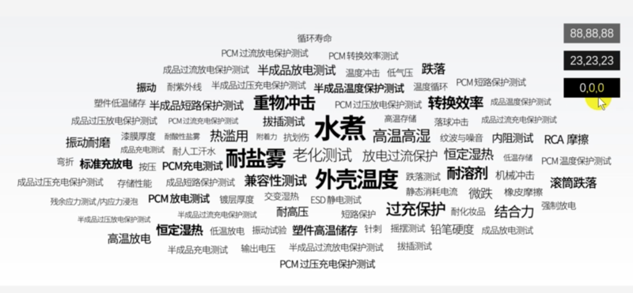
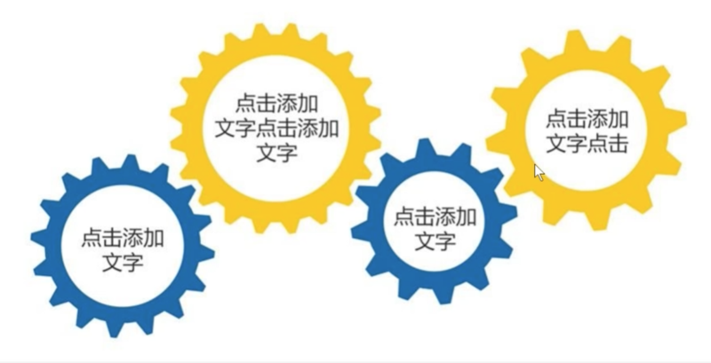
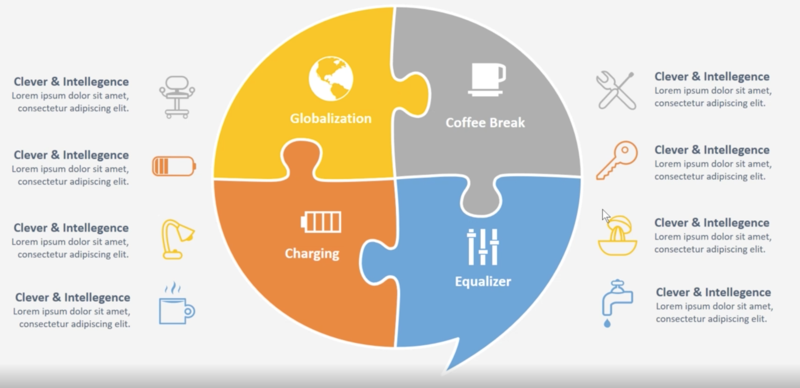
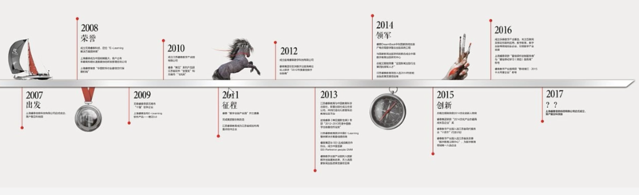
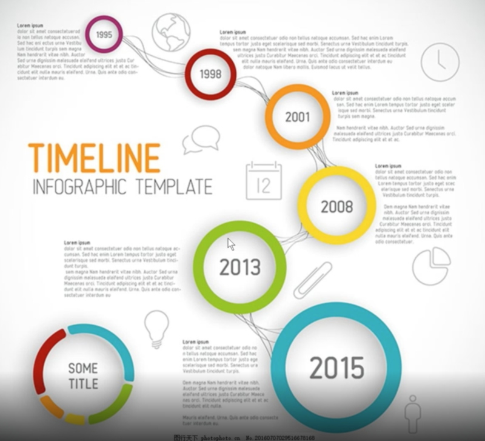
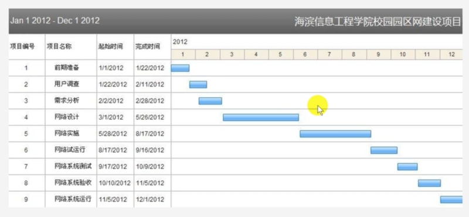
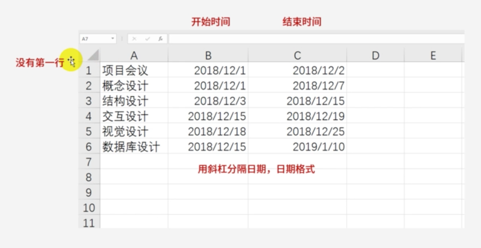

# 0301. 逻辑篇

## 18. why——逻辑递进

使用矩形和箭头。

适用情况：1）步骤：先完成什么，再完成什么。2）条件：完成一组条件后，才能解锁下一环节。

注意事项：1）使用明显的箭头。2）左右递进的表达效果好于上下递进。3）不要使用金字塔形表示递进关系。4）数字不能表示递进关系。5）反向箭头必须加说明。

递进的主要元素：1）明显的箭头链。2）没了。

## 19. What——复合关系图

核心目的是你想让观众明白什么样的逻辑。1）先在纸上画出草图，再去找素材，不要拿着素材整理思路。2）素材可以修改，但不能将就。3）不论你要表达的逻辑有多么复杂，最重要的逻辑一定是简单逻辑（对方一听就知道了）。4）标题是结论。5）检查是否有歧义。6）对比和并列关系一般不要画逻辑关系图。7）远离 Smart Art。

让别人理解你的逻辑往往是一件困难的事，所以你的逻辑关系图应该尽量做到让傻 X 都能看懂。

### 好例子

核心目的：让观众明自多次 PDCA 循环能使管理水平有阶梯式进步。

核心逻辑：阶梯式进步（递进关系）。次要逻辑：PDCA 循环（循环关系）。

先画草图：

善用配色表。

PPT 宽屏的默认尺寸是 33.867x19.05 cm，设置里可以找到。

从 PPT 复制元素到 AI 里会自带一些蒙版，需要删掉。

一个核心思想是现在 PPT 里借助其工具话矢量元素，直接复制到 AI 里加工。

注意，AI 里做好后，全选，control + shift + O，做一个转区的操作（把字体转成曲线）。

## 20. Where——词云

关键词云：1）最好的方式是用文本框拼，使用同一类非衬线字体。2）最大的关键词不是标题。3）色系一致，最好不要倾斜（倾斜的不好看）。4）字体大小要有明显差别，但差别不要过大 。5）重要的在中间，不重要的在四周。6）给词云一个轮廓形状这种事要谨慎。7）可以考虑使用易词云等工具。

## 21. Who——耦合关系

适用情况：强调事件之间的紧密联系。

注意事项：1）用标题讲明白内在联系。2）形状之间不要叠加，不要让观众误认为是韦恩图或者饼图，可以用齿轮或者拼图的形式。3）耦合与并列的区别：并列强调内容，耦合强调关系。

并列不要用关系图，用罗列即可。

拼图的形式：

判断哪些可以使用耦合型关系图：1）支持「大学生创业利大于弊」的三个论点（不适合）。 2）某种材料的四个主要化学成分（不好说，看是否会相互作用）。3）介绍一种产品的四个分销渠道（看情况）。4）西北五省的汽车保有量（不适合）。5）PM2.5 的几个主要致因（适合）。6）导致某次交通事故的 5 个原因（看情况）。7）某项目组的三个核心部门（适合）。8）小说的三要素（适合）。9）四大名著（不适合）。

耦合简单说各元素会相互作用，耦合强调关系而并列强调内容。

## 22. When——时间递进

时间递进用时间轴。

适用情况：时间先后，先发生什么，后发生什么。

注意事项：1）使用明显的「时间轴」。2）注意时间轴的刻度。3）谨慎使用「下坡路」。4）不要用箭头指示事件。

时间轴的主要元素：1）明显的箭头。2）明显的时间刻度。3）事件。

下坡路可以选择下面这种曲线式的，这样就不会寓意走下坡路了，哈哈。

对其的操作，选横向分布。

图片格式里可以通过偏移达到想要的效果。

## 23. How——甘特图

甘特图：1）小于等于三个项目使用复合时间轴而不是甘特图。2）如果你想让甘特图看上去很漂亮，使用表格 + 矩形，但这种方式比较麻烦。

用 Visio 来画甘特图。

