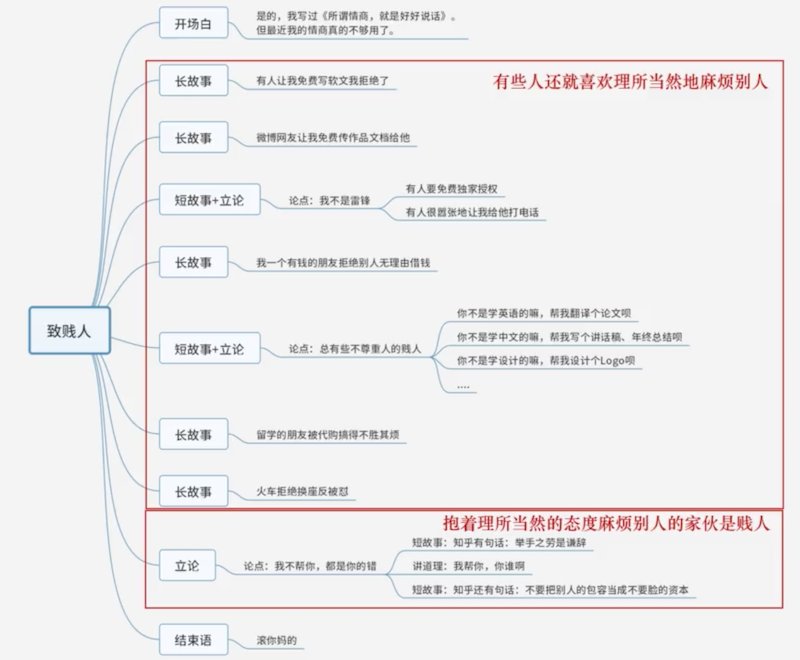

# 0501. 演讲篇

## 01. 立论的逻辑

立论正确 = 方法正确 + 内容正确

三段论：所有的 A 都是 B，所有的 C 是 A，所以 C 是 B。

《铁幕演说》。非社会主义国家有责任结盟对抗共产主义威胁，美国是非社会主义国家中的代表，所以美国有责任结盟以对抗共产主义威胁。

《致贱人》。抱着理所当然的态度麻烦別人的家伙是贱人，身边有些人还就喜欢理所当然地麻烦別人，所以这些家伙是贱人。

《相信奋斗的力量》。所有人奋斗后都能道袭，（你是所有人中的一个）所以你奋斗也能逆袭。（反例，「所有人奋斗后都能道袭」？）

《为人民服务》。凡是为人民服务过的人，其死都是重于泰山的，死得重于泰山的人是值得开追悼会的，所以为人民服务过的人死后是应该开追悼会的。

段论的组织过程取決于你的论证倾向。立论：大学生谈恋爱弊大于利。方式 1：不成熟的人谈恋爱是弊大于利的，大学生是不成熟的，所以大学生谈恋爱是弊大于利的。方式 2：收入不稳定的人谈恋爱是弊大于利的，大学生是收入不稳定的，所以大学生谈恋爱是弊大于利的。

逻辑错误：否定推理。运动员都是要锻炼身体的，我不是运动员，所以我不需要锻炼身体。

逻辑错误：归属错误。一切金属都能导电，石墨能导电，所以石墨是金属。

逻辑错误：偷换语义。中国的大学分布在全国各地，北大是中国的大学，所以北大分布在全国各地。

## 02. 演讲大纲的布局

一个靠谱的演讲大纲包含如下内容：1）主要观众调查或推测，至少明白四个问题：学历，年龄，职业背景，收入情況。2）三段论式立论和演讲题目。3）开场白的逐字稿，必须是逐字稿。4）思维导图-演讲的内容梗概。

大纲——《致贱人》

1、主要观众调查。学历：大专或本科，受过高等教育；年龄：以年轻人为主，推测 20-35 岁；职业：脑力工作者；收入：任何收入情况都有可能。

2、三段论式立论。抱着理所当然的态度麻烦别人的家伙是贱人，（主要论证）有些人还就喜欢理所当然地麻烦别人，（主要论证）所以这些家伙是贱人（不论证）。

注意：1）把所有的故事都写上，即使只有一句话也写上。2）长故事可以不立论，短故事必须立论。3）简短地讲道理能让你的论点升华。

## 03. 震撼人心的开场白

开场白比你想象得重要的多。1）寒暄：说一些场面话。寒暄看场合，要说只说一句，要么就不说。2）破冰与开场：拉近双方距离，引出演讲内容。

开场白：上场的前三句话非常重要；有趣，吸引注意力，拉近双方距离。

1、拍马屁，不留痕迹地拍马屁：1）在座的各位都是 XX 行业的骨千，XXX 的工作就需要你们来领头了。2）今天，我们站在这里！站在德国人的土地上！站在柏林，这块我们祖先用鲜血和尊严浇灌的土地上！我的身后，是安德烈柯里昂的雕像！他是全世界公认的自由斗士！他是全世界的光！3）就在前天，习近平总书记来学校视察，高度评价了北京大学对民族解放和国家建设做出的卓越贡献，对学校的改革发展和所取得的成就和进步，给予了充分肯定。4）每当想起耶鲁时，我感触最深的不是这里浓郁的政治氛围，也不是我所接受的顶级的法律教育。正是在耶鲁，我开始做一些事情这些事情从那时到现在都是我关心的核心。（高级境界是很隐晦，但让人舒服，不要直接去夸）

2、提问题，能让观众回答出来的问题：1）在座的有多少准备考研的同学，举手示意我一下，好的。2）今年我们的工作完成的非常圆满，大家猜一猜集团一共完成了多少销售额，1000 万？低了，继续猜。。3）我们想一想，今年热搜的 top10 都会是哪些词？贸易战？滴滴顺风车？对，世界杯....（注意点，观众是年轻的，这样才可能相应）

3、讲故事，讲和观众有关的故事：1）还有三个半小时，2017 年就要过去了。每个人的 2017 应该都不一样。所以从一个月前，我就不断的问我身边的朋友和我们的用户 2017 年，哪一天你认为很重要？得到的最多的答案，都是说 10 月 18 日，十九大召开的那一天很重要。2）今天，我高兴地同大家一起参加这次将成为我国历史上为争取自由而举行的最伟大的示成集会。100 年前，一位伟大的美国人——今天我们就站在他的雕像前一签署了《解放黑奴宣言》。这项重要法令的颁布，对于千百万灼烤于非正义残焰中的黑奴，犹如带来希望之光的硕大灯塔，恰似结束没没长夜禁锢的欢畅黎明。3）XX 年 1 月份北京，一个月里头 25 天雾霾。那个月里头，我还去了四个地方出差：陕西、河南、江西、浙江。回头看视频里的天空，当时的中国正被卷入一场覆盖了 25 个省市和 6 亿人的大雾霾。

4、说观点，要么和观众有关，要么能吓死人：1）阿里创办至今 15 年，淘宝是 11 年，支付宝是 10 年。我们比较运气，这 15 年我们确实走得比較快，今天看过来还不错，但是期间犯的错不亚于任何一家创办二三十年的公司，可能比他们犯得还要多。2）我本来在台上习惯把手背到后面，后来 5.20 之后，网上有我在台上的照片，两个胳膊背到后面像无臂人。现在正式开始，这个海报没什么，就是做一个噱头。我还健在，而且没有得绝症。3）今晚，我要借此机会向大家发表演说，因为我们已经来到了战争的关键时刻。4）我始终相信任何一个人想要改变自己的人生，想要改变自己的命运，最佳的法宝或者说最好的力量，就是去进行奋斗，我相信在座的各位同学坐在这儿也是来吸取这种力量。

注意点：1）如果要做自我介绍，迅速做完。2）不要在开场自上瞎纠结，不超过一分钟或者演讲时间的 10%。3）一字不差的背熟。4）注意主持人讲的内容，调整自己的开场白。

## 04. 初次演讲前的准备清单

1、一切演讲都是不完美的。

2、做好万全准备。1）仔细打磨演讲稿。写大纲和逐字稿，两者都要准备；梳理故事，尤其是长故事要经过反复推敲修改；打磨开场白，不要安排过于复杂的互动；尽可能做观众调查，规避禁忌词汇。2）演练到自己满意的程度。脱离 PT，看着大纲进行演练（逐字稿要准备，但不要背）；对着镜子演练，看着自己的眼晴，声音大一些，克服羞耻感；开场白必须一字不差地背下来；如果内容很多或者自己实在记不住，早点去淘宝买个趁手的手卡（建议深色无图案的）。

3、初次演讲合格水平：1）不严重卡売、忘词能接下去，顺利地讲完所有内容。2）重要论点和论据没有遗漏。

4、克服紧张情绪：1）上合前心理暗示。我这不是紧张，是激动。可以告诉周围的人自己非常紧张；2）如果你真的很缺乏演讲经验，就将逐字稿背熟；3）台下如果有观众是认真状或者微笑脸，可以多看看他们；4）腰杆挺直，声音高八度；5）背会三句死都不会忘的开场白。

5、处理车祸现场：1）忘词：过渡或者跳过。2）设备问题：准备无 PPT 演讲稿；3）Q&A：控制问题的数量，一般时间 5min 以内，数量 5 个以内。
