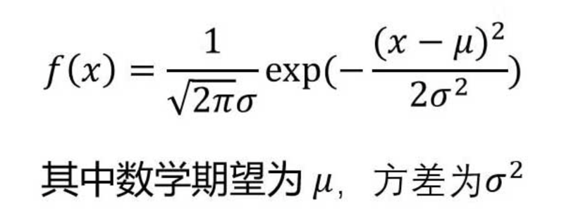
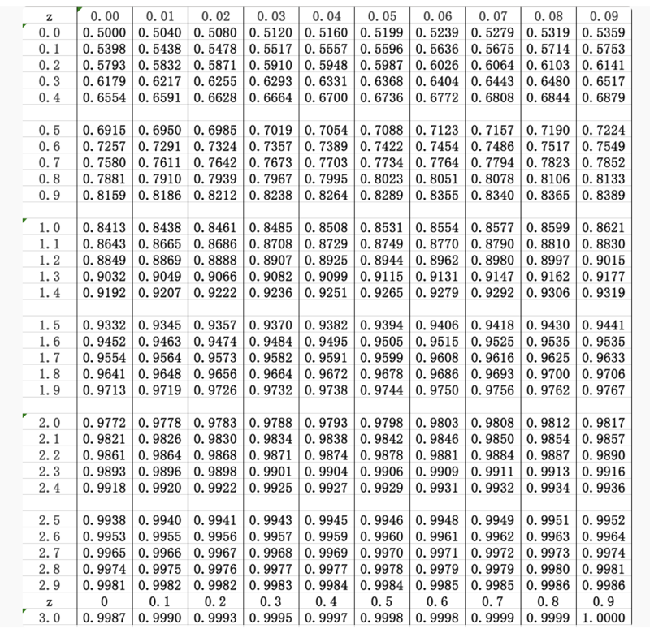
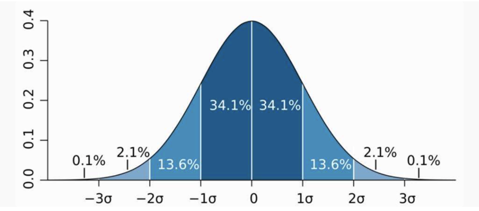

# 0301. 概率分布：认识现实世界的数学模型

刘嘉·概率论 22 讲

2020-07-25

上一模块，我们重点讲了频率法，并且学习了期望和方差这两个描述随机事件的重要指标。从这一讲开始，我们进入课程的下一模块 —— 概率分布。你可能听说过正态分布、幂律分布这些名字，对它们的含义可能也有或多或少的了解。这一次，咱们就从概率论的角度正本清源地讲一讲。模块第一讲，我会先带你从整体上理解概率分布，看看正态分布、幂律分布这些词都是怎么来的，又有什么具体的意义。

## 1.1 随机变量与概率分布

咱们知道，数学家解决问题的方式就是抽象。如果一类事物能找到共同点，就会被抽象成一个数学量。在处理随机事件的问题上，这个抽象出来的结果就叫「随机变量」。

什么是随机变量呢？简单说，就是把随机事件可能的结果抽象成一个数字，每个数字对应一个概率。这个随机变化的数字，就是随机变量。有了随机变量，我们就把现实世界和数学世界打通了。要寻找一个随机事件的规律，直接分析随机变量这个具体数字的变化情况就好了。比如，要研究中国人银行存款的状况，银行存款余额就是这件事的随机变量，咱们每个人的存款余额，就都是这个随机变量的一个结果；要研究地震的强度，地震的级别就是一个随机变量，1 到 8 级，每个震级都是随机变量的一个结果。

把随机变量所有的结果和它对应的概率全部统计出来后，我们就有了一个东西 —— 概率分布。还是地震的例子，如果把所有地震的震级都统计出来，根据频率法，我们就能知道不同级别的地震发生的概率了。1 级地震的概率多大、2 级地震的概率多大…… 一直到 8 级地震的概率多大，全都一清二楚。这样，我们就对地震这件事有了整体的认识。

到这里，概率分布的作用估计你已经看出来了，就是整体上的确定性。通过从整体上描述一个随机事件所有可能的结果和对应的概率分布情况，我们就能像上帝俯瞰世界一样，从整体上把握这件事的基本轮廓，也就为进一步探索其中的规律提供了可能。

## 1.2 用模型代表现实世界的规律

每一个随机事件都有自己的概率分布。随机事件不同，概率分布自然也不相同。但经过不断的研究，数学家们逐渐发现，概率分布是有规律可循的。比如人的身高和智商，看起来毫不相关，但它们的分布情况挺相似的，都是正常水平的比较多，而特别高和特别低的非常少。再比如地震，小规模的地震数量很多，但破坏性很小；大规模的地震数量很少，但破坏性很大，这和个人财富的分布状况又比较一致。

更进一步的，数学家们还发现，这些概率分布的变化规律甚至可以用数学公式来精确表示。这一个个的数学公式，就是我们这一讲说的概率分布模型。像常见的正态分布、幂律分布，以及后面会讲到的泊松分布，都是这些模型的一种，分别对应不同的数学公式，代表一种独特的变化规律。

当然，就像印度《吠陀经》说的：「真理只有一个，哲人用不同的语言表达。」概率分布模型的表示方式也很多，常见的有三种 ——

第一种，就是那些让人头大的数学公式。

▲ 正态分布公式

第二种，就是列表。把随机变量可能的结果和对应的概率全部列出来。想知道某个结果出现的概率，直接查表就好了。

▲ 正态分布表

第三种，就是画图。横坐标是随机变量的结果，纵坐标是对应的概率，画一个概率分布图。你可能见过正态分布、幂律分布的曲线，其实就是这种表示方式。

▲ 正态分布图

三种方式各有优缺点。列表很直观，但来回查表比较繁琐；画图很形象，但看图时往往会有一些误差；公式很简洁，也很精确，但门槛比较高，很多人看不懂。对于从事数学工作的人来说，我当然更喜欢公式。只有看到了唯一确定的数学公式，我们才会觉得找到了这件事的规律，才会觉得踏实。因为这种对真理的偏好和对公式的偏执，现实世界里越来越多的随机变量的变化规律，被数学家发现了。也就是说，我们的概率分布模型越来越多。有了这些模型，解决各种随机事件就简单多了，看看它适用于哪个模型，直接带入公式计算就好了。

现实世界纷繁复杂，各种随机变量数不胜数。但在概率学家眼里，它们只分为两类 —— 一类是已经找到了变化规律，可以用概率分布模型描述的；另一类是还没有找到变化规律，无法用概率分布模型描述的。

对于规律相似的同一类现象，概率分布模型只有一个，只是模型中的参数不同。比如人的身高和智商，它们的规律就很相似，都服从正态分布，只是各自的均值和方差不一样。同样的，地震和个人财富大体上都服从幂律分布，只是对应的幂指数不同。

当然，如果不是同一类现象，不遵循同一个规律，就不能用同一种概率分布模型。如果非要拿着正态分布的公式去计算幂律分布，肯定是要闹笑话的。至于正态分布和幂律分布是什么意思，你先不用太纠结，后面会详细讲到。你只要记着，它们是不同的概率分布模型，代表着不同的概率分布规律，不能混用，就可以了。

## 1.3 用模型不断逼近世界的真相

找到了变化规律的，可以用概率分布模型描述。还没有找到变化规律的怎么办呢？只能束手无策吗？当然不是。

一般情况下，面对一个无法解释的现象，专家会先假设它服从某个概率分布模型，然后再去验证假设。比如对于股市这个问题，过去的经济学家发现：股票的波动情况和抛硬币一样，连续两天都涨或连续两天都跌的可能性差不多都是 50%，挺服从正态分布的。于是，他们就用正态分布来模拟股市，并根据这个模型的数学特征，比如数学期望、方差、极端情况出现的可能性等，来构建整个金融体系的风险系统。最后，人们拿模型的预测和现实中股市的涨跌情况做个对比，发现变化挺一致的。所以人们就认为，股市的变化服从正态分布这个模型。

但是很快，这个结论就出问题了。金融危机爆发的时候，市场完全不遵循正态分布的规律。在正态分布的模型中，几十亿年才会出现一次的极端情况，会在一天内反复出现。这时候，人们终于明白 —— 用正态分布来评估股市的风险，可能压根就是错的。换句话说，我们可能从一开始就选错了模型。

请注意，是我们选错了模型，而不是说模型本身是错的。概率分布模型是逻辑的产物，百分之百是正确的；但是模型那么多，我们选择时可能出错。打个比方，菜刀的设计没有错，但你用菜刀钉钉子，就不免会伤到手。错的不是菜刀，而是你选错了工具。

模型选错了怎么办呢？当然是重新选择新模型。在研究过极端情况后，金融分析师就发现，用正态分布描述金融资产的风险不对，也许肥尾的柯西分布更有效。当然，你不用管柯西分布是什么意思，这里只是想告诉你：概率分布就好比一个工具箱，一个个的概率分布模型就好比是工具箱里的工具。遇到问题，我们从工具箱里找工具解决。如果工具选错了，就得重新选择。

目前，有多少种工具供我们选择呢？常见的有几十种，像正态分布、幂律分布、指数分布、泊松分布都是其中的一种。不过这个数字肯定会越来越大，因为数学家还在针对不同的现象、不同的变化特征，发现和发明新的模型。

1-2-3『又想到了「2019825模型思维 | 2019825The-Model-Thinker」那本书，一定要去研读。（2021-02-14）』——未完成

你可能会好奇：如果试了所有的概率分布模型，还是无法准确描述某个随机变量，这时候怎么办呢？老实说，这样的例子很多。像金融和社会领域的一些现象，目前确实还找不到合适的数学模型，但数学家们一直都在努力。我们坚信，任何事物都是有规律可循的，所以继续探索，发现更多模型的工作永远不会停。不断探索真理，向真理世界靠拢，这不就是科学发展的过程吗？

## 黑板墙

思考题：很多人喜欢民国，想着民国时期有那么多学术大师、名媛和文艺青年，于是就想穿越回去。根据今天学的概率分布，请你分析一下，假如我们穿越回民国，更可能成为林语堂、张爱玲这样的天才作家，还是拉车的骆驼祥子呢？

下节预告：虽然概率分布模型有几十种，但是几个常见的就已经能帮我们理解大部分现象了。这个模块接下来的几讲，我会向你介绍几种常见的概率分布模型。下一讲，先说最重要也最简单的正态分布。

### 01

民国学术大师有多少？占人ロ比例是多少？或许很少，因为少，就比较亮眼，所以我们都能数得出来，反而感觉很多。而今天我们的人口是当时的数倍，科学家作家也是不少的，但我们可能反而觉得少了。凡事要用数据说话，按此估计，回到民国成为拉车的概率更大，因为当时的文盲比例远远大于现在。

作者回复：我带着美好期望穿越回民国，想着王国维、梁启超、章太炎、陈寅恪、鲁迅、钱钟书、沈从文、徐悲鸿、齐白石、张大千、胡适、季羨林、钱学森、童第周、李四光、竺可桢。再不，当个成为徐志摩，嗯。想着想着我竟笑出声来。脑袋被打了ー下，「睡什么觉，还做梦？快点去拉车了！」

### 02

大概率会去拉车，两个阶层的人群相差太大。但如果你比普通人智商更高，更懂历史，长的更好看，把握机遇的能力更强，穿越的家庭条件更好，学习能力更强，那成为大作家的概率会比普通人高很多，但还是大概率成拉车的。今天股市大跌，很多人又开始讨论起来了，我想下刘嘉老师，怎么能通俗易懂地，从概率方面向身边人讲清楚股市在短期内的不可预测性，随机性？每次大涨大跌都有很多来问后市的身边朋友，我只能说，我也不知道。怎么讲明理由让其明白。

作者回复：股票短期来看是「投票机」，长期来看是「称重机」。投票机，影响投票的因素浩如烟海，甚至无法枚举出全部因素，也无法说清楚那几个因素最主要，因为不同的时间点，最主要的因素可能是在变化的。跌是个随机现象。看一个行业是不是「运气」占主要因素，有个简单的逻辑，你想输，能不能真的输。

### 03

这个问题有点类似于有的人觉得自己与同事处不好，换个环境就会顺了，有的人学习不好，父母把他送出国，学习就会变好了一样。我觉得一个人的能力、习惯，至少在短时间内都是不会大变的，处理不来的问题，在新环境还是一样的。同样，牛人到哪里，也都是闪闪发光的。优秀是一种习惯，金子在哪里都是那样耀眼。如果说，乱世出英雄，机遇只适用于那些本身就很牛但就差一点点运气的人。还有个问题问老师。为什么要假设它是某种分布，再去验证？我觉得把数据画成图，不是就一目了然了吗？比如，画出来是钟型，就是正态分布，是陡峭的刀状的，就是幂律分布。

作者回复：正态分布是钟形曲线，而钟形曲线未必一定是正态分布，柯西分布也是钟形的，差别只在尾部的高低上。判断分布，首先是性质，每个分布和其他分布区别的最重要的不是公式，不是曲线，而是每个分布拥有一种或几种不同的性质。这些性质其实反过来決定了公式，公式再決定了曲线。了解分布，重要的是了解性质，了解模型，重要的搞清楚性质。

### 04

平时最常见的概率分布就是正态分布和幂律分布。简单的说，投入要素的边际产出有刚性限制的事情，往往呈现正态分布。比如管理者如果凡事喜欢亲力亲为，那他的投入产出图形就应该是正态分布。因为对于一个人来说，时间是刚性的，你再努力ー天也只是 24 小时。所以一个管理者如果凡事都是自己动手，小富即安可以，大富大贵实现不了，因为超过一定的限度，再多的资源投入也白搭。但是对于边际成本趋于零的事情来说，就可能呈现强者通吃的幂律分布状态了。比如有专利保护的药品，有研制秘方的食品，通过在线播放的课程等，这些行业容易产生巨头和垄断者。

### 05

穿越回去成为普通大众的可能性最大，就好像我们总梦想着能穿越到清朝，想当然的成为富贵人家的大小姐与雍正爷谈场可歌可泣的恋爱一样，但可能性最大的却是成为贫苦人家的丫头整天以织布浣纱为生。因为张爱玲也好、林语堂也好，本身就是因为拔尖儿能被记得住，倘若每个人都是如此优秀，为啥人们非得记得他们呢？正是有我们这样平庸的芸芸大众，才能衬托出他们的出彩啊。另有一个问题想请教老师，科学家们一直致力于发现生活中随机变量里的数学规律，这是不是意味着我们这个宇宙本身就是数学的，我们都置身于被设计好的数学中，「真理」不过是在等着我们去发现而已，如果将来科学家揭开数学的最后一块面纱，又会发现什么呢？

作者回复：宇宙基于数学，这只是一种声音。数学背后的纱就是逻辑推理，这是一个完全抽象也完全正确的东西。

### 06

每次选择「概率分布模型」的时候都是随机选择吗？或者都是先选几个常见的来测试吗？有没有几个或一些指标来少这个过程呢？

作者回复：先分析特征，看看这件事儿有没有我们已有的分布模型身上的特质，比如正态分布的稳定性、幂律分布的无标度，指数分布的无记忆等等。再使用数据，看看这个分布是否可以符合现实的数据情況。如果吻合，就先假设这件事儿服从这个分布，再不断验证。

### 07

如果穿越回民国，大概率还是一个普通的底层老百姓，毕竟拉车的人占比更大，而天占比很少。今天这节课说到，还有许多现象，目前找不到合适得概率模型来描述，那数学家们怎么一般都是怎么探寻这些模型的呢？利用大量的真实数据，用计算机模拟计算出来，这样的思路是否可行？

作者回复：1）找特征，去匹配有这个特征的分布，所以学习所有分布，首先要了解这个分布的特征，比如正态分布的稳定，指数分布的无记忆，幂律分布的无标度，等等。2）找不到特征，就猜测是正态分布，在找数据去验证，如果吻合，就谨慎小心地说，这件事儿服某某分布。3）持续关注异常。

### 08

请教一个问题，假设大输液产品的无菌保证值 F0 => 8 是无菌输液药品生产的最低标准，即灭菌工艺需要保证灭菌后输液中能存活的活菌数比灭菌前下降 8 个数量级，即亿分之一，再假设 2019 年中国生产的输液数是在 11 瓶 / 袋这个水平上，请问我们应该怎么理解这个灭菌概率在现实中的意义？1）每一瓶输液灭菌是否成功，是一个独立事件，在 110 亿瓶 / 袋总产量中，有 110 瓶灭菌不彻底是完全正常的概率事件？ 2）在灭菌过程中，每一个活菌灭菌是否成功是一个独立事件，即使是无菌保证值 F0=8，完全正常的灭菌工艺，每细菌都有亿分之一的概率存活下来，所以无菌保证水平亿分之一看起来很严格，但ー旦基数放大到一个惊人的量级之后（例如全世界生产的总输液瓶 / 袋数，例如全世界生产的所有输液中灭菌前的总活菌数等）定量的灭菌失败仍然是可能发生的一个正常事件，即使所有工艺和质量保证工作都已经做到位？

作者回复：我没太看得懂，但是我大概理解你的意思。1）小概率事件几乎必定发生（足够的时间足够的次数），一定会有不符合标准的输液产品，数量取決于杀菌成功率和整体产量。2）一般来说，杀菌符合不符合标准，这不是独立事件，往往是一个批次，或者连续的一批。你发现每次召回也好，公告也好，都是按照批次的。