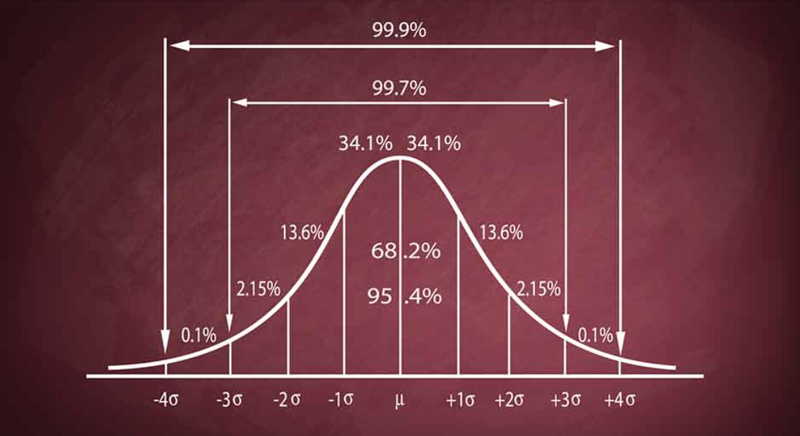

# 0302. 正态分布：最简单却最重要的概率分布

刘嘉·概率论 22 讲

2020-07-26

上一讲，我们从整体上理解了概率分布，知道了概率分布模型是对现实规律的抽象总结。从这一讲开始，我们就深入学习几个典型的概率分布模型。

概率分布模型有几十种，从哪一个讲起呢？你去问任何一个概率老师，得到的答案肯定只有一个 —— 正态分布。原因很简单，正态分布是概率分布中最重要的分布。在数学家眼里，它是远远高于其他分布的。这一讲，我们就先了解一下正态分布的数学性质和应用；下一讲，再看看正态分布到底有多重要。

## 2.1 正态分布的发现

要讲正态分布，我们得从天文学史上的一桩公案说起。1801 年初，一个神秘的天体出现在天文学家的视野中，几周之后又神秘消失。它是什么？又去了哪儿？没人知道。正在所有人都束手无策之时，「数学王子」高斯站了出来，他用一支笔计算出了这个天体的运行轨道。果然，在高斯指定的位置，人们重新发现了它。这就是人类发现的第一颗矮行星 —— 谷神星。

你可能好奇，高斯是怎么计算出这颗天体的运行轨道的呢？很简单，他在计算的过程中使用了正态分布。没有正态分布，人类束手无策；有了正态分布，竟然能精准计算一颗遥远的天体的位置。你说正态分布厉害不厉害？而且从此以后，正态分布就席卷一切，不仅推动了数学、统计学、物理学、工程学等众多领域的发展，而且还有很多其他的分布，比如说对数正态分布、T 分布、F 分布都是直接由正态分布推导出来的。

「正态分布」这个词，听上去挺复杂的，但它的英文表达就简单多了，叫 normal distribution，直接翻译过来就是「正常的分布」「一般的分布」。咱们国家台湾的教科书通常叫它「常态分布」。其它分布都是特殊的，只有正态分布是一般的、正常的。从名字上，我们也能感受到它的重要性。

作为数学史上数一数二的人物，高斯的伟大发现不胜枚举。甚至有人说，在高斯所在的那个时代，几乎所有伟大的数学成就都是高斯最先发现的。所以，高斯并不觉得自己发现正态分布是多了不起的事情，他的墓志铭上，刻的也是他的正十七边形，而没有提正态分布的事。但后人不这么认为，德国为了纪念高斯，就在 10 马克的钞票上印上了高斯的头像，而在头像旁边的，就是正态分布的钟形曲线。

## 2.2 正态分布的三个数学特性

有趣的是，正态分布不仅非常重要，而且还特别简单。说起正态分布曲线，你肯定见到过 —— 一条对称的倒钟形曲线，中间很高，两边下降，像个鼓起的小山包。这条曲线究竟是什么意思呢？下面我带着你简单了解一下，以后你就能看懂它了。

在正态分布的曲线图里，横坐标代表随机变量的取值范围，越往右，随机变量的值就越大；纵坐标，则代表概率的大小，最底下的概率是 0，越往上概率越大。这样，从曲线上随便找一点，确定它的横坐标、纵坐标，我们就知道了这个值出现的概率是多少。因为这条曲线是左右对称的，所以中间的最高点，就代表平均值出现的概率最大，数据最多；而两边陡峭下降，就意味着越靠近平均值，数据越多；越远离平均值，数据就越少。当然，我们不能停留在这种粗糙的描述上，要理解正态分布，必须了解它的三个数学性质。

性质一：均值就是期望。也就是说，正态分布曲线中间最高点的横坐标，不仅代表随机变量的平均值，而且还等于它的数学期望。这是经过数学证明的，你不用太纠结。在概率论中，正态分布的均值和期望就是一个意思，是一件事儿的两种表达。

这就很有意思了。我们前面讲过，数学期望代表长期价值，而现在平均值又是数学期望。也就是说，在正态分布中，平均值就代表随机事件的价值。为什么我们会用高考的平均成绩，衡量一所高中的教学质量？为什么我们会用平均收益率，衡量一家基金公司的好坏？原因很简单，高考成绩和基金公司的收益，是服从正态分布的。而在正态分布中，平均值就代表这个随机事件的价值。但提醒你一下，在正态分布里，平均值才具有这样的意义。如果不是正态分布，均值可能就没啥意义了。比如说地震，谁也没听说过平均强度和平均损失这样的说法吧？

性质二：极端值很少。还记得正态分布的图吗？越靠近平均值，这条曲线越高，出现的概率越大；越远离平均值，这条曲线就越低，出现的概率就越小。这就说明，正态分布的大多数数据都集中在平均值附近，极端值很少。

「极端值很少」这句话，有两层含义：一是极端值出现的概率很低，二是极端值对均值的影响很小。也因此，正态分布是非常稳定的。拿人的身高来说吧，它大体服从正态分布，所以即使姚明加入我们课程，我们的平均身高也不会有太大变化。当然，如果不服从正态分布，均值往往就很不稳定。

性质三：标准差决定胖瘦。如果留心你会发现，同样是正态分布图，有的曲线要矮胖一些，有的要高瘦一点，这是为什么呢？其实就是因为标准差不同。前面讲过，标准差就是方差的平方根，也能用来描述随机变量的波动情况。在正态分布中，标准差越大，数据的波动越剧烈，钟形曲线就越矮胖；标准差越小，数据越集中，钟形曲线就越高瘦。

为什么刚才说正态分布简单？就是因为在正态分布中，平均值等于期望，决定这条曲线的最高点；方差决定胖瘦，决定曲线的弯曲度。简单两个数据，就确定了这条曲线的形状。你说简单不简单？

## 2.3 正态分布的现实应用

日常生活中，正态分布的应用随处可见。当你打开电脑时，某产品会告诉你，「你的开机时间 23 秒，打败了全国 97% 的用户」。「23 秒」你可能没概念，但「打败了全国 97% 的用户」一下子就让会你明白快还是慢。不过你有没有想过，这个 97% 是怎么来的？是要把全国每台电脑的开机时间都收集起来，做个排序吗？这太复杂了吧？

其实不是这样的。他们只是构建了一个正态分布的模型而已。我们知道，大部分电脑的开机速度都差不多，只有小部分快一点或慢一点，可以认为它服从正态分布。而刚才说了，正态分布很简单，只要均值和标准差两个数据就能完全确定。所以，只要随机抽取一部分用户的开机数据，算出均值和标准差，就可以确定一条正态分布曲线。

而在正态分布中，一个标准差覆盖 68.26% 的数据，两个标准差覆盖 95.44% 的数据…… 都是一一对应、完全确定的。有了这层关系，当你的电脑开机的时候，它只需要比较你的开机时间和均值的差距，就能知道你距离均值多少个标准差，也就知道你的排名了。

正态分布，为我们提供了一个估算个体在整体中位置的便捷方法。像智商、身高、考试成绩，只要服从正态分布，我们就都能这样快速得到答案。

一个正态分布可以分析，不同的正态分布曲线能比较吗？也能的。

第一，只有均值不同，能比较好坏。比如两条生产线制造的产品，标准差一致，怎么比较呢？当然是平均合格率越高，品控做得越好。前面说了，正态分布里均值等于期望，就代表长期价值。

第二，只有标准差不同，能比较波动。最典型的就是男女智商了。两条曲线在均值上相似，但是男性的智商曲线要矮胖一些，女性的高瘦一点。换句话说，均值相同，标准差不同。这说明什么呢？前面说过，标准差代表波动程度，代表极端数据出现的概率。所以这就是说，从整体上看，男女智商没有高低之分，男性并不比女性更聪明；但男性的智商波动更大 —— 在智商超群的人中间，男性的数量要多于女性；当然，智商堪忧的人中间，男性也同样更多。

第三，标准差和均值都不同，能比较专业和业余。比如个人的射击成绩，都是在平均成绩上下波动，基本服从正态分布。如果我和射击冠军许海峰比赛，结果你能想象 —— 我的成绩肯定变化极大，有时候蒙中 10 环，有时候脱靶，大多数可能都是 3、4 环；而许海峰肯定特别稳定，基本都是 10 环。均值上，他更高，成绩更好；标准差上，他更小，成绩更稳定。这就说明，许海峰比我专业得多。

其他人总是用「刻意练习」「精准」等来评价专业和业余，但在数学家看来，这些词都太模糊。真正精确的标准只有两个 —— 均值和标准差。专业就是均值更高，标准差更小，业余恰恰相反。

## 黑板墙

思考题：为什么国家一公布居民收入数据，就有很多人说自己被平均了，甚至怀疑数据有问题呢？你能用这一讲的知识分析一下吗？

下节预告：前面我一直谨慎的说「正态分布是重要的分布」，但这一讲最后，我一定要说 —— 正态分布是概率分布中的神。为什么这么说呢？下一讲讲中心极限定理的时候我来告诉你。

### 01

刘润老师的公众号中有这样一段话：「2010 年，全球最有钱的 388 人，他们拥有的财富，相当于全球一半贫穷人口拥有的财富总和；2014 年，这个数字是 85 人，2015 年，62 人。2017 年，只有 8 个人。也就是说，一辆商务车，就能装下全球一半穷人口的财富。」从趋势上看，收入分配的差距越来越大，居民收入水平已经不符合正态分布，所以，当公布收入数据时，很多人会有被平均的感觉。满足正态分布关键要求有两个：「相加」和「独立」凡是多个独立随机变量相加的事件，结果就会是正态分布。而对于个体收入水平这个随机变量来说，它们并不是相互独立的，相互模仿而且密切合作，这就造成了「富者越富，穷者越穷」的局面，更像是幂律分布。

作者回复：相加 + 独立，等于正态分布。

### 02

受多种因素影响，没有任何一种因素起決定性作用的情，才会形成正态分布，比如人群的身高。但是我们设想一种情况，如果科学家研制出一种生长激素，能显著提高人的身高，但是价格比较昂贵，那么几十年之后，人群的身高状况就不再是正态分布了。同样的道理，人们的收入状况是不是体现出正态分布，或者说是不是必然呈现幂律分布，一方面要看经济资源的分配是否平均，比如古代王朝到中后期都会存在严重的土地兼并现象，而土地是最重要的生产要素，那收入状况肯定不会是正态分布。另一方面就是要看生产要素当中，有没有一种因素显著的影响经済发展水平，而这种因素又不是所有人能掌握的，它有定的门槛。比如随着人工智能的不断发展，只有极少数人能够掌握这项技术，这样的话少数人就有可能获取绝大多数的社会财富。

作者回复：那我们怎么应该怎么去描述收入、财富这种不是正态分布中的「均值」或者「大多数」呢？而真实表现现实的特征呢？数据都是任人打扮的花姑娘。

### 03

开机时间是一个被制造出来的结果，虽然有一定的理论依据，但依然会存在和现实的出入，娱乐足矣。而当下社会的发展，平均逐渐被终结，所以在现实中运用的时候要注意个体之间的差异和不同。关于男女智商的表述，哈佛校长曾因此而引咎辞职，一来提醒我们尽可能精确完整的表述，二来注意观众和表达的契合，来意识到世界正在变成一个高耦合的复杂系统。谨言慎行对于聚光灯下的人特别重要，尤其是网络还会放大恶意解读等阴暗面。

作者回复：提到这一点，就是为了帮哈佛校长说两句。我们现在太追求「有没有用」的问题，而不再去讨论「是不是对」的问题。

### 04

在真实世界中，一个有趣的现象是，我们对于成功概率很小的事件，往往非常喜欢冒险，比如说很多人明知道买彩票中大奖的概率很低，仍然乐此不疲。相反，对于很多大概率事件，或者说高风险事件，却往往视而不见，比如说买卖股票的风险很高，但依然有很多人喜欢盲目的追涨杀跌，结果损失惨重。理解了正态分布的含义，就能够帮助我们更好的认识风险，去选择做那些成功概率更高的事情。当然，无论我们做任何事情，都会受到随机性的影响，或者说都会存在一定的风险，这个时候，我们就要学会抓住事情的重点和主要矛盾。正态分布曲线就非常清晰的展示了重点，也就是一个标准差或者两个标准差的主体区间。由于我们每个人的时间和精力都是有效的，出于效率和风险之间的平衡考虑，我们更应该把握住重点，也就是在正态分布曲线中占据 68% 或者是 95% 置信度的那些事情。比如说相比于投资股票的高风险和高不确定性，投资指数基金就是有更大概率获得稳定收益的投资工具；虽然投资指数基金也有风险，但只要经済是一直向上的，那么总体上来看就是置信度更高的事情，也有更大概率获得不错的收益。所以，理解了正态分布，也就是真正理解了什么是大概率事件，未来的行动也就有了明确的目标和方向。

### 05

在《巨人的工具》这本书中，亚当斯说，如果你想取得出类拔萃的成就，你大概有两个选择。第一个选择是你把自己的某个技能练到全世界最好。这个非常困难，极少人能做到。这就是正态分布決定的，极差和极好的人是很少的，都是处于中状态。所以你还有第二个选择是，你可以选择两项技能，把每一项技能都练到世界前 25% 的水平，这就比较容易。同时拥有两个能排在前 25% 的技能的人，其实是很少的，而如果你能把这两个技能结合起来去做一件事，你就可能取得了不起的成就。这是了解了正态分布之后的一个应用。

亚当斯自己就是这么做的。他不是世界上画画技能最好的，但是他的画画技能能达到前 25% 的水平。他写笑话的技能也不是全世界最好的，但是他写笑话的技能也能达到前 25% 的水平。现在他把这两项技能结合到一起，画「呆伯特漫画」，能做到这一点的人就太少了。所以他能世界闻名。

### 06

正态分布也叫高斯分布，常态分布，是概率统计中，第一重要的分布。正态分布有两个参数決定，一个是均值，也叫位置参数，決定分布的中心位置，另一个是标准差，也叫尺度参数，決定钟形曲线的矮胖高瘦。一个受大量的独立因素影响而每个因素都不起主导运用的随机变量往往服从正态分布。正态分布的例子有测量误差，城市的用电量，学生的学习成绩，某地的农作物变量等。

还有一类重要的分布是幂律分布，也叫ニ八定律。人类社会中财富、流量、视频点击量等等与分配有关的量往往服从幂律分布。互联网时代互动连接的增加和市场经济的发展使得从正态分布逐渐转向幂律分布。在这个过程中，头部效应越来越严重。如果不能识别一个系的头部，仅凭个人努力，会越来越追不上这个时代，穷人会越来越穷。

在高斯分布生效的领域，平均值可以代表整体。但是在幂律法则统治的领域，平均值毫无意义。高斯分布和幂律分布的典型代表是分别身高和财富，把姚明放到 100 个人中，并不会显著改变平均身高，但把比尔·盖茨放到 100 个人中，就会极大改变平均财富。该平均的时候平均，不平均的时候努力成为头部。