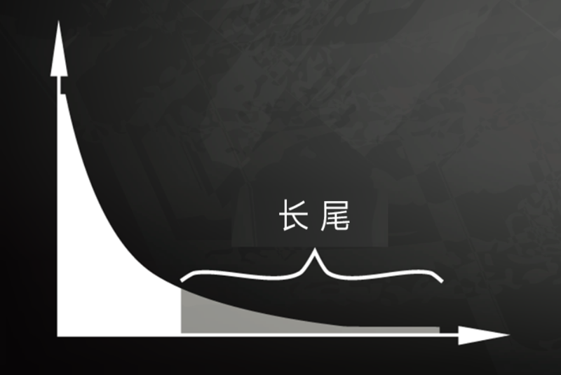

# 0304. 幂律分布：给人带来希望的魔鬼

刘嘉·概率论 22 讲

2020-07-28

上一讲最后我们说到，正态分布是信息熵最大的一种分布，是所有封闭系统演化的终点，是这个世界的宿命。看上去似乎很美好，但细思极恐。什么叫熵增？就是从有序趋向无序。熵增的终点，是完全死寂、混沌一片的状态。如果这是世界的终点，是不是很绝望？

不过话说回来了，如果这个世界完全被正态分布主宰，就没有人类历史上的伟大故事，也没有你和我在这里学概率论了。所以在正态分布的统治之下，一定还有捣蛋鬼存在，给这个世界增加了一些活力。这一讲，我们就说一个非常厉害的捣蛋鬼 —— 幂律分布。虽然它就像一个魔鬼，却实实在在的带给我们希望。

## 4.1 无标度：幂律分布的数学特征

幂律分布，你可能不太了解，但你肯定听过一个词，叫「二八法则」。比如全社会 80% 的财富集中在 20% 的人手里，一个行业 80% 的市场被 20% 的头部公司占据，一家公司 80% 的生意来自 20% 的重点客户…… 二八法则，其实就是幂律分布最直观的表现。

下面就是一张幂律分布的图 —— 

图里横坐标，代表随机变量的取值；纵坐标，代表发生的概率。而幂律分布就是一条向下的曲线，拖着一个长长的尾巴。它的含义也非常明确 —— 在随机变量中，越小的数值，出现的概率越大；越大的数值，出现的概率则越小。虽然幂律分布无处不在，但它的数学特征只有一个，就是无标度，也叫「无尺度」「尺度无关」。不管怎么叫，意思是一致的 —— 在任何观测尺度下，幂律分布都呈现同样的分布特征。

1-2『无标度跟「分形」很相似啊，此时才算理解了什么是无标度，网络科学里看到过这个概念。无标度，做一张术语卡片。（2021-02-14）』

一般的分布都会有个尺度范围，在这个范围内服从这个分布，超过这个尺度可能就不服从这种分布了。而幂律分布没有尺度的限制，不管截取任何一个部分，都仍然呈现幂律分布的特征。比如，图书销量是服从幂律分布的，最畅销那本书的销量在前 10 名销量中占的比例，和前 10 名的销量在前 100 名的销量中占的比例，和前 100 名在前 1000 名的总销量中占的比例，大体都是相同的。

这就是幂律分布唯一的数学特征 —— 无标度。

## 4.2 幂律分布是个无法预测的魔鬼

到这里你可能会好奇，无标度不是挺好的吗？为什么说幂律分布是魔鬼呢？别急。幂律分布魔鬼的一面，主要体现在三个方面。

第一，幂律分布让平均数失去意义。前面说过，正态分布是一种均匀对称分布，大多数数据都集中在平均值附近，所以平均值非常有用，因为它代表大多数。而幂律分布呢？它的数据变化幅度非常大，平均值毫无意义。拿个人收入来说，有一贫如洗的穷人，也有挥金如土的富豪，把这两群人的资产平均，完全没有意义。

小布什总统就曾在竞选演说中玩过这个把戏。他说，2003 年的减税计划让每个美国家庭平均少纳税 1586 美元。从数字上看，这句话没有撒谎，但它有很强的误导性。因为财富服从幂律分布，是高度不对称的。大部分普通家庭收入不高，减税的额度很有限；但小部分收入极高的家庭，可能会获得几万甚至几十万的减税额度，一下就把平均数拉高了。事实上，当年减税的中位数是 650 美元。也就是说，有一半的家庭连 650 美元都没达到，更别提 1500 多美元了。

这就是幂律分布，随机变量波动的范围非常大，常用的平均值、标准差到这里都没用了。如果说正态分布是概率分布的神，构建了一个稳定的秩序；幂律分布就是一个喜怒无常的魔鬼，让已有的秩序和工具全部失效，使一切变得难以捉摸。

第二，幂律分布让原本不会发生的极端事件发生。在数学上，这个叫「长尾」，也叫肥尾、厚尾。简单说就是，虽然极端数据出现的概率很低，但这个概率永远不会趋近于 0，永远不会小到可以忽略不计。这也和正态分布不同。在正态分布里，数据非常集中，非常极端的数据几乎不可能出现，可以直接忽略不不计。而在幂律分布里，再极端的数据都有出现的可能。

我可以用生命打赌，你在街上不可能看到身高超过 5 米的巨人。但一个城市的人口超过 3000 万，一本好书在畅销榜上盘踞 30 年，一个人的资产超过 3000 亿，这些事情虽然可能性很小，但仍然随时可能发生。就像超大规模的自然灾害，虽然发生概率极低，但我们知道它一定会发生。而在幂律分布里，极端数据往往意味着极端事件。而极端事件，比如超大型海啸、超强大地震、席卷全球的金融风暴等，都会给人带来非常大的损失。

正态分布构建的世界非常稳定，只需要考虑常规、考虑大多数就可以。但是幂律分布仿佛拥有一种神奇的魔力，让不可能发生的事情变得可能。它全然不顾人们的预测，也不理会常规，而是悄悄躲在阴暗的角落，不经意间给人类致命一击。你说，它是不是个魔鬼？

第三，幂律分布完全不可预测。听完前两点，你可能会说：虽然幂律分布很可怕，但我们还是可以对它进行科学研究，然后攻克它啊？没错，科学家们确实一直致力于幂律分布的研究。但告诉你一个悲伤的结论，到目前为止，幂律分布还完全无法预测。即便是在简单的模型里，我们也完全无法做出任何有效的预测。

比如著名的「沙堆模型」，在平台上不断添加沙粒，慢慢形成一个沙堆。随着沙堆高度的增加，新添加的沙粒会带动沙堆表面其他沙粒滚落，产生所谓的「沙崩」。统计沙崩的规模和发生的频率，科学家发现它服从幂律分布。

这是一个极其简单的模型实验。所有物理知识我们都掌握，而且能用计算机跟踪每一粒沙子的位置，但仍然找不到沙堆崩塌的原因。我们既不知道在什么条件下，再放一粒沙子就会导致沙崩，也无法预测这粒沙子导致的沙崩规模会有多大。所以到目前，我们对于幂律分布，比如说各种自然灾害，基本还是束手无策。

你可能会说，不是有「二八法则」吗？我们抓重点，抓住重要的 20% 不就好了吗？可能很多人都会这么告诉你，但我想说的是 —— 这是个存量思维，可以总结过去，却对未来没有用。因为虽然我们知道 80% 的生意来自于 20% 的客户，但永远不知道下一个客户是属于重要的 20%，还是不重要的 80%。还是那句话，幂律分布不可预测。

我们知道大灾难影响很大，而且一定会来，却不知道下一场大地震、下一场森林大火、下一场战争、下一次金融危机会什么时候发生，以及会带来多大的损失。我们知道公司市值、电影票房、社会财富的分布极不均匀，却寻找不到方法规避风险。这真是让人绝望。虽然幂律分布是中性的，没有好坏之分，但是站在人类的角度上来说，在一次次的自然灾害面前，我们还是会不由自主的产生一种念头 —— 幂律分布就是个彻彻底底的魔鬼。

## 4.3 可怕的魔鬼带来新希望

虽然幂律分布无法预测，但我们能不能找到它产生的原因呢？找到了产生的原因，不就能避开地震、火山爆发、海啸等自然灾害了吗？道理是这样，但现实可能又要让你失望了。幂律分布产生的原因，目前没有统一的答案。各种解释众说纷纭，谁也说服不了谁。

其中一个比较主流，也是我最喜欢的，是 1982 年诺贝尔物理学奖得主肯尼斯·威尔逊的观点。因为这个研究给人类对抗熵增，对抗世界的宿命，提供了新的希望。威尔逊的研究突破，源于水变成冰这个常见的生活现象。他发现，在水变成冰的过程中，存在一个神奇的临界温度 —— 在临界温度之前，水分子里原子的自旋都是随机指向不同的方向；可一旦到了临界温度，就会非常有序地指向同一个方向。

这是个神奇的事情，为什么在那一瞬间突然就从混乱变成了有序呢？威尔逊收集了很多临界态一瞬间的关键数据，结果发现，每个指标都在临界态附近涌现出了幂律分布。换句话说，在水变成冰，也就是从无序到有序的临界状态上，所有指标都呈现出幂律分布的现象。而我们知道，无序是熵值最大，有序是熵值最小，所以这也就说明，在从无序到有序这个熵减的过程中，幂律分布必然发生。

为什么说这个结论给人带来希望呢？你想，如果这个理论是幂律分布产生的原因，那幂律分布就是我们对抗熵增的必经状态。只要一个生命还存在，一个系统还在演化，它就必然在做熵减的工作，所以出现幂律分布也就不足为奇。这也正好解释了正态分布和幂律分布在生活里都很常见，秒杀其他分布的原因。

所以你看，虽然幂律分布像魔鬼一样狡诈、难以预料，但它可能是我们对抗熵增的必然选择，是每个系统从无序到有序，从混沌到清晰，从未知世界到规律世界的必经之路。幂律分布存在的地方，看似凶险，却恰恰是对抗熵增，对抗死寂，对抗死亡的角斗场，是我们的希望之光。

## 黑板墙

思考题：你能从生活中举个幂律分布的例子，说明幂律分布虽然无法预测，但让这个领域充满活力吗？

下节预告：说完了正态分布和幂律分布，我们下一讲进入泊松分布。

### 01

幂律分布到底是不是魔鬼，这就要看你在原先稳定的系统中处于何种位置。如果你在正态分布的两端，或者在幂律分布的长尾，那么能拯救你，帮助你鱼翻身的，或许就是下一次爆发的小概率意外事件。很多人一方面感慨阶层固化，一方面追求稳定生活，这个目标首先就可能是矛盾的。既然你想改变，你就不能怕变化，你和那些既得利益者相比，最大的优点就是沉没成本低，除此而外，你拥有的可能全都是劣势。你不可能又想当风口上的猪，又害怕飞起来不能实现软着陆。对于真正对自己有要求的人来说，把握住给你的机会，才能最大化的实现人生理想。只有在幂律分布下，你的付出オ可能得到应有的回报。

作者回复：你的盔甲也是软肋，你的软肋何尝不是你的盔甲？数学没有好坏，只有性质。关键是你怎么看，你怎么做。而看之前的基础，你得了解现实客观，的了解数学。

### 02

幂律分布的图像看上去和指数分布非常接近，但实际上幂律分布的密度函数是 x 的 a 次幂，其中 a < 0，是一个幂函数，而指数分布的密度函数是指数函数。指数分布的数学期望和方差可以很容易算出来，但幂律分布的数学期望和方差是不存在的！连续型概率分布的数学期望是 x 乘以密度函数然后积分，幂律分布用乘以密度函数后得到的仍然是幂函数，这个幂函数从负无穷积分到正无穷的广义积分是不收敛的，因此幂律分布的数学期望不存在，进而方差也不存在。一般概率教科书里是不讲幂律分布的，但生活中幂律分布还是很常见的。以后在教学中可以进行补充。

作者回复：在自然界与日常生活中，包括地震规模大小的分布、月球表面上月坑直径的分布、行星间碎片大小的分布、太阳耀斑强度的分布、计算机文件大小的分布、战争规模的分布、人类语言中单词频率的分布、大多数国家姓氏的分布、科学家撰写的论文数的分布、论文被引用的次数的分布、网页被点击次数的分布、书籍及唱片的销售册数或张数的分布、每类生物中物种数的分布、甚至电影所获得的奥斯卡奖项数的分布等，都是典型的幂律分布。

### 03

幂律分布是对抗封闭系统正态分布不断熵增的规律。小时候就跟同学讨论，任何物品在自然界都会被风化然后被这个世界吞没（当时还不懂熵增的概念），但同时世界又在不断的得有序。到底哪个才是世界的终极力量呢。现在觉得这是两种力量的对抗。就像幂律分布对抗正态分布一样。股市赚钱数量就服从幂率分布。极大多数人赚很少钱或亏钱，但长尾的地方有少数人赚走了大部分钱。虽然是这种让人失望的分布，不过就是因为长尾的那些人让所有人充满了幻想，整个市场非常有活力。

作者回复：大概相当于，一定被逼的要结婚了，但在结婚前，报复性地开着各种单身派对，可能各种极端的情都会发生结婚就好比正态分布，是最终宿命，而单身派对就好像在对抗宿命前挣扎的幂律分布。原本相关的或影响很大的随机因素在随机的力量或者叠加的效果长期作用下，慢慢就变成独立、很多普通因素的相加，就变成正态分布了。这就好像年轻人很有棱角、很有独特的性格，也会做极端的事情，但经不住岁月的沧桑，慢慢变成千篇一律的枸杞保温杯的油腻中年人。

### 04

我怎么觉得幂分布示意图，是从正态分布示意图右半边截取过来的呢。

作者回复：尾巴不一样，正态的尾巴越远，概率下降的越厉害，看图就看出就贴着坐标，就几乎可以认为是 0，而幂律分布在尾部下降的就非常缓慢。也就是极端值出现的概率虽然小，但仍然有不小的概率。更极端的值依旧有不小的几率会出现。

### 05

不是很理解这一讲的内容，比如说为什么在街上看到身高超过 5 米的巨人，这个不能用幂律分布来体现呢？

作者回复：身高服从正态分布，那么极端值的概率极小，而且越极端，发生概率就会急剧下降，也就不可能出现，平均几亿年几十亿年オ会出现一次的事儿，我们几干年的人类历史的尺度下，你可以认为概率就是 0。而幂律分布却不是这样，极端值虽然概率也很低，但远远比正态分布的极端值概率要大得多，在正态分布中平均几亿年オ会出现一次的事儿，如果是幂律分布可能几年十几年就会出现一次甚至多次。比如金融危机的时候，正态分布估算出的可能是几年オ会出现一次的极端暴跌，却一天出现了好几次。这说明金融市场价格波动不符合正态分布，这种现象称之为肥尾现象。也就是尾巴上的这些原本在正态分布中极小概率事件，他们实际发生的概率可能要比正态分布估算出的概率大一千倍一万倍。

### 06

今天的课程，了解冥律分布的原理，对于我个人而言，有两点重要的启示：第一，这个世界本身就是不公平的，我们必须坦然面对这一点。很多时候，我们的身边不乏这样的情况，有的人工作非常努力，业务能力突出，待人接物也颇受好评，但是就是一直得不到晋升或者提拔的机会；有的人看上去并不怎么努力，甚至有点夸夸其谈，但是他的背景很好，资源面非常丰富，他就可以凭借现有的资源很容易的取得成功，并且很有可能从一个成功走向下个成功。你可能会说这样很不公平？或许确实不怎么公平，但非常符合冥律分布，也非常符合这个真实世界的运作法则。第二，正是由于冥律分布的存在，我们更要懂得谋事在人、成事在天的道理。英伟达创始人黄仁勋在输掉了和高通的官司后，没有怨天尤人觉得法庭不公平，而是自责自己太在意官司的输贏，以至于晚进入人工智能领域。正是这样的反省和自责，オ让英伟达今天执人工智能芯片的牛耳。同样，我们无论做任何事情，都要尽自己所能把事情做好，剩下的就交给天命来安排；承认天命并不等于认命、放任自流，而是深刻的认识到自己的局限性。世界上有很多事情都非常复杂，都会超出我们有限的认知。我们的努力，解決了成一些维度上的问题，但是依然有很多维度的因素我们没有控制；当然，如果不尽人事，能把握的那些维度也把握不住，自然一事无成。承认天命的作用，我们在做人做事的时候就不会恃才物，而是能够保持一份谦虚谨慎，更能抱有一份对于命运的敬畏之心；也只有这样，我们才能坦然面对人生的种种际遇。

### 07

我上小学的时候，每个班里几十名同学中，都会有少数的五六人去学习竞赛数学；而每个年级凑起来的这二三十名学竞赛的「优等生」里，真正的「尖子」其实只有三四个；进一步地，把全市的「尖子」们放在一起，他们当中又会有少数人，成为真正的「顶尖」。如果衡量学习数学的「拔尖」程度，那么整个年级的同学，大体上就呈现出幂律分布的特征。这里幂律分布只是结果，其成因则是同学们之间的竟争。每一名学习赛数学的同学都想成为「尖子」，都想加入到顶尖的行列中甚至超过他们。至于哪些人会成为「顶尖」，哪些只是普通的「优等生」，则存在着一定的变数一至少在一批学生刚开始学奥数的时候，我们是猜不出，谁会是最优秀的那一小部分的。这么一个不稳定的体系，就是在竞争中不断进步的，以后就可能会出现一些优秀的数学家；即便不研究数学，在训练中获得的东西比如抽象思维能力，也可以带入其他学科领域，产生帮助。

### 08

有意思的是，虽然正态分布才是这个宇宙中的绝对主宰，但是作为生命的我们，却是生于幂律分布，而终身追求幂律分布的。生于幂律分布其实在课程中老师已经有所解释了，我们的生命其实是一个熵减的过程，而这个熵减的过程，与幂律分布之间有着必然的联系；而追求幂律分布是什么意思呢？我们每个人都希望自己是有别于其他人的，或者是名声在外，或者是富可敌国，实在不行大权在握也行，你看看，这些我们所追求的，哪一个不是服人幂律分布的変量？成为金字塔尖的极少数人，掌握或者能够影响这个方面里面的最大部分的内容。

不过话说回来，为啥总有人说什么「平平淡淡オ是真」，那是因为，再牛逼的幂律分布，如果我们拉长尺度来看，最终也都会被正态分布给平均掉。生物存在的意义，有可能仅仅只是通过自身对于宇宙能量的消耗，增加整个系统的熵增，帮助宇宙更快的走向热寂而已。哈哈，不过呢，包子哥本人可不信「平平淡淡才是真」这句话的，毕竟，人生在世，虽然大家的结局最终都是死去，但是，如果不能折腾点水花出来，让更多的人受益于我，深深的记住我的话，这一生得有多么的无啊。睡什么睡？起来造作吧！把我们自己的人生，活成幂律分布的那个顶端的值，这才是人间正道！

### 09

一个最关键的问题没讨论，那就是不同統计分布的条件和边界。在什么条件和情况下，会呈现正态分布？什么条件下，会呈现幂律分布？

作者回复：独立，多个，相加，就是正态分布。这是有中心极限定理约定的。幂律分布肯定是不独立，但不独立未必一定是幂律分布。幂律分布产生的原因没有类似中心极限定理这样的数学理论做支撑。这就好像，离婚的原因是结婚，但结婚不一定导致离婚一样。

### 10

请问老师，自然界的种群数量是否服从幂律分布，就像某些物种会取得压倒性的优势，有些物种走向灭绝。

作者回复：种群分布我不了解，但你可以对应到姓氏, 很多国家的姓氏服从幂律分布，比如中国前五大，占了 1/3，前 400 占了 99%，而中国出现在文献中的姓氏超过 5000 个。有个问题，国外很多国家的姓其实远比中国多，那是为什么呢？这也可以用一个简单的类似抛硬币的模型解释，姓氏代表家族的情況下，历史时间越长，姓氏的消失就越多。中国的历史很长很长，很多姓氏就消失了，留下来的就比较少。（当然，韩国没那么多姓氏，这有特殊的原因，它初始的总量就太少了，只有金、朴算是韩国本土姓氏）
