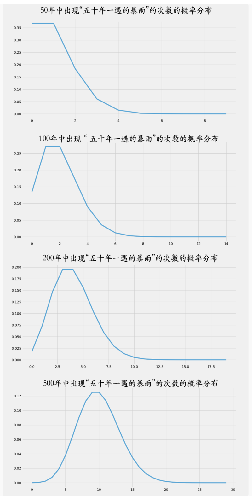

# 0305. 泊松分布：打开统计推断的大门

刘嘉·概率论 22 讲

2020-07-29

这一讲，我们介绍一个非常重要的概率分布 —— 泊松分布。要讲泊松分布，我们从很多城市一到夏天就会遇到的一个舆论痛点说起。很多城市，每当天气预报说明天城区有大暴雨，大家就会非常紧张。因为一遇到大暴雨，城区必定大堵车。为什么大堵车？因为积水排不出去。为什么排不出去？因为下水系统不给力。于是，市民纷纷问市政部门，这是怎么回事呢？市政部门解释说，我们是按照「五十年一遇」的标准建的下水系统。这是非常高的标准。只是暴雨太大了，超过了这个水平。不过不用担心，这样的情况是很少见的。于是大家就不干了，五十年一遇？骗人呢！城区都连着淹了两年了。所以不是你们虚假宣传，就是排水工程是豆腐渣。

现在问题来了，市政部门的解释成立吗？如果你是数学家，该怎么解答这个问题？

## 5.1 泊松分布的公式及意义

首先，我们来定位一下这个问题。「五十年一遇」，转化为数学语言是指，长期来看，这样的大暴雨是平均 50 年发生一次。注意，这里的时空范围是「长期」。长期是多长？很长很长。我这不是玩文字游戏，而是提醒你注意 —— 对长期理解不到位，是概率问题的结果经常反直觉的关键。

平均 50 年发生一次，会不会是每隔 50 年发生一次？有可能，但不一定。我们再设定一种情况，前 4 年每年都发生一次，之后的 196 年一次都没有，200 除以 4，还是 50 年一次，与「五十年一遇」并不冲突。

所以，真正的问题来了：当我们知道了五十年一遇这个长期的整体概率，注意是「长期的概率」，但我们想要知道的是，任何一段具体的、有限的时间内，比如 5 年之内，发生 1 次大暴雨的概率是多少？发生 2 次大暴雨的概率是多少？发生 3 次、4 次…… 任何你想知道的大暴雨的次数，它们的概率分别是多少，这时候这么办呢？

我们把问题再抽象一下，这一类问题其实是 —— 当我们知道了一个随机事件发生的整体概率，也知道这个随机事件发生的概率符合正态分布之后，那么在某一段时间或者空间间隔内，这个随机事件发生的次数的概率分布是什么呢？再说一遍，不是求解整体发生率，而是求发生次数的概率。

概率学家已经有了工具来对付这种问题，这个工具就是泊松分布。为什么是这个怪怪的名字呢？因为这个分布是大数学家泊松发现的，所以叫泊松分布。

我们先来看看泊松分布的公式 —— 

```
P(X=k) = (λ^k/k!)e^(-λ)
```

其中，e 为已知数学常量，k 为事件发生次数，λ 为单位时间内事件的平均发生次数。

对数学语言不熟悉的同学见到这个公式，会本能地心生厌恶，至少是拒绝的。其实，如果搞一个最美数学公式排行榜，泊松分布公式肯定能进前十名。当然，理解数学公式的美，和理解现代艺术的美一样，都需要一点背景知识。泊松分布的公式用语言表达就是：随机事件发生 k 次的概率，等于 lambda 的 k 次方除以 k 的阶乘，再乘以自然底数 e 的负 lambda 次方。

是不是已经晕了？不要着急，多看看上面的公式你就有感觉了。重点是要理解这个公式背后的思想。这里只有 3 个字母 —— 1）自然底数 e：这是数学常量，是已知的；2）k：就是随机事件发生的次数。在大暴雨的案例中，k 可以是 1 次大暴雨、2 次大暴雨、3 次大暴雨等等。3）lambda：是整体概率与要求解问题匹配之后对应的数值，这个数值是跟我们的问题联动变化的。在大暴雨的案例中，整体概率是 50 年 1 次，也就是 1/50。如果我们想知道接下来 50 年这个时间段暴雨次数的概率分布，那 lambda 就是 1。如果想知道 100 年，那 lambda 就是 1/50 乘以 100，相应的就变成了 2。要是想知道 5 年呢？1/50 乘以 5，这个数值就是 0.1。

就按「接下来 50 年」来计算吧，这时候 lambda 取值为 1。

K = 0，就是接下来的 50 年，1 次大暴雨都不发生的概率是多少？代入公式一算，答案是 37%。

K = 1，就是接下来的 50 年，发生 1 次大暴雨的概率是多少？代入公式一算，答案也是 37%。

K = 2，就是接下来的 50 年，发生 2 次大暴雨的概率。代入公式一算，答案是 18%。

其实，我们更关心的是，接下来 50 年发生 2 次和 2 次以上「五十年一遇」的大暴雨的概率是多少。就是用 1 减去发生 0 次的概率和发生 1 次的概率，1 减去 37%，再减去 37%，答案是 26%。也就是说，在「五十年一遇」的整体概率下，在接下来 50 年里发生 2 次或 2 次以上大暴雨的概率是 26%。所以在比较短的时间内发生 2 次这种「五十年一遇」的大暴雨，可能并不是什么小概率事件。仅仅用 2 次大暴雨就否认市政部门的解释，是证据不足的。

2『泊松分布，做一张主题卡片。（2021-02-14）』——已完成

## 5.2 泊松分布的数学性质

通过大暴雨这个案例，我们可以了解泊松分布的两个重要的数学性质。

数学性质一：泊松分布是正态分布的一种微观视角，是正态分布的另一种面具。在大暴雨的案例中，如果我们不断地计算各种时间间隔和大暴雨不同发生次数的概率，把这些画在一起，你就会看到泊松分布的曲线越来越像正态分布。下面这张图清晰地展现了，泊松分布是如何通过参数变化一步一步演化为正态分布的。



数学性质二：泊松分布的间隔是无记忆性的。注意，不是说泊松分布是无记忆的，而是泊松分布的间隔无记忆。什么叫无记忆性呢？就是之前的情况对之后的情况没有影响。所以间隔的无记忆性就是指，前一间隔中随机事件是否发生对后一间隔中随机事件是否发生没有影响。

在城市大暴雨的案例中，如果去年发生了一次大暴雨，那今年发生大暴雨的概率会变成多少呢？按人类的直觉，大暴雨是平均 50 年发生一次，刚刚发生了一次，接下来一年就不会再发生大暴雨了，概率是 0。但是，这个看法是不对的。这又是概率反直觉的一个例子。今年发生了大暴雨与明年的大暴雨，相互没有影响，用概率论的术语就是「相互独立」。

像连续大暴雨这种小概率事件扎堆出现的现象，看起来很反直觉。但现在我们知道，由于泊松分布间隔的无记忆性，所以一定存在一些短间隔和长间隔，而且它们很难一长一短、一长一短这样有规律的出现，而是会混杂着出现，否则就不叫随机了。如果恰好连续遇到短间隔，我们就会感觉这事扎堆出现。你看，其实一点也不稀奇。

## 5.3 打开统计推断的大门

理解了泊松分布的数学性质，我们就可以开启另一个重要的话题了 —— 泊松分布开启了统计推断的大门。

统计推断是什么意思？我们回看一下对大暴雨问题的解决思路。我们要解决的问题是，连续 2 年大暴雨是不是正常的。正常的意思是说，这不是一个小概率事件。如果是正常的，那就不能说城市下水系统的建设有问题。这个问题的困难在哪儿呢？数据太少。我们没有 1000 年的降雨资料，即使有 1000 年的数据，在长期、无限面前也是个渣渣，还是太少。所以要解决这个问题，就得改一个思路。

同样的，比如物理学家要研究放射性物质的半衰期。可是，绝大多数物质衰变期极长，长到我们没法直接测量。比如铋 209 原子的半衰期是 1.9x10 的 19 次方年，如果你盯着一个铋原子，想看到它衰变，可能看到宇宙毁灭都够呛。这时候数据太少了，连一个完整的衰变周期都观测不到。怎么办呢？我们可以假设衰变是服从正态分布的吗？当然可以。但是，连一个完整的衰变周期都看不全，怎么去验证这个假设呢？

用泊松分布解决。找一堆铋 209 原子，统计一下在几个确定的时间间隔中，这堆原子有多少个发生了衰变。只要这个数字服从泊松分布，反过来就证明铋 209 原子的衰变服从正态分布，就可以用正态分布直接计算。利用同样的原理，科学家们成功完成了像 DNA 的突变次数、外太空某个区域内恒星的数量等一系列科学问题的计算，推动了物理学、生物学、天文学等科学领域的发展。

在这些问题的解决中，统计数据和概率论的概率分布就被连在了一起。通过这种连接，我们对这些事情做出了科学的推断。到这里，统计学完成了一次跨越 —— 在泊松分布之前，概率和统计是两个不同的学科。概率研究未发生的随机事件，统计描述已发生的现实。换句话说，那会儿只有描述统计，没有推断统计。泊松分布开启了推断统计的大门，第一次把概率和统计连接在一起，不仅让统计学变得更有力量，也促进了其他科学的发展。

## 黑板墙

思考题：二战时德军轰炸伦敦，如果你是一个数学家，怎么通过分析炸弹落点判断德军是有针对性的轰炸，还是完全没有情报的随机轰炸呢？

### 01

判断德军是有针对性的轰炸，可以根据炸弹的平均爆炸半径粗略的计算一个轰炸面积，然后以这个面积为单位，把伦敦化成若干个小区域，就像电视屏幕的分辨率一样。之后我们就可以在伦敦地图上，把所有德军投弹的位置标记出来。如果德军是无目的的轰炸，那投弹的位置就是随机的，那就可以在重点区域用泊松分布去计算被轰炸的概率，这个结果应该和实际情况是相符的。

如果重点区域实际被投弹的数量远远多于计算结果，那就说明德军是有目的的轰炸。虽然我没有具体的数据去计算结果，但是我估计最后的结果有可能是反直觉的。问题的关键，就是随机不代表均匀。在我们的直觉中，如果投弹是随机分布的，那就应该是均匀的，比如每个区域的平均投弹数量是 2 个，而某个区域是 4 个，甚至 6 个，我们就会觉得这是不正常的。实际上在较大的样本空间中，这可能是正常的。

作者回复：很可能，发现某些区域炸弹数量很少，有些区域多一些，只要个数是服从泊松分布的，那么整体就正态分布，那就是纯随机。那就没有重点目标。

### 02

这一讲内容挺有意思的，之前我们还在讨论，我就活了二十多年，遇到的五十年一遇，百年一遇，数百年一遇，千年一遇，几千年一遇的事情太多了。今天老师的课程就告诉我们，整体事件发生概率 ≠ ー定时间发生次数的概率，后者要用泊松分布计算，且具有无记忆性。不过我还是好奇，30 年内同时遇到 50 年一遇，100 年一遇，500 年一遇，1000 年一遇，2000 年一遇的概率是多少？

作者回复：十年一遇，五十年一遇，并不代表他们十年五十年才发生一次，他们很可能发生好几次。发生一次的概率 37%，一次不发生的概率也是 37%，发生 2 次的概率 18%，这要用泊松分布。这让我们能直观理解，1/10，1/100 的概率究竟是什么含义。而好玩的是，如果中国划成 300 个不相关的区域，那么在未来一年中中国发生百年一遇的事情的概率是 95%，几可以说中国每年都有可能遇到一次百年一遇的事儿。所以你在电视里看到今年这儿遇到一个百年一遇的洪水，明年那儿，遇到一个百年一遇的暴雨之类的事情，不用惊讶，百年一遇的事儿每年都会遇到。这背后就是泊松分布。

1-2『这里如何算出来 95% 的没弄明白，需自己算出来。（2021-02-14）』——未完成

### 03

把伦敦划分成面积相同，形状相同的若干区域，在一次轰炸之后统计每个区域的弹壳数或者轰炸次数，根据轰炸次数统计区域数量，比如弹壳数为 0 的区域有 1 个，弹壳数为 1 的区域有 2 个，弹壳数为 3 的区域有 2 个，以此类推来統计数据，根据这样的数据可以绘制出横坐标为弹壳数，纵坐标为频率的频率分布图，也即通过频率法计算概率，将此曲线和泊松分布进行拟合，如果拟合度高可以视之为随机轰炸。但同时，也应该对多次轰炸行动进行統计，区域与区域也不能看成是同质性的，对区域内轰炸行动进行统计，如果某区域泊松分布参数明显高于其他，或许也可以说明轰炸有针对性。

作者回复：把整个伦敦分成很多格子，看看格子里炸弹的数量，看看这个数量是不是满足泊松分布。

追加提问：「把伦敦分成很多格子，看格子中炸弹的数量，是否符合泊松分布」。但格子的大小是多少呢？我认为格子的大小也会影响最后的判断，这个就要看德国轰炸机的轰炸精度是多少，假如格子面积远远小于轰炸精度，即使是有针对性的轰炸，也会表现出随机性。而格子太大的话，即使是随机轰炸，由于轰炸次数有限，也有可能表现出「有针对性轰炸」的假象不知老师怎么看？

作者回复：简单的说，德军轰炸了 100 次，每次轰炸一个区域。我观测到的现象是有些地方被轰炸了好几次，有些地方没有被轰炸到。我想看看德军是不是有些轰炸是有目的的轰炸，还是整体都是随机的。那么把伦敦分为 100 个区域（平均分格子），那么每个格子被轰炸到的概率就是 1/100，这时候统计被轰炸 1 次，被轰炸 2 次或者多次的区域的个数，看看是不是符合泊松分布，也就是看看没被轰炸到的格子是不是大概 37 个，轰炸到 1 次的格子是不是 37 个，轰炸到 2 次的格子是不是 18 个，等等，如果基本符合泊松分布，那就代表这个区域所有的格子大体上保持着随机性，轰炸就是一个随机的过程，没有特别的「重点目标」。

如果你发现被轰炸到 1 次、2 次、3 次等等的格子的数量异常的少或者异常的多，不服从泊松分布，那就说明有些区域是重点区域，那些被轰炸两三次的目标也许就是德军获知情报的目标。真实计算的时候，划分区域格子的大小、和平均一次空袭轰炸的范围有关系，一个格子要能覆盖一次空袭的范围，然后根据空袭规模大小做一些加权的处理，然后就可以了。

### 04

柏松分布有一个命门，就是假设历史概率是不变的。在暴雨这个例子里面，假设环保主义者说的是真的，因为人类对地球的破坏导致暴雨发生的概率更加频繁了，请问老师这个时候是不是应该把原有的 50 年一遇的概率乘以当前时间段人类对环境影响平均系数再带入泊松公式计算发生的次数呢？

作者回复：是的，松分布是不准确的，50 年一遇我在知识城邦中解释了来源，这很可能就是短时间阶段的数据进行拟合的结果，可能非常不准确，所以理论上，会有一个偏差幅度。对于大雨、地震、海啸等等，我们其实一直在调整 50 年一遇，100 年一遇的具体标准的数值。

### 05

将伦敦均匀划分为多个小格子，然后统计每个小格子被轰炸的次数，然后看是否符合泊松分布，如果符合，那就是没有针对性的随机轰炸。今天课程中的大暴雨案例，泊松分布的曲线越来越像正态分布，那这两种分布是不是有内在的联系呢？

作者回复：泊松分布是从正态分布中推导出来的。

正态分布宏观视角，泊松分布微观视角。

正态分布面向无限，泊松分布面向有限。

正态分布处理整体，泊松分布处理局部。

两个分布就像在两端，相互验证，相互描述。这也是我为什么不选择教科书上经常选择的一些分布讲，而选择泊松分布的原因。它同时，还能让你直观的理解类似 1/10 的概率究竟代表了什么。又美，又有用，还体贴你的认知，还能提升你的概率直觉能力。这简直就是概率分布中的理想伴侣。

### 06

1、事件发生「次数的概率」，相比于事件的「发生概率」上更加精确了，框定了有限的时间区间，化解了理论上无穷时间内的全样本搜集。用发生次数替代发生概率，这种转的思维方式也跟罗胖之前提到的「认知折叠」很相似，很多道理方法数学家们早就默默的在用了。

2、我们习惯于规律认知，均匀分布，但柏松分布给我们提供了更宽广的认知渠道，也是克服人的思维偏误的武器。

作者回复：让我们知道 1/10 的概率究竟是什么意思？是平均 10 次发生 1 次。那么真的 10 次能发生 1 次的概率是多少呢？37%。在 10 次中 1 次也不发生的概率呢？也是 37%。

### 07

1、50 年一遇这个怎得出来的呢？从设计的这年往上推 50 年，按这个时间段内最大的降雨量设计，还是往前推 500 年，取这个时间段内 10 次相同的最大降雨量？后者才有资格叫 50 年一遇，前者只能叫 50 年内，这样的数据肯定早被气象学算出来了。设计的时候，取最小成本值，这个值出现在 50 内就叫 50 年一遇，出现在 100 年内就叫 100 年 2 遇或几遇吧。

2、长期太有迷惑性了。相对于人生百年，这个长期意义有多大呢？概率有宗教的一面，提供決策时的心理安慰：虽然这次输了，可我严格按概率策的，我没错，错的是时间，活得不够长。我们之所以有稀奇感，是因为我们在寻找解释，不想解释了，啥都不稀奇。我们不是天生没有概率感，而是没有大数概率。毕竟生命很短，经历有限，而知识无限，以有涯逐无涯，违反生理，这是人类对自然的逆反，可是该逐还得逐。

3、直觉是炸点在目标周围集稀释程度推断，密集的地方就是轰炸目标。可是数学怎么描述呢。什么是横坐标，什么是纵坐标，理不清楚。横坐标是面积，纵坐标是炸坑数？这样跟概率有啥关系呢？还是橫坐标是特定地点炸点数随时间变化的数量，纵坐标是概率，可是这个概率是关于谁的概率呢。

作者回复：50 年一遇也特有意思，原则上是通过过去的数据进行计算的。但其实有些百年一遇的千年一遇的事儿，也没遇到过啊，这咋计算呢？比如，你有 70 年的暴雨数据，那么最大的降雨量的那场暴雨，出现的概率就假设成 1/70，第二大的呢，出现的概率就是 2/70。这样，你就构建出一个 概率分布，然后做一些坐标系的缩减的基础上拟合这个图，我们就能得出 1/100 的概率对应的降雨量（当然还会做一些处理，把分母变大一点儿之类的），然后得到 1/1000 的概率的降雨量，这样就知道百年一遇的暴雨降雨量是多少以上，干年一遇的暴雨降雨量是多少。当然每个领域还有自己的些处理方式，本质逻辑是这样。比如洪水，可能服从贡贝尔分布，比如地震，可能服人幂律分布。

统一的说，百年一遇，千年一遇这样的说法，收到过去数据的统计影响非常大，刚刚看到了，我只有 70 年的数据，万一这 70 年恰巧是风调雨顺呢？我们听到的百年一遇，千年一遇，背后没有人告诉我们，他们计算依据的历史数据到底是多少年，是那些年。我们其实也不知道他们的误差到底有多大。但是，我不断的增加数据，不断的更新百年一遇的降水量的标准，自然就越来愈准确。这就是数学应用中的，日拱一卒无有尽，功不唐捐终入海。

### 08

我们前面学过正态分布，正态分布大量的存在于我们的生活中，但是，我们该怎么证明一个事件的发生概率是符合正态分布的呢？有些可以，因为它存在的范围在我们可观察的范围内，发生的时长在我们可观察的范围内，那如果有一些事情发生的范围和存在的时长不在我们的可观察范围内呢？这个时候就可以用到这节课我们学习的泊松分布了，可以说，事件发生概率符合泊松分布的事件，一定是符合正态分布的。只是，为什么这一点，我完全没搞懂。还有，如何相互证明，其实我也没有完全搞懂，这节课程还需要 Mark ー下。

1-2『这里的「为什么」应该已经被数学证明了，待验证。（2021-02-14）』——未完成