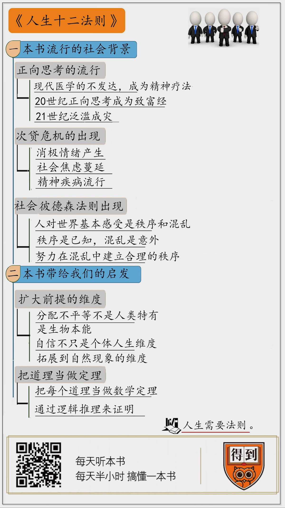

# 2020001. 人生十二法则
> 《人生十二法则》| 刘玄解读

## 关于作者

这本书的作者是美国著名的心理学家乔丹·彼得森，他被誉为当今世界重要的思想家。彼得森是多伦多大学心理学教授，前哈佛大学心理学教授，百万年轻人追随的心灵之父，在他的学生眼中，他是「能改变你的人生」的人。

## 关于本书

现代人欠缺的，不是知识，而是实现的能力。在《人生十二法则》中，著名心理学家乔丹·彼得森的将人类数千年来哲学思考、神话故事中的精神财富与心理学、生物学、神经科学等学科的前沿研究相结合，用 12 条人生法则，为年轻一代提供了一种摆脱人生困境的方法。

## 核心内容

解读中，我不会逐一给你讲这十二个法则，我想跟你分享两个我觉得更有意思的问题：第一，这本书是在什么样的社会背景下流行起来的；第二，我们能从这本书获得什么启发。

法则一：获胜的龙虾从不低头：笔直站立，昂首挺胸。

法则二：像照顾生病的宠物一样关心自己：待己如助人。

法则三：放弃损友：与真心希望你好的人做朋友。

法则四：战胜内心的批评家：和昨天的自己比，别和今天的别人比。

法则五：管教你家的小怪物：别让孩子做出令你讨厌他的事。

法则六：当痛苦到想要诅咒一切：批判世界之前先清理你的房间。

法则七：苏格拉底的选择：追求意义，拒绝苟且。

法则八：不买醉鬼卖的东西：说真话，或者至少别说谎。

法则九：别偷来访者的问题：假设你聆听的人知道你不知道的事。

法则十：不要无视地毯下的龙：直面问题，言辞精确。

法则十一：不要打扰玩滑板的孩子们：承认现实，反对偏见。

法则十二：当你在街上遇到一只猫时，摸摸它：关注存在的善。

## 前言

这本书 2018 年在美国出版，一度高居亚马逊畅销榜前五名，而且长盛不衰，上榜 64 周，是一本现象级的畅销书。你是不是有点好奇，这得是多么振聋发聩的 12 条法则啊。那我来给你读几条：第一条，笔直站立，昂首挺胸；第三条，跟真心希望你好的人做朋友；第十一条，不要打扰玩滑板的孩子；第十二条，在街上遇到流浪猫，摸摸它。

听完之后，你是不是有点失望？这 4 条法则，说白了就是平时要自信，择友要慎重，对人不要心存偏见，对世界要保持善意。这样的人生建议，谁都能说出几条，还需要有人专门写本书来讲吗？

这些法则，一开始还真是作者随意写的。这本书的作者叫乔丹·彼得森，有人说他是当代美国最知名的公共知识分子之一。他的本职工作是一位临床心理学家，曾经在哈佛大学心理系任教，现在是加拿大多伦多大学的教授。

彼得森在美国的问答网站 Quora 上回答了一个问题 —— 每个人都该知道的最有价值的事是什么？他的答案是一个有几十条法则的清单。他自己也没想到，这个答案居然大受欢迎。后来，一家出版社想要请彼得森写一本针对普通人的心理自助书，彼得森就拿出了这张清单，他用自己的学术理论逐一解释了这些法则，从一开始计划的 40 篇精简到现在的 12 篇，于是就有了《人生十二法则》这本书。

彼得森写的这 12 条法则是我们本来就知道的一些道理，他就是要把你知道但又不那么重视的大道理重新告诉你一遍。人生难免遇到困境，难免有感到困惑或者迷茫的时候。这个时候，这样的提醒或许真的有用。很多人的确从这本书里找到了共鸣，获得了帮助他们整理自己人生的方法。今天为你解读这本书，希望它也能给你带来一些启发。

## 第一部分

听了我刚才读的那 4 条法则，你可能会觉得，它们说得都对，但是又好像也没说什么。读者对这本书的评论也很两极化，有人吐槽它就是一锅乱炖的鸡汤，也有人说它给自己的人生带来了真正的改变。为什么一些人眼中的鸡汤，是另一些人眼中的救命良药呢？

这就得回到这本书产生的社会环境来看了。在今天的美国，彼得森的观点就像是一副清醒剂。他的观点有一套底层逻辑：人生在世是痛苦的，文化太过多元也有可能带来混乱；人不是自由的，每个人都应该为自己的行为负责。这种观点和美国主流思想是完全相反的。大多数美国人都相信，世界是美好的，文化是多元的，人生来是自由的。

这种观点来自一个叫「正向思考」的思潮，在美国已经有上百年的历史了。有人甚至说美国的强大都跟这个思潮有关。说到这里，就必须得提到另外一本书，书名叫《失控的正向思考》。这本书里说，虽然「正向思考」的思潮曾经对美国社会有过积极的影响，但是今天它已经「失控」，反而让很多美国人感到困惑和迷茫。

正向思考的思潮是怎么形成的呢？19 世纪初，刚刚独立几十年的美国是一个充满机会的国家。任何人都可以一夜致富，当然也有可能一夜破产。美国人开始抛弃他们原本的信仰，就是基督教新教推崇的责任、劳动、坚韧等等美德，他们开始相信，人的精神力量能够战胜一切。当时，现代医疗还不太发达，很多病，医院治不好。有一个叫昆比的医生提出了一种精神治疗法。他告诉病人，每个人都能靠精神的力量自己把病治好。昆比这种听着很不靠谱的说法，在当时大受欢迎，他的思想甚至被人拓展成了一种生活哲学。这就是正向思考的开端。

到了 20 世纪，现代医学发展起来了，这种生活哲学没了用武之地，从医疗领域撤了出来，却意外地在教人怎么赚钱的领域里红火起来。当时，美国社会上流行着很多致富经，都开始强调人的精神能量能解决一切困难，只要乐观，就能成功。围绕「正向思考」，慢慢形成了一个产业。鼓吹这种思想的人会出书、出视频课程，还会四处演讲、开研讨会等等。到后来，连本来和正向思考对立面对新教都加入其中了，教士不再威胁人会下地狱，相反，他们会向信徒保证：「神要你成功。」

到了 21 世纪，正向思考在美国已经泛滥成灾。《失控的正向思考》这本书的作者回顾，2007 年的时候，她觉得整个社会到处都是好消息。电视里的专家一直在说经济会越来越好，房价会越来越高。很多人因此热衷消费。现在我们知道，没过多久，次贷危机就爆发了。许多人流落街头，丢了工作、没了医保。

次贷危机这个残酷的现实，给了正向思考的鼓吹者和信徒们巨大的冲击。这群人本来相信，只要「正向思考」就能成功，成功之后，有了财富，世界就会变得更好。但是这时候，他们也不得不承认，「正向思考」已经失灵了。面对残酷的现实，相信「正向思考」的人就感到幻灭，有些人甚至会觉得，活着都没有什么意义了。这股潮流让社会上开始产生一种消极的情绪，整个社会焦虑蔓延，精神疾病像感冒一样流行。

这时候，彼得森的法则出现了。

在彼得森看来，「正向思考」主张人要只专注于快乐的结果，不用考虑潜藏的危险，这其实是反本能的。就像你开车的时候，总得随时保持警惕，随时准备踩刹车吧。很多美国年轻人第一次听到彼得森观点的感受，大概就像是学车的时候，陪练突然替你踩下了一脚刹车。谁不知道应该踩刹车呢？但是在刚学车的时候，我们很可能会忽视这个最重要的问题。彼得森给出的不过是非常传统的价值观。你可以这么理解，他红了，并不是因为他说了什么新奇的观点，而是这些简单朴素的观点，现在在美国没有人愿意说了。

彼得森批判正向思考那一套。他说：快乐是很脆弱的，人生充满苦难。在他看来，人对世界的基本感受就是秩序和混乱。你眼前的办公桌，收拾好了，就是有秩序的；没收拾好，就是混乱的，只有这两种状态。

我来稍微解释一下。在彼得森看来，秩序来自确定。秩序是社会结构，是已知的世界，是你熟悉的环境。秩序会让你觉得世界是安全的，生活是稳定的。而混乱来自意外，突然失业，伴侣出轨，甚至你在聚会上讲了个笑话，结果是一片尴尬的沉默，这都会让你感到混乱。

人应该如何在这样的世界里生存呢？彼得森认为，人类一直都努力在混乱中建立意义，塑造秩序。他曾经出版过一本书叫《意义的地图》，是一本学术书，讲的就是这个问题。比如说《圣经》里的《创世记》，他认为，故事一开始，上帝创造了世界，象征着把宇宙的混乱转化为宜人的秩序。然后，上帝创造了人，就是继续在混乱中创造秩序。接下来的两章，讲的是秩序中如何蕴藏着混乱。亚当和夏娃本来生活在有秩序的天堂，但是蛇出现了。人那种善的秩序被堕落打破了，就产生了混乱。为什么会突然出现一条蛇？蛇本身就象征着意外的、未知的混乱。

彼得森说，古人用各种神话、故事描述世界，就是想在脑海中从混乱的世界中建立合理的秩序，建立自己的意义系统。他给出的 12 个法则，也是为了帮助人们应对这个混乱的世界，在混乱中寻找秩序。

彼得森无非是说了大实话，这些话难道过去没人说过吗？陀思妥耶夫斯基一百多年前就说过：「人生就是一场苦役，只有当人们背负起各自的罪责，才能体会人生的真谛。」但是，对很多欧美年轻人来说，这些经典或许早已淡出视线，但彼得森简单易懂的法则近在眼前。彼得森自己说，在很多次演讲中当他谈到责任的时候，他都看到现场很多年轻人眼睛立刻亮了起来。

## 第二部分

这些法则都是古老的大道理，你可能也有点怀疑，它们真的有用吗？带着这个问题，我采访了这本书的翻译、心理咨询师史秀雄老师。史老师曾经是彼得森的学生，他说，他不仅自己认同彼得森的法则，而且他也会把这些法则用在心理咨询中，对他的患者也同样有效。这些道理就像是药，对健康人没什么用，但是对那些正处于痛苦、彷徨中的人，确实能够带来一些帮助。不过，就算我们现在不需要这副药，或许也能从彼得森讲道理的方式获得一个启发，那就是：怎么给别人讲道理？

我们可以从彼得森那里总结出两个讲道理方法：第一是扩大前提的维度；第二是把道理当作定理。接下来，我们就来说说彼得森是怎么讲这些大道理的。

先来说第一个方法，扩大前提的维度。

彼得森最出名的法则就是第一条：获胜的龙虾从不低头，所以我们要笔直站立，昂首挺胸。这个道理的本质上就是在说人要有自信。不过，你有没有问过自己，我们为什么要自信呢？一般我们可能会说，因为自信了，我们才能如何如何，这都是从自信的好处来谈。假设你是要说服一个「杠精」，你要自信。结果他反问你，我要是不想成功，也不想做成什么事，这时候，你要怎么说服他呢？

彼得森采取的策略，是把要自信的前提从个体人生扩大到了生物本能的维度。他要告诉你，要自信，是自然界生存的现实需求。

彼得森说，你和龙虾的共同点，比你想象的多得多。于是，他提出了他的第一个论断：分配不平等不是人类社会特有的现象，而是生物本能。

他首先抛出了一个问题，既然生物都要竞争有限的生存资源，这种竞争是不是会带来无法挽回的损失？答案是不会。比如说，龙虾这种简单的生物也像人一样会争夺资源，甚至它们比人类出现在地球上的时间还早得多，几亿年过去了，它们为什么没有给自己带来什么无法挽回的损失呢？

这是因为除了竞争，生物还建立了另一种本能，就是以最小的代价建立优势地位。只要是群居动物，大多都有这种本能，龙虾也不例外。龙虾在成长中需要蜕壳，这个时候，必须要待在安全的洞穴里，最好还有贝壳能把洞口盖住。所以，一群龙虾在一起，就会争夺最好的洞穴。但是，龙虾不会一上来就拼命杀死对手。他们有一套决斗的流程，这套防御和进攻综合运用的机制，早就写进了它们的神经系统。

这个过程会分成四个阶段。第一阶段，两只龙虾会先交换彼此的基本信息，看看谁更厉害。它们会像拳击手一样挥舞它张开的钳子，前后左右移动；它们还会喷射体液，这种体液会告诉对手自己的各种信息，包括体型、性别、健康程度、情绪状态等等。这个时候，相对处于劣势的龙虾就会不战而退。如果双方互不相让，战斗就会升级到第二阶段。两只龙虾会相互示威，他们把钳子向下收起，一只向前，一只退后，然后再反过来。反复拉锯几回之后，胆小的就会摆动尾巴，迅速离开。如果双方僵持，就会进入第三阶段。真正的打斗开始了，不过这个阶段，龙虾只是试图打倒对方，不会把对方置于死地。如果一只龙虾被打翻在地，战斗就结束了；如果双方势均力敌，战斗就会进入终极阶段。这个时候，它们才会真的用钳子去扯对方的腿或者胡须，失败的龙虾很可能会丧命。

有了这样的机制，它们很快就分清楚，谁好欺负，谁惹不起，然后建立起来一种稳定的等级制度，同时又不会死伤太大。换句话说，赢家通吃不只是人类社会的法则，也是一种自然属性。在复杂的自然环境中，等级制度是一个永久存在的特征。你看，通过跟龙虾类比，彼得森就让把人类社会的分配不平等定义成了一种自然现象。他下面再谈自信，就不只是在个体人生这个维度，而是拓展到了生物本能的维度。

接下来，我们再来说说彼得森讲道理的第二个方法：把道理当定理。

万维钢老师在他的精英日课里讲到过彼得森，他说了一个很有意思的事。彼得森在一档电视节目里跟女主持辩论，完爆了对方。因为那个女主持犯了一种典型的逻辑谬误，叫「稻草人攻击」，简单说就是，彼得森只要说出一个观点，女主持都会说，「so you are saying」，把彼得森的观点换成一种特别极端的版本来反驳，这种反驳当然毫无效果，因为它本来就不是彼得森的意思。比如彼得森说，我早餐吃了培根和鸡蛋；女主播就可能会反驳说，所以你是说应该杀死所有素食主义者。

给别人讲道理，就特别容易面对这种事儿。这个时候，严密的逻辑就显得特别重要，这也是为什么彼得森努力把他说的每一个道理都当作一个数学定理，通过逻辑推理证明了一遍。你可以不相信你觉得主观的道理，但是逻辑严密、可证明、能推导的客观定理，你总得相信吧。

我接着用龙虾那条法则的例子来说明这件事。

彼得森说，等级制度在生物界一直存在，生物就进化出了一种功能，可以监测自己所处的等级。一只龙虾如果失败了，它的大脑就会告诉它，你降级了。表面看，它只是变得胆小一点、谨慎一点，但科学家已经证明，失败会重构龙虾的大脑，好适应卑微的处境。这时候，龙虾大脑里的两种调节神经的化学物质的分泌量就会改变。这两种化学物质就是血清素和章鱼胺。胜利的龙虾会分泌更多的血清素，更少的章鱼胺；失败的龙虾则正好相反。所以正常情况下，失败的龙虾肯定不会再挑战它的对手，在未来的战斗中，它会越来越谨慎，失败者很有可能会越来越失败。但是如果给失败的龙虾额外打一些血清素，它就会有勇气再次挑战之前的胜利者。

研究证明，在竞争的问题上，人类和龙虾不光行为和体验上相似，生理过程也基本一致。一个人成功了，他大脑的监测机制也会为他分配地位，调节血清素，这也会让他产生特定生理或者心理反应。这是大脑的一个调节机制，有力地影响我们的方方面面。

你看，彼得森是在说，要自信，不是维持什么虚无的心理状态，而是让自己的大脑处在血清素分泌带来的客观的正反馈里。你的自信感可能会因为只相信成功和快乐变得脆弱，但是分泌血清素带来的效果是你不能抵抗的，这种自信带来的成功，是自然法则，很坚强。

这就是彼得森说必须要自信的原因。要自信是在告诉你的大脑，你需要血清素，需要生理机制的帮助，只有这样，才有可能走出失败的死循环，而这是自然界的定理，没什么可质疑的。

关于建立信心，彼得森的论证不是唯一的，也不见得是最好的，换个有点「抬杠」的说法，勾股定理也有 16 种方法论证。但是我们必须得承认，有逻辑的论证确实增强了他的说服力。如果我告诉你，直角三角形两条直角边的平方和等于斜边的平方，你就算拿成百上千个直角三角形验证，你也不可能确信，每一个直角三角形都会符合。但是，如果我们用普遍归纳出来的数学方法把它证明了，它在你心里就成了一条不用怀疑的定理，你甚至可以推导它，用它来继续解决其他数学问题。同样的，你也可以用彼得森的法则，来解决你自己在未来人生中遇到的问题。

## 总结

彼得森用最朴素的方式讲了 12 个最基本的道理。在今天的美国，他的声音或许有点刺耳，但却是美国人需要的一副清醒剂。对于那些对人生感到困惑，甚至消极、痛苦的人来说，彼得森的提醒或许真的有用。就算你暂时不需要这些提醒，这本书也能给你带来一些其他的启发，比如说，怎么给别人讲道理。我为你总结了两点，一是扩大前提的维度，二是把道理当定理。在我看来，这正是这本书有意思的地方，重要的不是这些听起来有点好笑的法则本身，而是他努力说服你的过程。
