# 净化空调中送风温差的确定

Supply-air temperature in clean air conditioning

谢雨东

近年来，医药行业发展迅猛，对整个产业都带来了空前的机遇和挑战，设计作为中上游产业，更是如此。净化空调是医药项目设计中非常重要的一部分，其直接影响了产品的优劣成败，在项目设计中也越来越受到重视。

送风温差作为净化空调计算中最关键的参数之一，亦是净化空调系统方式选择的重要依据之一，在净化空调设计过程中起着举足轻重的作用。本文通过系统分析，深入探讨各种情况下的送风温差，以提高设计过程的准确性、便捷性，并可作为项目设计及校审的一个参考。需要特别注意的是，因设定参数及条件的不同，送风温差会存在一定的误差，本文的结论只可作为参考，实际项目设计中以焓湿图计算为准。

## 01. 初始数据规定

为了方便计算分析，现对洁净区的初始数据规定如下 3 点（国内长江下游地区）。

1、洁净室的基础要求。

表 1 - 洁净室的基础要求

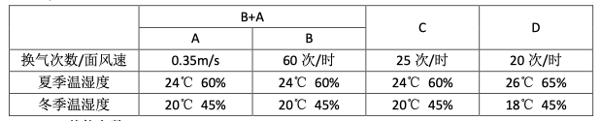

2、其他参数。

大气压：10^5Pa；室外点 W；室内点 N；混合点 C；露点 L（95%）；送风点 O；单位人员散热量 q1（81/93 W）①；单位人员散湿量 w1（184/150 g/h）②；人员密度 i（0.05 人 /m2）③。

夏季室外状态点 W：干球温度 35℃，湿球温度 27.5℃。

冬季室外状态点 W：干球温度 0℃，湿球温度 -1.3℃。

房间参数：面积：S（m2），吊顶高度 H（2.6m）④，换气次数 n（次 / 时），围护结构夏季负荷 + 照明负荷 [q 夏季]（60W/m2）⑤，围护结构冬季负荷 - 照明负荷 [q 冬季]（35W/m2）⑥，人员 P（p=S*i），设备散热量 Q 设备散热（W），设备散湿量 W 设备散湿（g/h）。

注：①、② 的数据来源于「陆耀庆。实用供热空调设计手册 [M].2 版。北京：中国建筑工业出版社，2009：1548」；③、⑤、⑥ 的数据是笔者根据多个长江中下游地区的项目设计中的数据而确定的平均值；④为一般洁净室的高度。

3、计算公式。

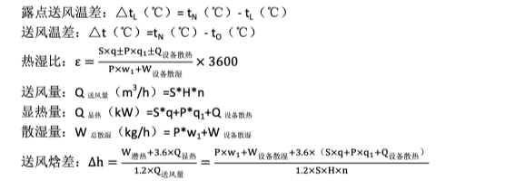

热湿比、焓差与温差的近似数值关系。在净化空调计算中，我们一般只能通过焓湿图来确认热湿比、焓差及温差。为了便于计算及分析，可通过焓湿图整理出表 2 中的数据。

表 2

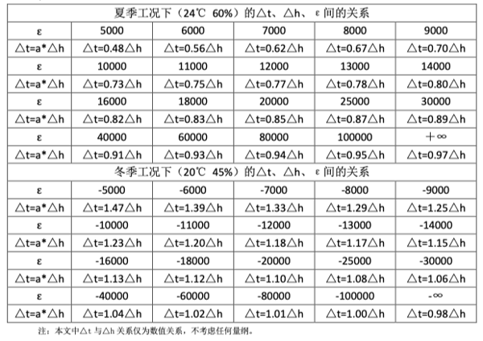

## 02. 送风温差分析

以下通过各类型情况对送风温差进行分析。

1、室内无人员、无设备散热散湿、无局部排风、热湿比为 +∞ 或 -∞（图 1）

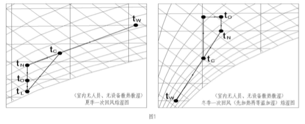

D 级区夏季：送风焓差 3.46kJ/kg，热湿比为 +∞，送风温差 △t=0.97△h=3.36℃；D 级区冬季：送风焓差 -2.02kJ/kg，热湿比为 -∞，送风温差 △t=0.98△h=-1.98℃。同理可以算出 C 级区、B+A 级区。

C 级区夏季：送风焓差 △h=2.77kJ/kg，送风温差 △t=0.97△h=2.69℃；C 级区冬季：送风焓差 △h=-1.62kJ/kg，送风温差 △t=0.98△h=-1.58℃。

B+A 级区夏季：送风焓差 △h=1.15kJ/kg，送风温差 △t=0.97△h=1.12℃；B+A 级区冬季：送风焓差 △h=-0.67kJ/kg，送风温差 △t=0.98△h=-0.66℃。

一般 B 级区为 A 级区服务。A 级区通常采用 FFU 或独立空调系统，采用 FFU 时，FFU 的散热量为 B 级区系统承担（为了便于分析，本文不考虑此种情况，即忽略 A 级区对 B 级区的影响）；采用独立空调系统时，A 级区自己承担负荷。

以上结论都是基于初始数据（国内长江下游地区）下的结论，在一般情况下（无人员、无设备散热散湿的洁净室），我们可以根据以下公式来计算净化空调的送风温差。

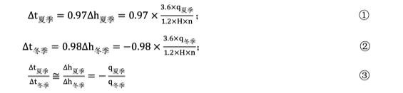

2、室内仅有人员、无设备散热散湿（图 2）。

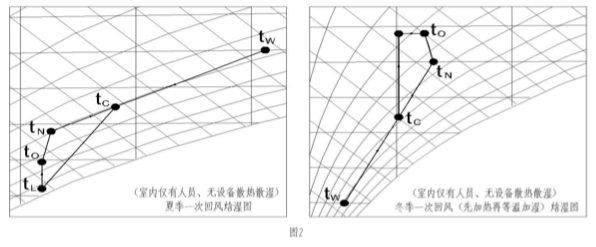

夏季热湿比，△t=0.87△h。冬季热湿比，△t=1.1△h。

D 级区夏季：送风焓差 △h=3.84kJ/kg，送风温差△t=0.87△h=3.34℃。D 级区冬季：送风焓差 -1.63kJ/kg，送风温差 △t=1.1△h=-1.79℃。同理可以算出 C 级区、B+A 级区。

C 级区夏季：送风焓差 △h=3.07kJ/kg，送风温差 △t=0.87△h=2.67℃；C 级区冬季：送风焓差 △h=-1.31kJ/kg，送风温差 △t=1.1△h=-1.44℃。

B+A 级区夏季：送风焓差 △h=1.28kJ/kg，送风温差 △t=0.87△h=1.12℃；B+A 级区冬季：送风焓差 △h=-0.54kJ/kg，送风温差 △t=1.1△h=-0.60℃。

因此我们可以对国内长江下游地区一般洁净室（无设备散热散湿且层高为 2.6 米）总结如下：

1）根据（1、2）的结论可看出室内有无人员对送风温差影响甚微，因此我们可以忽视人员的影响；2）一次回风与二次回风的区别，仅是二次回风可以省去夏季系统的回热量，而对整个系统的送风温差无任何影响；3）新风量的大小仅是对系统制冷量及制热量的影响，对送风温差也无影响；4）房间的换气次数不变，房间的送风温差也应该为一定值。

根据以上结论，可以汇总成下表（表 3）：

表 3

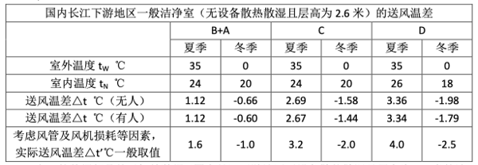

表 3 的数据都是基于初始数据（国内长江下游地区无设备散热散湿且层高为 2.6 米的洁净室）下的结论。在一般情况下（无设备散热散湿的洁净室），我们可以根据以下公式来估算净化空调的送风温差。

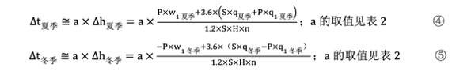

3、室内有设备散热散湿（图 3）

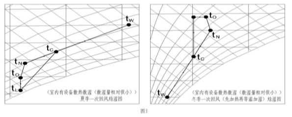

此类情况比较复杂，房间的散热散湿不仅直接影响了该房间的送风温差，而且还影响了该房间的制冷制热方式、新风比及换气次数。需要特别注意的是本文只是针对于单个房间，通常情况下，一个系统存在多种类型房间，各房间会相互影响、相互制约，这样就只能通过实际情况对系统和房间综合分析，因此本文分析的结果只能作为房间的初步分析。

一般情况下，热湿比、△t 及 △h 的数值关系可以按表 2 取值。夏季时净化空调只会存在制冷状态，且一次或二次回风以及新风比对送风温差均无影响，根据图 3、图 2，我们可以得到下表（表 4）：

表 4

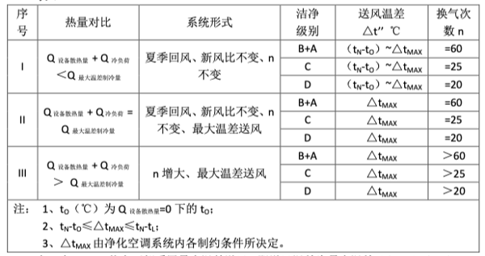

表 4 中：II、III 状态下都采用最大温差送风，即送风温差为最大温差（△t’’(℃)=△tMAX(℃)）；I 状态下，送风温差为 △t≈ax△h，其中 a 的取值详见表 2。

冬季时的情况比夏季更要复杂，主要原因有以下几点：1）散热量大到一定程度时，系统需由制热状态转成制冷状态，此时需增加新风比甚至于采用冷冻水来制冷；2）当房间设备散热量与房间热负荷相差不大时，此时房间的热湿比比较小，焓差变化率与温差变化率相差较大；3）散热量较大时，新风比的大小对制冷制热方式、回风方式、送风温差等都有一定的影响。

鉴于以上原因，我们在此只分析 [Q散热量] ≤ [Q热负荷] 时的情况，因为当 [Q散热量]＞[Q热负荷]，送风温差为正值，即 tN＞tO，新风比、散热量、散湿量、空调系统等等都是相互制约、相互影响、相互联系的，此时必须考虑各种制约因素后再绘制焓湿图来计算送风温差。

我们根据图 3 同样可以得到以下表格（表 5）：

表 5

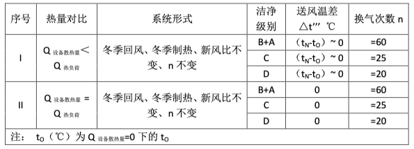

表 5 中：I 状态下的送风温差为，其中 a 的取值详见表 2。

当房间散湿量较大时，热湿比的绝对值较小。此时焓差变化率与温差变化率相差较大，即 a 值的变化率较大，此时表 2 就只能作为参考数据了，最好还是通过焓湿图来精确确定送风温差。

## 小结

以上结论都有一定的局限性及误差性，特别是第三种类型。笔者认为在第一及第二种类型下，可以采用公式 ①、②、③、④、⑤ 及表 2 来计算送风温差，而第三种类型，表 4 及表 5 的结论需在优先考虑各类系统限制条件后，再通过公式 ④、⑤ 及表 2 来计算。

洁净室无论在何种情况下都可以采用焓湿图来精确计算送风温差，但对于很多个洁净室的系统而言工作量是相当巨大的，本文的结论可以在一般洁净室直接初定送风温差，从而大大减少工作量。

在实际项目中，一般一套净化空调内有多种类型的房间，此时一般采用一套净化空调系统多种送风方式的设计理念。因为采用的是一套系统，各类型房间之间必然会存在一定的制约，此时就必须优先考虑这些制约条件，再进行后面的工作。同时，我们还需考虑系统排风、风机得热、风管耗损等对送风温差的影响，只有这样综合考虑各种因素后，才能得到比较准确的送风温差。

## 参考文献

[1] GB 50457-2019 医药工业洁净厂房设计规范 [S]. 北京：中国计划出版社，2019

[2] GB 50073-2013 洁净厂房设计规范 [S]. 北京：中国计划出版社，2013

[3] 陆耀庆，实用供热空调设计手册 [M].2 版。北京：中国建筑工业出版社，2009：955，2062-2113