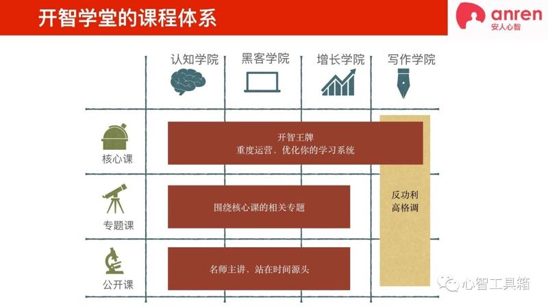
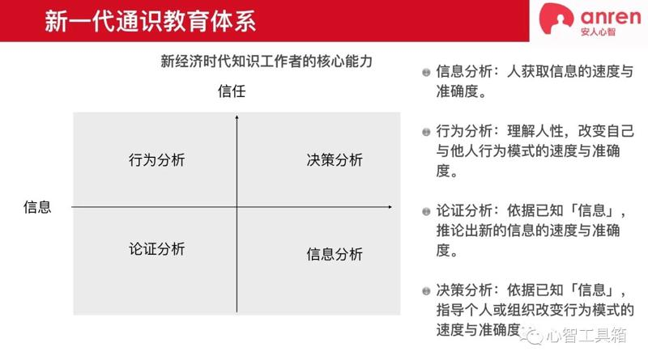
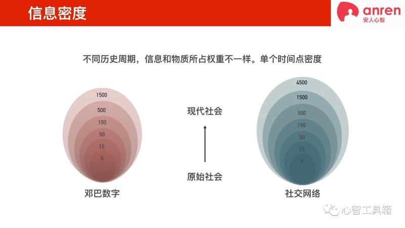
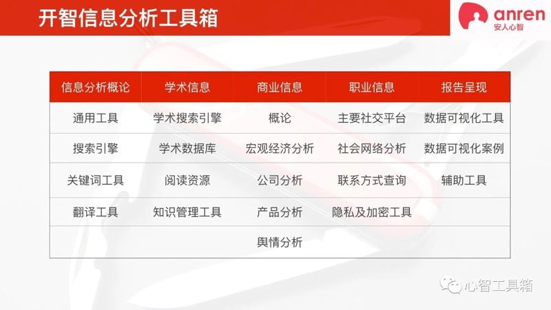
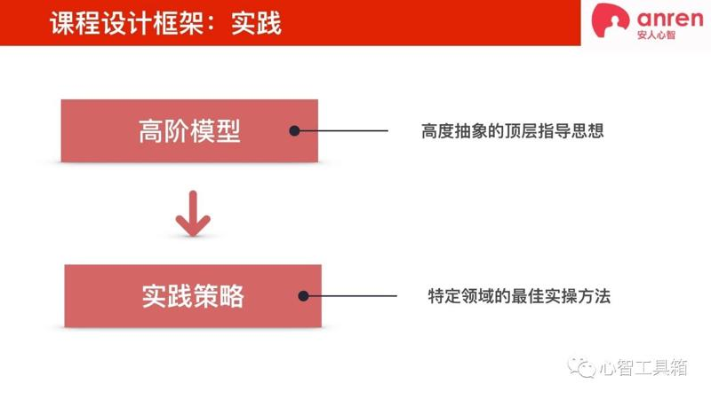

# 成年人的通识教育第一课——信息分析
> 原创： 阳志平  心智工具箱  2019 年 2 月 23 日

[成年人的通识教育第一课——信息分析](https://mp.weixin.qq.com/s/q3aLEFN4rk6xFylIre78zg)

在真正的教育、给自己的教育与认知科学给教育工作者的启发等文章中，我阐述了自己的教育理念。从理念到实践，是一个落地的过程。2018 年用了整整一年时间，研发面向未来的通识教育体系。其中，第一门上线的课是信息分析课。在这篇文章中，我回顾一下信息分析课项目的背景、立意与课程设计。

## 01. 缘起

2015 年 3 月，安人心智旗下的开智公司诞生于中关村五道口，致力于为 24-36 岁的知识工作者提供一流的职业教育。一个成年人为什么发展不好？可能卡在认知；也可能卡在技能。对应开智学堂的课程体系，就是通识教育与专业技能教育。前者，我总结为开智认知学院的信息分析、论证分析、行为分析与决策分析四大课程与核心技能。后者是开智黑客学院、增长学院、写作学院传授的编程、写作、运营等具体职业技能。

从三年前开智公司创办的第一天，我就一直在思考：如何快速提高 24-36 岁小伙伴的认知能力？带着团队，做了很多探索，比如开智部落、心智学徒计划、认知科学讲座等等。早期，我将这些努力命名为「认知升级计划」，尝试结合认知科学来提升认知能力。但，2017 年下半年，我南下深圳、广州、杭州、上海四个城市，与数百位开智学员深度交流后，有了一些新的启发。最重要的启发是，我需要放弃学科导向的课程设计。 认知能力低下，的确会制约人的职业生涯发展。但纯粹学习认知科学知识并不是好的课程设计。

我们需要将认知训练与技能训练有效结合。最终，我选取 21 世纪知识工作者最重要的通用核心技能，以认知科学为根基，结合相应具体领域的技能，将认知训练和技能训练结合在一起，形成独特的「开智认知学院通识四课」——信息分析、论证分析、行为分析、决策分析。

## 02. 通识第一课

开智认知学院的通识四课，各自解决的问题有所侧重：1）信息分析：人获取信息的速度与准确度；2）论证分析：依据已知「信息」，推论出新的信息的速度与准确度；3）行为分析：理解人性，改变自己与他人行为模式的速度与准确度；4）决策分析：依据已知「信息」，指导个人或组织改变行为模式的速度与准确度。

信息分析侧重信息，行为分析侧重人性，而决策分析和论证分析，既涉及人性，又涉及信息。无论是使用论证分析进行论证，还是依靠行为分析、决策分析改变和指导行为模式，都需要以信息为基础。

我认为信息是决策的依据，信息也是行为改变的基础。在 21 世纪智力不对称难，信息不对称易。在日常中人与人智力差异并不大，然而像我藏书数万，占有的图书信息比大部分人多，其中的量级差异，就制造了信息不对称优势。在今天这个信息爆炸时代，信息分析成了我认识的绝大多数精英人士的必备技能。因此，我将「信息分析」列为开智认知学院通识四课的第一课。

## 03. 提高信息分析能力的难点

互联网大大增加了信息，也提高了信息分析的难度。那么一般人信息分析能力差，是差在哪里呢？ 我认为多数人，信息分析能力差是差在：1）面对陌生的领域，不知道该采取什么样的信息分析框架；2）不知道「竟然」还有某某信息源存在。

从 2010 年前后，人类信息量步入了一个新的增长期。新学科新科技喷涌而出，短短十年间新增数百个新学科；短短几年内，App Store 应用数量从 0 到 300 万；微信公众号数量从 0 到 1000 万。每个新学科、每篇高引用论文、每个 App ，每个微信公众号又是一个新的「信息源」，继续引爆第二轮信息爆炸。

在这个信息爆炸时代，面对庞大信息，如果没有好的分析框架，这些信息碎片，很难变成自己的知识。而普通人以往习得信息分析框架的短板在于——往往只适用于某一个领域。比如在学术领域由导师传授了一套信息分析框架，但很难迁移、整合到工作领域。因此，结合我的职业生涯早期的企业竞争情报从业经验，针对这个难题，我提出「信息分析的核心框架」：时间、空间与变量关系，帮助大家快速地获得一个领域的关键信息，详细内容大家可以在课程中进行了解。

提高信息分析能力的第二个难点是，不知道信息源的存在。以找工作为例，大多数人在求职时，压根不知道，其实可以非常容易地了解到一个企业的关键信息，比如该企业的注册资本、股东关系、交社保人数等。这些数据按照国家法律规定，必须公开，查询一下国家企业信用系统，就能发现这些数据，辅助个人做出更好的判断。然而大多数人并不知道这些公开的数据源存在，导致一些小伙伴在找工作时上当受骗，甚至被欺诈。

在信息源上，我带着课程组，在往期数百位同学的协助下，整理了一个「开智信息分析开放工具箱」，一网打尽中英文世界优质信息源，按照课程框架，分门别类整理了数千个优质信息源。你将初步了解各类神奇的信息源、软件或在线服务。

总之，提高信息分析能力，一方面要掌握好的信息分析框架，另一方面要占据独特的信息源。信息分析框架+信息来源，能更好提高自己的信息分析能力。

## 04. 全局认识与交叉验证

信息分析课程结合科学计量学、情报科学、图书馆学，以及情报官员、商业间谍、图书管理员的实践，来提供思维素材。通过「高阶模型+实践策略」的巧妙组合，尝试规避传统思维训练类课程的缺点。

在信息分析时，我们人类大脑很容易出现认知偏差。为帮助各位同学更好地提高认知能力，避免偏差，我总结出两个核心的高阶模型：「全局认识」与「交差验证」。那么，什么是「全局认识」与「交叉验证」高阶模型呢？

先说「全局认识」。平时我们大部分接受的信息为「利基知识」，如看公众号，朋友圈等。与之相反的「全局认识」，它来自对一个领域的洞察，存在于生活的 10% ，却可能在我们作出重大的人生抉择和承诺时会起到关键作用。详细介绍可以参考我的旧文：真正的教育。

碎片时代，我们容易盲目，以为占有知识就代表习得。然而，真正的教育并不是去掌握那些碎片知识，而是在每一个学习阶段，将碎片拼接为你的知识雪球。「全局认识」在任意一个信息分析领域都可以让你站在更高的维度去分析，这样能够帮助自己规避很多弯路。

再说一下「交叉验证」。 我们人类习惯单线条思维，很容易被人收割智商税。那么，当我们从几个信息源拿到信息后，引入「交叉验证」，同时借助大脑爱找不同的特点，能帮我们进行规避认知偏差。同时，「交叉验证」这套方法论中还整合了美国情报局发明的「竞争性假设分析法」，该理论是小理查兹·J·霍耶尔在《情报分析心理学》一书中提出。作为情局资深教育家、理论家和反情报专家，他与肯特、Robert Gates、道格拉斯三人，并称美国中央情报局四位功臣。

## 05. 用作品说话

我设计的课程不鼓励单向输入。因为从认知科学角度，单听音频，三个月后这些知识大多数都会遗忘。具体到信息分析课，结业大项目是课程设计重要环节，考察重点是信息分析的速度与准确度。

当老师，最爽的时候就是同学毕业汇报。信息分析课于我而言，也是一场教学相长之旅。每次课程结束时，参加同学路演汇报，都会收获满满。各位同学将我的理念复用到商业、学术、职业等不同领域。每期课程结束，都会涌现诸多精彩结业报告。这些结业项目，课程组小伙伴将其汇总在「信息分析结业作业展」中，在开智学堂官网（OpenMindClub.com）可找到。欢迎各位查看。相关文章亦可参考：

### 1. 商业

如何开「一个书店」？

抖音小姐姐排行榜来了

如何获得信息优势？信息分析六大优秀结业项目视频

### 2. 学术

知识大融通项目复盘

[茫茫信息大海，你如何为自己绘制航海图？](https://mp.weixin.qq.com/s?__biz=MzA4ODM4ODQ3MQ==&mid=2651938538&idx=1&sn=2a17847d7f21a8fa1fb2b65cd8aa0ff6&chksm=8bcf18f2bcb891e4451d79e48273a5515907c163967ecfa7851c014cf611f8161efc26fa2b73&scene=21#wechat_redirect)

21世纪的通识教育项目复盘

### 3. 职业

[进击！做信息时代的智人](https://mp.weixin.qq.com/s?__biz=MzA4ODM4ODQ3MQ==&mid=2651940218&idx=1&sn=51beaa85704e604c98e14c47045a87e9&chksm=8bcf2362bcb8aa74ae836c6157287eec361c564ac6496e02ce5268f770c644a7441cd8983b8a&scene=21#wechat_redirect)

[科学转行背后的「心智启蒙」历程](https://mp.weixin.qq.com/s?__biz=MzA4ODM4ODQ3MQ==&mid=2651940234&idx=1&sn=aa43fb3c3fb49f630303258e2a1bb60f&chksm=8bcf2392bcb8aa84695f7a8ab5e15a0c50c8c90fe64f562e28b807cfdce606cf7610a149513a&scene=21#wechat_redirect)

未来哪些职业不会被机器人取代？这里有一份《智能时代应对指南》

## 小结

在 21 世纪，智力不对称难，信息不对称易。人与人智力差异并不大，但绝大多数杰出创作者都拥有更好的信息分析习惯。信息分析课是我设计的通识教育体系落地的第一课。期待感兴趣的同学，共建课程体系。

阳志平

2019-2-23

相关阅读：[认知科学给教育工作者的启发](https://mp.weixin.qq.com/s?__biz=MzA3MzM0MjUyMQ==&mid=2652150315&idx=1&sn=0573a5f38029d0ced1924337e8b61c8c&chksm=84f0b17db387386b717e0f54d4f4d490ae1196c10bd6240f9ae7bd1117d48b9ca26df550aefc&scene=21#wechat_redirect)