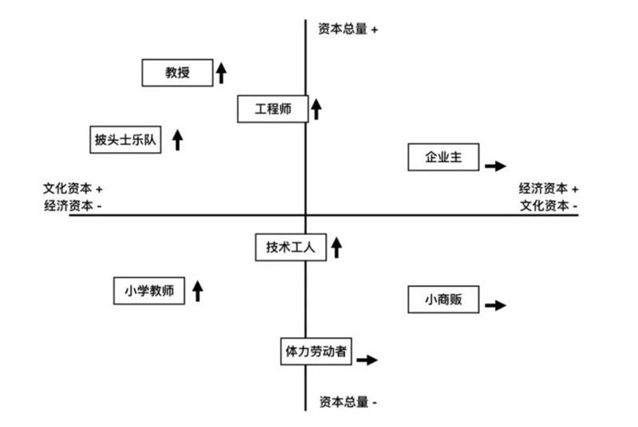

# 文化资本与社会资本

原创 阳志平 心智工具箱 2020-11-03

[文化资本与社会资本](https://mp.weixin.qq.com/s?__biz=MzA3MzM0MjUyMQ==&mid=2652151520&idx=1&sn=0fa00d45e6e4df23159c4a60cec46f85&chksm=84f0b5b6b3873ca0ed55c92199c7f51923757da9de388e154bb88ecb754436a93aff51e6dc5d&scene=21#wechat_redirect)

## 01

寒山苍翠，秋水潺潺。如果将人生比喻成河流，同样的源头，不同的结果。因此，仕女爱姻缘，士子求前程。如果以终为始，站在四十八岁看三十六岁，站在三十六岁看二十四岁，我们发现，不同的生活方式区分了不同的人。

假设两种极端，你拿青春赌明天，赌上你二十四岁到三十六岁的十二年时间。一种极端是过去十二年，你只积攒人脉，在过往人生中，花费大量时间，结识人脉，维系社交关系。另一种极端是过去十二年，你只闭关读书，远离人群，埋头苦修。在过往人生中，你读了一千本好书，写了一千本书的笔记。

哪条人生路径容易大概率胜出？前者是多数年轻人曾经选择过的「阳关大道」，后者则是少数人走过的「林荫小路」。康德、梭罗等无不是选择了后者的路径。即使到了如今，也有少数人选择后者，典型如神话学大师坎贝尔（Joseph Campbell），在一个与世隔绝的小木屋里，用五年时间去看自己喜欢的书。

熙熙攘攘的大道，拥挤得你推我让。无人问津的小路，反而是通往心灵自由的捷径。这是为什么呢？

因为前者积攒的是社会资本（Social Capital）。什么是社会资本？按照美国社会学家林南在《社会资本》一书中的定义，社会资本是通过社会关系获得的资本。那些处在两个人际网络之间的人，就比只处在一个人际网络之中的同伴，社会资本更大；同样，在单一人际网络中，那些更受人喜欢、影响力更强的人，其社会资本更胜于那些沉默寡言、孤僻独处的人。

假设我要从候选人 A 与候选人 B 之间选拔公司高管，那么如何评估谁的社会资本更高呢？可以采用一个简单的度量社会网络的方法：看候选人在四大网络——建议网、友谊网、信任网、外界网——当中的位置。

建议网是指这个高管，企业内有多少人愿意寻求他的建议；友谊网是指多少人把他看作朋友，愿意邀请他参加生日晚会；信任网是指企业内部有多少人信任他；外界网则是在产业上下游，有多少信息节点离不开他。在高管评定中，我们往往可以采取董事会网络等类似外界网指标，比如，候选高管与担任上下游相关产业的董事会、股东的关系。

社会资本不仅影响人的职业生涯，同样影响国家。日裔美国学者福山（Francis Fukuyama）在他撰写的《信任：社会美德与创造经济繁荣》中，把诚信作为一种社会资本，在分析东西方各国文化传统和信任度的差别后指出，在中国及其它东南亚国家培养信任很难，需要很长时间。

1999 年，年轻的杨青刚刚博士毕业，正在硅谷的一家生物科技公司工作，他读了此书，思考道：

如果能在有志于在生物医药工业领域发展的华人同行间，建立一个会员制的社区，在职业生涯的早期就开始互相帮助，培养彼此的信任度。那么多年之后等会员们职业持续发展，需要在生意上做更大的决定时，他们就可以借助于在这个会员制社区所积累的人脉和彼此直接或间接的信任，拥有更多的资源。如果会员之间合作，也可以对对方有更多的了解。

这一思考成就了生物科技领域的百华会传奇。更容易形成信任的时期是在人的职业生涯早期。入行不久，就与一批内在动机驱动、热爱学习、用好奇心探索世界的小伙伴同行，这是积攒社会资本的最佳手段。

## 02

中国处处可以看到对社会资本的重视。中国人发明了成千上万的名词来描述社会关系中的微妙。你比他更有地位，此时，你帮对方忙，这个叫作「给面子」；你和对方地位平等，你求对方帮忙，这个叫作「看我面子」。你求地位比你低的人办事，结果失败了，你恼羞成怒，叹道「丢脸」「没脸见人」；一个社会地位高于你的人帮你站台，你立即发一条朋友圈晒照片，内心笑道：「真长脸」。

在中国，金钱、财富等经济资本与人脉等社会资本前所未有地亲密。似乎，你的人脉就代表着你的财富。因此，绝大多数年轻人推崇这条路径。甚至误以为，这是通向成功的唯一路径。

然而，历史告诉我们，不是这样。在九品中正制盛行的魏晋时代，上品是高门望族，中品是普通士族，下品则是寒门庶族。「九品」可以近似地理解为今天的阶层。你究竟属于社会上哪个阶层？社会资本在你成为普通士族时作用较大，但到了上品时则意义微弱。

中国百年以上望族，有莆田之蔡、白沙之萧、毗陵之胡、会稽之石、番阳之陈、新安之汪、吴兴之沈、龙泉州之鲍。在魏晋年代，吴兴沈氏堪称一代武宗，土豪祖师爷。但因为欠缺经学传承，外加南北之争，始终入不了上品高门。直到唐宋，沈氏宗族经过一代又一代人的努力，从豪强沈法兴开始，再到德清沈、归安沈、乌程沈、竹墩沈，开枝散叶，猎猎张扬。

相对来说，在年轻时积累社会资本的发展路径，会存在极大的局限。

第一是受限于地域。比如你在郑州认识一堆朋友，若换工作到北京来，那么你需要重新构建一个人际交往圈子。开个玩笑，假设你是天津滨海新区的老大，在当地你横行霸道，但是你到北京五道口，还可以吗？前文列举吴兴沈氏例子，佐证了此点。在当时，沈氏武力值堪称第一，却始终得不到上品士族的承认。

第二是不够稳健。比方说，你好不容易和对方建立了非常好的关系，但是对方因为利益问题，背叛了你，彼此关系从此中断。不是你的原因，但你也不得不承受损失。极端案例如离婚，不仅损失时间、金钱，更伤心劳神。

第三是存在明显的天花板。根据英国进化心理学家罗宾·邓巴（Robin Dunbar）的研究，受制于人类的生理限制，人类能管理的人际关系在 150 人左右。主要是指你在机场遇到，不打招呼不好意思的人，这些人加在一起，总数也不会超过约 150 人。如今在社交媒体工具的帮助下，人类第一次能尝试管理 4500 人。做个极端一点的假设，如果你将十年时间都花在与人社交上，那么你一天什么都干不了。反之，十年时间，读千本好书，却是可行的。

那么，为什么社会上的多数人，首选积累社会资本的发展路径呢？这是因为人类演化习得的进化偏差。我们更容易记忆人脸。我们可以不费吹灰之力，完成面孔识别这类任务，人工智能却需要花费九牛二虎之力。反之，大脑爱偷懒，我们逃避学习抽象的概念。当你年轻时，有两个选择，一个是呼朋唤友，春风得意马蹄疾，看尽长安；一个是独自一人，三更灯火五更鸡，熟读精思，多数人会选择哪个？

## 03

无论是曾经从寒门子弟到士族，或从普通士族到上门高品，还是今天从草根到中产，从中产到精英，若想成功跃迁，你还可以选择另一条路径：积累文化资本（Cultural Capital）。

什么是文化资本？它的提出者是法国二十世纪最重要的社会学家布迪厄（Pierre Bourdieu），他认为，文化资本是指借助教育行动所传递的文化物品。资本除了直接转换成金钱的经济形式之外，它还以文化的形式存在。激发布迪厄提出文化资本概念的原因是他注意到，一个人的学术成就与他家庭所处的社会阶级相关。君子之泽，五世而斩；诗书传家，流芳百世。

具体而言，布迪厄认为，文化资本包括三种形式：具身的、客观的、制度的。

什么是具身的？它只属于你。文养气，诗洗心，十年寒窗苦读，沉淀在你身上的精气神。它不因地而异，不可转让，始终为你所有。

客观的则指你的藏书、你的作品。乱世黄金，盛世古玩。更聪明的玩法则是在家族建立藏书楼。如沈节甫（1533—1601）建有著名藏书楼「玩易楼」，与归安茅坤「白华楼」、嘉兴项元汴「天籁阁」、宁波范钦「天一阁」齐名于世。沈氏千年望族，离不开一代又一代的文化资本积累。这也是在今天这个电子书流行时代，我始终坚持藏书的考量，家财万贯，不如满室书香。

制度的文化资本则指各种文凭、证书与资格认证。在此事上，容易出现两种极端。第一种极端是高度重视证书，比如今天各类考证狂。另一种极端是忽略证书。多年前的我年轻气盛，毕业伊始，就在一个高级知识分子圈内工作，原本有机会成为博士，却始终对证书嗤之以鼻。从而让我的某些文化资本失去了制度保障。

与社会资本受限于地域不同，文化资本更容易洞穿不同阶层，实现认知升级，阶层跃迁。2002 年心理学家卡尼曼（Daniel Kahneman）荣获诺贝尔经济学奖之后，无论在中国还是美国，都受到心理学圈的追捧。在 2002 年，我第一次统计国内引用卡尼曼的论文总数，不过三四十篇而已，而今天，这个数字已经高达成千上万。同样，具身的文化资本，始终属于你，黄金万两，不如一技在身。这是为什么呢？

文化资本更易被人忽略的特点是，你可以更高效地利用你的时间，让你的文化资本实现量级跃迁。以年轻人从二十四岁到三十六岁这十二年的时间举例，他们之间交友数量级的差异难以太大，因为都受制于邓巴数字（Dunbar Number），往往不过是十个好友与百个好友的差异。但是，如果你像我一样，在过去十二年时间，耐心地买了数万本书，写了上千本书的读书札记，那么，就与社会上多数人的阅读量拉开了差距。据 2017 年统计，中国国民纸质图书平均年阅读量不过四本，社会上 99%的人，十年时间，阅读的非虚构类著作，不会超过一百本。

有了量级差异，才能拥有信息不对称优势。智商再高，天才与庸才，不过两三倍左右的差异。但如果你精读过一千本以上阅读难度较大的书，你很容易拥有十倍、百倍于同辈人群的信息差异。我经常开玩笑说，写读书笔记，百篇千篇万篇，区分开不同人群。如果你与人交谈，常常有听君一席话，胜读十年书的感觉，那是因为你太懒了，读的书过少。

一个努力向上的年轻人，在从二十四岁到三十六岁这段人生最美妙的时光，将自己的心力押注在完全受自己控制的事情上，严谨地制定个人自修计划，利用人类强大的好奇心，攻占一个又一个领域，积累庞大的文化资本。

另一种做法则是在十二年中，不断参与各类聚会，或者花天酒地，觥筹交错，推杯换盏；或者不断跑场子，交换名片，认识一个又一个所谓大牛，时间、关系受他人制约。采取哪种做法更容易取得成就？

前者正是多数精英走过的路。在中国，他们是韩愈、曾国藩、毛泽东；在西方，他们成了富兰克林、芒格、德鲁克。就像德鲁克所言：

供职的那家报社下午出版。我们早上 6 点开始工作，下午 2 点 15 分出版，于是我迫使自己在下午和晚上学习，学习的内容包括国际关系和国际法、社会和法律机构的历史、普通史、金融，等等。就这样，我慢慢构建起自己的知识体系。我现在仍然坚持这个习惯，每隔三四年我就会选择一个新的领域，例如统计学、中世纪史、日本艺术、经济学，等等。三年的学习当然不足以让我掌握一个领域，但足以让我对它有所了解。因此，在 60 多年的时间里，我不断地学习，每次学习一个领域。这不仅让我掌握了丰富的知识，而且迫使我去了解新的学科、新的途径和新的方法——我研究的每一个领域，它们的假设不同，采用的方法也不同。

## 04

文化资本与社会资本同样可以相互转换。有个常讲的段子是，你来往最频繁 5 个人的平均收入决定了你的收入。其实，应该将这句话改为，你来往最频繁的 5 个族群的平均社会经济地位，决定了你的社会经济地位。你可以主动挑选你的社交圈，积累更有助于生发文化资本的社会资本。

拿我举例，我经常往来的前五个族群是：家人、同事、书友、学员、智者。其中，家人来自血缘，难以改变。你不太可能逼着老父亲、老母亲再去学习，他们在家打打麻将就好，颐养天年，平安是福。依然有不少人，将希望寄托在家人身上，成人十余年，没有摆脱原生家庭影响。

但是你可以选择与什么样的人共事、与什么样的师友来往。我给自己设定了 3 个另类群体：书友、学员、智者。书友来自网络读书社群，君子之交淡如水，有共同兴趣而已。学员则以青年精英为主，面向未来的最好方法就是与代表未来的人群在一起。与学生相处，也是传承。

除此之外，我还给自己设定了一个特殊族群：历史上的智者。我喜欢读人物传记，家中数万藏书，人物传记占据了数千本。这些智者的图书与传记，构成了我从二十四岁到三十六岁知识谱系图的一部分。

十二年时间，看遍神作，对我影响深远的作者，数不胜数。如西蒙、斯坦诺维奇、吉仁泽、卡尼曼、平克之于认知科学；坎德尔、达马西奥、巴瑞特之于神经科学；如莫斯科维奇、帕金斯、托马塞洛、契克森米哈赖之于心理学；又如马奇、明茨伯格、德鲁克之于管理学；侯世达、纽曼、邓肯·瓦茨、霍兰、巴克、克莱因伯格、巴拉巴西、沃尔夫勒姆之于复杂性研究；伯特、格兰诺维特、布迪厄之于社会学；阿奇舒勒、野中郁次郎之于创新；艾柯、卡尔维诺、毛姆、怀特、博尔赫斯、纳博科夫、阿西莫夫之于文学；佐藤信夫、图尔敏之于修辞学；瓦茨拉维、阿吉里斯、温格之于行动科学；李亦园、杨中芳、杨国枢、黄光国之于本土心理学；普林斯、坎贝尔之于叙事学；邓巴、布洛克之于人类学。

人很难在同一时间相遇，却容易在同一地点相见。与不同时空的智者促膝谈心，何尝不是一种快乐呢？

## 05

如果将时间、空间摊平来看，每个人不过是一只在三维空间上爬行的蚂蚁。为了更好地看清你所在蚂蚁部落的爬行轨迹，布迪厄发明了「社会空间」图示法来描述人们的阶层跃迁。他用纵轴表示你所在族群拥有的资本总量。横轴则表示不同族群拥有的不同资本类型。如下图所示：

越上面的表示阶层越高，比如工程师的资本总量就高于技术工人的，因此工程师位居纵轴上方，技术工人位居纵轴下方。横轴则表示不同族群拥有的不同资本类型。比如教授、披头士乐队的文化资本大于经济资本，因此位于横轴左边；反之，企业主的经济资本则大于文化资本，位于横轴右边。

布迪厄将人的资本划分为经济资本、文化资本、社会资本与符号资本四种。在为社会空间做图示时，为简化问题，他常常只通过文化资本与经济资本来定位社会不同阶层所处的位置。上图中箭头方向表示阶层跃迁状况。

布迪厄按照这个族群在社会上的就业人数比例变化，来表示该阶层的发展状况。箭头向上，表示上升趋势；箭头向下，表示下降趋势；箭头方向持平，表示停滞。如果绘制一幅中国不同族群的「社会空间」图，那么从事互联网相关职业的族群，如工程师、运营、产品经理处在上升趋势。

详细论述参考他的经典之作《区分》，截至 2017 年 1 月，该书被引用的次数是 45827 次，是二十世纪社会科学类文献中被引用次数最多的二十篇文献之一。今天流行的「中产品味」「小资趣味」等词，皆发轫于此。

布迪厄的四种资本中，经济资本、文化资本、社会资本都容易懂。那么，什么是符号资本？符号资本（Symbolic capital），也译作象征资本，指运用符号使占有不同形态的其他三种资本合法化，即上述三种资本——经济资本、文化资本和社会资本通过符号而获得合法化的形式。

当你处在社会中层或下层努力往上走时，文化资本也好，社会资本也罢，都会帮助你。当你处在社会中上层，你却在不知不觉使用荣誉、信用等种种符号资本来维系自己阶层的统治地位。布迪厄终其一生，始终在维护同性恋、女性、少数族裔等社会弱势群体利益，他这样群嘲当时那些虚伪的知识分子：符号暴力！

你们这帮人，不再使用直接的暴力，却转为使用奖赏这类隐藏的软暴力，太虚伪了！

布迪厄的一个经典研究是对巴黎高师毕业生的研究。巴黎高师是法国哲学家和社会科学家的摇篮，大师辈出。布迪厄虽然毕业于此，却并不认同知识阶层的虚伪。

先看一个他对巴黎高师学生选择专业的研究。他发现，从学校到教师，巴黎高师不仅仅极力淡化不同学科的社会阶层限制，还不断神话不同学科的智力要求、人格特质要求，从而隐形地神化那些在社会资本、文化资本上高人一等的学生群体。

哲学、法语与数学，从来需要才华与天赋，因此成为上层与中产家庭出身学生的专利；而中下阶层出身的孩子还是老老实实去学习地理、自然科学吧。

一位高三学生很难区分心理学专业与计算机专业的好坏。学校与教师在极力淡化心理学与计算机专业的阶层差异，转而强调心理学与计算机专业的智力、兴趣与人格差异。

符号暴力最隐蔽的地方在于，来自阶层的差异最终却转换为个体的差异。你必须承认命运，不是你的家庭阶层不同，而是你的智力不行。

而布迪厄通过系列创造：中产、品味、区隔、文化资本、社会资本等系列词汇，群嘲了知识分子阶层的虚伪。

这种虚伪，不仅在你高三选择专业时干扰你的决策。甚至在他们死掉之后，依然在影响你的判断。

布迪厄另一个经典研究则是巴黎高师毕业生的悼词研究。巴黎高师毕业生的模范人生是成为大学教授与学术精英，但依然有不少毕业生在外省中小学教师位置上终其一生。

吊诡的是，无论是巴黎的学术精英，还是在外省的中小学教师，离世后的悼词，多半会脱离对个人的评价，而是强调巴黎高师的神话地位。

巴黎高师文凭本身，赋予了校友制度化的文化资本。他们去世时，也在不知不觉地维持这份文化资本的神话：落难贵族仍是贵族。北大学生即便毕业卖猪肉，也不同于出身普通的屠夫。

从此，身份成了命运；文化成了枷锁。

## 小结

然而，人生除了资本、价值、阶层跃迁、工具理性之外，还可以采菊东篱下，悠然见南山，还有理想、意义、平静生活、广义理性。就像柏拉图时代，既有兜售精神食粮的智术师，也有努力引领人们走出洞穴的先知。

若身处洞穴，使自己的灵魂得以转而向上，看见智慧及真理之光。

若离开洞穴，哲学家同样不可以只沉溺在真理之光中，他们还要重回洞穴中引领束缚在洞穴中的人离开洞穴，远离无知。

—— 柏拉图《理想国》

亘古长夜黑如墨，总有智者点亮苍穹。布迪厄 2002 年去世后，人们引用布迪厄在《自我分析纲要》一书中的自述，如是纪念他：「我把自己看得有点像这个中世纪的石匠，他在拉苏泰莱纳教堂里，雕刻一个表现连结并高高在上的柱头，柱头淹没在穹顶的黑暗里，注定让人完全看不到。」

阳志平

本文使用写匠创作，2020-11-3

相关阅读：人生发展，有这四种资本，越积累越自由

备注 1 ：本文首次发表日期为 2017 年 10 月 15 日，修正后，见于我的个人文集《人生模式》第十九章。