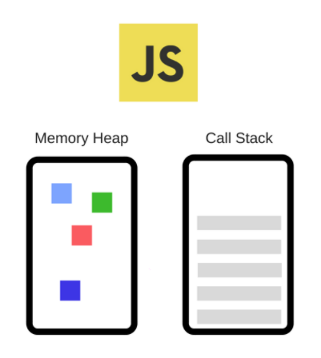
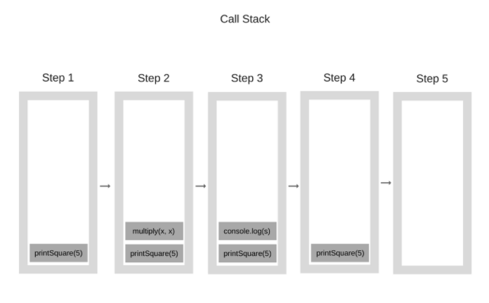
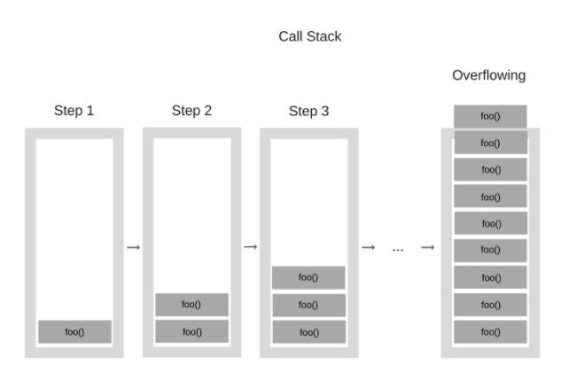
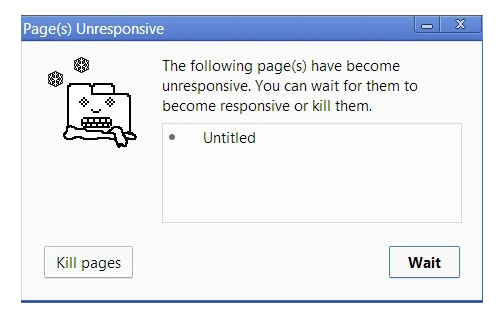
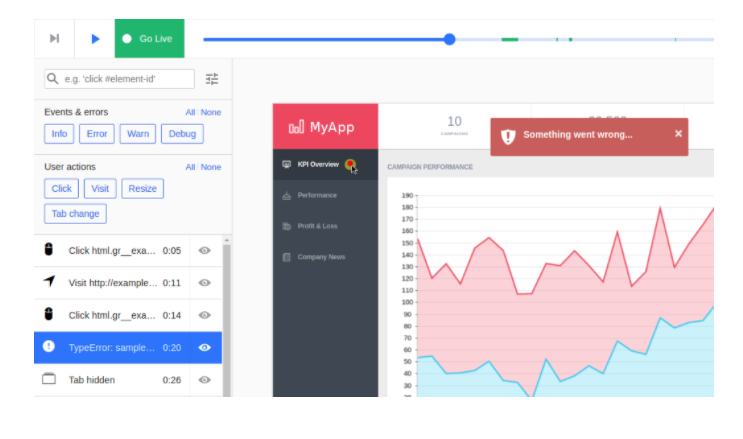

# How JavaScript works: an overview of the engine, the runtime, and the call stack

Alexander Zlatkov

Aug 10, 2017 · 6 min read

[How JavaScript works: an overview of the engine, the runtime, and the call stack](https://blog.sessionstack.com/how-does-javascript-actually-work-part-1-b0bacc073cf?gi=878b004bb1a0)

As JavaScript is getting more and more popular, teams are leveraging its support on many levels in their stack - front-end, back-end, hybrid apps, embedded devices and much more.

This post is meant to be the first in a series aimed at digging deeper into JavaScript and how it actually works: we thought that by knowing the building blocks of JavaScript and how they come to play together you’ll be able to write better code and apps. We’ll also share some rules of thumb we use when building SessionStack ([Co-browsing, live and recorded sessions for support teams | SessionStack](https://www.sessionstack.com/?utm_source=medium&utm_medium=source&utm_content=javascript-series-post1-intro)), a lightweight JavaScript application that has to be robust and highly-performant in order to stay competitive.

As shown in the GitHut stats ([GitHut - Programming Languages and GitHub](https://githut.info/)), JavaScript is at the top in terms of Active Repositories and Total Pushes in GitHub. It doesn’t lag behind much in the other categories either.

If projects are getting so much dependent on JavaScript, this means that developers have to be utilizing everything that the language and the ecosystem provide with deeper and deeper understanding of the internals, in order to build amazing software.

As it turns out, there are a lot of developers that are using JavaScript on a daily basis but don’t have the knowledge of what happens under the hood.

## 01. Overview

Almost everyone has already heard of the V8 Engine as a concept, and most people know that JavaScript is single-threaded or that it is using a callback queue. In this post, we’ll go through all these concepts in detail and explain how JavaScript actually runs. By knowing these details, you’ll be able to write better, non-blocking apps that are properly leveraging the provided APIs.

1『JavaScript is single-threaded or that it is using a callback queue. JS 是单线程的，使用「callback queue」。』

If you’re relatively new to JavaScript, this blog post will help you understand why JavaScript is so “weird” compared to other languages. And if you’re an experienced JavaScript developer, hopefully, it will give you some fresh insights on how the JavaScript Runtime you’re using every day actually works.

## 02. The JavaScript Engine

A popular example of a JavaScript Engine is Google’s V8 engine. The V8 engine is used inside Chrome and Node.js for example. Here is a very simplified view of what it looks like:



The Engine consists of two main components:

* Memory Heap — this is where the memory allocation happens.

* Call Stack — this is where your stack frames are as your code executes.

## 03. The Runtime

There are APIs in the browser that have been used by almost any JavaScript developer out there (e.g. “setTimeout”). Those APIs, however, are not provided by the Engine.

So, where are they coming from?

It turns out that the reality is a bit more complicated.


So, we have the Engine but there is actually a lot more. We have those things called Web APIs which are provided by browsers, like the DOM, AJAX, setTimeout and much more.

And then, we have the so popular event loop and the callback queue.

## 04. The Call Stack

JavaScript is a single-threaded programming language, which means it has a single Call Stack. Therefore it can do one thing at a time. The Call Stack is a data structure which records basically where in the program we are. If we step into a function, we put it on the top of the stack. If we return from a function, we pop off the top of the stack. That’s all the stack can do.

Let’s see an example. Take a look at the following code:

```js

function multiply(x, y) {

    return x * y;

}

function printSquare(x) {

    var s = multiply(x, x);

    console.log(s);

}

printSquare(5);

```

When the engine starts executing this code, the Call Stack will be empty. Afterwards, the steps will be the following:



Each entry in the Call Stack is called a Stack Frame.

And this is exactly how stack traces are being constructed when an exception is being thrown — it is basically the state of the Call Stack when the exception happened. Take a look at the following code:

```js

function foo() {

    throw new Error('SessionStack will help you resolve crashes :)');

}

function bar() {

    foo();

}

function start() {

    bar();

}

start();

```

If this is executed in Chrome (assuming that this code is in a file called foo.js), the following stack trace will be produced:

“Blowing the stack” — this happens when you reach the maximum Call Stack size. And that could happen quite easily, especially if you’re using recursion without testing your code very extensively. Take a look at this sample code:

```js

function foo() {

    foo();

}

foo();

```

When the engine starts executing this code, it starts with calling the function “foo”. This function, however, is recursive and starts calling itself without any termination conditions. So at every step of the execution, the same function gets added to the Call Stack over and over again. It looks something like this:



At some point, however, the number of function calls in the Call Stack exceeds the actual size of the Call Stack, and the browser decides to take action, by throwing an error, which can look something like this:

Running code on a single thread can be quite easy since you don’t have to deal with complicated scenarios that are arising in multi-threaded environments — for example, deadlocks.

But running on a single thread is quite limiting as well. Since JavaScript has a single Call Stack, what happens when things are slow?

## Concurrency & the Event Loop

What happens when you have function calls in the Call Stack that take a huge amount of time in order to be processed? For example, imagine that you want to do some complex image transformation with JavaScript in the browser.

You may ask — why is this even a problem? The problem is that while the Call Stack has functions to execute, the browser can’t actually do anything else — it’s getting blocked. This means that the browser can’t render, it can’t run any other code, it’s just stuck. And this creates problems if you want nice fluid UIs in your app.

And that’s not the only problem. Once your browser starts processing so many tasks in the Call Stack, it may stop being responsive for quite a long time. And most browsers take action by raising an error, asking you whether you want to terminate the web page.



Now, that’s not the best user experience out there, is it?

So, how can we execute heavy code without blocking the UI and making the browser unresponsive? Well, the solution is asynchronous callbacks.

This will be explained in greater detail in Part 2 of the “How JavaScript actually works” tutorial: “Inside the V8 engine + 5 tips on how to write optimized code”.

In the meantime, if you’re having a hard time reproducing and understanding issues in your JavaScript apps, take a look at SessionStack. SessionStack records everything in your web apps: all DOM changes, user interactions, JavaScript exceptions, stack traces, failed network requests, and debug messages.

With SessionStack, you can replay issues in your web apps as videos and see everything that happened to your user.

There’s a free plan, no credit card is required. Get started now.


