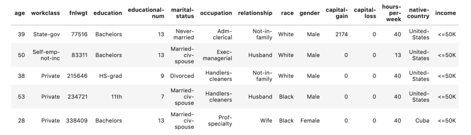

# A Data Scientists Guide to Python Modules and Packages

How to create, import and work with your own python packages.

Rebecca Vickery

[Elevate Your Webscraping With Splinter - Towards Data Science](https://towardsdatascience.com/elevate-your-webscraping-with-splinter-a926eee7f7d9)

[A Data Scientists Guide to Python Modules and Packages](https://towardsdatascience.com/a-data-scientists-guide-to-python-modules-and-packages-9193a861c26b)

Data science code is often very linear. Extract some data from a source, apply a series of transformations and then perform some analysis, calculations or train a model. However, for readability, efficiency and repeatability it can be useful to modularise and package your code for reuse and collaboration.

When I first started learning to program for data science I found it very difficult to locate simple explanations and tutorials for creating modules and packages, particularly for data science projects. In this post, I will give a very simple tutorial on how to create and use your own packages and modules for data science and machine learning projects.

Throughout this article, I will be using the adults dataset which can be downloaded from the UCI machine learning repository. This is a dataset commonly used to build a classification machine learning model with the goal being to predict if a given adult will earn over $50k per year or not.

## 01. A data science use case for modules

A python module is simply a set of python operations, often functions, placed in a single file with a .py extension. This file can then imported into a Jupyter notebook, IPython shell or into another module for use in your project.

Let’s run through an example.

In the below code I have read in the CSV file I will be working with using pandas.

```
import pandas as pd
data = pd.read_csv('adults_data.csv')
data.head()
```



This dataset contains a lot of categorical features. If we were planning to use this to train a machine learning model we would first need to perform some pre-processing.

Having analysed this data I have determined that I will take the following steps to preprocess the data before training a model.

One-hot encode the following columns: workclass, marital-status, relationship, race and gender.

Take the most commonly occurring values, group remaining values as ‘others’ and one-hot encode the resulting feature. This will need to be performed for the following columns as they have a large number of unique values: education, occupation, native-country.

Scale the remaining numerical values.

The code that we will need to write to perform these tasks will be quite large. Additionally, these are all tasks that we may want to perform more than once. To make our code more readable and to easily be able to re-use it we can write a series of functions into a separate file that can be imported for use in our notebook — a module.

## 02. Writing a module

To create a module you will need to first make a new blank text file and save it with the .py extension. You can use an ordinary text editor for this but many people use an IDE (Integrated Development Environment). IDE’s provide a lot of additional functionality for writing code including tools for compiling code, debugging and integrating with Github. There are many different types of IDE’s available and it is worth experimenting with a few to find the one which works best for you. I personally prefer PyCharm so I will be using this in the example.

To start writing the python module I am going to create a new python file.

I will name it preprocessing.py.

Let’s write our first preprocessing function in this file and test importing and using it in a Jupyter Notebook.

I have written the following code at the top of the preprocessing.py file. It is good practice to annotate the code to make it more readable. I have added some notes to the function in the code below.

```
def one_hot_encoder(df, column_list):
    """Takes in a dataframe and a list of columns
    for pre-processing via one hot encoding"""
    df_to_encode = df[column_list]
    df = pd.get_dummies(df_to_encode)
    return df
```

To import this module into a Jupyter Notebook we simply write the following.

    import preprocessing as pr

IPython has a handy magic extension known as autoreload. If you add the following code before the import then if you make any changes to the module file they will automatically be reflected in the notebook.

```
%load_ext autoreload
%autoreload 2

import preprocessing as pr
```

1「上面的代码一定要牢记，太有用了。」

Let’s test using it to preprocess some data.

```
cols = ['workclass', 'marital-status', 'relationship', 'race', 'gender']
one_hot_df = pr.one_hot_encoder(data, cols)
```

Now we will add the remaining preprocessing functions to our preprocessing.py file.

```
def one_hot_encoder(df, column_list):
    """Takes in a dataframe and a list of columns
    for pre-processing via one hot encoding returns
    a dataframe of one hot encoded values"""
    df_to_encode = df[column_list]
    df = pd.get_dummies(df_to_encode)
    return df

def reduce_uniques(df, column_threshold_dict):
    """Takes in a dataframe and a dictionary consisting
    of column name : value count threshold returns the original
    dataframe"""
    for key, value in column_threshold_dict.items():
            counts = df[key].value_counts()
            others = set(counts[counts < value].index)
            df[key] = df[key].replace(list(others), 'Others')
            return df

def scale_data(df, column_list):
    """Takes in a dataframe and a list of column names to transform
     returns a dataframe of scaled values"""
    df_to_scale = df[column_list]
    x = df_to_scale.values
    min_max_scaler = preprocessing.MinMaxScaler()
    x_scaled = min_max_scaler.fit_transform(x)
    df_to_scale = pd.DataFrame(x_scaled, columns=df_to_scale.columns)
    return df_to_scale
```

If we go back to the notebook we can use all these functions to transform the data.

```
import pandas as pd
from sklearn import preprocessing

%load_ext autoreload
%autoreload 2

import preprocessing as pr

one_hot_list = ['workclass', 'marital-status', 'relationship', 'race', 'gender']
reduce_uniques_dict = {'education' : 1000,'occupation' : 3000, 'native-country' : 100}
scale_data_list = data.select_dtypes(include=['int64', 'float64']).columns

one_hot_enc_df = pr.one_hot_encoder(data, one_hot_list)
reduce_uniques_df = pr.reduce_uniques(data, reduce_uniques_dict)
reduce_uniques_df = pr.one_hot_encoder(data, reduce_uniques_dict.keys())
scale_data_df = pr.scale_data(data, scale_data_list)

final_data = pd.concat([one_hot_enc_df, reduce_uniques_df, scale_data_df], axis=1)
final_data.dtypes
```


We now have an entirely numerical dataset which is suitable for training a machine learning model.

A snapshot of transformed columns

## 03. Packages

When working on a machine learning project it can often be desirable or sometimes necessary to create several related modules and package them so that they can be installed and used together.

For example, in my work, I am currently using a Google Cloud deployment solution for machine learning models called AI Platform. This tool requires that you package up preprocessing, training and prediction steps in the machine learning model to upload and install on the platform to deploy the final model.

A python package is a directory containing modules, files and subdirectories. The directory needs to contain a file called \__init__.py. This file indicates that the directory it is contained within should be treated as a package and specifies the modules and functions that should be imported.

We are going to create a package for all the steps in our preprocessing pipeline. The contents of the \__init__.py file are as follows.

```
from .preprocessing import one_hot_encoder
from .preprocessing import reduce_uniques
from .preprocessing import scale_data
from .makedata import preprocess_data
```

Modules within the same package can be imported for use within another module. We are going to add another module to our directory called makedata.py that uses the preprocessing.py module to execute the data transformations and then export the final dataset as a CSV file for later use.

```
import preprocessing as pr
import pandas as pd

def preprocess_data(df, one_hot_list, reduce_uniques_dict, scale_data_list, output_filename):
    one_hot_enc_df = pr.one_hot_encoder(data, one_hot_list)
    reduce_uniques_df = pr.reduce_uniques(data, reduce_uniques_dict)
    reduce_uniques_df = pr.one_hot_encoder(data, reduce_uniques_dict.keys())
    scale_data_df = pr.scale_data(data, scale_data_list)
    final_data = pd.concat([one_hot_enc_df, reduce_uniques_df, scale_data_df], axis=1)
    final_data.to_csv(output_filename)
```

The new directory now looks like this.


Now we can go back to the Jupyter Notebook and use this package to execute all the preprocessing. Our code is now very simple and clean.

```
import pandas as pd
%load_ext autoreload
%autoreload 2
import preprocessing as pr
data = pd.read_csv('adults_data.csv')
one_hot_list = ['workclass', 'marital-status', 'relationship', 'race', 'gender']
reduce_uniques_dict = {'education' : 1000,'occupation' : 3000, 'native-country' : 100}
scale_data_list = data.select_dtypes(include=['int64', 'float64']).columns
pr.preprocess_data(data, one_hot_list, reduce_uniques_dict,scale_data_list, 'final_data.csv')
```

In our current working directory, there will now be a new CSV file called final_data.csv which contains the preprocessed dataset. Let’s read this back in and inspect a few rows to ensure that our package has performed as expected.

```
data_ = pd.read_csv('final_data.csv')
data.head()
```

## In this article I have illustrated how using modules and packages for data science and machine learning projects can make your code more readable and reproducible. In my quest to find simple explanations of these processes I found this blog post very useful, and a nice walk through in the python like you mean it project.