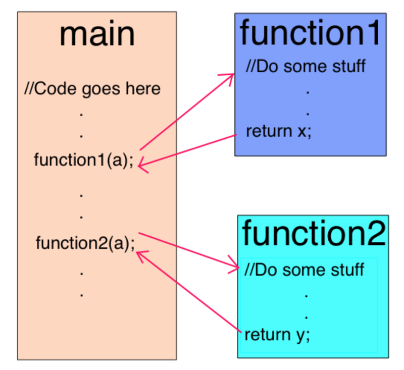
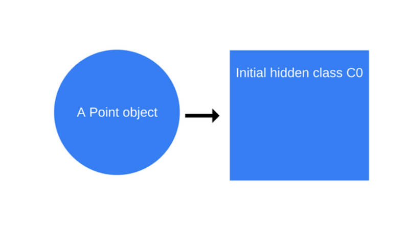
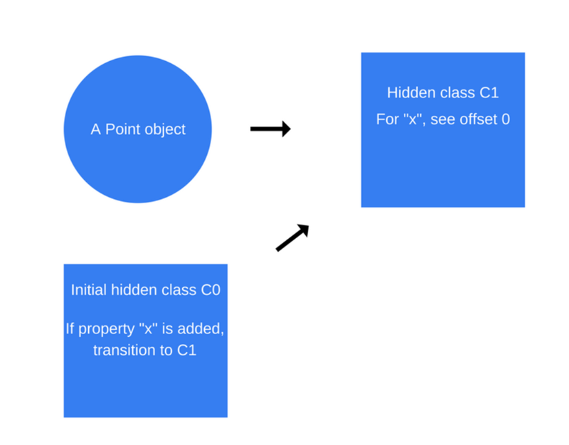
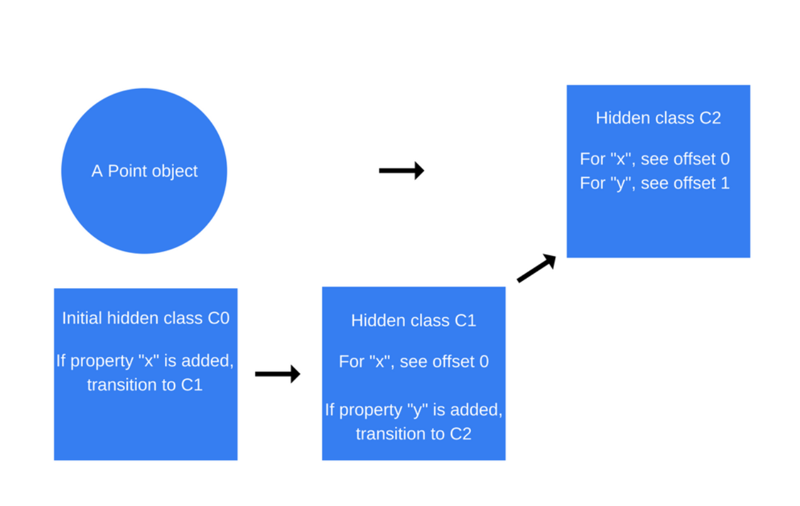
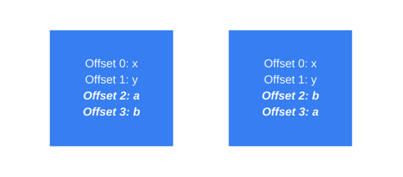
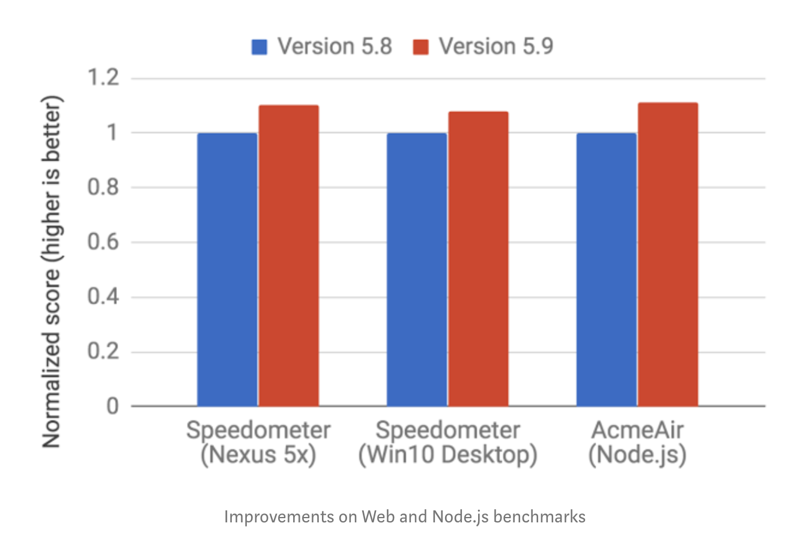

# How JavaScript works: inside the V8 engine + 5 tips on how to write optimized code

Alexander Zlatkov

Aug 21, 2017 · 11 min read

[How JavaScript works: inside the V8 engine + 5 tips on how to write optimized code](https://blog.sessionstack.com/how-javascript-works-inside-the-v8-engine-5-tips-on-how-to-write-optimized-code-ac089e62b12e)

Couple of weeks ago we started a series aimed at digging deeper into JavaScript and how it actually works: we thought that by knowing the building blocks of JavaScript and how they come to play together you’ll be able to write better code and apps.

The first post of the series focused on providing an overview of the engine, the runtime and the call stack. This second post will be diving into the internal parts of Google’s V8 JavaScript engine. We’ll also provide a few quick tips on how to write better JavaScript code —best practices our development team at SessionStack follows when building the product.

## 01. Overview

A JavaScript engine is a program or an interpreter which executes JavaScript code. A JavaScript engine can be implemented as a standard interpreter, or just-in-time compiler that compiles JavaScript to bytecode in some form. This is a list of popular projects that are implementing a JavaScript engine:

V8 — open source, developed by Google, written in C++.

Rhino — managed by the Mozilla Foundation, open source, developed entirely in Java.

SpiderMonkey — the first JavaScript engine, which back in the days powered Netscape Navigator, and today powers Firefox.

JavaScriptCore — open source, marketed as Nitro and developed by Apple for Safari.

KJS — KDE’s engine originally developed by Harri Porten for the KDE project’s Konqueror web browser.

Chakra (JScript9) — Internet Explorer.

Chakra (JavaScript) — Microsoft Edge.

Nashorn, open source as part of OpenJDK, written by Oracle Java Languages and Tool Group.

JerryScript — is a lightweight engine for the Internet of Things.

## 02. Why was the V8 Engine created?

The V8 Engine which is built by Google is open source and written in C++. This engine is used inside Google Chrome. Unlike the rest of the engines, however, V8 is also used for the popular Node.js runtime.

V8 was first designed to increase the performance of JavaScript execution inside web browsers. In order to obtain speed, V8 translates JavaScript code into more efficient machine code instead of using an interpreter. It compiles JavaScript code into machine code at execution by implementing a JIT (Just-In-Time) compiler like a lot of modern JavaScript engines do such as SpiderMonkey or Rhino (Mozilla). The main difference here is that V8 doesn’t produce bytecode or any intermediate code.

## 03. V8 used to have two compilers

Before version 5.9 of V8 came out (released earlier this year), the engine used two compilers: 1) full-codegen — a simple and very fast compiler that produced simple and relatively slow machine code. 2) Crankshaft — a more complex (Just-In-Time) optimizing compiler that produced highly-optimized code.

The V8 Engine also uses several threads internally: 1) The main thread does what you would expect: fetch your code, compile it and then execute it. 2) There’s also a separate thread for compiling, so that the main thread can keep executing while the former is optimizing the code. 3) A Profiler thread that will tell the runtime on which methods we spend a lot of time so that Crankshaft can optimize them. 4) A few threads to handle Garbage Collector sweeps.

When first executing the JavaScript code, V8 leverages full-codegen which directly translates the parsed JavaScript into machine code without any transformation. This allows it to start executing machine code very fast. Note that V8 does not use intermediate bytecode representation this way removing the need for an interpreter.

When your code has run for some time, the profiler thread has gathered enough data to tell which method should be optimized.

Next, Crankshaft optimizations begin in another thread. It translates the JavaScript abstract syntax tree to a high-level static single-assignment (SSA) representation called Hydrogen and tries to optimize that Hydrogen graph. Most optimizations are done at this level.

## 04. Inlining

The first optimization is inlining as much code as possible in advance. Inlining is the process of replacing a call site (the line of code where the function is called) with the body of the called function. This simple step allows following optimizations to be more meaningful.



## 05. Hidden class

JavaScript is a prototype-based language: there are no classes and objects are created using a cloning process. JavaScript is also a dynamic programming language which means that properties can be easily added or removed from an object after its instantiation.

Most JavaScript interpreters use dictionary-like structures (hash function based) to store the location of object property values in the memory. This structure makes retrieving the value of a property in JavaScript more computationally expensive than it would be in a non-dynamic programming language like Java or C#. In Java, all of the object properties are determined by a fixed object layout before compilation and cannot be dynamically added or removed at runtime (well, C# has the dynamic type which is another topic). As a result, the values of properties (or pointers to those properties) can be stored as a continuous buffer in the memory with a fixed-offset between each. The length of an offset can easily be determined based on the property type, whereas this is not possible in JavaScript where a property type can change during runtime.

1『 Java 在检索键-值型数据结构（对象）时比 JS 高效。』

Since using dictionaries to find the location of object properties in the memory is very inefficient, V8 uses a different method instead: hidden classes. Hidden classes work similarly to the fixed object layouts (classes) used in languages like Java, except they are created at runtime. Now, let’s see what they actually look like:

```js
function Point(x, y) {
    this.x = x;
    this.y = y;
}
var p1 = new Point(1, 2);
```

Once the「new Point(1, 2)」invocation happens, V8 will create a hidden class called「C0」. No properties have been defined for Point yet, so「C0」is empty.



Once the first statement「this.x = x」is executed (inside the「Point」function), V8 will create a second hidden class called「C1」that is based on「C0」.「C1」describes the location in the memory (relative to the object pointer) where the property x can be found. In this case,「x」is stored at offset 0, which means that when viewing a point object in the memory as a continuous buffer, the first offset will correspond to property「x」. V8 will also update「C0」with a「class transition」which states that if a property「x」is added to a point object, the hidden class should switch from「C0」to「C1」. The hidden class for the point object below is now「C1」.



Every time a new property is added to an object, the old hidden class is updated with a transition path to the new hidden class. Hidden class transitions are important because they allow hidden classes to be shared among objects that are created the same way. If two objects share a hidden class and the same property is added to both of them, transitions will ensure that both objects receive the same new hidden class and all the optimized code that comes with it.

This process is repeated when the statement「this.y = y」is executed (again, inside the Point function, after the「this.x = x」statement).

A new hidden class called「C2」is created, a class transition is added to「C1」stating that if a property「y」is added to a Point object (that already contains property「x」) then the hidden class should change to「C2」, and the point object’s hidden class is updated to「C2」.



Hidden class transitions are dependent on the order in which properties are added to an object. Take a look at the code snippet below:

```js
function Point(x, y) {
    this.x = x;
    this.y = y;
}

var p1 = new Point(1, 2);
p1.a = 5;
p1.b = 6;

var p2 = new Point(3, 4);
p2.b = 7;
p2.a = 8;
```

Now, you would assume that for both p1 and p2 the same hidden classes and transitions would be used. Well, not really. For「p1」, first the property「a」will be added and then the property「b」. For「p2」, however, first「b」is being assigned, followed by「a」. Thus,「p1」and「p2」end up with different hidden classes as a result of the different transition paths. In such cases, it’s much better to initialize dynamic properties in the same order so that the hidden classes can be reused.

## 06. Inline caching

V8 takes advantage of another technique for optimizing dynamically typed languages called inline caching. Inline caching relies on the observation that repeated calls to the same method tend to occur on the same type of object. An in-depth explanation of inline caching can be found here. We’re going to touch upon the general concept of inline caching (in case you don’t have the time to go through the in-depth explanation above).

3『 [Optimizing dynamic JavaScript with inline caches · sq/JSIL Wiki](https://github.com/sq/JSIL/wiki/Optimizing-dynamic-JavaScript-with-inline-caches) 』

So how does it work? V8 maintains a cache of the type of objects that were passed as a parameter in recent method calls and uses this information to make an assumption about the type of object that will be passed as a parameter in the future. If V8 is able to make a good assumption about the type of object that will be passed to a method, it can bypass the process of figuring out how to access the object’s properties, and instead, use the stored information from previous lookups to the object’s hidden class.

So how are the concepts of hidden classes and inline caching related? Whenever a method is called on a specific object, the V8 engine has to perform a lookup to the hidden class of that object in order to determine the offset for accessing a specific property. After two successful calls of the same method to the same hidden class, V8 omits the hidden class lookup and simply adds the offset of the property to the object pointer itself. For all future calls of that method, the V8 engine assumes that the hidden class hasn’t changed, and jumps directly into the memory address for a specific property using the offsets stored from previous lookups. This greatly increases execution speed.

Inline caching is also the reason why it’s so important that objects of the same type share hidden classes. If you create two objects of the same type and with different hidden classes (as we did in the example earlier), V8 won’t be able to use inline caching because even though the two objects are of the same type, their corresponding hidden classes assign different offsets to their properties.



The two objects are basically the same but the「a」and「b」properties were created in different order.

1『养成习惯，创建属性时顺序也要保持一致。』

## 07. Compilation to machine code

Once the Hydrogen graph is optimized, Crankshaft lowers it to a lower-level representation called Lithium. Most of the Lithium implementation is architecture-specific. Register allocation happens at this level.

In the end, Lithium is compiled into machine code. Then something else happens called OSR: on-stack replacement. Before we started compiling and optimizing an obviously long-running method, we were likely running it. V8 is not going to forget what it just slowly executed to start again with the optimized version. Instead, it will transform all the context we have (stack, registers) so that we can switch to the optimized version in the middle of the execution. This is a very complex task, having in mind that among other optimizations, V8 has inlined the code initially. V8 is not the only engine capable of doing it.

There are safeguards called deoptimization to make the opposite transformation and reverts back to the non-optimized code in case an assumption the engine made doesn’t hold true anymore.

## 08. Garbage collection

For garbage collection, V8 uses a traditional generational approach of mark-and-sweep to clean the old generation. The marking phase is supposed to stop the JavaScript execution. In order to control GC costs and make the execution more stable, V8 uses incremental marking: instead of walking the whole heap, trying to mark every possible object, it only walk part of the heap, then resumes normal execution. The next GC stop will continue from where the previous heap walk has stopped. This allows for very short pauses during the normal execution. As mentioned before, the sweep phase is handled by separate threads.

## 09. Ignition and TurboFan

With the release of V8 5.9 earlier in 2017, a new execution pipeline was introduced. This new pipeline achieves even bigger performance improvements and significant memory savings in real-world JavaScript applications. 

The new execution pipeline is built on top of Ignition, V8’s interpreter, and TurboFan, V8’s newest optimizing compiler. You can check out the blog post from the V8 team about the topic here.

3『

[Documentation · V8](https://v8.dev/docs)

[TurboFan · V8](https://v8.dev/docs/turbofan)

[Launching Ignition and TurboFan · V8](https://v8.dev/blog/launching-ignition-and-turbofan)

』


Since version 5.9 of V8 came out, full-codegen and Crankshaft (the technologies that have served V8 since 2010) have no longer been used by V8 for JavaScript execution as the V8 team has struggled to keep pace with the new JavaScript language features and the optimizations needed for these features. This means that overall V8 will have much simpler and more maintainable architecture going forward.



Improvements on Web and Node.js benchmarks

These improvements are just the start. The new Ignition and TurboFan pipeline pave the way for further optimizations that will boost JavaScript performance and shrink V8’s footprint in both Chrome and Node.js in the coming years. 

Finally, here are some tips and tricks on how to write well-optimized, better JavaScript. You can easily derive these from the content above, however, here’s a summary for your convenience:

## How to write optimized JavaScript

1. Order of object properties: always instantiate your object properties in the same order so that hidden classes, and subsequently optimized code, can be shared.

2. Dynamic properties: adding properties to an object after instantiation will force a hidden class change and slow down any methods that were optimized for the previous hidden class. Instead, assign all of an object’s properties in its constructor.

3. Methods: code that executes the same method repeatedly will run faster than code that executes many different methods only once (due to inline caching).

4. Arrays: avoid sparse arrays where keys are not incremental numbers. Sparse arrays which don’t have every element inside them are a hash table. Elements in such arrays are more expensive to access. Also, try to avoid pre-allocating large arrays. It’s better to grow as you go. Finally, don’t delete elements in arrays. It makes the keys sparse.

5. Tagged values: V8 represents objects and numbers with 32 bits. It uses a bit to know if it is an object (flag = 1) or an integer (flag = 0) called SMI (SMall Integer) because of its 31 bits. Then, if a numeric value is bigger than 31 bits, V8 will box the number, turning it into a double and creating a new object to put the number inside. Try to use 31 bit signed numbers whenever possible to avoid the expensive boxing operation into a JS object.

## Resources

https://docs.google.com/document/u/1/d/1hOaE7vbwdLLXWj3C8hTnnkpE0qSa2P--dtDvwXXEeD0/pub

https://github.com/thlorenz/v8-perf

http://code.google.com/p/v8/wiki/UsingGit

http://mrale.ph/v8/resources.html

https://www.youtube.com/watch?v=UJPdhx5zTaw

https://www.youtube.com/watch?v=hWhMKalEicY