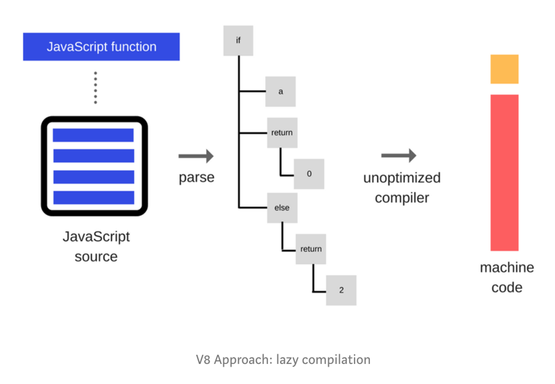
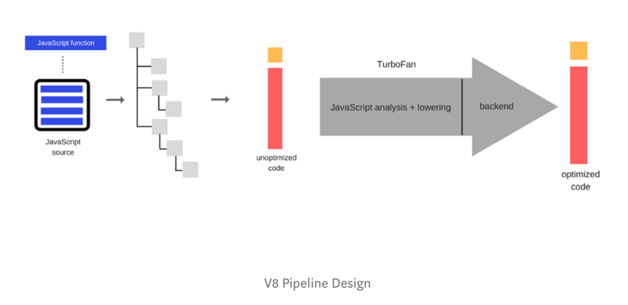
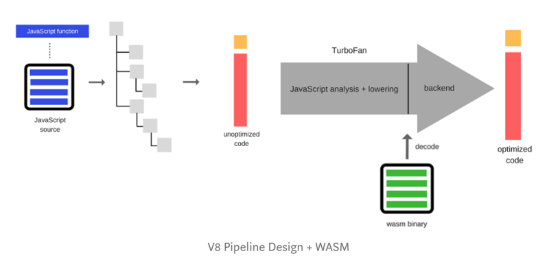
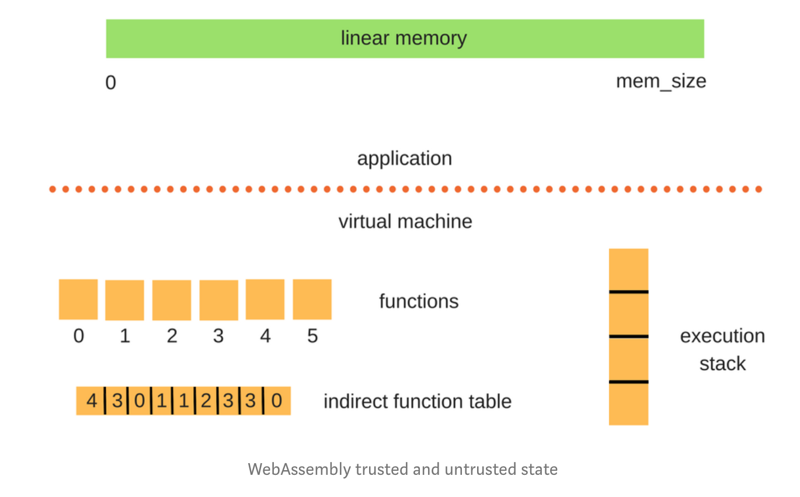

# How JavaScript works: A comparison with WebAssembly + why in certain cases it’s better to use it over JavaScript

Alexander Zlatkov

Nov 22, 2017 · 9 min read

[How JavaScript works: A comparison with WebAssembly + why in certain cases it’s better to use it over JavaScript](https://blog.sessionstack.com/how-javascript-works-a-comparison-with-webassembly-why-in-certain-cases-its-better-to-use-it-d80945172d79)

This is post # 6 of the series dedicated to exploring JavaScript and its building components. In the process of identifying and describing the core elements, we also share some rules of thumb we use when building SessionStack, a lightweight JavaScript application that has to be robust and highly-performant to help users see and reproduce their web app defects real-time.

If you missed the previous chapters, you can find them here:

An overview of the engine, the runtime, and the call stack.

Inside Google’s V8 engine + 5 tips on how to write optimized code.

Memory management + how to handle 4 common memory leaks.

The event loop and the rise of Async programming + 5 ways to better coding with async/await.

Deep dive into WebSockets and HTTP/2 with SSE + how to pick the right path.

This time we’ll take apart WebAssembly to analyze how it works, and more importantly, how it stacks against JavaScript in terms of performance: loading time, execution speed, garbage collection, memory usage, platform API access, debugging, multithreading and portability.

The way we build web apps is on the brink of revolution — this is still the early days but the way we think about web applications is going to change.

## 01. First, let’s see what WebAssembly does

WebAssembly (a.k.a. wasm) is an efficient, low-level bytecode for the web. WASM enables you to use languages other than JavaScript (e.g. C, C++, Rust or other), write your program in it, and then compile it (ahead of time) to WebAssembly. The result is a web app that’s very fast to load and execute.

## 02. Loading time

In order to load JavaScript, the browser has to load all the `.js` files which are textual. WebAssembly is faster to load inside the browser because only the already-compiled wasm files have to be transported over the internet. And wasm is a low-level assembly-like language with a very compact binary format.

## 03. Execution

Today Wasm runs just 20% slower than native code execution. This is, by all means, an astonishing result. It’s a format that’s compiled into a sandbox environment and runs within a whole lot of constraints to make sure it has no security vulnerabilities or is very hardened against them. The slowdown is minimal compared to truly native code. What’s more, it will be even faster in the future.

Better yet, it’s browser-agnostic — all major engines added support for WebAssembly and offer similar execution times now. In order to understand how faster WebAssembly executes compared to JavaScript, you should first read our article on how the JavaScript engine works. Let’s take a look at what happens in V8 as a quick overview:

V8 Approach: lazy compilation

On the left, we have some JavaScript source, containing JavaScript functions. It first needs to be parsed so that it converts all the strings into tokens and generates an Abstract Syntax Tree (AST). The AST is an in-memory representation of the logic of your JavaScript program. Once this representation is generated, V8 goes straight to machine code. You basically walk the tree, generate machine code and there you have your compiled function. There is no real attempt made to speed it up. Now, let’s take a look at what the V8 pipeline does at the next stage:

V8 Pipeline Design

This time we have TurboFan, one of V8’s optimizing compilers. While your JavaScript app is running, a lot of code is running inside V8. TurboFan monitors if something is running slow, whether there are bottlenecks and hot spots in order to optimize them. It pushes them through that backend, which is an optimized JIT that creates much faster code for those functions which are chewing up most of your CPU.

It solves the problem but the gotcha here is that the process of analyzing the code and deciding what to optimize also consumes CPU. This, in turn, means higher battery consumption, especially on mobile devices. Well, wasm doesn’t need all that — it gets plugged into the workflow like this:

V8 Pipeline Design + WASM

The wasm has already gone through optimization during the compilation phase. On top, parsing is not needed either. You have an optimized binary that can directly hook into the backend which can generate machine code. All the optimizations have been done by the compiler at the front end. This makes the execution of wasm a lot more efficient since quite a few of the steps in the process can simply be skipped.

## 04. Memory model

WebAssembly trusted and untrusted state

The memory of a C++ program, for example, compiled into WebAssembly, is a contiguous block of memory with no「holes」in it. One of the features of wasm that helps boost security is the concept of the execution stack being separate from the linear memory. In a C++ program, you have a heap, you allocate from the bottom of the heap, and grow the stack from the top of the heap. It’s possible to take a pointer and then look up in the stack memory in order to play with variables you’re not supposed to touch.

This is a pitfall that a lot of malware exploit.

WebAssembly employs a completely different model. The execution stack is separated from the WebAssembly program itself, so there is no way you can modify inside it and change things like variables. Also, the functions use integer offsets rather than pointers. Functions point into an indirection function table. And then those direct, calculated numbers jump in the function inside the module. It’s been built this way so that you can load multiple wasm modules side by side, offset all the indexes and it all works well.

For more information on the memory model and management in JavaScript, you can check our very detailed post on the topic.

## 05. Garbage collection

You already know that JavaScript’s memory management is handled with a Garbage Collector. WebAssembly’s case is a bit different. It supports languages that manage memory manually. You can ship your own GC with your wasm modules, but it’s a complicated task.

Currently, WebAssembly is designed around the C++ and RUST use cases. Since wasm is very low-level, it makes sense that programming languages that are just one step above assembly language would be easy to compile to it. C can use normal malloc, C++ might use smart pointers, Rust employs a totally different paradigm (a whole different topic). These languages don’t use GCs, so they don’t need all the complicated runtime stuff to keep track memory. WebAssembly is a natural fit for them.

In addition, these languages aren’t 100% designed to call into complex JavaScript things like mutating the DOM. It doesn’t make sense to write an entire HTML application in C++ because C++ isn’t designed for it. In most cases, when engineers write C++ or Rust, they target WebGL, or highly-optimized libraries (e.g. heavy-math computations).

In the future, however, WebAssembly will support languages that don’t come with a GC.

## 06. Platform API access

Depending on the runtime that executes JavaScript, access to platform-specific APIs is being exposed which can be directly reached through your JavaScript application. For example, if you’re running JavaScript in the browser, you have a set of Web APIs that the web app can call to control web browser/device functionality and access things like DOM, CSSOM, WebGL, IndexedDB, Web Audio API, etc.

Well, WebAssembly modules have no access to any platform APIs. Everything is mediated by JavaScript. If you want to access some platform-specific APIs inside your WebAssembly module, you have to call it through JavaScript.

For example, if you want to console.log, you have to call it through JavaScript, instead of your C++ code. And there is a cost penalty for those JavaScript calls.

This won’t be always the case. The specification will provide Platform APIs to wasm in the future, and you’ll be able to ship your apps without JavaScript.

## 07. Source maps

When you minify your JavaScript code, you need a way to debug it properly. That’s where Source Maps come to the rescue.

Basically, Source Maps are a way to map a combined/minified file back to an unbuilt state. When you build for production, along with minifying and combining your JavaScript files, you generate a source map which holds information about the original files. When you query a certain line and column number in your generated JavaScript, you can do a lookup in the source map which returns the original location.

WebAssembly does not currently support source maps because there is no specification but it will, eventually (probably quite soon).

When you set a breakpoint in your C++ code, you’ll see the C++ code instead of WebAssembly. At least, that’s the goal.

## 08. Multithreading

JavaScript runs on a single thread. There are ways to utilize the Event Loop and leverage asynchronous programming as described in a great detail in our article on the topic.

JavaScript also uses Web Workers but they have a very specific use case — basically, any intense CPU computation that would block the main UI thread could benefit from being offloaded to a Web Worker. However, Web Workers have no access to the DOM.

WebAssembly doesn’t currently support multithreading. However, this is probably the next thing to come. Wasm is going to get closer to native threads (e.g. C++ style threads). Having「real」threads is going to create a lot of new opportunities in the browser. And of course, it’s going to open the door to more possibilities for abuse.

## 09. Portability

Nowadays JavaScript can run almost anywhere, from the browser to the server-side and even in embedded systems.

WebAssembly is designed to be safe and portable. Just like JavaScript. It will run in every environment that supports wasm (e.g. every browser).

WebAssembly has the same portability goal as the one Java attempted to achieve in the early days with the Applets.

## 10. Where is it better to use WebAssembly over JavaScript?

In the first versions of WebAssembly, the main focus is on heavy CPU-bound computations (dealing with math for example). The most mainstream use that comes to mind is games — there are tons of pixel manipulations there. You can write your app in C++/Rust using OpenGL bindings that you’re used to, and compile it to wasm. And it will run in the browser.

Take a look at this (Run it in Firefox) — http://s3.amazonaws.com/mozilla-games/tmp/2017-02-21-SunTemple/SunTemple.html. That’s running the Unreal engine.

Another case where it could make sense to use WebAssembly (performance-wise) is implementing some library that is doing very CPU-intensive work. For example, some image manipulation.

As mentioned earlier, wasm can reduce quite a bit the battery consumption on mobile devices (depending on the engine), since most of the processing steps have been completed ahead of time during compilation.

In the future, you’ll be able to consume WASM binaries even if you’re not actually writing code that compiles to it. You can find projects in NPM that are starting to use this approach.

For DOM manipulation and heavy platform API usage, it definitely makes sense to stay with JavaScript, since it adds no further overhead, and has the APIs provided natively.

At SessionStack we are constantly pushing the boundaries of JavaScript performance in order to write highly-optimized and efficient code. Our solution needs to provide blazing-fast performance as we can’t afford to impede the performance of our customers’ apps. Once you integrate SessionStack into your production web application or website, it starts recording everything: all DOM changes, user interactions, JavaScript exceptions, stack traces, failed network requests, and debug data. And all this takes place in your production environment without impacting any of the UX and performance of your product. We need to heavily optimize our code and make it asynchronous as much as possible.

And not just the library! When you replay a user session in SessionStack, we have to render everything that happened in your user’s browser at the time the problem occurred, and we have to reconstruct the whole state, allowing you to jump back and forth in the session timeline. In order to make this possible, we’re heavily employing the async opportunities that JavaScript provides due to a lack of a better alternative.

With WebAssembly, we’ll be able to push some of the heaviest processing and rendering into a language that is better suited for the job and leave the data collection and DOM manipulation to JavaScript.

If you want to give SessionStack a try, you can get started for free. There’s a free plan that provides 1,000 sessions / month.

## Resources

https://www.youtube.com/watch?v=6v4E6oksar0

https://www.youtube.com/watch?v=6Y3W94_8scw
