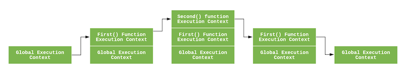

# Understanding Execution Context and Execution Stack in Javascript

Learn How JavaScript Programs are Executed Internally

Sukhjinder Arora

Aug 28, 2018 · 9 min read

[Understanding Execution Context and Execution Stack in Javascript](https://blog.bitsrc.io/understanding-execution-context-and-execution-stack-in-javascript-1c9ea8642dd0)

If you are or want to be a JavaScript developer, then you must know how the JavaScript programs are executed internally. The understanding of execution context and execution stack is vital in order to understand other JavaScript concepts such as Hoisting, Scope, and Closures. Properly understanding the concept of execution context and execution stack will make you a much better JavaScript developer.

Tip: Use Bit to build JS apps faster with components. It helps you share and reuse components with your team, using them to build new apps! Give it a try.

3『 [The shared component cloud · Bit](https://bit.dev/) 』

## 01. What is an Execution Context?

Simply put, an execution context is an abstract concept of an environment where the Javascript code is evaluated and executed. Whenever any code is run in JavaScript, it’s run inside an execution context.

### Types of Execution Context

There are three types of execution context in JavaScript.

1. Global Execution Context — This is the default or base execution context. The code that is not inside any function is in the global execution context. It performs two things: it creates a global object which is a window object (in the case of browsers) and sets the value of this to equal to the global object. There can only be one global execution context in a program.

2. Functional Execution Context — Every time a function is invoked, a brand new execution context is created for that function. Each function has its own execution context, but it’s created when the function is invoked or called. There can be any number of function execution contexts. Whenever a new execution context is created, it goes through a series of steps in a defined order which I will discuss later in this article.

3. Eval Function Execution Context — Code executed inside an eval function also gets its own execution context, but as eval isn’t usually used by JavaScript developers, so I will not discuss it here.

## 02. Execution Stack

Execution stack, also known as「calling stack」in other programming languages, is a stack with a LIFO (Last in, First out) structure, which is used to store all the execution context created during the code execution. When the JavaScript engine first encounters your script, it creates a global execution context and pushes it to the current execution stack. Whenever the engine finds a function invocation, it creates a new execution context for that function and pushes it to the top of the stack.

The engine executes the function whose execution context is at the top of the stack. When this function completes, its execution stack is popped off from the stack, and the control reaches to the context below it in the current stack. Let’s understand this with a code example below:

```js
let a = 'Hello World!';
function first() {
  console.log('Inside first function');
  second();
  console.log('Again inside first function');
}
function second() {
  console.log('Inside second function');
}
first();
console.log('Inside Global Execution Context');
```



An Execution Context Stack for the above code.

When the above code loads in the browser, the Javascript engine creates a global execution context and pushes it to the current execution stack. When a call to first() is encountered, the Javascript engines creates a new execution context for that function and pushes it to the top of the current execution stack.

When the second() function is called from within the first() function, the Javascript engine creates a new execution context for that function and pushes it to the top of the current execution stack. When the second() function finishes, its execution context is popped off from the current stack, and the control reaches to the execution context below it, that is the first() function execution context.

When the first() finishes, its execution stack is removed from the stack and control reaches to the global execution context. Once all the code is executed, the JavaScript engine removes the global execution context from the current stack.

## 03. How is the Execution Context created?

Up until now, we have seen how the JavaScript engine manages the execution context, Now let’s understand how an execution context is created by the JavaScript engine. The execution context is created in two phases: 1) Creation Phase and 2) Execution Phase.

## 04. The Creation Phase

The execution context is created during the creation phase. Following things happen during the creation phase: 1) LexicalEnvironment component is created. 2) VariableEnvironment component is created.

So the execution context can be conceptually represented as follows:

```js
ExecutionContext = {
  LexicalEnvironment = <ref. to LexicalEnvironment in memory>,
  VariableEnvironment = <ref. to VariableEnvironment in  memory>,
}
```

### 1. Lexical Environment

The official ES6 docs define Lexical Environment as:

A Lexical Environment is a specification type used to define the association of Identifiers to specific variables and functions based upon the lexical nesting structure of ECMAScript code. A Lexical Environment consists of an Environment Record and a possibly null reference to an outer Lexical Environment.

3『 [ECMAScript 2015 Language Specification – ECMA-262 6th Edition](http://ecma-international.org/ecma-262/6.0/) 』

Simply put, A lexical environment is a structure that holds identifier-variable mapping. (here identifier refers to the name of variables/functions, and the variable is the reference to actual object [including function object and array object] or primitive value).

For example, consider the following snippet:

```js
var a = 20;
var b = 40;
function foo() {
  console.log('bar');
}
```

So the lexical environment for the above snippet looks like this:

```js
lexicalEnvironment = {
  a: 20,
  b: 40,
  foo: <ref. to foo function>
}
```

Each Lexical Environment has three components: 1) Environment Record. 2) Reference to the outer environment. 3) This binding.

#### 01. Environment Record

The environment record is the place where the variable and function declarations are stored inside the lexical environment. There are also two types of environment record :

1. Declarative environment record — As its name suggests stores variable and function declarations. The lexical environment for function code contains a declarative environment record.

2. Object environment record — The lexical environment for global code contains a objective environment record. Apart from variable and function declarations, the object environment record also stores a global binding object (window object in browsers). So for each of binding object’s property (in case of browsers, it contains properties and methods provided by browser to the window object), a new entry is created in the record.

Note — For the function code, the environment record also contains an arguments object that contains the mapping between indexes and arguments passed to the function and the length(number) of the arguments passed into the function. For example, an argument object for the below function looks like this:

```js
function foo(a, b) {
  var c = a + b;
}
foo(2, 3);
// argument object
Arguments: {0: 2, 1: 3, length: 2},
```

#### 02. Reference to the Outer Environment

The reference to the outer environment means it has access to its outer lexical environment. That means that the JavaScript engine can look for variables inside the outer environment if they are not found in the current lexical environment.

#### 03. This Binding

In this component, the value of this is determined or set. 

1. In the global execution context, the value of this refers to the global object. (in browsers, this refers to the Window Object).

2. In the function execution context, the value of this depends on how the function is called. If it is called by an object reference, then the value of this is set to that object, otherwise, the value of this is set to the global object or undefined(in strict mode). For example:

```js
const person = {
  name: 'peter',
  birthYear: 1994,
  calcAge: function() {
    console.log(2018 - this.birthYear);
  }
}
person.calcAge(); 
// 'this' refers to 'person', because 'calcAge' was called with //'person' object reference
const calculateAge = person.calcAge;
calculateAge();
// 'this' refers to the global window object, because no object reference was given
```

Abstractly, the lexical environment looks like this in pseudocode:

```js
GlobalExectionContext = {
  LexicalEnvironment: {
    EnvironmentRecord: {
      Type: "Object",
      // Identifier bindings go here
    }
    outer: <null>,
    this: <global object>
  }
}
FunctionExectionContext = {
  LexicalEnvironment: {
    EnvironmentRecord: {
      Type: "Declarative",
      // Identifier bindings go here
    }
    outer: <Global or outer function environment reference>,
    this: <depends on how function is called>
  }
}
```

### 2. Variable Environment

It’s also a Lexical Environment whose EnvironmentRecord holds bindings created by VariableStatements within this execution context. As written above, the variable environment is also a lexical environment, So it has all the properties and components of a lexical environment as defined above.

In ES6, one difference between LexicalEnvironment component and the VariableEnvironment component is that the former is used to store function declaration and variable (let and const) bindings, while the latter is used to store the variable (var) bindings only.

## 05. Execution Phase

In this phase assignments to all those variables are done and the code is finally executed.

## 06. Example

Let’s look at some example to understand the above concepts:

```js
let a = 20;
const b = 30;
var c;
function multiply(e, f) {
 var g = 20;
 return e * f * g;
}
c = multiply(20, 30);
```

When the above code is executed, the JavaScript engine creates a global execution context to execute the global code. So the global execution context will look something like this during the creation phase:

```js
GlobalExectionContext = {
  LexicalEnvironment: {
    EnvironmentRecord: {
      Type: "Object",
      // Identifier bindings go here
      a: < uninitialized >,
      b: < uninitialized >,
      multiply: < func >
    }
    outer: <null>,
    ThisBinding: <Global Object>
  },
  VariableEnvironment: {
    EnvironmentRecord: {
      Type: "Object",
      // Identifier bindings go here
      c: undefined,
    }
    outer: <null>,
    ThisBinding: <Global Object>
  }
}
```

During the execution phase, the variable assignments are done. So the global execution context will look something like this during the execution phase.

```js
GlobalExectionContext = {
LexicalEnvironment: {
    EnvironmentRecord: {
      Type: "Object",
      // Identifier bindings go here
      a: 20,
      b: 30,
      multiply: < func >
    }
    outer: <null>,
    ThisBinding: <Global Object>
  },
VariableEnvironment: {
    EnvironmentRecord: {
      Type: "Object",
      // Identifier bindings go here
      c: undefined,
    }
    outer: <null>,
    ThisBinding: <Global Object>
  }
}
```

When a call to function multiply(20, 30) is encountered, a new function execution context is created to execute the function code. So the function execution context will look something like this during the creation phase:

```js
FunctionExectionContext = {
LexicalEnvironment: {
    EnvironmentRecord: {
      Type: "Declarative",
      // Identifier bindings go here
      Arguments: {0: 20, 1: 30, length: 2},
    },
    outer: <GlobalLexicalEnvironment>,
    ThisBinding: <Global Object or undefined>,
  },
VariableEnvironment: {
    EnvironmentRecord: {
      Type: "Declarative",
      // Identifier bindings go here
      g: undefined
    },
    outer: <GlobalLexicalEnvironment>,
    ThisBinding: <Global Object or undefined>
  }
}
```

After this, the execution context goes through the execution phase that means assignments to the variables inside the function are done. So the function execution context will look something like this during the execution phase:

```js
FunctionExectionContext = {
LexicalEnvironment: {
    EnvironmentRecord: {
      Type: "Declarative",
      // Identifier bindings go here
      Arguments: {0: 20, 1: 30, length: 2},
    },
    outer: <GlobalLexicalEnvironment>,
    ThisBinding: <Global Object or undefined>,
  },
VariableEnvironment: {
    EnvironmentRecord: {
      Type: "Declarative",
      // Identifier bindings go here
      g: 20
    },
    outer: <GlobalLexicalEnvironment>,
    ThisBinding: <Global Object or undefined>
  }
}
```

After the function completes, the returned value is stored inside c. So the global lexical environment is updated. After that, the global code completes and the program finishes.

Note — As you might have noticed that the let and const defined variables do not have any value associated with them during the creation phase, but var defined variables are set to undefined .

This is because, during the creation phase, the code is scanned for variable and function declarations, while the function declaration is stored in its entirety in the environment, the variables are initially set to undefined (in case of var) or remain uninitialized (in case of let and const).

This is the reason why you can access var defined variables before they are declared (though undefined) but get a reference error when accessing let and const variables before they are declared.

This is, what we call hoisting.

Note — During the execution phase, if the JavaScript engine couldn’t find the value of let variable at the actual place it was declared in the source code, then it will assign it the value of undefined.

## Conclusion

So we have discussed how JavaScript programs are executed internally. While it’s not necessary that you learn all these concepts to be an awesome JavaScript developer, having a decent understanding of the above concepts will help you to understand other concepts such as Hoisting, Scope, and Closures more easily and deeply.
