# My Top 5 Pandas Data Manipulation Functions

Know your Pandas library function arsenal as a data scientist.

Cornellius Yudha Wijaya

Apr 5 · 7 min read

As a data scientist who uses Python as their main language, we know that the Pandas library would be inseparable in our daily life. From when you start learning data science using Python until your professional career, knowing every little thing that Pandas offer would not hurt you at all. Although, there are some functions that I use more often than the other to manipulate my data.

Note that the DataFrame and Series function would be used even before the data manipulation function is applied, so I would not explain those functions. Here are 5 Pandas functions that I frequently use in my daily work.

There are many Pandas Function that useful depend on the necessity of your work, although some might be used more than the other. Here, to show you what are the functions I often use, I would use the mpg dataset from the seaborn module (Visualization library, but I only use it to acquire the data).

```py
import pandas as pd
import seaborn as sns

mpg = sns.load_dataset('mpg')
```

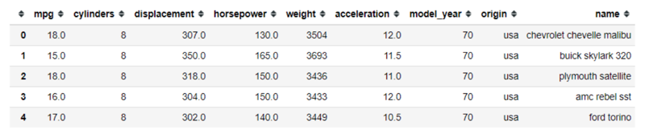

Now, let’s get to the main point.

## 01. crosstab

crosstab is a pandas function to compute a cross-tabulation of two (or more) factors. If you did not what is cross-tabulation is, let me show you with an example.

```py
pd.crosstab(index = mpg['origin'], columns = mpg['model_year'])
```

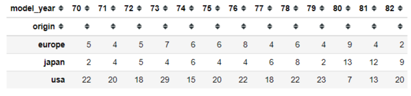

two-factors cross-tabulation example

Above is an example of what is cross-tabulation is. The data itself is still a DataFrame object. We specify the index and the columns of the table from the category variables of our dataset; in my case, I use the ‘origin’ and the ‘model\_year’ category variables. By default, the crosstab function would compute a frequency of the factors and show it on the cross-tabulation. Although, we could change it by introducing another factor, which often is a continuous variable.

```py
pd.crosstab(index = mpg['origin'], columns = mpg['model_year'], values = mpg['mpg'], aggfunc = 'mean')
```

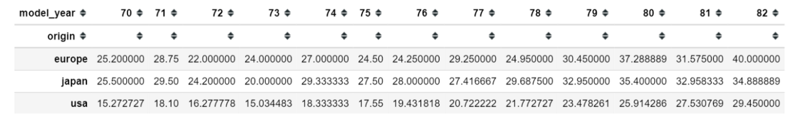

cross-tabulation with the continuous variable as another factor

Above, if we add the ‘mpg’ variable into the values and set the aggfunc parameter as ‘mean’ we would get cross-tabulation with mean of the ‘mpg’ separated by the category. It is similar to what we called the pivot table Pandas function pivot\_table could achieve similar results.

## 02. cut

Pandas cut function is used to binning the continuous values into discrete intervals. We use cut when we need to segment and sort continuous values into bins. For you who did not know what binning is; it is a process of putting the continuous value into a certain range interval. It is best described by using the histogram plot.

```py
mpg['mpg'].hist()
```

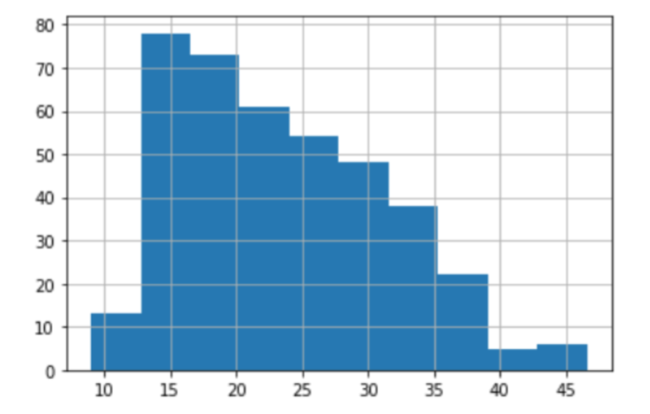

Example of the histogram plot

Here we input the continuous values into a certain range interval and create bins. Each bar shows the values that fall into those intervals, with the higher the bar is the bigger the frequency is.

The range interval depends on the number of bins. For example, if we have a continuous variable with a minimum value 10 and maximum value 45 and we want to create 10 bins then the range interval would be (max-min)/bins. Which means (45–10)/10 = 3.5. So the first bin would be filled by the continuous value that was present between 10 to 13.5 and so on.

This function is also useful for going from a continuous variable to a categorical variable. For example, the cut function could convert ages to groups of age ranges. Let’s show this function with a dataset example.

```py
pd.cut(x = mpg['mpg'], bins = 4, labels = [1,2,3,4])
```

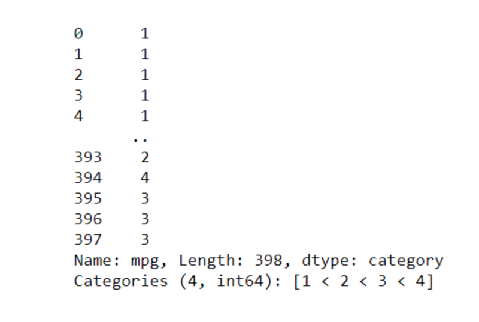

In the function above, I set the bins parameter to 4 because I want to get 4 categories with the labels is set as 1,2,3, and 4. The output from the cut function would be a series with all the continuous values that have been binned and converted into the respectable category. Here is how it looks like if I put it into the data frame.

```py
mpg['mpg_bin'] = pd.cut(x = mpg['mpg'], bins = 4, labels = [1,2,3,4])
mpg[['mpg', 'mpg_bin']]
```

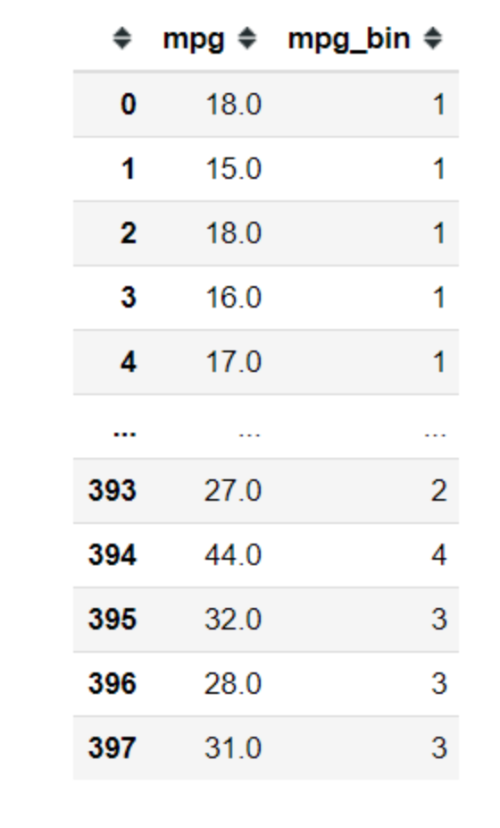

## 03. qcut

In pandas, we have cut function and we also have a qcut function. Similar to the cut function, we would be binning the continuous variable, but in qcut function, the bin size would be equal-sized based on rank or based on sample quantile. Quantile is basically a division technique to divide the continuous value in an equal way. For example, if we divide the continuous value into 4 parts; it would be called Quartile as shown below.

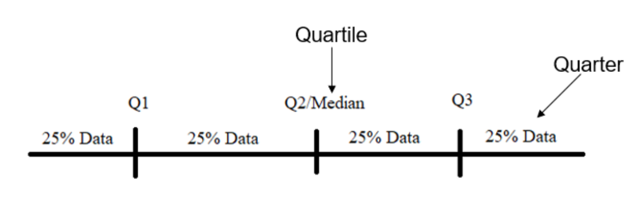

Let me show you as well with a code example.

```py
pd.qcut(x = mpg['mpg'], q = 4, labels = [1,2,3,4])
```

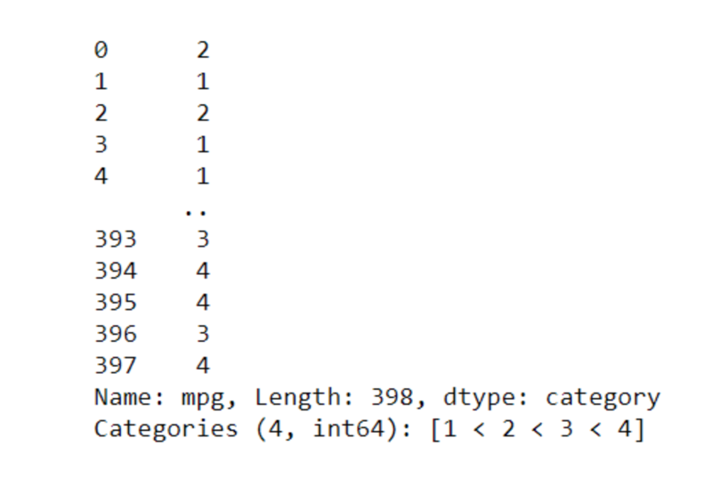

Above is the output of qcut function. Here I input the q parameter as 4 to divide the continuous value into Quartile and label them with 1,2,3, and 4. The result is different compared to the cut function because their calculation is already different. Let me put it as well into the DataFrame so we could see the result differences.

```py
mpg['mpg_qcut'] = pd.qcut(x = mpg['mpg'], q = 4, labels = [1,2,3,4])
mpg[['mpg', 'mpg_bin','mpg_qcut']]
```

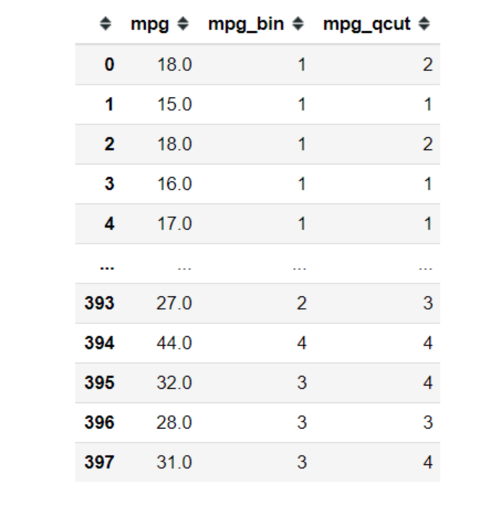

## 04. get\_dummies

This function is used to convert the categorical variable into a numerical variable by One-Hot-Encode the categorical variable. For you who did not know what it One-Hot-Encode, it is a process to create a new column from our categorical variable where each category becomes a new column with the value are either 0 or 1 (0 represent not-present and 1 represents present).

Why do we want to convert the categorical variable into a numerical variable? It is because many of the statistical technique or machine learning equation only accepting numerical value instead of categorical value. Let me show you what I talk about with a code example.

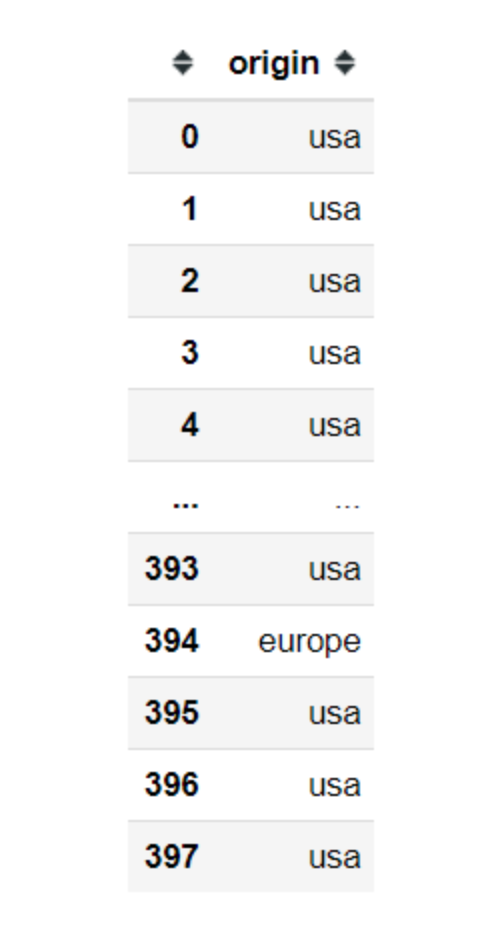

Above is the ‘origin’ variable from the mpg dataset. It is a categorical variable with 3 cardinal (‘usa’, ‘europe’, and ‘japan’). Here I would use the get\_dummies function to One-Hot-Encode this variable.

```py
origin_dummies = pd.get_dummies(mpg['origin'])
origin_dummies
```

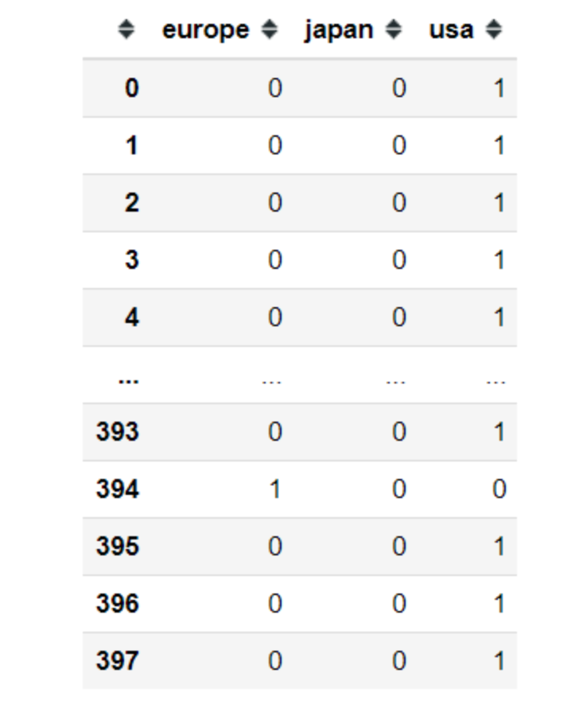

Just like that, we already get 3 new columns with each category become a new column and the value is either 0 or 1.

## 05. concat

My most often pandas function for data manipulation is concat function. This function is like what it called; it concatenates. Although, what did this function concatenate? It concatenates between pandas object (Series or DataFrame). Here, let me show you an example. Let’s say I just want the ‘mpg’ columns shown with the origin\_dummies variable I just created previously.

```py
pd.concat(objs = [mpg['mpg'], origin_dummies], axis = 1)
```

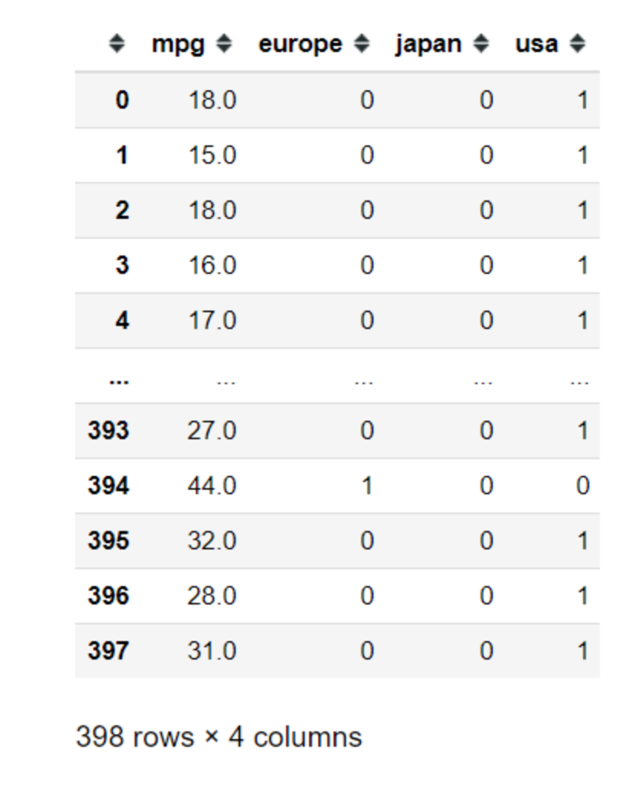

Using the concat function, I just combine 2 pandas object (Series and DataFrame) into 1 data frame. In the function, I specify the axis parameter as 1 because I want to combine the Pandas object so the columns look like glued side to side. This axis parameter only accepts 2 things; 0 or 1. Depend on how you want to concatenate the Pandas object, set it to 0 if you want to concat the pandas object like stacking the object (concat the object like adding new rows) in respect to the columns or 1 if you want the object side to side with respect to the index. Here is what happens if we set the axis into 0.

```py
pd.concat([mpg['mpg'], origin_dummies], axis = 0)
```

2『合并 dataframe，去研究下与 merge 函数有啥区别。』

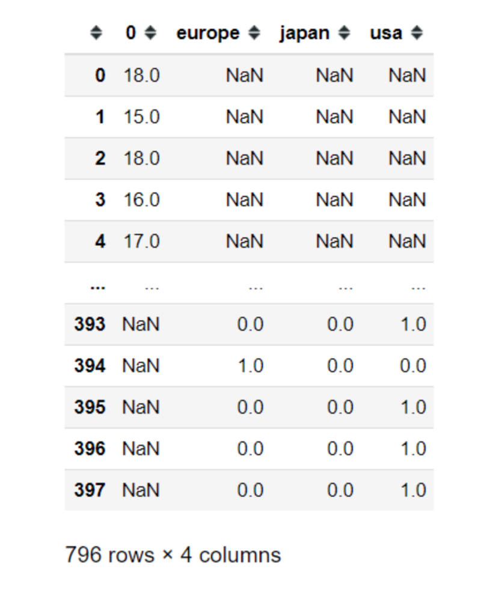

We could see now that we have 796 rows and a lot of NaN objects in our data frame. It happens because we concatenate the Pandas object but as we set it so we stacked the object, not all the columns name are present in either object so it filled the columns which are not previously present with a NaN value.