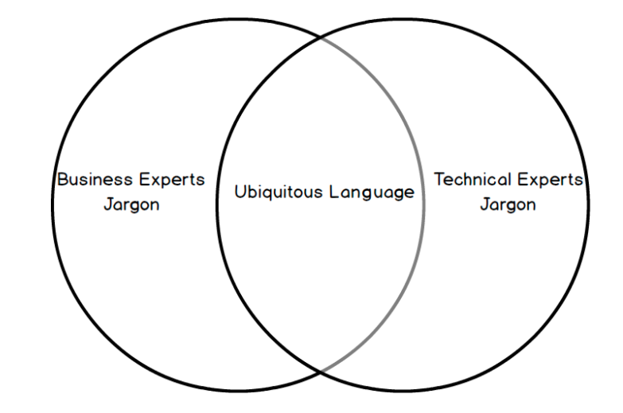
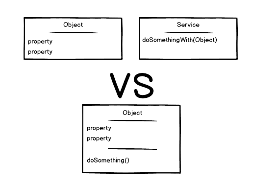
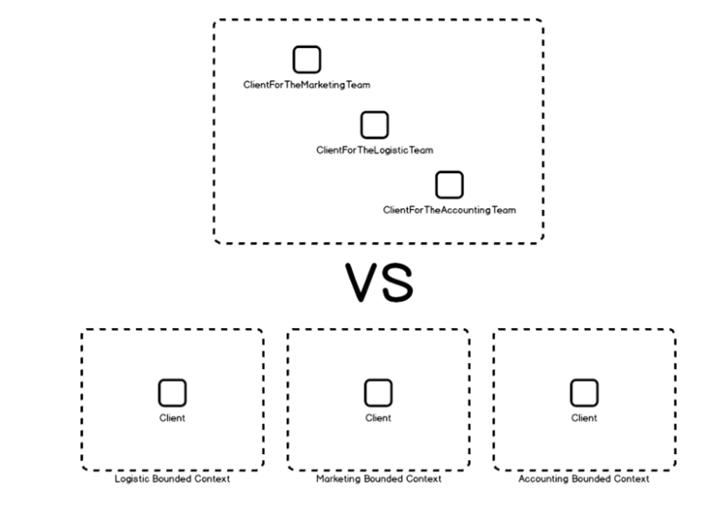

# DDD 101 — The 5-Minute Tour

Gérald Croës

Feb 24, 2018 · 9 min read

I like crazy challenges.

During a conference in Paris, after the organizers asked me to fulfill a missing-speaker slot for a lightning talk (an hour before the presentation time), not only did I accept, but I decided that an introduction to DDD (Domain Driven Design) was a good choice. Yes, DDD — the discipline that was born in a 560-page book.

Unfortunately, even if I had managed to get the attention of a room crowded with (PHP!) developers to talk about a topic that was dear to my heart, I don’t know if the presentation insisted enough on the two key aspects that are DDD.

My goal with this article is to give it another try, with more time to prepare.

## 01. DD What?

Before you leave, driven away from this article by your acronym-o-phobia syndrome, you might want to know that DDD is full of shiny new design patterns. Design patterns … The funny thing is that they are the reason why I was drawn into this world in the first place … and the funniest thing is that they are the least essential elements in that world.

### 1.1 So, What Is DDD?

When I’m using my keyboard, cradled by the sound of the stroke keys, I like to understand the code I’m writing (easy), to understand the code I wrote the day before (less so), to understand the code I wrote six months before (challenging), and the satisfaction that tops the list is to see other developers understand the code I wrote.

Any fool can write code that a computer can understand. Good programmers write code that humans can understand.

— Refactoring: Improving the Design of Existing Code, 1999

1『老马的这句话实在是太有名了。』

My best memory on the subject happened years ago. At the time, I had asked a developer in the team to add a feature to the application. I didn’t give her many details about how the code was organized, and when she came back, a bit puzzled, she asked for confirmation,「All I have to do is to add some lines here and there … and I’m done, right?」

She couldn’t have been more right. It was amazing to know that the object model I had come up with worked just as expected — on the first read.

To me, that’s what Domain Driven Design is all about — expressing a meaningful object-oriented model that says what it does.

DDD reminds you of common sense rules, and it offers a set of ideas, principles, and patterns to make it happen.

### 1.2 What Sets DDD Apart From Standard OOP?

Good question — nothing.

DDD is nothing more than OOP applied to business models. (You’ll prove me wrong when you dive deeper into DDD, but let’s accept that as an answer for now.)

I’ll use my personal experience to try to explain why I believe that DDD is plain OOP.

When I first learned about DDD, I was already an enthusiastic OOP practitioner, and I used to advocate about OOP a lot (giving talks, practicing pair reviews, and so on).

Even though at the time I was considered a satisfactory developer, I knew deep down that something was wrong with my code, something I couldn’t figure out, something that had to do with my inability to write meaningful unit tests that covered the business rules. I knew that the tales my code were telling were not as expressive as I wished they were.

But since no one seemed to complain, I kept learning patterns, and patterns, and patterns.

Before I bought the「blue book」(Domain Driven Design: Tackling Complexity in the Heart of Software), I scanned through the pages and saw factories, repositories, value objects, entities, and this incredibly appealing schema that would lure any geek’s attention.

They alone convinced me to invest my time (and money) into the book. Even though I was eager to learn about new fancy patterns, I managed to contain my impatience and read the introduction.

## 02. The Ubiquitous Language

I don’t remember every word of this infamous reference, nor do I remember every rule, but I remember being hooked right from the beginning. The concept of the ubiquitous language was a revolution.

Despite a convoluted designation, the idea is straightforward — call a spade a spade. And the underlying rule is,「To know what a spade is; how to use it; what it does … ask someone who knows.」



Oh, my! Did you enjoy the book just because of this?

Well, it might sound obvious, but this was the main issue that impaired my ability to write self-explanatory code. Don’t mock me, I can say from experience that I wasn’t alone (and that not everyone has been cured).

How many of us, developers, have just peeked at the requirements only to start coding right away? How many programmers have skimmed through the business rules to jump on the framework-y and database-ish aspect of the project? Don’t pretend — I know for sure!

I can’t blame us. These requirements are often a bland and boring read, at least as bland and boring as it is to write them (it’s called karma).

Good news is that it doesn’t have to be this way.

### 2.1 Only What You Understand Can You Explain

To be able to solve a problem, I have to understand it (along with its intricacies).

If you can’t explain it to a six-year-old, you don’t understand it yourself.

——Albert Einstein

The corollary to that is,「To understand a problem, I have to interview the people that are dealing with it.」

### 2.2 Agile Methods Certified

「Talking to the right people.」That sounded familiar.

```
Individuals and interactions over processes and tools

Working software over comprehensive documentation

Customer collaboration over contract negotiation

Responding to change over following a plan

——The Agile Manifesto
```

Of course, if you took programming because you’d rather talk to computers over human beings, that can be a harsh truth to swallow. But, if you were looking for the perfect occasion to socialize and stop acting like an IT Crowd stereotype, good news, here is your chance.

No More Dull Projects

「Talk to business people; they’ll enjoy explaining their jobs and problems, you’ll love listening and finding solutions.」

It literally changed my vision of IT.

As a young developer, thrilled by the idea of crunching technical puzzles, I was often disappointed by the lack of challenges brought by real-life projects. No, calculating a price for an insurance plan is not what I call challenging … nor is finding the cheapest hotel room on a given date … you only spend time writing something you’ve figured out in seconds.

But when you talk to the business people who need your skills to find a solution and save some time or increase the quality of their output, it all becomes interesting because you get a sense of purpose. Not only will you write the code for the solution, but you will be part of the solution itself, you’ll know its whys, whats, and whens … and the challenge will be to write it in a way that exposes that very purpose.

### 2.3 I Shall Not Pass! (Nor Should j or x.)

「You should name a variable using the same care with which you name a first-born child.」

——Robert C. Martin, Clean Code: A Handbook of Agile Software Craftsmanship

The above quote resonates even more with the ubiquitous language concept. Each class, each method, each variable should be carefully named so that the story they tell is the business story you’re writing. And heed DDD’s words,「These names should be agreed on with the business.」Why? Because in the future, when you talk about a new feature or a bug report, you’ll understand each other. The code reflects business reality.

If anyone ever needs to be persuaded that meaningful variable names are mandatory, just ask them.

Which of the following would you rather read?

```php
<?php
if ($data[$i][$j] > $x) {
   //some code here
}
```

or

```php
<?php
if ($activityReport[$employeeId][$month] > $salesGoal) {
   //some code here
}
```

To this day, no one has ever missed the point … except for one person,「Nope, I would never ever write or read anything in PHP.」

## 03. Health Check — Anemic or Not?

But let’s go back on track. We’ve said that DDD was OOP applied to the business model. Naturally, after I had read the book, I asked myself this simple question.

「Is my object model a real object model? Or is this procedural code in disguise?」

And I realized that I used to focus all my efforts on the data, without proper dedication to the processes that come along, and that I suffered the anemic model syndrome.

The fundamental horror of this anti-pattern is that it’s so contrary to the basic idea of object-oriented designing; which is to combine data and process them together. The anemic domain model is just a procedural style design […]. What’s worse, many people think that anemic objects are real objects, and thus completely miss the point of what object-oriented design is all about.

——Martin Fowler — Martin Fowler’s Bliki

To self-diagnose my code’s disorder, I asked myself,「Can I replace all my objects with hashmaps? Will my code work after that?」And the answer was a stark yes.



I had developed the habit of setting apart data and intelligence — which is contrary to the creed of object-oriented programming — which explained why I often ended up having hundreds of services manipulating dumb data objects … with fat controllers trying to orchestrate the resulting mess.

DDD’s rule of thumb — Bind data and intelligence together …

## 04. … And Set Boundaries to Keep Them Apart

At this point, two major concepts had finally sunk in — I was talking to business people so that the code would reflect their problems, and I was modeling the solution using real objects.

Though, as the project grew, I still had two hurdles to overcome: conflicts and complexity.

Conflicts when we tried to find names for similar concepts used in different contexts, and complexity as the model started to include more intelligence.

The easiest-to-explain example that comes to my mind is Client.

```
ClientForTheLogisticTeam, ClientForTheMarketingTeam, ClientForTheAccountingTeam, …
```

The problem at hand was that Client was the actual name used by the business teams, but that very name implied rules and constraints that depended on the context. Our first reflex was to differ from the real names, but the rule is to stick to the business vocabulary.

Then, we remembered another key point of DDD — Bounded Contexts.



Bounded contexts are the Single Responsibility Principle applied to your domain model. Each part of your system has its intelligence, data, and vocabulary. Each part is independent of one another.

1『哈哈，原来「限界上下文」是「单一职责」原则再领域模型中的应用。』

## 05. Is It Time We Talk About Patterns?

Oh, patterns … I had almost forgotten.

Yes, DDD brings its lot of patterns. Brace yourself; you’re on the brink of learning them in a breeze.

You model your business using Entities (the ID matters) and Value Objects (the values matter). You use Repositories to retrieve and store them. You create them with the help of Factories. If an object is too complex for a single class, you’ll create Aggregates that will bind Entities & Value Objects under the same root. If a business logic doesn’t belong to a given object, you’ll define Services that will manipulate the involved elements. Eventually, when the state of the business changes (a change that matters to business experts), you’ll publish Domain Events to communicate the change.

There you are, we’ve talked about DDD patterns!