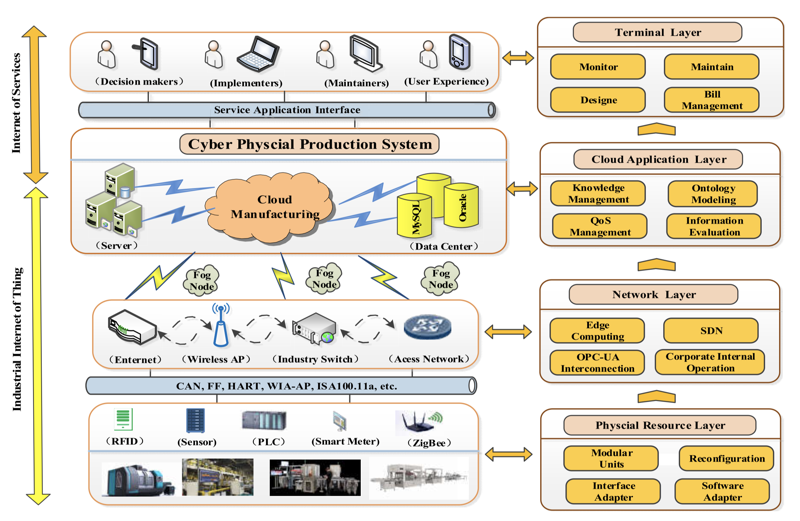
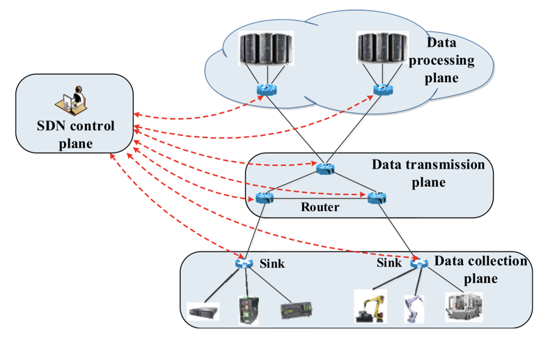
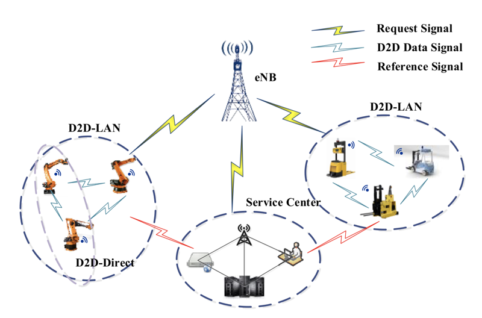
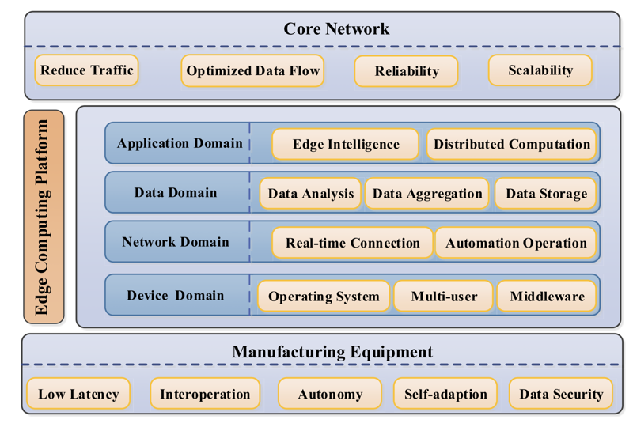
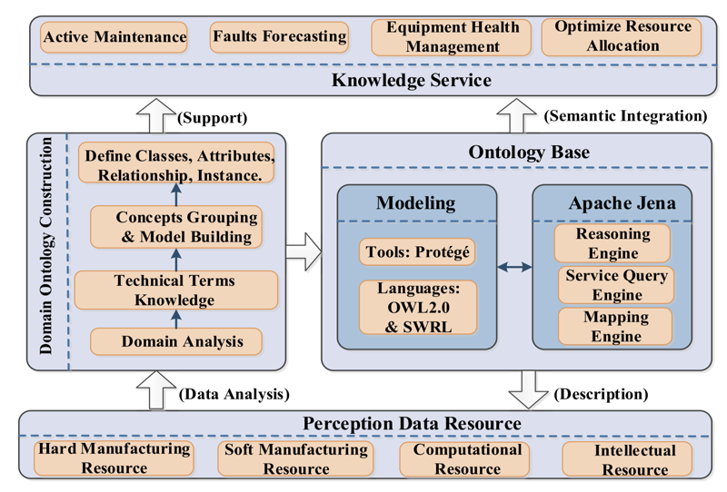
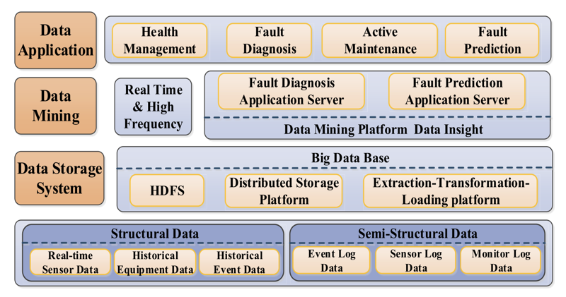

## Smart Factory of Industry 4.0: Key Technologies, Application Case, and Challenges

最新版发表于 2018-03

Received October 24, 2017, accepted December 9, 2017, date of publication December 14, 2017, date of current version March 9, 2018.

BAOTONG CHEN 1 , JIAFU WAN 1 , (Member, IEEE), LEI SHU 2,3 , (Senior Member, IEEE), PENG LI 4 , MITHUN MUKHERJEE 5 , (Member, IEEE), AND BOXING YIN6

1 School of Mechanical and Automotive Engineering, South China University of Technology, Guangzhou 510641, China 2 School of Engineering, Nanjing Agricultural University, Nanjing 210014, China 3 School of Engineering, University of Lincoln, Lincoln, U.K.

4 Institute Industrial IT, Ostwestfalen-Lippe University of Applied Science, 32657 Lemgo, Germany 5 Guangdong Provincial Key Laboratory of Petrochemical Equipment Fault Diagnosis, Guangdong University of Petrochemical Technology, Maoming 525000, China 6 School of Electrical Engineering and Automation, Jiangxi University of Science and Technology, Ganzhou 314000, China

Corresponding author: Jiafu Wan (jiafuwan2017@163.com)

This work was supported in part by the National Key Research and Development Project under Grant 2017YFE0101000, in part by the Key Program of Natural Science Foundation of Guangdong Province, China, under Grant 2017B030311008, in part by the Maoming Engineering Research Center of Industrial Internet of Things under Grant 517018, and in part by the National Natural Science Foundation of China under Grant 61401107.

### Abstract

Due to the current structure of digital factory, it is necessary to build the smart factory to upgrade the manufacturing industry. Smart factory adopts the combination of physical technology and cyber technology and deeply integrates previously independent discrete systems making the involved technologies more complex and precise than they are now. In this paper, a hierarchical architecture of the smart factory was proposed first, and then the key technologies were analyzed from the aspects of the physical resource layer, the network layer, and the data application layer. In addition, we discussed the major issues and potential solutions to key emerging technologies, such as Internet of Things (IoT), big data, and cloud computing, which are embedded in the manufacturing process. Finally, a candy packing line was used to verify the key technologies of smart factory, which showed that the overall equipment effectiveness of the equipment is significantly improved.

Key Works: Smart factory, big data, cloud computing, cyber-physical systems, industrial Internet of Things.

### 01. Introduction

With the rapid development of electric and electronic technology, information technology and advanced manufacturing technology, the production mode of manufacturing enterprises is being transferred from digital to intelligent. The new era that combines virtual reality technology based on the Cyber-Physical System (CPS) is coming [1]–[4]. Due to the new challenges, the advantages of traditional manufacturing industries have been gradually diminished. Consequently, the intelligent manufacturing technology is one of high technology areas where industrialized countries highly pay more attention to. Europe 2020 strategy [5], Industry 4.0 strategy [6] and China manufacturing 2025 [7] have been proposed. United States has gradually accelerated the speed of reindustrialization and manufacturing reflow [8]. The transformation of intelligent manufacturing intrigued the profound and lasting effect on the future manufacturing worldwide.

In the context of intelligent manufacturing, it is important to establish the smart factory to achieve advanced manufacturing based on network technologies and manufacturing data. In addition, the implementation of smart factory should take into account the status quo and manufacturing requirements. Due to the different characteristics of manufacturing field and information field, there are still many technical problems to be solved in order to accelerate the path of smart factory. The main goals of this paper are summarized as follows:

1 In the physical resources layer, physical equipment needs to have support for real-time information acquisition, and communication devices should provide a high-speed transmission of heterogeneous information. The workshop should ensure fast reconfiguration and adaptability. In addition, the intelligence of underlying equipment should be enhanced in order to meet the requirements of Internet of Things (IoT).

2 In the network layer, Industrial Internet of Things (IIoT) should support new protocols and new data format with high flexibility and scalability, whereas the Industrial Wireless Sensor Networks (IWSNs) bring new opportunities for development of industrial network. Additionally, the other relevant technologies (e.g., OLE for Process Control Unified Architecture (OPC UA), Software defined Networks (SDNs), and Device-toDevice (D2D) communication) should be introduced to guarantee Quality-of-Service (QoS) of the network, reliable communication, and cooperation among equipment.

3 In the data application layer, the cloud platform should be able to analyze the semantics of various data. Therefore, ontology is being employed in modeling of the smart factory, which can provide the abilities of selforganization, self-learning and self-adaption. Moreover, data analysis could provide the scientific basis for decision-making, while data mining could be used to ensure design optimization and active maintenance.

1『这里看到了「the semantics of various data」，加了了在其他 Paper 里看到的「语义逻辑」，哈哈。（2021-01-29）』

In general, we developed and analyzed the hierarchical architecture of smart factory with the focus on key technologies of every layer. The remainder of the paper is organized as follows. In Section II, the architecture of smart factory is presented, and approaches for implementation of smart factory based on hierarchical architecture are discussed. In Section III, the key technologies of physical resource layer are studied. In Section IV, technologies related to the network layer are given. The methods used for data processing in data application layer are presented in Section V. Its research results and development trends of these technologies are also presented. In Section VI, the implementation of smart factory, namely the prototype platform of candy packing line, was introduced, wherein the key technologies of the smart factory were employed and verified in practice. In Section VII, main issues and challenges of key technologies are presented. Finally, in Section VIII a brief conclusion and envisions of further development of smart factory are given.

3『

Google 搜索 CPS 信息：

Cyber-Physical Systems (CPS) are integrations of computation, networking, and physical processes. Embedded computers and networks monitor and control the physical processes, with feedback loops where physical processes affect computations and vice versa.

[网宇实体系统 - 维基百科，自由的百科全书](https://zh.wikipedia.org/wiki/%E7%B6%B2%E5%AE%87%E5%AF%A6%E9%AB%94%E7%B3%BB%E7%B5%B1)

网宇实体系统（Cyber-physical system）或称「虚实整合系统」是一个结合电脑运算领域以及感测器和致动器装置的整合控制系统。

目前已有某些领域出现似于 CPS 的电子控制整合系统，例如航空、汽车、化学制程、基础建设、能源、健康、制造、交通控制、娱乐和消费性电子产品，但目前这些系统通常都是嵌入式系统，嵌入式系统比较强调机器的计算能力，CPS 则更为强调各个实体装置和电脑运算网络的连结。CPS 是借用技术手段实现人的控制在时间、空间等方面的延伸，CPS 系统的本质就是人、机、物的融合计算。所以，国内又将 CPS 称为人机物融合系统。

和传统的嵌入式系统不同，一个完整的 CPS 被设计成一个实体装置的互动网络，而不只是一个单独运作的装置 [1]。这个概念类似于机器人网络和无线感测网络。据推测，接下来的数年在科学和工程的进步会使得计算和物理实体单元能够更紧密的互相结合，而使得 CPS 的适应性、自动化、效率、功能、可靠性、安全性和可用性大幅提升。科技进展也会让 CPS 在多个方面的可能应用变大，例如：行动介入（避免行为冲突）；精准度（机器手术和奈米层级的制造）; 在危险或是无法进入的环境下行动（搜寻和营救、消防和深海或太空探测）；协调（空中交通控制、战斗行动协调）；效率（零能源额外损耗建筑）；扩增人类的能力（医疗监控和照护）。[2]

美国国家科学基金会 （National Science Foundation,NSF）已经将 CPS 列入重点科研领域。[3] 从 2006 年末开始，美国国家科学基金会和其他美国的联邦机构赞助了一些 CPS 的研讨会。[4][5][6][7][8][9][10] 

于 2006 年在美国德州奥斯汀举办的 CPS 研讨会上，NSF 对 CPS 给出了如下的定义 [11] ：[12]

实体（Physical）：自然界中的或由人类制造的，遵循物理定理在连续的时间内运行的系统。

网络（Cyber）：利用计算、通信、及控制系统进行的离散及逻辑化管理。

网络实体系统：（Cyber-Physical System）：将实体与网络的各个组成部分在所有层面和维度上紧密结合的系统，对实体及网络进行对称性的深入管理。

CPS 实质上是一种多维度的智能技术体系，以大数据、网络与海量计算为依托，通过核心的智能感知、分析、挖掘、评估、预测、优化、协同等技术手段，将计算、通信、控制（Computing、Communication、Control，3C）有机融合与深度协作，做到涉及对象机理、环境、群体的网络空间与实体空间的深度融合。CPS 能够从实体空间（Physical Space）、环境、活动大数据的采集、存储、建模、分析、挖掘、评估、预测、优化、协同，并与对象的设计、测试和运行性能表征相结合，使网络空间（Cyber Space）与实体空间深度融合、实时交互、互相耦合、互相更新的网络空间（包括机理空间、环境空间与群体空间的结合）；进而，通过自感知、自记忆、自认知、自决策、自重构和智能支持促进工业资产的全面智能化 [13]。

#### CPS 的技术构架设计

在实施 CPS 技术的过程中遇到的一个重要挑战，是如何满足不同应用对象的差异化需求，以及各个系统之间问题和属性的差异性。因此，设计一个具有广泛适用性的 CPS 技术构架是十分重要的。

CPS 的技术设计与应用可以参照「5C」的体系 [14]，包括了 5 个层次的内容和构建模式：智能感知层（Connection）、信息挖掘层（Conversion）、网络层（Cyber）、认知层（Cognition）、和配置执行层（Configuration）[15]。

智能感知层的核心是建立一个物联网的构架，使得数据得以被以各种形式采集和汇聚，同时设备之间也可以进行通信和交流。信息挖掘层的核心是在设备端的嵌入式分析算法（Machine-based Algorithms）, 使得一部分数据能够在设备本地被分析和利用，实现本地的智能化。网络层是整个 CPS 系统数据处理、分发、决策、和调度控制的核心，在这里形成一个大数据环境，同时运行先进的分析算法进行大规模计算和知识挖掘。认知层的主要作用是识别与决策，通过分析当前系统中各个部分的任务目标和状态，制定协同优化的决策。配置执行层在接受到决策后，将决策按照各个子系统的运行逻辑转化成为它们听得懂的语言，将指令分发后由设备端的执行机构实施。

CPS 技术体系来看，核心在于以数据分析的能力创造新的价值，因此，这也决定了 CPS 技术的高可移植性、高通用性，应用范围可以涉及工厂车间、运输系统、能源行业等各个行业。在这里我们提出以 CPS 为核心的数据创值体系的「二维」应用战略：

在第一个维度上需要三个横向的应用基础：一是平台基础，即智能数据收集与平台运用；二是分析手段，即智能化的数据分析、管理、优化工具与软件应用；三是商业模式内核，即智能管理及服务体系的设计与应用。

在第二个维度上扩展在三个纵向的应用：一是基础的部件级应用，二是系统的装备级应用，三是成体系的应用链设计。

#### 实例

CPS 的主要应用在感测器系统和自动系统上，例如：有许多无线感测网络监控环境并且将资讯回传到主控节点。其他类型的 CPS 包括了自动车系统、医疗监控、流程控制系统、分散式机器人和航空自动驾驶系统。目前研发的 CPS 系统有 MIT 的 Distributed Robot Garden，这个花园里有一群的机器人负责照顾番茄。这个系统结合了感测网络 (每一株植物上都有感测器会去监控植物状态)、 导航、机器人控制和无线网络。

另外一个 MIT 正在发展的 CPS 系统是 CarTel 页面存档备份，存于互联网档案馆计划，这个计划里，有一队的计程车会搜集波士顿的即时交通资讯，路径规划就可以使用即时的交通资讯和历史资讯规划出最快的交通路径。

CPS 在制造行业的应用有巨大的潜力 [16]，制造系统中的每一个实体都可以通过 CPS 在网络端产生一个「镜像模型」（Cyber Twin），对实体进行深入对称性管理。实体产生的数据通过在网络空间内的分析，能够实时更新镜像模型的状参数，使镜像模型能够实时真实地反映实体的状态。同时利用镜像模型进行数字化仿真与优化，又能够对实体模型的行为进行指导，从而实现制造系统的自省性（self-aware）, 自比较性（self-compare），和自重构性（self-configure），最终实现无忧的智能制造系统 [17]。

』

### 02. Smart Factory Architecture

In the context of Industry 4.0, the intelligent manufacturing attracts enormous interest from government, enterprises and academic researchers [9]. Therefore, the construction patterns of smart factory are widely discussed. However, the standards for smart factory implementation have not been established yet. Benkamoun et al. [10] proposed a class diagram which can be used to represent the manufacturing system from different perspectives of entities and functions. Radziwon et al. [11] expounded former research from the concept of smart factory, and they pointed out that smart factory is actually an exploring of adaptive and flexible manufacturing. Lin et al. [12] proposed an architecture for cloud manufacturing systems oriented to aerospace conglomerate, which facilitates optimal configuration of manufacturing resources. 

1-2『目前个人比较认同 Radziwon et al. [11] 的观点，自适应和灵活性生产。然后发现这篇 Paper 已经下载了「2021011The Smart Factory: Exploring Adaptive and Flexible Manufacturing Solutions」并存入了 Zotero。（2021-01-29）』

The above-mentioned authors provided a guidance architecture for smart factory. In summary, the smart factory, which is based on digital and automated factory, uses information technology (e.g., cloud platform and IIoT) to improve the management of manufacturing resources and QoS [13], [14]. In order to build the smart factory, manufacturing enterprises should improve production and marketing, enhance controllability of production process, and reduce manual intervention in workshop. Through the analysis of manufacturing data, the smart factory can realize flexible manufacturing, dynamic reconfiguration, and production optimization, which are aimed to adapt the system to the changes of business model and consumer shopping behavior [15].

2『感觉 [13-15] 这篇 Paper 很重要。「2021025Context-Aware Cloud Robotics for Material Handling in Cognitive Industrial Internet of Things」目前没下载到原文，已下载「2021026Cloud Robotics: Current Status and Open Issues」、「2021006基于大数据的智慧工厂技术框架」并存入 Zotero。（2021-01-29）』

In the implementation of smart factory, the IIoT is employed to integrate the underlying equipment resources. Accordingly, the manufacturing system has abilities of perception, interconnection and data integration. The data analysis and scientific decision are used to achieve production scheduling, equipment service and quality control of products in smart factory. Further, the Internet of services is introduced to virtualize the manufacturing resources from a local database to the cloud server. Through the human-machine interaction, the global collaborative process of intelligent manufacturing oriented to the order-driven market is built. Therefore, the smart factory represents an engineering system that mainly consists of three aspects: interconnection, collaboration and execution. 

As shown in Fig. 1, the architecture of smart factory [16], [17] includes four layers, namely physical resource layer, network layer, data application layer, and terminal layer. With the aim to convert modern factory into smart factory, key technologies involved in all layers have to be studied in detail.

FIGURE 1. Hierarchical architecture of smart factory.

### 03. Physical Resources Layer

The physical resources include all manufacturing resources involved in the entire life cycle of manufacturing, which represent the basis for achievement of intelligent manufacturing. The efficient manufacturing of customized products puts forward new demands on manufacturing equipment, production line and data acquisition. Therefore, to meet the requirements of smart factory, present problems of key technologies should be solved.

#### 3.1 Reconfigurable Manufacturing Unit

1『目前 Reconfigurable 翻译为「可重构」比较合适。（2021-01-29）』

Due to the lack of flexible and configurable construction, current manufacturing equipment in workshop has strong specificity and relatively narrow application range, which results in weak adaptation to manufacturing environment changes. The manufacturing unit, which is modularized by manufacturing equipment (e.g., industrial robot, mechanical arm, and machining center), improves dynamic scheduling. Moreover, the controller is reconfigurable and provides an extension of manufacturing equipment functions.

3.1.1 Modular Manufacturing Units

From the aspect of modular manufacturing units, Fiasché et al. [18] proposed a modular-adaptive and self-contained reconfigurable robotic island to improve assembly capacity of the workshop, where flexible manufacturing ability was also enhanced by integrated management framework which controls and organizes the modular manufacturing unit. Piranda and Bourgeois [19] proposed a distributed algorithm for reconfiguration of lattice-based modular self-reconfigurable robots, which drastically simplifies complexity of robots configuration through iterative approach. Further, Valente [20] proposed a vertical cyber physical integration of cognitive robots in manufacturing. The cognitive robots, which were vertically integrated into the manufacturing industry, and coordinated with the manufacturing execution system. In the context of intelligent manufacturing, the cognitive robots can perceive information uncertainty, change scheduling management and adjust manufacturing behavior to independently cope with a complex manufacturing problem. The intelligent level of smart factory is closely related to the modular manufacturing unit, and the above-mentioned literature describes the intelligent robot units from different perspectives. The modular manufacturing units can work independently and deal with a changeable scheduling of smart factory.

Therefore, it is very important to enhance the intelligence of robots units. Several suggestions for construction of modular manufacturing units are proposed as follows:

1 Modular manufacturing units should cooperate with each other to accomplish the common tasks, where the emphasis is on the mutual perception and the collaboration mechanism between intelligent modules. In addition, heterogeneity of interaction should be took account.

2 The functions of different modular manufacturing units may be redundant for a certain product, therefore it is crucial to make an optimal or suboptimal combinatorial scheme.

1『又看见冗余性「redundant」。（2021-01-29）』

3 Each manufacturing unit can not only meet the manufacturing requirements of products, but also improve the smart factory efficiency in a self-organized way.

In the intelligent manufacturing, small quantities of various products enter into manufacturing system disorderly, which certainly leads to the deadlock phenomenon. Currently, approach for deadlock prevention in flexible manufacturing systems is a hot research topic [21], [22].

3.1.2 Configurable Controller

The configurability of the control system refers to the ability to integrate, extend, replace, and reuse hardware or software components of the system. Proper configuration of controller can improve configurability of manufacturing unit, which expands unit’s function in multi-application scenarios. In this way, manufacturing unit would be able to adapt swiftly to operation condition changes [23], [24].

Short and Burn [25] upgraded robot function using available software components, which were used to adapt the robot to changeable operating conditions. Moreover, they introduced an advanced design of robot controller which can be used in the new generation of robots. 

Morales-Velazquez et al. [26] developed a new multi-agent distributed controller system to meet the requirements of intelligent reconfigurable Computer Numerical Control (CNC). Specifically, they proposed an open architecture for reconfigurable applications based on a Field Programmable Gate Array (FPGA) and utilized an eXtensible Markup Language (XML) structure to describe system files. 

Since the component models of a control system can improve the reconfiguration processes by standardization and universality, the embedded design tools such as Ptolemy II have been matured for component model. The service oriented technology with the semantic web theory is employed to adapt external demand on industry control domain. However, this static-related reconfigurable technology cannot meet dynamic requirements. Lepuschitz et al. [27] proposed an automation agent-based architecture which subdivides the control layer into two layers, where the high-level layer is combined with the ontology while the low-level layer is based on the IEC 61499 standard. The low-level control is modified by the reasoning and initiating reconfiguration processes of high-level layer. Hence, the control system provides the selfreconfiguration and self-adaption services. However, the current research still lacks the validation techniques for the strict background. 

1-2『这里又看到语义逻辑，Paper [27] 应该很重要。对自己理解智慧工厂的「autonomy and sociality」应该很有帮助，可惜目前没下载到原文「2021029Toward Self-Reconfiguration of Manufacturing Systems Using Automation Agents」。（2021-01-29）』

Based to normalized structure of reconfigurable logic controller, Adamski and Tkacz [28] proposed a hierarchical modular control logic described by a petri net where the formal reasoning method is used to predict results of a logic design. With the development of equipment computing ability, it has become a trend to apply the multi-agent technology, knowledge modeling, and reasoning technology in the control system.

The research of configurable controller mainly focuses on its structure and function. General, an information model is built in the control system to perceive operation condition, while reasoning decision is made according to the information of evaluation module. Moreover, the controller system completes reconfiguration planning and implements processes automatically for specific needs. However, lack of support for interoperable technology, such as interactive interface, results in poor flexibility. The basic theory from reconfigurable aspect (e.g., ontology modeling and verification) is still weak. Moreover, dynamic re-configuration mechanism is not perfect and research results are only applicable to the specific scenarios. Thus, more attention should be paid to the embedded component model in real-time running framework. Therefore, the knowledge-driven adaptive re-configuration is crucial for the implementation of reconfigurable service.

#### 3.2 Reconfigurable Production Line

Nowadays the manufacturing products in the market are characterized by small batches and multiple varieties. Therefore, the production-line should reconfigure its process paths and recombine manufacturing units dynamically. Accordingly, the smart factory should adjust product type and production capacity in real-time. 

Kim et al. [29] proposed an application service based on information and communication technology convergence to support the re-configurability of door trim assembly line, where the emphases is on minimization of reconstruction complexity and maximization of workbench recyclability. 

Järvenpää et al. [30] proposed an ontology model and a description concept for manufacturing resources based on XML, and developed a set of integrated tools to reconfigure production system rapidly and automatically. 

Gyulai et al. [31] introduced a hierarchical planning decision workflow to assign products to dedicated and reconfigurable production lines, which denotes an integrated way to optimize system configuration and production plan. 

Goyal and Jain [32] divided the optimization design of reconfigurable production line into two stages. In the first stage, a multiple-objective particle swarm algorithm was proposed to optimize cost, machine utilization, operational capability, and configuration convertibility. At the next stage, a maximum deviation method was used to choose an optimal scheme from the alternatives in order to avoid both subjectivity and uncertainty in decision-making process.

The reconfigurable production line can generate a large range of different products due to its variability, scalability and schedulability, which is the basis of flexible manufacturing in smart factory. Presently, the problem of production line is strong specialty, which can be enhanced by advance planning and control methods. Here, we build a reconfigurable system to simulate the production line and propose a scheme for reconfiguration. The feasibility of proposed scheme is verified by the manufacturing scenario. With the aim to respond timely to the market requirements, it is necessary to implement a reconfigurable production line in the smart factory.

#### 3.3 Intelligent Data Acquisition

The manufacturing resource data denote basic information for workshop scheduling and intelligent service in smart factory. The wireless sensor networks (WSNs) are employed in smart factory for data monitoring, acquisition and logging. Based on data analysis and using an intelligent equipment in manufacturing scenarios, the manufacturing execution system can properly implement production scheduling. 

The most common types of wireless sensor networks are Radio Frequency Identification (RFID) [33], ZigBee, and Bluetooth. Zhong et al. [34] proposed a RFID-enabled real-time manufacturing execution system for mass-customization production, where RFID identifies anomalous information and feeds it back to the decision-making production system in realtime, thus the smart factory has more efficient execution plans and makes accurate scheduling decisions. 

Zhang et al. [35] proposed a new data cleaning algorithm based on WSNs and RFID, where WSNs and RFID system provide an excellent infrastructure for data acquisition, distribution, and processing. With the development of RFID, the Near-Field Communication (NFC) has been studied as an access to manufacturing resources [36]. Further, both Bluetooth and ZigBee meet the requirements for cost of industrial automation of wireless communication technologies (e.g., low price and low energy consumption) [37].

Various kinds of special sensors are used to collect data in manufacturing area, wherein devices are independent of each other. The collected data are heterogeneous with uneven quality. Therefore, the communication interface of intelligent equipment should be compatible with a series of communication protocols. For instance, it should be compatible with OPC, Open Database Connectivity (ODBC), RS232, Dynamic data exchange (DDE), etc., which are used to connect control systems such as Supervisory Control and Data Acquisition (SCADA), Distributed Control System (DCS), and Process Control System (PCS). In addition, data acquisition devices should be easily set up and their interfaces should be flexible and scalable. The manufacturing resources should support a fine-grained data acquisition in process visibility system. As show in Fig. 2, the equipment operating state is similar to the human heart beating. The equipment health management system, which is based on the monitoring equipment status obtained by the electrocardiograph (EGC), can predict system failure and arrange necessary maintenance activity in advance. However, current pattern of data acquisition is still a bottleneck of intelligent manufacturing.

FIGURE 2. Dynamic electrocardiogram system.

### 04. Network Layer

Industrial networks represent the integration of various kinds of network technologies such as field bus and sensor networks. The network layer, which is characterized by perception and control, plays an important role in the smart factory. Due to the improvements of cloud computing technology [38], real-time and reliable network techniques are required for data transmission, information sharing between intelligent equipment, and manufacturing cloud platform. The advanced information technologies (e.g., IWSNs and field bus) and their related technologies provide an important way to meet above mentioned requirements. Field buses (e.g., Foundation Fieldbus (FF), Profibus, and Hart) gradually meet enterprise requirements of open, universal and compatible networks, and most of them have already been Standardized [39], [40]. However, there are still many issues such as routing, congestion control, errors handling and seg mentation technology in network layer. The IWSNS and the other related technologies involved in the smart factory are discussed in the following.

#### 4.2 Industrial Wireless Sensor Networks

The Industrial Wireless Sensor Networks (IWSNs) represent the expansion and promotion of the existing wireless communication technology intended for industrial application and they lead to the revolution of measurement and control mode in the traditional industrial field. In the meantime the deployment of industrial networks has become flexible reliable, and low-cost. Currently, the universal and mature wireless network communication standards mainly include ireless HART, WTA-AP, and ISA100.11a. The application of industrial networks is complex, and it is difficulty to introduce a generic wireless network communication standard. The industrial wireless network technology should have low latency, high reliability, and high synchronous accuracy when dealing with a control service, and should have high access density and low power consumption in data acquisition. The networks should also have a high transmission rate of interactive service.

Reliability and latency are the core requirements of industrial wireless network communication [41], [42]. The wireless network technology has gradually permeated into the industrial field including data acquisition and production control. The workshop is characterized by a complicated electromagnetic environment. Meanwhile, data transmission may be unsynchronized with the clock causing packet loss and delay or some other interference factors, which have negative effect on QoS of IWSNs. 

Niu et al. [43] presented a reliable reactive routing enhancement to increase the resilience of WSNs/IWSNs to link dynamics, which provides reliable and energy-efficient packet delivery regardless the unreliable wireless links. Therefore, both high reliability and low delivery latency are guaranteed. Dobslaw et al. [44] proposed a generic heuristic scheduling algorithm extension to improve the end-to-end reliability of WSNs. In summary, IWSNs are complex dynamical networks which couple real-time control with high-speed communication using a multi-node collaboration.

Energy efficiency is an important factor that affects adaptability of wireless sensor networks [45]. Due to the large number of nodes in IWSNs, a dynamic scheduling is needed in intelligent manufacturing. Gao et al. [46] improved energy efficiency with the coded preambles in low-power sensor networks. Lee et al. [47] proposed FlexiCast which uses an energy-efficient method to check the integrity of software objects, and it significantly reduces energy consumption for both software object updating and modification checking. Luo et al. [48] achieved energy saving using an opportunistic routing algorithm that ensures a minimal-power low-residual energy, and which is focused on minimization of energy consumption and maximization of network lifetime of data relay in one-dimensional queue networks. The current researches on energy efficiency are mainly based on following aspects: improvement of data forwarding mechanism of sensor itself, optimization of deployment of network nodes, and development of new energy-saving algorithms. Along with the expanded deployment of IWSNs to enhance energy efficiency more attention should be paid to continuity.

Since the wireless communication has a character of radio broadcasting, wireless networks are easily accessed by both authorized users and unauthorized visitors. For that reason, IWSNs are more vulnerable than industrial wire networks, and invasive intrusion may lead to serious consequences for smart factory. Sun et al. [49] proposed a fountain-coding (FC) aided relaying scheme, where a secure cooperative transmission is guaranteed by accumulating the required number of FC packets. Zou and Wang [50] proposed an optimal sensor scheduling scheme to improve the physical-layer security of industrial WSNs against the eavesdropping attack, and they also conducted an asymptotic intercept probability analysis to characterize diversity gains of round-robin scheduling and optimal sensor scheduling. Dong and Liu [51] proposed robust and secure time-synchronization protocol to defend from Sybil attacks to the sensor networks. Due to limited computing power and networks resources, it is impossible to apply generic security protocols and mechanisms directly to the IWSNs. Therefore, IWSNs are faced with greater security challenges than public networks.

The equipment monitoring and information interaction are convenient for smart factory with IWSNs because they accelerate the progress of intelligent manufacturing. The IWSNs should meet the requirements for reliability and real-time data transmission. Because of uncertainty of position, energy efficiency of IWSNs constrains its expansion. When a largescale equipment accesses to the industrial networks, network security is very important. In the IWSNs scenarios such as mass connection, low-power consumption, and wide coverage, new wireless communication technologies (e.g., NB-IoT, 5G, LTE, and 3GPP) provide low latency and high reliability. However, certain measures should be taken to improve robustness of signal propagation in complex electromagnetic environment and extend working hours of networks nodes. Accordingly, networks standardization and security defense need further improvement.

#### 4.3 Related Technologies

The application of network technology in smart factory provides reliable and supportable information service. However, the implementation of industrial internet still faces with many problems such as information interaction between equipment, flexible configuration of networks, and transmission delay. Some of key related technologies are described in detail in the following.

4.3.1 OPC UA-Based Interactor in Multi-Agent Systems

The intelligent manufacturing system is a multi-agent system which consists of task-driven intelligent equipment, where agent is characterized by autonomy, heterogeneity and decentralization [22]. Leitão et al. [52] pointed out that OPC UA is transferred from the original communication architecture (e.g., the Component Object Model (COM) standard) to the service-oriented architecture with a cross platform, in which way the communication among equipment and intelligent manufacturing system is provided. With the standardization of OPC UA, a new opportunity for multi-agent technology is created. 

Girbea et al. [53] designed a service-oriented architecture for optimization of industrial application, where OPC UA is used to connect every sub-manufacturing system and ensure real-time communication between devices in standardized and unified manner. Fernbach et al. [54] proposed an OPC UA information modelling framework which provides a holistic information base. Hence, the multi-agent architecture can integrate agent-based system into the existing manufacturing site using a semantic method.

The multi-agent system is a system of coordinated solving of large-scale complex problems with the cooperation of every agent. Besides data transmission, the OPC UA can be used to integrate production data into manufacturing environment and provide semantic annotation for every agent. Due to the construction of data source and receiver, the OPC UA can allocate all manufacturing resources including embedded system to the specific areas and extensible computing nodes through the address space and pre-defined model. Further, the OPC UA solves the problem related to unified access to the information of different systems. The OPC UA-based interaction in multi-agent systems makes all agent coordinate with each other to solve problems in a parallel manner, which effectively improves the problem solving efficiency. Thus, the development of OPC UA is of high importance because of redundancy, which is featured with adjustable overdue settings, error detection, and automatic correction. Therefore, the communication tools which are in accordance with the OPC UA standard can deal with the communication errors and failures easily.

4.3.2 Software Defined Industrial Networks

Network technology is used to integrate internal and external resources in smart factory in order to form comprehensive, unified, and high covering manufacturing resource. Therefore, it is crucial to achieve network scalability and adaptive transmission [55], [56]. Making network configuration flexible is a key issue for researchers. The SDNs simplify the required hardware with centralized control by a software, which facilitates network management and satisfies requirements of dynamic networks for intelligent manufacturing [57], [58].

As the IIoT advances, the network becomes overloaded due to a large number of connections between heterogeneous equipment. Bizanis and Kuipers [59] supposed that SDNs and networks virtualization technology provide scale and versatility necessary for IoT service, and they pointed out that SDNs could be used together with machine learning technology to make network more intelligent and self-adaptive.

Wan et al. [60] proposed a software-defined IIoT architecture which can determine network resource allocation and accelerate information exchange by an easily customizable networking protocol. Using this architecture, some innovative industrial applications can be realized through well-defined APIs. The OpenFlow [61], [62], which is a novel switched internetwork model, promotes implementation of SDNs [63]. The application of OpenFlow drastically reduces complexity of control plane, increases programmability and extensibility, and provides a gradual adoption path [64]. Though the OpenFlow is not a sole standard that supports SDN technology, its rules have been generally accepted. Namely, the OpenFlowbased SDN deployment has been already used in industrial scenarios, such as intranets and data center.

Currently, the basic network system of manufacturing enterprises is consisted of different types of communication devices (e.g., routers, switches, and services). Therefore, present network management problems are as follows: 1) work-flow of network security is complex [65], and it is difficult to locate network failure; 2) traditional networks cannot effectively support a real-time cloud manufacturing; in addition, it is crucial to establish the coordination in multilayer network; and lastly, 3) it is difficult to adjust network bandwidth in real time according to the flow demand of data acquisition, which leads to low utilization of network resources. The solutions to the above problems require an intelligent network management. The SDNs framework, which makes network programmable by separating the control layer from the data transmission layer is presented in Fig. 3. This separation meets demand on centralized control of network and increases flexibility of configuration and operation of data center. The OpenFlow-based SDNs provide a good platform for innovative network applications and development of IIoT.

FIGURE 3. The SDN framework in smart factory.

4.3.3 Device to Device Communication

The contradictions between rapid growth of intelligent equipment and limited bandwidth of industrial networks become increasingly prominent in smart factory [66], [67]. The D2D communication refers to the communication wherein devices directly exchange information with neighbors under the control of communication system. In common cellular networks, an intelligent equipment can use D2D communication technology for direct communication via an isotropic antenna at every base station. This technology provides a new way for low-latency communication, large data transmission, and massive access to the mobile terminal. Holfeld et al. [68] stated that LTE-based wireless technology can provide new services for factory automation. On the other hand, 5G communication technology brings new opportunities to the automated wireless communication technology. Liu et al. [69] described the challenges and potential solutions to the implementation of machine-type communication system and presented a roadmap of current cellular technologies toward 5G mobile systems capable of fully-machine type communication(MTC). Pratas and Popovski [70] proposed networkassisted D2D schemes that enable the cooperation between machine-type devices and standard cellular devices, and meet the MTC outage requirement by maximizing the rate of broadband services. Bagaa et al. [71] proposed an optimal solution that uses D2D communication to reduce the overhead of MTC devices in 5G networks, and which aims to decrease energy consumption and data transfer delay at eNodeBs. Yu et al. [72] proposed a D2D-communicationbased system underlying cellular networks to improve local services, where optimal resource allocation and power control between cellular and D2D connections were analyzed for different resource sharing modes.

Once the D2D communication link is established in communication network, data transmission is free of core device and interference from the middleware, which can reduce pressure on core network in communication system, improve spectrum utilization and networks throughput, and expand network capacity. The D2D-based communication in smart factory is presented in Fig. 4. The D2D communication technology brings high-quality network services to the intelligent manufacturing. Although, a small-scale distribution of data packets is more convenient, there are still many challenges related to the introduction of D2D communication technology into cellular networks. For instance, it is difficult to switch network interaction from D2D communication to cellular communication, and spectrum reuse in D2D communication causes interference.

FIGURE 4. The D2D communication in smart factory.

4.3.4 Edge Computing

Edge computing denotes an open platform with many features such as networking, computing, storage, and application. Edge computing is performed at the network edge near to device or data source. Moreover, edge computing provides intelligent services that meet key requirements of intelligent manufacturing for agile connection, real-time processing, data cleaning, and privacy protection [73], [74]. Brito et al. [75] supposed that deployment of programmable fog nodes, which is attributed to inter-node Peer-to-Peer (P2P) communication and services orchestration without centralized control, could increase flexibility, reliability and efficiency. Pizoń et al. [76] argued that edge computing enables dynamic monitoring and control of manufacturing process. Meanwhile they pointed out that edge computing requires special IT ecosystem to build dynamic systems for transfer of production data. Georgakopoulos et al. [77] presented a manufacturing roadmap of IoT and edge cloud computing to address elastic and virtual manufacturing resources, which provides opportunities for real-time monitoring of production KPIs and smart inventory management.

In the context of distributed computing based on heterogeneous networks, the concept of edge computing is closely related to distributed autonomy in industry. Edge computing combines disperse treatment with centralized upload. This mode provides an effective use of network bandwidth and ensures autonomy, security and robustness of manufacturing system. Fig. 5 shows the generic architecture of edge computing. The middle layer is edge computing platform. The lower layer controls manufacturing equipment with the characteristics of low latency, interoperability, autonomy, and adaptability.

FIGURE 5. The generic architecture of edge computing.

The upper layer reduces pressure to the core network, optimizes data transmission, and provides support for application extension. The edge computing integrates operation technology with ICT, while its distributed control system interacts with physical system with high stability. Additionally, edge computing makes a full use of embedded computing of terminal-side equipment, which provides autonomy of equipment with a disperse treatment. Meanwhile, the edge computing that is coordinated with cloud computing increases intelligence of the entire manufacturing system. As edge intelligence advances, communication and computing performances in distributed perception, decisionmaking and control will change significantly.

### 05. Data Application Layer

The semantic association between manufacturing data is established by ontology model [78]. The essence of data application is to discover knowledge from data resources and build the industrial value chain. The industrial big data mainly include structured data and semi-structured data. As data mining technology advances, data-driven innovation will further promote intelligent manufacturing.

#### 5.1 Ontology-Based Manufacturing Model

Considering the large amount of manufacturing resources, resources concept may vary among different perspectives. A formal description is presented by ontology for domain knowledge. Namely, ontology is a semantic representation of related concepts and their relationship in intelligent manufacturing. It is significant to construct the ontology for knowledge sharing, reuse, and reasoning. 

3『

[本体论 (哲学) - 维基百科，自由的百科全书](https://zh.wikipedia.org/wiki/%E6%9C%AC%E4%BD%93%E8%AE%BA_(%E5%93%B2%E5%AD%A6))

本体论（Ontology），又译存在论、存有论，是形而上学的基本分支，本体论主要探讨存有本身，即一切现实事物的基本特征。

有的哲学家，如柏拉图学派认为：任何一个名词都对应着一个实际存在；另外一些哲学家则主张有一些名词并不代表存在的实体，而只代表一种集合的概念，包括事物或事件，也有抽象的，由人类思维产生的事物。例如「社团」就代表一群具有同一性质的人组成的集合；「几何」就代表一种特殊知识的集合等。

本体论就是「研究到底哪些名词代表真实的存在实体，哪些名词只是代表一种概念」。所以本体论成为某些哲学分支的基础。近年来，人工智能及资讯技术相关领域的学者也开始将本体论的观念用在知识表达上，即借由本体论中的基本元素：概念及概念间的关连，作为描述真实世界的知识模型。针对此一趋势，W3C 组织也开始定义了许多本体论的相关语言，如 RDF、DAML+OIL、OWL 等。

』

Chungoora et al. [79] presented a model-driven method with ontology to achieve the interoperability and the knowledge sharing for manufacturing system across multiple platforms in product lifecycle. Usman et al. [80] supposed that a verifiable formal semantic base could solve the problem of inappropriate interpretation of manufacturing concepts, and that formal manufacturing reference ontology is a key component of future interoperable manufacturing system. Wang et al. [81] proposed a cloudbased manufacturing semantic model which can be used to obtain general task ontology construction and task subontology matching. Alsafi and Vyatkin [82] proposed an approach for fast reconfiguration of modular manufacturing systems, which is based on the reconfiguration agent with ontology. The ontology-based model achieves standardized terms and semantic knowledge for decision-making or other applications in intelligent manufacturing [83].

The ontology-based modeling of manufacturing resources provides a novel technical reference for construction of smart factory. Due to the improvement of manufacturing system configuration, the ontology-based model promotes event-driven interoperability in smart factory. Ontology-based applications are able to optimize scheduling for manufacturing resources and provide a semantic basis for consistent description of interactions between different applications. The modeling language for manufacturing ontology (e.g., the Web Ontology Language) has rich semantic expression ability and support reasoning mechanism. Additionally, the ontology-based modeling for intelligent manufacturing should align the following criteria: clarity, consistency, extendibility, coding minimum deviation, and ontology minimum commitment.

As shown in Fig. 6, the ontology-based modeling combines knowledge base with database to achieve semantic reasoning, and this method decouples data processing from specific applications. The data-centric architecture has both flexibility and universality. The ontology-based manufacturing model provides a new research direction in fault diagnosis, equipment health prediction, and active preventive maintenance in smart factory.

FIGURE 6. Ontology-based domain modeling method.

#### 5.2 Applications of Big Data Manufacturing

The big data in smart factory mainly include real-time sensor data, machine log, and manufacturing process data, which have large volume, multiple sources, and spare value. In the context of intelligent manufacturing, the applications of big data develop rapidly in industrial supply chain analysis and optimization, product quality control, and active maintenance [84]–[87].

5.2.1 Active Maintenance Based on Big Data

Proper operation of intelligent equipment is a guarantee of continuous production in the smart factory, where operation conditions have an important impact on equipment utilization and productivity. Data mining technology brings new breakthroughs to failure prediction and actie maintenance. Wan et al. [88] proposed a manufacturing big data solution for active preventive maintenance in manufacturing environment, which combines a real-time active maintenance mechanism with an off-line prediction method. Regev and Benson-Karhi [89] proposed a segmented model for preventive maintenance of semiconductor manufacturing equipment, namely they presented both parametric and non-parametric models for preventive maintenance. Hashemian and Bean [90] discussed the limitations of timebased equipment maintenance methods and advantages of predictive and online maintenance techniques for early identification of equipment failure. Xiong et al. [91] used data mining to identify bearing faults in wind turbines, and they built models for bearing faults prediction based on historical wind turbine data.

FIGURE 7. Open application architecture for active maintenance based on manufacturing big data.

The regular maintenance in traditional mode just wastes resource and time. In contrast, active maintenance based on big data can provide necessary maintenance service. The active maintenance reduces machine downtime, optimizes resource utilization, and increases production. In the meantime, the maintenance cost is also reduced. The open application architecture of active maintenance based on manufacturing big data is presented in Fig. 7. The requirements for active maintenance of production facilities are as follows: 1) improve intelligence of workshop equipment; 2) cooperate with domain experts; and 3) express knowledge professionally. The machine learning and statistical analysis are the mainstream approaches of active maintenance. However, many factors should be considered. Such as uncertainty of production process, integration of different methods and model applicability. Presently, active maintenance of complex equipment still lacks the effective methods, thus further improvement is needed.

5.2.2 Product Design Optimization Based on Manufacturing Big Data

With the development of IoT technology, it becomes convenient to collect the product data. At present, the optimization based on big data in manufacturing is effective on the stages of logistics, warehousing, and selling. Analysis technology based on big data is used in product design, which takes advantage of knowledge discovery and trend prediction of data. Graening and Sendhoff [92] proposed a shape mining as a framework, based on engineering design data, which was applied to the passenger car design. Williams et al. [93] developed a big data management infrastructure with semantic technologies, which provides unified data access layer and consistent approach to analytic execution. Bae and Kim [94] proposed the apriori and C5.0 algorithms for data mining, and mining results were attributed as knowledge to provide the suggestions for product design and marketing. However, if data receiver and feedback mechanism are added to the traditional product, the product itself will become the data source for design optimization without affecting its use.

In addition, the product logs, maintenance data, and user data will become the valuable resources to build product information model. The scientific and reasonable product evaluation results can be obtained by data fusion and data mining, thus these technologies represent the basis for design of a next-generation product.

Data mining helps designers to transform big data into enlightening knowledge using selection, analysis and modeling methods. The data fusion technology can analyze the same object based on multiple data resource. The data mining technology is introduced in optimization of product design because it can deal with fuzzy and uncertain reasoning results caused by a designer. However, the product optimization design based on big data lacks the knowledge discovery tools. Therefore, we cannot take full advantage of potential information from design examples. The decision-making, which is based on existing knowledge, is less flexible in design optimization. The product design optimization based on big data requires multidisciplinary knowledge. Therefore, the other interdisciplinarities associated with big data, such as deep learning and artificial intelligent, have become important research directions in product design optimization.

### 06. Application Case Study

From the view of intelligent manufacturing, manufacturing equipment should be equipped with the abilities of edge computing, environment perception, and coordination between equipment. The smart factory, which is a cyber-physical production system (CPPS), integrates intelligent sensors, embedded terminal systems, intelligent control system, and communications facilities. The peer to peer interaction (e.g., person to equipment, equipment to equipment, service to service) is achieved by CPPS. Therefore, building of smart factory should take into consideration manufacturing characteristics to meet rapidly-changing market needs [95], [96]. In the following, we use the laboratory prototype platform as an example to explore typical characteristics of smart factory. The laboratory prototype platform, which represents a candy packing production line, is shown in Fig. 8.

FIGURE 8. Prototype platform for the validation of key technologies.

1『看到这张图里的机器手臂，想到了以后车间的操作人员肯定会被机器人取代。（2021-01-29）』

According to the smart factory architecture, the prototype platform had four layers including the physical resources layer, the cloud service layer, the terminal layer, and the network layer. The prototype layers were as follows.

1 The physical resources layer was consisted of intelligent equipment, conveyor equipment, packing products. It was mainly responsible for execution of tasks such as processing, monitoring, and assembling. The manufacturing process information was the primary data source for upper application.

2 The cloud service layer contained the cloud platform (a service cluster system based on the Hadoop architecture) which provided data storage and computing resource for data application. The ontology model of packing line was built on the cloud platform, and a relationship between objects was established in two dimensions: structure and interaction. The Protégé was used to build application-oriented ontology, and complex constraints were expressed by semantic web rule language. The manufacturing data were uploaded to the cloud platform to form a semantic data model. Based on the knowledge base, the Jena tool was used to reason the equipment operating mode. This layer provides supports for the fault alarm, the resource allocation, and the scheduling optimization.

3 The terminal layer mainly included end-user devices, such as smart phones, desktop computers and electrical boards, which were distributed in workshop, office, monitoring center and other regions. Terminal devices were used to visualize the results of cloud processing, and they supported remote monitoring of operation and maintenance. Moreover, customers were able to check the order in real time using the intelligent terminal.

4 The network layer was used to connect layers within smart factory. According to the distributed control, the connection between controller and actuator was implemented by field bus, Modbus, and EtherCAT. The connection between equipment was achieved by the combination of Ethernet and DDS, which formed the self-organized network. The connection between equipment and cloud platform was implemented by integration of Ethernet and OPC UA, which provided data interaction.

The basic flow of candy packing is as follows. Firstly, customers choose candy and purchase it online. Then, the order information is sent directly to the manufacturing system. Finally, the completed order is automatically transported by logistical system of smart factory. The candy packaging line has typical characteristics of smart factory, such as high interconnection, dynamical reconfiguration, deep integration, and so on.

In the experiment, we took into account factors such as equipment availability, equipment performance, and qualified rate of products. Next, we developed a cloud-aided manufacturing system, which gave suggestions on scheduling optimization of self-organized equipment. The six-month experiment was performed on the equipment of candy packaging line. The smart meter is used to measure the total electrical energy for the equipment in the lab. We calculated the related parameter every day, and the average was took as the value of the month. As shown in Fig. 9, the Overall Equipment Effectiveness (OEE) of tested equipment is improved from 0.42 to 0.82 using the cloud-aided manufacturing system. Compared to the centralized scheduling, the self-organized scheduling with the cloud-aided manufacturing system has more remarkable effect. In general, the candy packing line is an example which was used to explore flexibility, efficiency, and transparency of smart factory.

FIGURE 9. The overall effectiveness and influential factors of prototyping platform.

2『这里糖果包装线的智慧工厂案例蛮不错的，做一张主题卡片。（2021-01-29）』——已完成

### 07. Issues and Challenges

Due to the rapid progress of manufacturing, smart factory should be flexible and reliable, and satisfy the high quality standards. The technological breakthroughs bring many opportunities for the implementation of intelligent manufacturing. However, there are still some issues and challenges.

#### 7.1 Intelligent Requirements of Equipment

Due to the foundation place of the underlying equipment, it is crucial to monitor and control the underlying manufacturing resource for reconfiguration of production line, dynamic scheduling, and information fusion in smart factory. Therefore, it is necessary to improve the intelligence level of manufacturing equipment. The configurable controller and self-reconfigurable robots can provide potential solutions to function expansion of manufacturing units. In the context of hybrid production, the coordination and information interaction among the multi-module manufacturing units should be explored. The optimized combination of programs should be made to enhance the workshop efficiency. The intelligent equipment should be able to collect production information, provide compatible data interface, and support generic communication protocol. In addition, the equipment could perceive manufacturing environment and cooperate with other equipment in smart factory. Flexible manufacturing is a typical feature of smart factory, but there are still many problems such as strong proprietary of production line, dynamic scheduling, and tight coupling between functions and devices.

In the context of intelligent manufacturing, the data generated by intelligent equipment is mostly unstructured. The high-speed operation in workshop needs higher standards of data acquisition. Namely, data acquisition is the basis of big data analytics, where physical resource should: 1) support fine-grained and efficient data acquisition, and achieve visibility of manufacturing process; 2) integrate heterogeneous data in a unified system by generic protocols (e.g., RFID, ZigBee, and NFC); and 3) improve extensibility of controller for access to the core industrial networks.

#### 7.2 Deep Integration Networks

The IIoT facilitates a deep integration of information and industrialization. The advanced IIoT technology is important for the implementation of the smart factory. The mature and generic standards have not been formed yet in the field of IWSNs, and the standardization process of IWSNs should be promoted continuously. In the complicated electromagnetic environment, data transmission should meet the requirements of reliability and real time equipment control. Due to the limited energy, energy efficiency is a key issue that affects the deployment of IWSNs. Moreover, because of the access of large-scale devices, network security also becomes very important. As the information technologies have advanced (e.g., NB-IoT, 5G, LTE-Advanced, and 3GPP), a significant progress has been made in industrial wireless networks. These progress has provided new solutions for key issues of IWSNs, such as reliability, real-time performance, energy efficiency, and security strategy.

Development of information technologies has brought opportunities to the intelligent manufacturing. The OPC UA-based interaction facilitates the coordination between intelligent agents because a multi-agent system can solve problems in a parallel way. The OpenFlow-based SDN technology provides more flexible solution for network configuration, which enhances network management ability. The D2D technology makes communication between devices more efficient and expands network capacity. The edge computing equips terminal system with decision-making ability and autonomy. Additionally, high transmission rate of data, low duty cycle, and IP network availability are the requirements of network layer which denote the foundation for ubiquitous communication in smart factory.

#### 7.3 Knowledge-Driven Manufacturing

The large amount of manufacturing data provides a comprehensive description of the smart factory, but manufacturing data cannot be utilized directly due to high dimension, variable metric, and high noise. Consequently, it is important to define the data semantic through the manufacturing glossary. The domain ontology provides a potential solution to data semantic for data application. Using the big data of intelligent manufacturing, the active maintenance of equipment, the optimization design for manufacturing product, and the optimization of production line is achieved in the smart factory. The knowledge-driven manufacturing brings opportunities to transformation from traditional industry to intelligent industry, meanwhile the data mining technology is a serious challenge to enterprises. Moreover, the data-based optimization of product design needs to add data receiver and feedback mechanism to the traditional product, and then the product itself will become the data source. Consequently, the product will become a participant in the process of data collection, which provides technical information to the product designer.

In order to achieve a knowledge-based intelligent manufacturing, the manufacturing entity should be able to provide data collection, data fusion, and extraction of manufacturing resource characteristics. The smart factory should integrate data resources (e.g., supply chains, product data, and logistic data) into service platform, which provides product services such as sales forecasting and quality analysis. In general, data mining and knowledge discovery provide a scientific decision for planning and scheduling of manufacturing product.

### 08. Conclusions

The smart factory is an intelligent production system which utilizes the integration of manufacturing and services. It integrates communication process, computing process, and control process to meet the industrial demands. In this paper, we proposed the hierarchical architecture of smart factory according to the newly research. Then the main issues of key technologies involved in the physical resource layer, the network layer, and the data application layer in the smart factory are analyzed, and some application cases were discussed to explore potential solutions for key technologies. Finally we established verification platform by means of the proposed key technologies, which showed that the OEE ration is improved. The compound talents and multi-field cooperation is required for the implementation of smart factory. The research of key technologies not only refers to the integration of information technology as a main body, but also includes the traditional disciplines such as control theory, mechanical technology, and materials and energy. As the big data technology advances, the data-based virtual manufacturing mode will improve product quality, increase production efficiency, and reduce energy consumption. Furthermore, the intelligent manufacturing based on big data will lead to the revolution of traditional industry.

### References

[1] M. Brettel, N. Friederichsen, M. Keller, and M. Rosenberg, ‘‘How virtualization, decentralization and network building change the manufacturing landscape: An industry 4.0 perspective,’’ Int. J. Mech., Ind. Sci. Eng., vol. 8, no. 1, pp. 37–44, 2014.

[2] F. Li, J. Wan, P. Zhang, D. Li, D. Zhang, and K. Zhou, ‘‘Usage-specific semantic integration for cyber-physical robot systems,’’ ACM Trans. Embedded Comput. Syst., vol. 15, no. 3, 2016, Art. no. 50.

[3] J. Wan, D. Zhang, Y. Sun, K. Lin, C. Zou, and H. Cai, ‘‘VCMIA: A novel architecture for integrating vehicular cyber-physical systems and mobile cloud computing,’’ Mobile Netw. Appl., vol. 19, no. 2, pp. 153–160, 2014.

[4] J. Wan, H. Yan, D. Li, K. Zhou, and L. Zeng, ‘‘Cyber-physical systems for optimal energy management scheme of autonomous electric vehicle,’’ Comput. J., vol. 56, no. 8, pp. 947–956, 2013.

[5] Europe 2020: A Strategy for Smart, Sustainable and Inclusive Growth, European Commission, Brussels, Belgium, 2010.

[6] H. Lasi, P. Fettke, H.-G. Kemper, T. Feld, and M. Hoffmann, ‘‘Industry 4.0,’’ Bus. Inf. Syst. Eng., vol. 6, no. 4, pp. 239–242, 2014.

[7] J. Zhou, ‘‘Intelligent manufacturing-main direction of ‘Made in China 2025,’’’ China Mech. Eng., vol. 26, no. 17, pp. 2273–2284, 2015.

[8] J. P. Holdren, T. Power, G. Tassey, A. Ratcliff, and L. Christodoulou, ‘‘A National strategic plan for advanced manufacturing,’’ US Nat. Sci. Technol. Council, Washington, DC, USA, Tech. Rep., 2012. [Online]. Available: http://www.docin.com/p-391856652.html

[9] J. Wan, M. Yi, D. Li, C. Zhang, S. Wang, and K. Zhou, ‘‘Mobile services for customization manufacturing systems: An example of industry 4.0,’’ IEEE Access, vol. 4, pp. 8977–8986, 2016.

[10] N. Benkamoun, W. ElMaraghy, A.-L. Huyet, and K. Kouiss, ‘‘Architecture framework for manufacturing system design,’’ Procedia CIRP, vol. 17, pp. 88–93, 2014.

[11] A. Radziwon, A. Bilberg, M. Bogers, and E. S. Madsen, ‘‘The smart factory: Exploring adaptive and flexible manufacturing solutions,’’ Procedia Eng., vol. 69, pp. 1184–1190, Jan. 2014.

[12] J. Lin et al., ‘‘Application technology of cloud manufacturing for aerospace complex products,’’ Comput. Integr. Manuf. Syst., vol. 22, no. 4, pp. 883–896, 2016.

[13] J. Wan, S. Tang, Q. Hua, D. Li, C. Liu, and J. Lloret, ‘‘Contextaware cloud robotics for material handling in cognitive industrial Internet of Things,’’ IEEE Internet Things J., to be published, doi: 10.1109/ JIOT.2017.2728722.2017.

[14] J. Wan, S. Tang, H. Yan, D. Li, S. Wang, and A. V. Vasilakos, ‘‘Cloud robotics: Current status and open issues,’’ IEEE Access, vol. 4, pp. 2797–2807, 2016.

[15] Y. Lyu and J. Zhang, ‘‘Big-data-based technical framework of smart factory,’’ Comput. Integr. Manuf. Syst., vol. 22, no. 11, pp. 2691–2697, 2016.

[16] D. Zhang, J. Wan, C.-H. Hsu, and A. Rayes, ‘‘Industrial technologies and applications for the Internet of Things,’’ Comput. Netw., vol. 101, pp. 1–4, Jun. 2016.

[17] Z. Shu, J. Wan, D. Zhang, and D. Li, ‘‘Cloud-integrated cyber-physical systems for complex industrial applications,’’ Mobile Netw. Appl., vol. 21, no. 5, pp. 865–878, 2016.

[18] M. Fiasché, G. Ripamonti, F. G. Sisca, M. Taisch, and A. A. Valente, ‘‘Management integration framework in a shop-floor employing self-contained assembly unit for optoelectronic products,’’ in Proc. IEEE 1st Int. Forum Res. Technol. Soc. Ind. Leveraging Better Tomorrow (RTSI), Turin, Italy, Sep. 2015, pp. 569–578.

[19] B. Piranda and J. Bourgeois, ‘‘A distributed algorithm for reconfiguration of lattice-based modular self-reconfigurable robots,’’ in Proc. 24th Euromicro Int. Conf. Parallel, Distrib., Netw.-Based Process. (PDP), Heraklion, Greece, Feb. 2016, pp. 1–9.

[20] A. Valente, ‘‘Reconfigurable industrial robots—An integrated approach to design the joint and link modules and configure the robot manipulator,’’ in Advances in Reconfigurable Mechanisms and Robots II, vol. 36. Cham, Switzerland: Springer, 2016, pp. 779–794.

[21] S. Wang, C. Zhang, and J. Wan, ‘‘A smart factory solution to hybrid production of multi-type products with reduced intelligence,’’ in Proc. IEEE Inf. Technol., Netw., Electron. Autom. Control Conf., Chongqing, China, May 2016, pp. 848–853.

[22] S. Wang, J. Wan, D. Zhang, D. Li, and C. Zhang, ‘‘Towards smart factory for Industry 4.0: A self-organized multi-agent system with big data based feedback and coordination,’’ Comput. Netw., vol. 101, pp. 158–168, Jun. 2016.

[23] W. Dai, V. Vyatkin, J. H. Christensen, and V. N. Dubinin, ‘‘Bridging service-oriented architecture and IEC 61499 for flexibility and interoperability,’’ IEEE Trans. Ind. Informat., vol. 11, no. 3, pp. 771–781, Jun. 2015.

[24] M. G. Valls, I. R. Lopez, and L. F. Villar, ‘‘ILAND: An enhanced middleware for real-time reconfiguration of service oriented distributed real-time systems,’’ IEEE Trans. Ind. Informat., vol. 9, no. 1, pp. 228–236, Feb. 2013.

[25] M. Short and K. Burn, ‘‘A generic controller architecture for intelligent robotic systems,’’ Robot. Comput.-Integr. Manuf., vol. 27, no. 2, pp. 292–305, 2011.

[26] L. Morales-Velazquez, R. de J. Romero-Troncoso, R. A. Osornio-Rios,

G. Herrera-Ruiz, and E. Cabal-Yepez, ‘‘Open-architecture system based on a reconfigurable hardware–software multi-agent platform for CNC machines,’’ J. Syst. Archit., vol. 56, no. 9, pp. 407–418, 2010.

[27] W. Lepuschitz, A. Zoitl, M. Vallée, and M. Merdan, ‘‘Toward selfreconfiguration of manufacturing systems using automation agents,’’ IEEE Trans. Syst., Man, Cybern. C, Appl. Rev., vol. 41, no. 1, pp. 52–69, Jan. 2011.

4.0,’’ Bus. Inf. Syst. Eng., vol. 6, no. 4, pp. 239–242, 2014.

[28] M. Adamski and J. Tkacz, ‘‘Formal reasoning in logic design of reconfigurable controllers,’’ IFAC Proc. Volumes, vol. 45, no. 7, pp. 1–6, 2012.

[29] H. J. Kim, Y. K. Lee, Y. A. Jeon, and J. Y. Son, ‘‘ICT convergencebased application service development to support the re-configurability of door trim assembly line,’’ in Proc. Int. Conf. Inf. Commun. Technol. Converg. (ICTC), Jeju, South Korea, Oct. 2016, pp. 1126–1128.

[30] E. Järvenpää, N. Siltala, and M. Lanz, ‘‘Formal resource and capability descriptions supporting rapid reconfiguration of assembly systems,’’ in Proc. IEEE Int. Symp. Assembly Manuf. (ISAM), Fort Worth, TX, USA, Aug. 2016, pp. 120–125.

[31] D. Gyulai, B. Kádár, A. Kovács, and L. Monostori, ‘‘Capacity management for assembly systems with dedicated and reconfigurable resources,’’ CIRP Ann., vol. 63, no. 1, pp. 457–460, 2014.

[32] K. K. Goyal and P. K. Jain, ‘‘Design of reconfigurable flow lines using MOPSO and maximum deviation theory,’’ Int. J. Adv. Manuf. Technol., vol. 84, nos. 5–8, pp. 1587–1600, 2016.

[33] D. Zhang, Y. Qian, J. Wan, and S. Zhao, ‘‘An efficient RFID search protocol based on clouds,’’ Mobile Netw. Appl., vol. 20, no. 3, pp. 356–362, 2015.

[34] R. Y. Zhong, Q. Y. Dai, T. Qu, G. J. Hu, and G. Q. Huang, ‘‘RFIDenabled real-time manufacturing execution system for mass-customization production,’’ Robot. Comput.-Integr. Manuf., vol. 29, no. 2, pp. 283–292, 2013.

[35] D. Zhang, Z. He, Y. Qian, J. Wan, D. Li, and S. Zhao, ‘‘Revisiting unknown RFID tag identification in large-scale Internet of Things,’’ IEEE Wireless Commun., vol. 23, no. 5, pp. 24–29, Oct. 2016.

[36] V. Coskun, B. Ozdenizci, and K. Ok, ‘‘A survey on near field communication (NFC) technology,’’ Wireless Pers. Commun., vol. 71, no. 3, pp. 2259–2294, 2013.

[37] S. Choudhury, P. Kuchhal, R. Singh, and Anita, ‘‘ZigBee and Bluetooth network based sensory data acquisition system,’’ Procedia Comput. Sci., vol. 48, pp. 367–372, Jan. 2015.

[38] M. Chen, Y. Ma, Y. Li, D. Wu, Y. Zhang, and C.-H. Youn, ‘‘Wearable 2.0:

Enabling human-cloud integration in next generation healthcare systems,’’ IEEE Commun. Mag., vol. 55, no. 1, pp. 54–61, Jan. 2017.

[39] R. A. Gupta and M.-Y. Chow, ‘‘Networked control system: Overview and research trends,’’ IEEE Trans. Ind. Electron., vol. 57, no. 7, pp. 2527–2535, Jul. 2010.

[40] T. Sauter, ‘‘The three generations of field-level networks—Evolution and compatibility issues,’’ IEEE Trans. Ind. Electron., vol. 57, no. 11, pp. 3585–3595, Nov. 2010.

[41] X. Li, D. Li, J. Wan, A. V. Vasilakos, C.-F. Lai, and S. Wang, ‘‘A review of industrial wireless networks in the context of industry 4.0,’’ Wireless Netw., vol. 23, no. 1, pp. 23–41, 2017.

[42] C. Zou, J. Wan, M. Chen, and D. Li, ‘‘Simulation modeling of cyberphysical systems exemplified by unmanned vehicles with WSNs navigation,’’ in Proc. 7th Int. Conf. Embedded Multimedia Comput. Technol. Service, Gwangju, South Korea, Sep. 2012, pp. 269–275.

[43] J. Niu, L. Cheng, Y. Gu, L. Shu, and S. K. Das, ‘‘R3E: Reliable reactive routing enhancement for wireless sensor networks,’’ IEEE Trans. Ind. Informat., vol. 10, no. 1, pp. 784–794, Feb. 2014.

[44] F. Dobslaw, T. Zhang, and M. Gidlund, ‘‘End-to-end reliability-aware scheduling for wireless sensor networks,’’ IEEE Trans. Ind. Informat., vol. 12, no. 2, pp. 758–767, Apr. 2016.

[45] D. Zhang, J. Wan, Q. Liu, X. Guan, and X. Liang, ‘‘A taxonomy of agent technologies for ubiquitous computing environments,’’ KSII Trans. Internet Inf. Syst., vol. 6, no. 2, pp. 547–565, 2012.

[46] Y. Gao, W. Dong, L. Deng, C. Chen, and J. Bu, ‘‘COPE: Improving energy efficiency with coded preambles in low-power sensor networks,’’ IEEE Trans. Ind. Informat., vol. 11, no. 6, pp. 1621–1630, Dec. 2015.

[47] J. Lee, L. Kim, and T. Kwon, ‘‘Flexicast: Energy-efficient software integrity checks to build secure industrial wireless active sensor networks,’’ IEEE Trans. Ind. Informat., vol. 12, no. 1, pp. 6–14, Feb. 2016.

[48] J. Luo, J. Hu, D. Wu, and R. Li, ‘‘Opportunistic routing algorithm for relay node selection in wireless sensor networks,’’ IEEE Trans. Ind. Informat., vol. 11, no. 1, pp. 112–121, Feb. 2015.

[49] L. Sun, P. Ren, Q. Du, and Y. Wang, ‘‘Fountain-coding aided strategy for secure cooperative transmission in industrial wireless sensor networks,’’ IEEE Trans. Ind. Informat., vol. 12, no. 1, pp. 291–300, Feb. 2016.

[50] Y. Zou and G. Wang, ‘‘Intercept behavior analysis of industrial wireless sensor networks in the presence of eavesdropping attack,’’ IEEE Trans. Ind. Informat., vol. 12, no. 2, pp. 780–787, Apr. 2016.

[51] W. Dong and X. Liu, ‘‘Robust and secure time-synchronization against sybil attacks for sensor networks,’’ IEEE Trans. Ind. Informat., vol. 11, no. 6, pp. 1482–1491, Dec. 2015.

[52] P. Leitão, V. Marík, and P. Vrba, ‘‘Past, present, and future of industrial agent applications,’’ IEEE Trans. Ind. Informat., vol. 9, no. 4, pp. 2360–2372, Nov. 2013.

[53] A. Girbea, C. Suciu, S. Nechifor, and F. Sisak, ‘‘Design and implementation of a service-oriented architecture for the optimization of industrial applications,’’ IEEE Trans. Ind. Informat., vol. 10, no. 1, pp. 185–196, Feb. 2014.

[54] A. Fernbach, W. Kastner, S. Mätzler, and M. Wollschlaeger, ‘‘An OPC UA information model for cross-domain vertical integration in automation systems,’’ in Proc. IEEE Emerg. Technol. Factory Autom. (ETFA), Barcelona, Spain, Sep. 2014, pp. 1–8.

[55] Z. Shu et al., ‘‘Traffic engineering in software-defined networking: Measurement and management,’’ IEEE Access, vol. 4, pp. 3246–3256, 2016.

[56] J. Liu, J. Wan, B. Zeng, Q. Wang, H. Song, and M. Qiu, ‘‘A scalable and quick-response software defined vehicular network assisted by mobile edge computing,’’ IEEE Commun. Mag., vol. 55, no. 7, pp. 94–100, Jul. 2017.

[57] Y. Li and M. Chen, ‘‘Software-defined network function virtualization:

A survey,’’ IEEE Access, vol. 3, pp. 2542–2553, 2015.

[58] J. Liu, Q. Wang, J. Wan, J. Xiong, and B. Zeng, ‘‘Towards key issues of disaster aid based on wireless body area networks,’’ KSII Trans. Internet Inf. Syst., vol. 7, no. 5, pp. 1014–1035, 2013.

[59] N. Bizanis and F. A. Kuipers, ‘‘SDN and virtualization solutions for the Internet of Things: A survey,’’ IEEE Access, vol. 4, pp. 5591–5606, 2016.

[60] J. Wan et al., ‘‘Software-defined industrial Internet of Things in the context of industry 4.0,’’ IEEE Sensors J., vol. 16, no. 20, pp. 7373–7380, Oct. 2016.

[61] Flowgrammable: Driving the Next SDN Generation. Accessed:

Jul. 15, 2015. [Online]. Available: http://flowgrammable.org/ sdn/openflow/

[62] The ONF is an Operator Led Consortium. Accessed: Jun. 21, 2017.

[Online]. Available: http://www.opennetworking.org

[63] K. Lin, W. Wang, X. Wang, W. Ji, and J. Wan, ‘‘QoE-driven spectrum assignment for 5g wireless networks using SDR,’’ IEEE Wireless Commun., vol. 22, no. 6, pp. 48–55, Dec. 2015.

[64] S. Das, G. Parulkar, and N. McKeown, ‘‘Why OpenFlow/SDN can succeed where GMPLS failed,’’ in Proc. Eur. Conf. Exhib. Opt. Commun., Amsterdam, Netherlands, Sep. 2012, pp. 1–3, paper Tu.1.D.1.

[65] Z. Shu, J. Wan, D. Li, J. Lin, A. V. Vasilakos, and M. Imran, ‘‘Security in software-defined networking: Threats and countermeasures,’’ Mobile Netw. Appl., vol. 21, no. 5, pp. 764–776, 2016.

[66] M. Chen, J. Wan, S. Gonzalez, X. Liao, and V. C. M. Leung, ‘‘A survey of recent developments in home M2M networks,’’ IEEE Commun. Surveys Tuts., vol. 16, no. 1, pp. 98–114, 1st Quart., 2014.

[67] L. Kong, D. Zhang, Z. He, Q. Xiang, J. Wan, and M. Tao, ‘‘Embracing big data with compressive sensing: A green approach in industrial wireless networks,’’ IEEE Commun. Mag., vol. 54, no. 10, pp. 53–59, Oct. 2016.

[68] B. Holfeld et al., ‘‘Wireless communication for factory automation: An opportunity for LTE and 5G systems,’’ IEEE Commun. Mag., vol. 54, no. 6, pp. 36–43, Jun. 2016.

[69] J. Liu et al., ‘‘High-efficiency urban traffic management in context-aware computing and 5G communication,’’ IEEE Commun. Mag., vol. 55, no. 1, pp. 34–40, Jan. 2017.

[70] N. K. Pratas and P. Popovski. (2013). ‘‘Low-rate machine-type communication via wireless device-to-device (D2D) links.’’ [Online]. Available: https://arxiv.org/abs/1305.6783

[71] M. Bagaa, A. Ksentini, T. Taleb, R. Jantti, A. Chelli, and I. Balasingham, ‘‘An efficient D2D-based strategies for machine type communications in 5G mobile systems,’’ in Proc. IEEE Wireless Commun. Netw. Conf. (WCNC), Doha, Qatar, Apr. 2016, pp. 1–6.

[72] C.-H. Yu, K. Doppler, C. B. Ribeiro, and O. Tirkkonen, ‘‘Resource sharing optimization for device-to-device communication underlaying cellular networks,’’ IEEE Trans. Wireless Commun., vol. 10, no. 8, pp. 2752–2763, Aug. 2011.

[73] W. Shi, J. Cao, Q. Zhang, Y. Li, and L. Xu, ‘‘Edge computing: Vision and challenges,’’ IEEE Internet Things J., vol. 3, no. 5, pp. 637–646, Oct. 2016.

[74] A. V. Dastjerdi, H. Gupta, R. N. Calheiros, S. K. Ghosh, and R. Buyya.

(2016). ‘‘Fog computing: Principles, architectures, and applications.’’ [Online]. Available: https://arxiv.org/abs/1601.02752

[75] M. S. De Brito, S. Hoque, R. Steinke, and A. Willner, ‘‘Towards programmable fog nodes in smart factories,’’ in Proc. IEEE Int. Workshops Found. Appl. Self Syst., Augsburg, Germany, Sep. 2016, pp. 236–241.

[76] J. Pizoń and J. Lipski, ‘‘Perspectives for fog computing in manufacturing,’’ Appl. Comput. Sci., vol. 12, no. 3, pp. 37–46, 2016.

[77] D. Georgakopoulos, P. P. Jayaraman, M. Fazia, M. Villari, and R. Ranjan, ‘‘Internet of Things and edge cloud computing roadmap for manufacturing,’’ IEEE Cloud Comput., vol. 3, no. 4, pp. 66–73, Jul. 2016.

[78] P. Shvaiko and J. Euzenat, ‘‘Ontology matching: State of the art and future challenges,’’ IEEE Trans. Knowl. Data Eng., vol. 25, no. 1, pp. 158–176, Jan. 2013.

[79] N. Chungoora et al., ‘‘A model-driven ontology approach for manufacturing system interoperability and knowledge sharing,’’ Comput. Ind., vol. 64, no. 4, pp. 392–401, 2013.

[80] Z. Usman, R. I. M. Young, N. Chungoora, C. Palmer, K. Case, and

J. A. Harding, ‘‘Towards a formal manufacturing reference ontology,’’ Int.

J. Prod. Res., vol. 51, no. 22, pp. 6553–6572, 2013.

[81] T. Wang, S. Guo, and C.-G. Lee, ‘‘Manufacturing task semantic modeling and description in cloud manufacturing system,’’ Int. J. Adv. Manuf. Technol., vol. 71, nos. 9–12, pp. 2017–2031, 2014.

[82] Y. Alsafi and V. Vyatkin, ‘‘Ontology-based reconfiguration agent for intelligent mechatronic systems in flexible manufacturing,’’ Robot. Comput.Integr. Manuf., vol. 26, no. 4, pp. 381–391, 2010.

[83] X. Chang, R. Rai, and J. Terpenny, ‘‘Development and utilization of ontologies in design for manufacturing,’’ J. Mech. Des., vol. 132, no. 2, p. 021009, 2010.

[84] J.-F. Wan, D. Li, H.-H. Yan, and P. Zhang, ‘‘Fuzzy feedback scheduling algorithm based on central processing unit utilization for a software-based computer numerical control system,’’ Proc. Inst. Mech. Eng., B, J. Eng. Manuf., vol. 224, no. 7, pp. 1133–1143, 2010.

[85] Z. Song, Y. Sun, J. Wan, and P. Liang, ‘‘Data quality management for service-oriented manufacturing cyber-physical systems,’’ Comput. Elect. Eng., vol. 64, pp. 34–44, Nov. 2017, doi: 10.1016/j.compeleceng. 2016.08.010.2016.

[86] W. Yuan, P. Deng, T. Taleb, J. Wan, and C. Bi, ‘‘An unlicensed taxi identification model based on big data analysis,’’ IEEE Trans. Intell. Transp. Syst., vol. 17, no. 6, pp. 1703–1713, Jun. 2016.

[87] Y. Xu, Y. Sun, J. Wan, X. Liu, and Z. Song, ‘‘Industrial big data for fault diagnosis: Taxonomy, review, and applications,’’ IEEE Access, to be published, doi: 10.1109/ACCESS.2017.2731945.2017.

[88] J. Wan et al., ‘‘A manufacturing big data solution for active preventive maintenance,’’ IEEE Trans. Ind. Informat., vol. 13, no. 4, pp. 2039–2047, Aug. 2017.

[89] I. Regev and D. Benson-Karhi, ‘‘Segmentation models for the duration of expected preventive maintenance in semiconductor fabs,’’ IEEE Trans. Semicond. Manuf., vol. 29, no. 3, pp. 223–229, Aug. 2016.

[90] H. M. Hashemian and W. C. Bean, ‘‘State-of-the-art predictive maintenance techniques,’’ IEEE Trans. Instrum. Meas., vol. 60, no. 10, pp. 3480–3492, Oct. 2011.

[91] J. Xiong, Q. Zhang, J. Wan, L. Liang, P. Cheng, and Q. Liang, ‘‘Data fusion method based on mutual dimensionless,’’ IEEE/ASME Trans. Mechatronics, to be published, doi: 10.1109/TMECH.2017.2759791.2017.

[92] L. Graening and B. Sendhoff, ‘‘Shape mining: A holistic data mining approach for engineering design,’’ Adv. Eng. Informat., vol. 28, no. 2, pp. 166–185, 2014.

[93] J. W. Williams et al., ‘‘Semantics for big data access & integration: Improving industrial equipment design through increased data usability,’’ in Proc. IEEE Int. Conf. Big Data (Big Data), Santa Clara, CA, USA, Oct./Nov. 2015, pp. 1103–1112.

[94] J. K. Bae and J. Kim, ‘‘Product development with data mining techniques:

A case on design of digital camera,’’ Expert Syst. Appl., vol. 38, no. 8, pp. 9274–9280, 2011.

[95] S. Wang, J. Wan, D. Li, and C. Zhang, ‘‘Implementing smart factory of industrie 4.0: An outlook,’’ Int. J. Distrib. Sensor Netw., vol. 2016, Jan. 2016, Art. no. 3159805, doi: 10.1155/2016/3159805.

[96] S. Wang, J. Wan, M. Imran, D. Li, and C. Zhang, ‘‘Cloud-based smart manufacturing for personalized candy packing application,’’ J. Supercomput., to be published, doi: 10.1007/s11227-016-1879-4.2016.