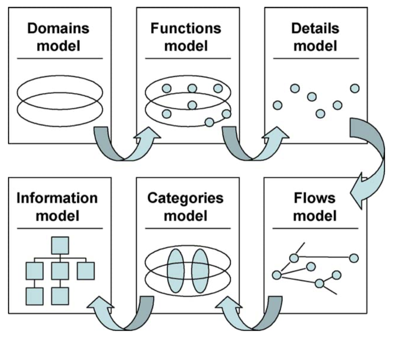
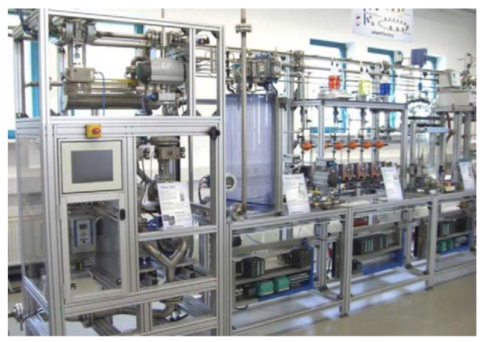
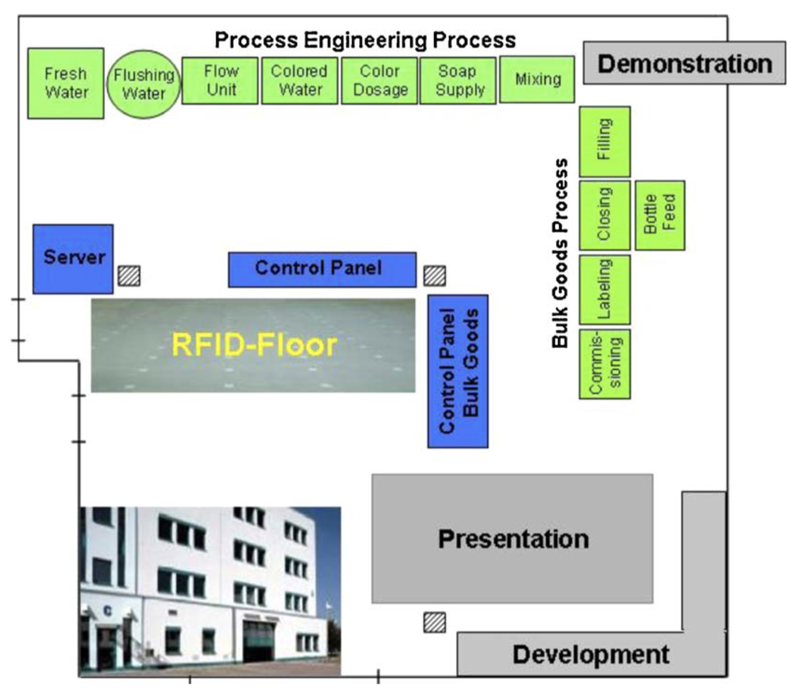
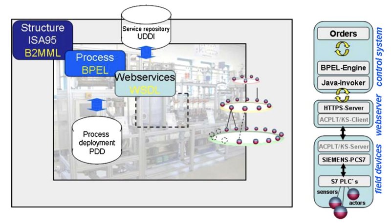
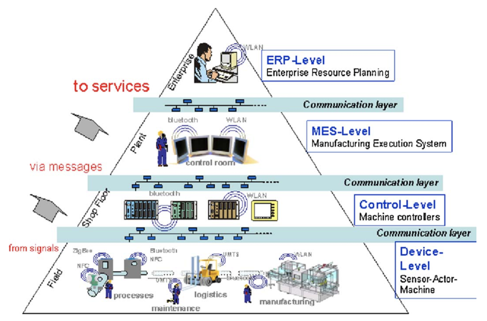

# SmartFactory — Towards a factory-of-things

Detlef Zuehlke a,b, *

SmartFactoryKL, Technology Initiative e.V. Kaiserslautern, Germany

German Research Center for Artificial Intelligence DFKI/Kaiserslautern, Germany

Article history:

Received 12 April 2009 Accepted 22 February 2010 Available online 28 March 2010

Keywords: Internet-of-things Digital factory RFID SoA OPC HMI Wireless networks

## Abstract

In 1991, Mark Weiser described the vision of a future world under the name of Ubiquitous Computing. Since then, many details of the described vision have become reality: Our mobile phones are powerful multimedia systems, our cars computer systems on wheels, and our homes are turning into smart living environments. All these advances must be turned into products for very cost-sensitive world markets in shorter cycles than ever before.

Today, the resulting requirements for design, setup, and operation of our factories become crucial for success. In the past, we often increased the complexity in structures and control systems, resulting in inflexible monolithic production systems. But the future must become lean — not only in organization, but also in planning and technology! We must develop technologies which allow us to speed up planning and setup, to adapt to rapid product changes during operation, and to reduce the planning effort. To meet these challenges we should also make use of the smart technologies of our daily lives. But for industrial use, there are many open questions to be answered. The existing technologies may be acceptable for consumer use but not yet for industrial applications with high safety and security requirements.

Therefore, the SmartFactory KL initiative was founded by industrial and academic partners to create and operate a demonstration and research test bed for future factory technologies. Many projects develop, test, and evaluate new solutions. This presentation describes changes and challenges, and it summarizes the experience gained to date in the SmartFactoryKL .

2010 Elsevier Ltd. All rights reserved.

## 01. Todays world of technology

Mark Weiser, one of the pioneers in computer technology, has coined the term ubiquitous computing — often also referred to as pervasive computing or ambient intelligence — for this new world Ubiquitous computing names the third wave in computing, just now beginning. First were mainframes, each shared by lots of people. Now we are in the personal computing era, person and machine staring uneasily at each other across the desktop. Next comes ubiquitous computing, or the age of calm technology, when technology recedes into the background of our lives (Weiser, 1991). 

In reality today, we are still quite a distance away from this vision. We focus too much on the technology and hope to attain a market advantage by combining a greater number of functionalities in each single device. Unfortunately, this「Swiss army knife」strategy leads to products that customers are unable to master. The manufacturers also encounter a growing number of problems: The cost efficient production with suitable quality requirements becomes proble matic when products with increasingly short life cycles shall be equipped with an ever growing number of options (Zuehlke, 2004).

The production plants also become ever more complex despite all efforts at improving this situation. This in turn, results in longer planning phases and unacceptably long times-to-market. At this point, let's look back to 20 years ago. In the 1980s, we witnessed the first wave of integration of IT technologies into the factories computer integrated manufacturing (CIM), as it was called then The hope was that fully automated plants would solve cost and quality problems on the basis of state-of-the-art computer technology. Since humans would no longer fit in there, the visions of the future then aimed at deserted factories with no human workers. The reality arrived quite differently than imagined. These CIM systems were extremely complex in planning as well as in construction, operation, and maintenance. The technologies were not yet mature and the humans were overstrained. At the beginning of the 90's, when the crisis was obvious, a milestone was represented by the popular book by Womack, Jones and Roos: The Machine That Changed the World: The Story of Lean Production  (Womack, Jones, Roos, 1991), Which explained to the high-tech addicts in the western industry, how Toyota was able to build high quality automobiles with very simple production principles. These principles were known from then on as lean production, which became the paradigm of the beginning decade.

1-2『已下载书籍「2021059The-Machine-That-Changed-the-World」。Lean Production 做一张术语卡片。（2021-01-28）』——已完成

Lean production meant networks, not hierarchies; dynamic, self-coordinating work teams instead of monotonous assembly line jobs; and, most importantly, the personal responsibility of the individual worker. But this philosophy is directed primarily on the organization and less on the technologies.

An earlier version of this article was presented as a keynote paper at the 13th IFAC Symposium on Information Control Problems in Manufacturing (INCOM 09) Moscow. Russia.3-5 une 2009

German Research Center for Artificial Intelligence DFKI/Kaiserslautern Germany.

### 1.1. Where are we today?

Today, computer integrated manufacturing is a reality, but we are still wrestling with the challenges of extreme complexity in planning and operations. Our planning processes are just as before: too sequential, too comprehensive in content, too much hardware-oriented and too product-specific. At the same time, we are facing new challenges: our products need to be more individualized and be offered in more variants, they must be adjusted to the market requirements in shorter time, the product life cycles are shorter than ever before and the global competition ever stronger. But definitely we can rely on the old remedy:「Don’t make things fat, think lean!」Create and use lean technologies now as you created a lean organization then! Lean means reducing complexity, avoiding waste technologies and information and strictly supporting the humans in their daily work. Here, we have the help of many new smart technologies that we take for granted in our daily lives which, in the meantime, have reached a level of maturity that makes them useful under industrial constraints.

1-2『上面对传统工厂弊端做的阐述真好，简单易懂。大大加深了之前看的 Paper「2021005Implementing-Smart-Factory-of-Industrie-4.0-An-Outlook.md」里，对传统单一产品、智慧工厂多功能产品的比较。（2021-01-28）』

Think about a service task in a huge manufacturing plant: A valve does not work properly leading to an overheat situation in the system. Today, the resulting alarm can be directed to the service staff via the mobile phone system anywhere, their smartphones will then guide them via GPS or equivalent indoor location systems very quickly to the place of malfunction. Their portable PC-systems will identify the broken valve e.g. by RFID technology and download all necessary information on this valve and possible replacements instantly via wireless communication channels like WLAN. The service staff can make photos with their smartphones and send them to a spare part shop for better identification. And finally, after a successful repair the crew can check the successful system restart even while having a snack in the cafeteria using their powerful mobile devices.

Isn't that a desirable vision of the future? Without doubt, there have been great advances since 1991 that can help us come closer to realizing the goal of lean technologies. Since some years a new vision has been created: the Internet of Things. The IoT will likely be a non-deterministic and open network in which auto-organized intelligent entities (e.g. Web services) and virtual objects will be interoperable and able to act independently pursuing their own objectives (or shared ones) depending on the context, circumstances or environments. But to make this vision turn into reality several prerequisites must first be met.

1『这里看到 on the context 突然领悟到时「上下文」的意思。设备的「自组织」体现在可以根据上下文自己做决定。（2021-01-28）』

### 1.2. Smart devices

Everything, down to the smallest piece of equipment, must have a certain degree of built-in intelligence. We see RFID technology here as a pioneer. A highly integrated, low-power and low-cost processor is extended with a memory and a wireless communications interface and affixed to each component in a mass market. In effect, the「intelligence」of a central system is moved into every piece of equipment. Products know their histories and their routes, and thereby not only greatly simplify the logistic chain but also form the basis for product life cycle data memories. When this technology is mastered and can be manufactured for just a few cents, the next step will be to couple sensors and actuators on the chip and turn it into an autonomous actuator-sensor network.

3『维基百科里的 RFID：射频识别是一种无线通信技术，可以通过无线电信号识别特定目标并读写相关数据，而无需识别系统与特定目标之间建立机械或者光学接触。无线电的信号是通过调成无线电频率的电磁场，把数据从附着在物品上的标签上传送出去，以自动辨识与追踪该物品。』

1『看到了这里突然想到了「网络科学」，如果人类已经把网络科学吃透了，每个设备变成简单的「小脑」，组合起来可以形成一个自组织的复杂网络。正好「复杂」那本书里有对「复杂系统」的定义，智慧工厂搞不好就可以做成一个复杂系统。这个观点放在「未来工厂」头脑风暴的最后一页 PPT，顺便把几个典型的复杂系统图片放上去，冲击力还是有的，比如蚁群、经济体、食物链等。（2021-01-28）』

### 1.3. Networked systems

Due to their communication capability these smart devices must form networks which allow them to set up and maintain a very reliable communication infrastructure. Based on the Internet Protocol (IP) these networks will be highly redundant and therefore reliable. Every single piece has an IP address and can communicate. But with today's standards we will reach the technical limits soon. The IP address space must be enlarged. The IPv4 standard could hardly supply enough addresses for today's technology, but IPv6 will bring us relief and even far more: IPv6 will provide each of us roughly 60 thousand trillion addresses (Garfinkel, 2004).

### 1.4. Mobility of devices

The advances in low-power electronics together with high-resolution LCD screens and the wireless communication capabilities will bring mobility forward. Our mobile phones will become multifunctional and multimodal tools which offer us permanent access to all plant elements. We will be able to work anywhere and anytime using any device we like. But general solutions for this kind of interaction are still far away. The plant IT structures today are mostly strictly centralized (thick servers, thin clients). They require a powerful network infrastructure to route the task data between the devices in real-time and are furthermore too device-dependant. What is needed in the future is device-independent mobility at the task level. We must be able to switch from a laptop to a smartphone instantaneously and to continue our task considering the particular technical features of the device in use. And as future devices will not live for 30 years we must allow for shorter technology updates without requiring reprogramming of the control software. But this will require a standardized task (or service) description on a still to be defined meta level (Satyanarayanan, 2004).

1『 What is needed in the future is device-independent mobility at the task level，看到这句 get 了智慧工厂里，移动设备所需的东西，所有计算都是在云端，移动端的屏幕、手机等只是作为一个显示器。（2021-01-28）』

Another important problem concerns knowledge about the place of interaction. When we operate today’s wire-based systems, the wire installation gives us implicit information about the place of interaction. In nomadic applications we will never know exactly where this place is. The user may be seated in front of the machine as well as in the local tavern. To keep the nomadic devices lean and up-to-date, we cannot store every possible front-end software in the devices; instead we should use the network connection to download an abstract HMI representation depending on the users place and task which will be used to generate a hardware-specific HMI on the dedicated device. Therefore we need location sensing systems, which can track the nomadic devices precisely also in indoor environments. The initial positioning solutions that are already available on the market still lack a broad coverage of industrial requirements. Furthermore, they are not standardized in terms of the required hard- and software interfaces, which makes their integration in large company-wide installations a non futureproof decision.

### 1.5. Standards must emerge

Fig. 1. ISA-95 models.

As indicated above, industrial solutions for many of the described applications will only be successful when they are based on vendor-independent open standards in order to keep cost and development effort low and guarantee for high availability and reliability during their lifetime. But many of today’s standards, e.g. in wireless networking are often lacking regulations which are essential for process control applications. Therefore, in the first phase of industrial applications vendors are forced to develop their own extensions. But in the next phase, appropriate general solutions are likely to follow. A good example is wireless HART, which emerged from analog wire-based (4–20 mA) via digital extensions to today’s wireless standard and is widely accepted as well by users as by vendors.

In addition to the hard-/software and communication standards for devices we also need design standards, e.g. for model representation which are needed to link the various planning systems (CAD, VR, CAE, CAM, etc.) in order to achieve a seamless planning, design and operation environment based on device, process, communication and HMI models. Here the evolving ISA95 standard (Fig. 1) seems to cover major requirements on the higher levels, while EDDL (Electronic Device Description Language) will bring solutions to the lower device levels.

1『直接上图 1 表达的信息很重要，有点类似于智慧工厂里的领域模型。（2021-01-28）』

However, before we can employ these technologies in our operations, we must be able to certify their reliability and safety under industrial conditions. No user will substitute the well-established control cables by a wireless connection unless he is convinced of their safety and security — no user replaces a machine panel by smartphone services as long as nothing works anymore when the smartphone is replaced by a newer device. For this reason, it makes great sense to test these technologies first under near-industrial conditions and to develop them further in order to ensure their suitability in industrial environments. It was for this purpose that in Germany for the first time in the year 2004, representatives of manufacturers and users met with people from academia and developed a vision for the intelligent factory of the future. This became the basis for the SmartFactory KL in Kaiserslautern, the very first multi-vendor research and demonstrator facility for smart production technologies in the world. The next section provides a brief introduction to this facility.

## 02. The SmartFactory KL approach

Based on a feasibility study, a non-profit registered association named「Technology Initiative SmartFactoryKL」was established in June 2005. The founding partners represented various sectors of economy and research. Their common goals were the development, application, and distribution of innovative, industrial plant technologies and to create the foundation for their widespread use in research and practice. The partner circle has since grown to 21 and includes producers and users of factory equipment as well as universities and research centers. Support is also provided by industry and political organizations (Fig. 2).

Fig. 2. Partners of the SmartFactoryKL .

1『发现我们化工行业里的巨头，比如巴斯夫、拜耳、西门子等。（2021-01-28）』

Funding for the establishment, operation, and expansion of the infrastructure primarily stem from membership fees and donations by members of the initiative. Additional funding was provided during the build-up phase by the Minister of Economics and Science of the State of Rhineland-Palatinate. Beyond this, there are many R&D projects that are funded solely by the participating industrial partners as pure research projects or as sponsored joint projects. These projects benefit from the use of the SmartFactoryKL infrastructure and contribute to its upkeep as well as expansion.

In a series of workshops the intentions and research focus of the members are regularly solicited so that new work groups can form and devote their efforts to current topics of interest. The group activities and the moderation of meetings are coordinated by a core team from the SmartFactory KL to ensure that the synergies between development subjects and research projects are realized for all participants. This continuously leads to new approaches for projects to be pursued internally by the partnership circle or to serve as the basis for requesting public funding for research grants. The initiative lives to this extent from the active participation and contributions of all members in joint research and development projects. In the process, the circle is always open to new partners, who bring in innovative products, projects, or ideas and have a desire to actively join in the work on further developing the platform. A framework of information forums introduces interested companies to well-known representatives of research and business who present the current state-of-the-art and invite an exchange of ideas about trends and smarter technologies. Furthermore, SmartFactory KL regularly presents itself to the public at major industry events, like well-known trade fairs or industry meetings.

The equipment basis for the SmartFactory KL is a hybrid production facility for the production of colored liquid soap. The product is mixed, filled into dispenser bottles, individually labeled, and then delivered by customer order. The plant has been designed strictly modular and it consists as well of a process manufacturing part as of a piece goods handling part. The machinery and components are identical to those found in modern industrial plants and stem from various manufacturers so that the result is a multi-vendor production and handling facility available for research purposes, absolutely comparable in its complexity with real manufacturing plants (Figs. 3 and 4).

Fig. 3. Photo of the SmartFactory KL facility.

Fig. 4. Floorplan of the SmartFactoryKL .

The research focuses clearly on the use of innovative information and communication technologies in automated systems and on the resulting challenges in the design of such systems. Several different wireless communications systems are employed in the demonstration facility (Fig. 5). As a consequence, a permanent WLAN connection has been implemented for the decentralized control systems of the components in the piece goods part to the higher level control center. Bluetooth, ZigBee, UWB, NFC and RFID systems are deployed among the components, which serve as an extended link at the sensor/actuator level. The wireless communication guarantees new freedoms in plant layout and reduces the planning effort in that cabling is no longer required. However, the robustness of the radio communications in such a heterogeneous environment must always be proven. In this demo plant several monitoring devices are installed to monitor the frequency bands and the quality of service in data transmission. On the other hand, various sources for interference are used to check the electromagnetic compatibility of the systems.

1『有启发的：Bluetooth, ZigBee, UWB, NFC and RFID systems are deployed among the components, which serve as an extended link at the sensor/actuator level，蓝牙、RFID 这些可以为整个无线局域网做补充，当然，主要还是通过 5G 实现。（2021-01-28）』

The wireless communication in combination with the modular construction allows the facility to operate according to the「plug'n work」principle. Every element takes on a clear, well-defined function within the process chain. Because no physical connections exist between the components other than the power supply, it is relatively simple to replace or add individual components for a modification or extension of the production processes. The components recognize their function and position themselves within the process chain and integrate automatically into the control systems for plant management. The configuration of the information flow becomes ever simpler because the components identify their tasks from the manufacturing situation and attune themselves to the surrounding components.

1『这里 get 到一个很重要的点：因为无线连接设备了，可以理解把部分的「硬连接」转化为「软连接」，这样的话我改生产线只需要改算法逻辑，仪表桥架不需要重新连了，灵活性大大提高。所以也就理解了之前多篇 Paper 里提到的，设备管道连接可能会冗余一些，这是为多变的生产创造条件的。醍醐灌顶的感觉。（2021-01-29）』

The logical continuation of the「plug'n work」principle is the transition from traditional function-oriented to service-oriented control architectures (SoA). The SmartFactory KL has experimentally converted a sub-area of the plant control to SoA architecture (see Fig. 5). The purpose of this was to gain experience in the handling of this new architecture for industrial control processes. The present system is based on a Business to Manufacturing Markup Language (B2MML) model according to ISA-95, a Web Services Description Language (WSDL) model, as well as the Business Process Execution Language (BPEL) for system administration. While this test case revealed the fundamental advantages of a SoA architecture, it also clearly shows the far ranging effects of this paradigm change on the overall information structure of a company.

Fig. 5. Experimental SOA architecture of the SmartFactoryKL .

Using radio technologies it is also possible to employ new, mobile and flexible systems for the operation, maintenance, and diagnostics of the production facility. Today, most sensors and actuators as well as more complex mechatronic units are equipped with stationary, inflexible control panels that range from those with just a few buttons and lights to those with complete PC-based, color LCD panels. Due to the lack of standards and the increasing range of functionalities, the complexity of these device operating systems is rapidly growing, a fact which not only leads to higher costs but also to problems in familiarization training and maintenance service. One solution to this problem is the physical separation of the devices and the control panels. Radio technologies enable standard control devices such as PDA's or mobile telephones to access different suppliers' field devices. A widely standard, consistent control concept raises the learning conduciveness of such systems and prevents operational errors. Location independence and the advanced display and interactive possibilities enable a significant increase in the flexibility of device operations (Fig. 6).

2『关键信息：One solution to this problem is the physical separation of the devices and the control panels，这里涉及到自控的知识，目前不是很明白。（2021-01-28）』

Fig. 6. Wireless technologies in the SmartFactoryKL .

The integration of location sensing systems with production and logistic processes is a major condition for meeting the demands for greater flexibility and shorter production cycles. The effective use of location data allows for flexible context-related applications and location-based services. Various positioning systems are deployed at the demonstration facility of the SmartFactoryKL . For example, the floor is fitted with a grid of RFID tags. These tags can be read by mobile units to determine location data. Other systems for three-dimensional positioning based on ultrasonic as well as RF technologies are also installed and currently tested, especially in terms of the accuracy achievable under industrial conditions.

The installed systems cover the full range of components within the automation pyramid (Fig. 7): from field devices (sensors/ actuators) and programmable logic controllers (PLC) through process management and manufacturing execution systems (MES) to the enterprise level (ERP) software, the entire spectrum of control technologies for industrial manufacturing is represented in the SmartFactoryKL .

Fig. 7. Automation pyramid.

The platform offered by the SmartFactory KL served as a research and development basis in numerous projects with various partners. For example, a demonstrator has been developed, that shows the usability of commercial mobile telephones for radiobased parameterization of components (Goerlich, Stephan, & Quadflieg, 2007). Using Java software, which runs on the mobile phones of several different brands, it is possible to monitor and configure a multitude of field devices in the SmartFactoryKL. The available devices and wireless links are automatically identified. Furthermore, a uniform operating philosophy facilitates handling of field devices and enables access to any device from any location on the shop floor, thereby speeding up parameterization, diagnostics, and control of field devices. Rapid switching from one device to another is possible without changing location.

In a government funded project, a very basic and general method for the description of human-machine interactions in an abstract and hardware-independent way is currently being developed. An early prototype already builds fully functional remote control software from communication models and use models, and provides a simple, context-adaptive user interfaces. This is a prerequisite for decoupling HMI engineering from hardware design, respectively the actual hardware used.

A digital record of the life cycle of high value products, continuous monitoring of a product's status, product location tracking as well as ubiquitous access to all relevant product data are topics of increasing importance to manufacturing and trade companies. In a government funded research project named「SemProM」(Semantic Product Memory), an innovative, basic concept for a digital product memory has been developed and implemented at the SmartFactoryKL . As a visionary technology of the future, it is based on the next generation of mobile, embedded, and radio-based elements for semantic communication between everyday objects. The goal is to develop「intelligent」products, with capabilities far beyond the pure identification function of today’s RFID features. Besides the evaluation of the various embedded sensors (e.g., temperature, brightness, humidity, speed, acceleration, location), they record all relevant product and operating data and, in the sense of an Internet of things, exchange this information with other products, with their surroundings, and even with their users.

In cooperation with the partner SAP-Research the SmartFactory KL has been linked into the SAP Future Factory network. By this experiences were gained on the integration into production networks on the MES level. A production order can be started anywhere in the network, the production remotely controlled and the products routed to other manufacturing plants or the customer.

## 03. Towards a factory-of-things

Despite the success stories already discussed, it is still a long and winding road from the vision to the reality of a smart factory, but just as it is constantly being walked by the consumer product engineers, it must also be taken by the factory planners. Adopting the basic principles of the internet-of-things we should talk about a factory-of-things as a vision for our future factories. The factory-of-things will be composed of smart objects which interact based on semantic services. There will be no hierarchy in the traditional sense instead the objects will self-organize to fulfil a certain task. But to achieve this goal there are multi-dimensional problems to be solved.

1『 There will be no hierarchy in the traditional sense instead the objects will self-organize to fulfil a certain task，这句话是对「智慧工厂」一个核心的解释。补充进主题卡片「智慧工厂的 autonomy and sociality」里。（2021-01-28）』——已完成

### 3.1. The technical dimension

The technical dimension most likely poses the least difficult challenges. Here, smart devices suitable for industrial use are to be developed. For reasons of economy they will likely be based to a great extent on the technologies from the world of consumer goods. For example, just as it took many years for the PC to become suitable for industrial purposes, so too will smartphones, wireless PLC’s or sensors make the jump. In the process, we should always strive to use the existing standards from the world of the consumer market whenever possible, for that is where the high production volumes are which lead to acceptable prices. But these standards also need to be adjusted to the conditions of the industry with regard to reliability and the different environmental conditions.

A typical change will affect our operating devices. The upcoming use of the various wireless technologies will bring mobility to the worker. The use of nomadic operating devices is also far more than just a substitution for the fixed installation of control panels. One problem here is the variety of different devices, which are also designed with significantly shorter life cycles as the rest of the plant. Additionally, there is the problem of user permissions and identity management, which must ensure that only authorized users can access a certain device within the plant. And, as device tracking enables permanent monitoring of the user, there are privacy issues of data protection to be clarified prior to use.

For making a factory-of-things work all elements must become smart, i.e. they must offer a thin web server functionality to act as a service provider in a factory network. To let a simple inductive proximity sensor become smart in that sense may look totally excessive from today’s point of view. But in 5 or 10 years the advances in microelectronics will surely bring it close to reality. And the emerging IPv6 standard will offer enough addresses to give each grain of sand on the entire earth more than just one.

### 3.2. The architectural dimension

Many of the envisioned changes can only develop their maximum benefit when we move to a more abstract description of the planning and control process. We must avoid to link hardware, software and architecture at early stages already. Instead, we must concentrate on architectures enabling interoperability based on abstract component and task models. From similar developments in software engineering we learned that we must proceed from electrical signals via simple data integration to system models based on abstract objects. With the increased use of OPC, CORBA, etc. we moved into the right direction. But as in modern software engineering we have to proceed to the semantic level e.g. by using service architectures based on commonly defined process services. But this next step will be much more challenging than any other leap in the past (Vernadat, 2006).

The new service-oriented architecture (SoA) paradigm will not only bring substantial advantages to the design of complex systems but will completely shake up many traditional design processes. SoA is a powerful decentralized architecture that relies on company-wide task and service models. The services themselves are encapsulated and retrieved over a standard interface. The various levels of aggregation must first be identified and defined for such services. What makes the implementation so difficult is that initially the company-wide services must be defined semantically, and then step by step refined down to the unit level. Additionally, the SoA architecture is not a hierarchical structure as is typical for plant construction today; rather it is a loosely linked distributed network architecture. This implies a need for new engineering methods and tools to be satisfied before any employment in an industrial setting can be considered promising. And perhaps most challenging, the experienced factory planners trained in hierarchical thinking over decades must learn a new thinking: to compose complex technical systems of abstract services based on common ontologies (see Fig. 8). Another important factor is the trust of the customers in such new control architectures. SoA as a loosely coupled service network will surely not fulfil today’s typical requirements concerning real-time behavior and predictability. But this was also true for the Ethernet when it was first promoted for industrial use.

1『多次看到语义性逻辑 Semantically，目前还不是很明白，感觉与根据「上下文」自行调整同义。（2021-01-29）』

As customers in this field are not looking for revolutions but instead for a continuous evolution with predictable behavior and steady improvements the factory-of-things paradigm will be hard to promote in complete. It will surely not replace the old structures with lots of experiences over decades in just one night. But the advantages will drive the SoA application downwards from the ERP level – where it is used today already to a large extend – to the MES and Device level. Most likely, a good intermediate interface between the different architectures can be realized at the PLC level. A future PLC may look as a complex service object to the upper MES level and interpret the service requests to the lower device levels still based on the traditional hierarchical bits and bytes paradigm.

1『这里的 PLC 层如同图 7 金字塔控制层里的 Control-Level（Machine controllers）。（2021-01-29）』

### 3.3. The planning dimension

A large portion of the problems in plant engineering has their origin in the planning methods commonly used today, which are closely associated with hardware factors. As a rule, today’s planning procedures normally start with an initial, top-down rough planning in which the structures, components and production methods and parameters of the product are defined. Thereafter, the bottom-up detailed planning begins, in which the required machine parts and components are selected and engineered, wiring schemes planned in detail, and finally, the control hardware and software is developed. Today there are many advanced CAx systems used for this. With CAD, for example, STEP models can import and integrate mechanical data; CAE tools for SCADA development like PCS7/WinCC (Siemens) facilitate the design of control software, and visualization (or simulation) tools allow for the simulation of the entire plant already in early design planning stages. Unfortunately, these systems often lack adequate data integration: Although they are internally model-based, the models are often incompatible with one another. It is precisely this model-based integration that takes on increased significance in the lean planning process of the future. Here, solutions are most urgently needed to create an improved planning situation. Modelbased planning needs device models on the basic levels. Today, most industrial devices are already delivered to the customer with electronic CAD and product data in the international STEP format. In the future, this data must be transformed into comprehensive device models including communication and service models (Fig. 9).

The vision for future factory planning is named「Digital Factory」. The importance of this field is pointed out by the fact that several big players from the industry equipment market merged with IT-companies in order to offer comprehensive system development, planning and control tools. These tools will integrate planning, simulation, operation and even MES and ERP functions supporting the complete product lifecycle. This will require consistent and comprehensive system models which will be the most crucial point for success.

In the long run, we aim at a semantic interoperability of the various factory devices. This requires semantic service models based on common ontologies and – for a world-wide market success – international standards.

### 3.4. The safety and security dimension

The daily frustration of having an empty battery for your mobile phone or having a virus sneak onto your PC is certainly annoying, but very seldom threatening. This is quite different for an industrial application. There, we must be able to ensure under nearly every normal condition, that the systems stay constantly under control. Today, while wired controls can provide a satisfactory safety guarantee, there are still many open questions concerning the mobile and wireless solutions. It is not only the technical issues like the power supply or the availability of channels that can present problems; there is also the risk of criminal attacks – the tiresome hackers – that not only cause severe problems but will be much harder to be traced. In our SmartFactory KL a simple wireless webcam set was sufficient to widely jam all wireless communication and thereby stop production.

Another problem area is fast approaching and with it come challenges we will be confronted with in the near future: As more and more devices are becoming smart and equipped with wireless communication interfaces, the frequency bands allocated for this purpose will quickly reach their capacity limits. Already today, e.g. at industry trade fairs, the WLAN links often break down, simply because there are too many users in a relatively small, enclosed area. New access protocols can certainly lead to a far better use of the frequency bands, but for the long term, there will be the need to release additional radio bands.

In spite of such problems, the first wireless systems are now being sold by several of the large vendors in the field of process automation. However, these are still custom solutions, which serve mainly to gather experience and test the market. Most customers have not yet been convinced of these systems’ safety and security. But just as it took years for the PC to overcome the skepticism of industry as a reliable control component, the wireless systems will need a bit more time before they can assert themselves (Welander, 2007).

### 3.5. The human dimension

Finally, we should not forget the lessons learned from the CIM era. Whatever technical system we design, we always should put the human in the center! The factory devoid of humans is an aberration. We need humans in all phases of factory operations from the planning through the operation to the maintenance and repair services. While our human cognitive and sensomotor abilities have not significantly improved within the last thousands of years, future systems should focus on humans and their abilities and not conversely demand that the humans adjust to whatever technology.

The new technological possibilities will further provide a level of mobility for humans which has never been reached before. The place of work will be increasingly decoupled from the physical location of the worker. The wireless communication technologies make it a reality to remotely perform portions of the plant monitoring and operating functions, for example, from the cafeteria or even the sidewalk cafe. This brings up not only issues of job security but also of the boundaries between work and leisure and certainly even the monetary compensation models.

As we have learned from today’s smartphones, the short life cycles of such operating devices in comparison to the long life cycles of the production equipment require an independency of the HMI software from the hardware. This can only be achieved by replacing the device-dependant HMI software by abstract HMI models to describe the interaction independent from the actual hardware realization. Such models will have to be developed and then implemented in appropriate engineering tools. This will fit perfectly into SoA architectures, as abstract HMI models itself are mostly composed of services.

Taking all this into consideration, the engineering of the HMI takes on a whole new significance. We are following the path we already walked long ago in the development of hardware and especially software: namely, from the direct design or programming to abstract engineering methods. In current software engineering, we are able to model systems using abstract, object-oriented methods. Similarly, we must now develop Useware 1 engineering methods that describe the interaction in abstract, object-oriented ways (Fig. 10, Zuehlke, 2007).

[1] USEWARE comprises all hard- and software components of a technical system that are related to human-machine-interaction, the term USEWARE was introduced in 1999 to emphasize the independent significance of HMI design compared to the traditional fields of hard- and software.

## 04. Conclusions

Today we are in a comparable situation to 29 years ago. New ICT technologies and products offer a broad range of new applications not only in the consumer but also the industrial world. A simple adaptation of existing technologies from the area of consumer goods appears tempting but, this would be inappropriate for industrial use in most cases. Instead, we should remember the lessons learned from the CIM crisis:

1 reduce complexity by strict modularization and lean technologies,

2 avoid centralized hierarchies in favor of loosely linked decentralized structures consisting of self-adapting modules,

3 allow for self-organization on the system level wherever possible,  allow for a really concurrent engineering by decoupling process, mechanical, electrical, and control design on the basis of semantic models,

4 create and apply standards to all levels of the automation pyramid in order to reduce planning effort and allow re-use of components, 

5 and in the end: develop technologies for the human. A deserted factory is an aberration!

The path we have taken in Germany with the SmartFactoryKL initiative, to examine, test and develop technologies in a physical factory test bed in cooperation of industry and academia, has proven itself so that we can recommend it for imitation elsewhere. However, the resources required are not to be underestimated. And as future changes will not only require steady technical evolution but instead the acceptance of new engineering paradigms we need visions and visionary decision makers in industry, politics and academia (Zuehlke, 2008).

## References

Garfinkel, S. (2004). Internet 6.0, technology review January: (2004).

Goerlich, D., Stephan, P., & Quadflieg, J. (2007). Demonstrating remote operation of industrial devices using mobile phones. In Proceedings of the 4th international conference on mobile technology, applications and systems.

Satyanarayanan, M. (2004). Seamless mobility: In pursuit of the holy grail. In Proceedings of the 2nd IEEE conference on pervasive computing and communications.

Vernadat, F. B. (2006). Interoperable enterprise systems: architectures and methods. In Proceedings of the 12th IFAC/IFIP/IFORS/IEEE/IMS symposium information control problems in manufacturing INCOM’2006.

Weiser, M. (1991). The computer for the 21st century. Scientific American, special issue on communications, computers, and networks.

Welander, P. (2007). When will wireless be ready for control functions? Control Engineering October: (2007).

K, J. P., Jones, D T, &Roos, D (1991). The machine that changed the world. Harper Perennial: The Story of Lean Production

Zuehlke, D (2004). Pervasive computing technologies in industrial applications. In

Proceedings of the 9th IFAC/IFIPS/IFORS/IEA symposium on analysis, design, and evaluation of human-machine systems

Zuehlke, D (2007). Model-based development of user interfaces-a new paradigm in

useware engineering. In Proceedings of the 10th IFAC/IFIPS/IFORS/EA symposium on

analysis, design, and evaluation of human-machine systems (plenary paper) Zuehlke, D (2008) Smartfactory- from vision to reality in factory technologies. In

Proceedings of the 17th IFAC world congress (plenary paper).

Prof Dr-Ing. Detlef Zuehlke received the MS in electrical engineering and computer sciences and his PHD in robotics both from RWTH Aachen/Germany. Currently he is a professor for Production Automation at the University of Kaiserslautern and scientifi director of the research department Innovative Factory Systems (IFS) at the German Research Center for Artificial Intelligence (DFKI). He is chairman of the executive board of the Smartfactory, chairman of the IFAC CC 4 on Mechatronics, Robotics and Components, advisory board member of the VDI/VDE-SOCIETY for Measurement and Automatic Control and member of the advisory panel of Springer publishing. His interest is in industrial control architectures, factory planning and operation and human-machine-systems for industrial applications.