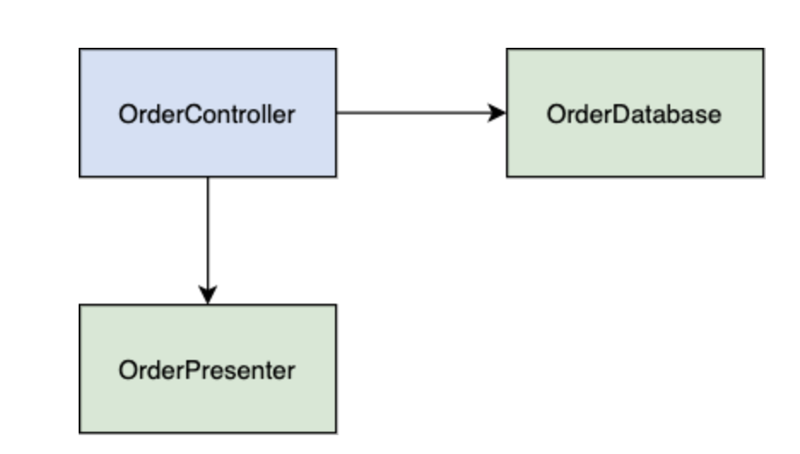
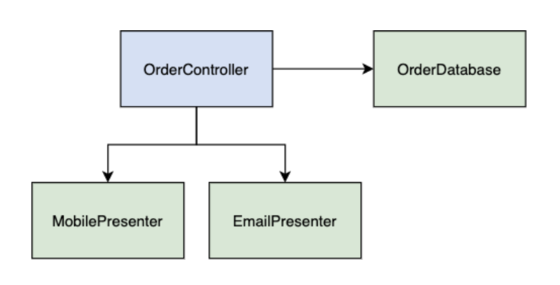
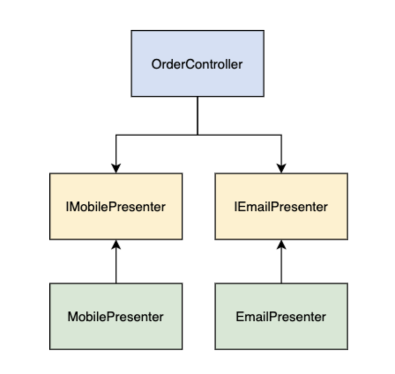
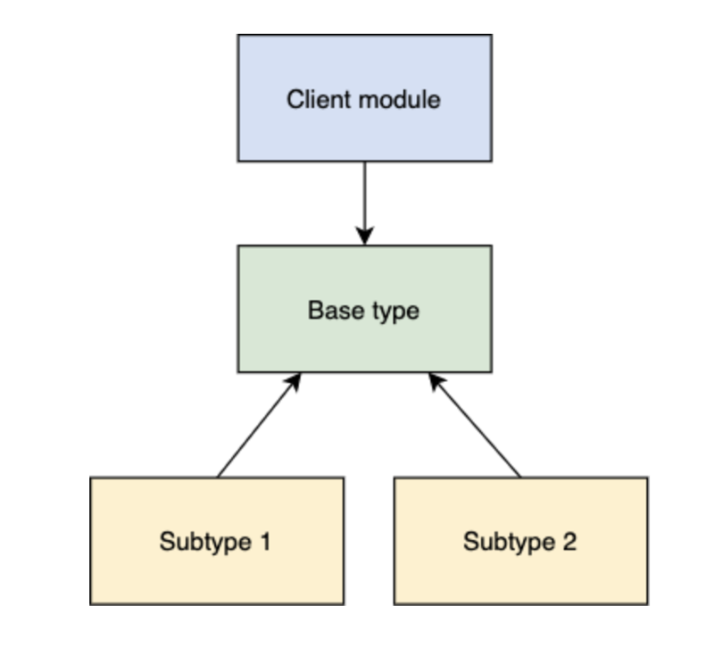
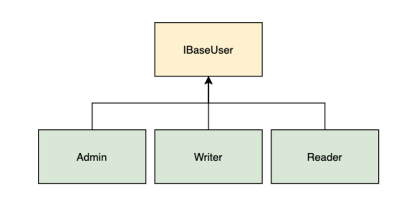
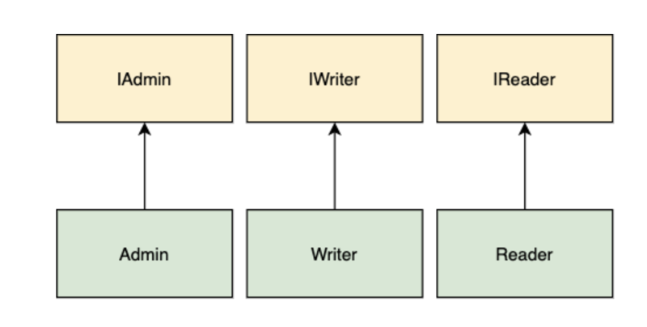
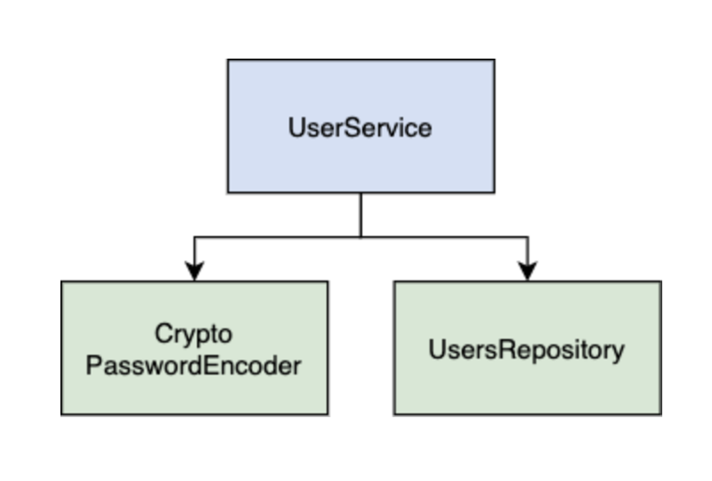
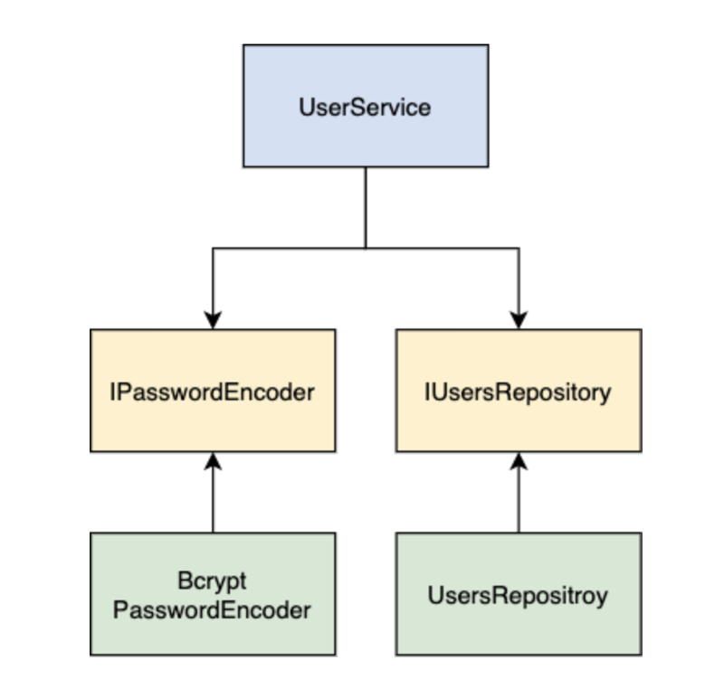

# 5 Problems Faced When Using SOLID Design Principles — And How To Fix Them

[5 Problems Faced When Using SOLID Design Principles — And How To Fix Them | by Vlad Ostrenko | Mar, 2021 | Better Programming](https://betterprogramming.pub/5-problems-faced-when-using-solid-design-principles-and-how-to-fix-them-df6dbf3699fb)

Know how to use design patterns correctly

Vlad Ostrenko

In this article, we'll explore why and when software developers should use SOLID principles.

First, we'll start by exploring the reasons why we should consider them when designing software. Then, we'll outline each principle alongside a problem and solution. Please note that the examples in this article are simplified. Their purpose is simply to demonstrate problems that arise when these principles are violated.

## 01. Introduction

SOLID is an acronym for the five software design principles by Robert C. Martin. I highly recommend reading his book 'Clean Architecture'. So here's the list of principles:

Single-responsibility principle (SRP)

Open-closed principle (OCP)

Liskov substitution principle (LSP)

Interface-segregation Principle (ISP)

Dependency-inversion principle (DIP)

The main goal of these principles is to make software resilient to changes and easy to extend and maintain.

Making changes to the software takes time, which is the most expensive resource. The business has to react to market changes quickly, so the development time is critical. The faster you can adapt your code, the easier it will be for a business to develop and grow.

## 02. Single-Responsibility Principle (SRP)

Each module has one — and only one — reason to change

The hardest principle to understand is SRP because many developers think it means that each module should be responsible for one thing. This really applies when we're working with functions. For example, when we divide functions into smaller ones, we make sure these functions are only doing one thing.

But the essence of SRP is different. To make it clearer, we can paraphrase the principle as follows:

Each module has to be responsible for one — and only one — user or stakeholder.

Software is changed to satisfy users' or stakeholders' needs. So these users and stakeholders are the reason to change. Module, in this case, is a set of functions and data structures that are cohesive.

The problem:

In the following example, we have an AdsAccount class, which violates the SRP principle.

```java
class AdsAccount {
  public startCampaign() { ... }
  public calculateCampaignStats() { ... }
  public save() { ... }
}
```

This module has more than one reason to change:

1 Implementation of the startCampaign method is defined by the marketing team.

2 Implementation of the calculateCampaignStats method is defined by the analytics team.

3 Implementation of the save method is defined by the development team.

If we put the implementation of these methods into one class, there's a chance that new requirements by the marketing team will affect the business logic of the analytics team.

Imagine that the startCampaign and calculateCampaignStats methods use the common method getCampaignImpressions. The marketing team improved the impression-calculation logic, and they want to apply it to new campaigns. The developers updated and tested the startCampaign and getCampaignImpressions methods. The marketing team approved changes, and a new build was deployed.

After some time, it turned out that the campaign stats calculated in an unexpected way, and the analytics team worked with inconsistent data.

The solution:

The solution is pretty straightforward. We just need to split our logic into separate classes.

```java
class AdsAccount {
  constructor() {
    this.statsCalculator = new StatsCalculator()
    this.campaignLauncher = new CampainLauncher()
    this.campaignSaver = new CampaignSaver()
  }

  public startCampaign() {
    this.campaignLauncher.startCampaign(...)
  }

  public calculateCampaignStats() {
    this.statsCalculator.calculateCampaignStats(...)
  }

  public save() {
    this.campaignSaver.save(...)
  }
}

class StatsCalculator {
  public calculateCampaignStats() { ... }
  private getCampaignImpressions() { ... }  
}

class CampaignLauncher {
  public startCampaign() { ... }
  private getCampaignImpressions() { ... }  
}

class CampaignSaver {
  public save() { ... }
}
```

Now we have three classes that follow the SRP: StatsCalculator, CampaignLauncher, and CampaignSaver. Each new class doesn't depend on others. We have separate private methods for getting campaign impressions — each with its own logic needed for a particular team.

AdsAccount is now acting as a facade. It's responsible for creating instances of our new classes and method-call delegation.

## 03. Open-Closed Principle (OCP)

Each module should be opened for extension but closed for modification

Open for an extension means that adding new features to the application could be done only by providing new modules.

Closed for modification means that the result of extending the behavior of existing modules shouldn't force you to make changes in the modules depending on it.

1『原文中上面这段话高亮显示的，做一张金句卡片。（2021-04-23）』—— 已完成

The goal of this principle is to make your system easy to extend and protect from the impact of changes.

If a simple extension of the application logic leads to a chain of changes in the other modules, then you probably have violated the OCP.

Applying this principle in conjunction with the single-responsibility and dependency-inversion principles prevents situations in which a change to one of your classes also requires you to adapt all of your depending modules.
Let's dive into the example.

The problem:

Imagine, you're creating a food delivery application. You have a mobile app where your users create and view orders. The popular solution is where you have a module (aka a controller) that loads models from the database, transforms them to an HTTP response payload, and sends the payload to a client.



Arrows that pointed from module 1 to module 2 shows that the source code of module 1 uses module 2. The source code of module 2 does not know anything about module 1.

In the diagram above, we have OrderController, which holds references to OrderDatabase and OrderPresenter. OrderDatabase is responsible for loading and persisting order models. OrderPresenter is responsible for mapping the order model to the response payload data structure.

Let's assume that stakeholders asked to implement sending orders via email. We quickly update the controller code so that it sends an email to the user when a new order is created.

Let's look at the following pseudocode:

```java
class OrderController {
  constructor() {
    this.mailServer = new MailServer()
    this.orderPresenter = new OrderPresenter()
  }

  public createOrder(): Promise<OrderView> {
    const order = new Order(...)
    
    await order.save()
    
    const orderView = this.orderPresenter.present(order)
    
    this.mailServer.send(orderView)
    
    return orderView
  }
}
```

After some time, new requirements are introduced. We need to display the order total price in the email. In other words, we need to update our order view.

The important thing to understand is that the order is presented by two different views: via a mobile screen and via email. With new requirements, each view displays order details differently.

There are several ways in which we can implement the solution. We can extend OrderPresenter with a new method for creating an email view. We can create another presenter module for emails. In both cases, we have to update our controller to match the new presenter APIs.

Doesn't it look like we are violating the OCP? How can we protect our controller and presenters from changes each time a new requirement is introduced?

The solution:

Let's start off by splitting our presentation logic into two modules. Each module will be responsible for the transformation of the order model to the needed structure for a particular view.



That's better. Changes in the email presenter, like adding new fields and so on, won't affect the mobile presenter. But still, the problem with the controller persists. How do we organize our code in order to protect the controller when the presenter API is changed?

To achieve that, we need to make the controller independent from presenters by inverting the dependencies. Our controller module should define an interface for the presenter. And the presenter should implement this interface.

To achieve that, we need to make the controller independent from presenters by inverting the dependencies. Our controller module should define an interface for the presenter. And the presenter should implement this interface.To achieve that, we need to make the controller independent from presenters by inverting the dependencies. Our controller module should define an interface for the presenter. And the presenter should implement this interface.



1-2『上面的图，很好的展示了「反转依赖关系」，目前没吃透，需反复研读。（2021-04-23）』—— 未完成

With this architecture, the controller doesn't know anything about the actual implementation of presenters. All the presenters must follow the contract defined in the interface. Let's look at the updated code example:

```java
export interface IEmailPresenter {
  present(order: Order): EmailView
}

export interface IMobilePresenter {
  present(order: Order): MobileView
}

class OrderController {
  constructor(emailPresenter: IEmailPresenter, mobilePresenter: IMobilePresenter) {
    this.emailPresenter = orderPresenter
    this.mobilePresenter = mobilePresenter
    this.mailServer = new MailServer()
  }

  public createOrder(): Promise<MobileView> {
    const order = new Order(...)
    
    await order.save()
    
    const emailView = this.emailPresenter.present(order)  
    
    this.mailServer.send(emailView)
    
    const mobileView = this.mobilePresenter.present(order)
    
    return mobileView
  }
}
```

As the result, we closed our OrderController for modification using the interfaces. Additionally, we can say that our presenters are opened for extension. When we need to add another type of functionality, we provide a new module.

This is how OCP works. You split the application, considering how, when, and why it needs to be changed. After that, you organize everything into the components hierarchy. Those components which need to be protected from changes define the interfaces used by frequently changing components.

## 04. Liskov Substitution Principle (LSP)

A subclass should override the parent class methods in a way that does not break functionality from a client's point of view

In other words, software modules that use base type should be able to use subtypes of the base type without changing the code.



Software modules that use base type should be able to use subtypes of the base type without changing the code.Software modules that use base type should be able to use subtypes of the base type without changing the code.
Such design corresponds to LSP if the base type can be replaced by both subtypes.

But what are base types and subtypes? The base type can be a class with subtypes as successors. Or the base type can be an interface with subtypes as its implementations.

To better understand the idea behind LSP, let's look at the example.

The problem:

Imagine we need to implement an e-wallet application, where we can transfer money from one card to another. An abstract solution might look like this:

```java
class BankCard {
  topup() { ... }
  withdraw() { ... }
}

class Wallet {
  transfer(amount: number, sender: BankCard, receiver: BankCard) {
    // ...
  }
}

const wallet = new Wallet()
const senderBankCard = new BankCard()
const receiverBankCard = new BankCard()

wallet.transfer(1000, senderBankCard, receiverBankCard)
```

Here we have a Wallet instance that uses BankCard instances to make transfers.

After some time, new requirements were added to our e-wallet application. Our wallet users have to be able to transfer money from a savings card. These cards are virtual. They can't be replenished manually, so they don't have a topup method.

Now our sender can be a bank card or a savings card.

```java
class BankCard {
  topup() { ... }
  withdraw() { ... }
}
class SavingsCard {
  withdraw() { ... }
}

class Wallet {
  transfer(amount: number, sender: BankCard | SavingsCard, receiver: BankCard) {
    if (sender instanceof BankCard) {
      // ...
    }
    if (sender instanceof SavingsCard) {
      // ...
    }
  }
}

const wallet = new Wallet()
const senderSavingsCard = new SavingsCard()
const receiverBankCard = new BankCard()

wallet.transfer(1000, senderSavingsCard, receiverBankCard)
```

This will work, but any time a new card is introduced, we have to add a new type to the argument and a new if statement. We can't replace BankCard with SavingsCard, so we're violating the LSP.

The solution:

To follow the LSP, we need to add a base type for our cards to support their interchangeability. This approach guarantees that we'll always have the withdraw method.

```java
interface IWithdrawable {
  withdraw(): void
}

interface IRechargeable {
  topup(): void
}

class BankCard implements IRechargable, IWithdrawable {
  topup() { ... }
  withdraw() { ... }
}

class SavingsCard implements IWithdrawable {
  withdraw() { ... }
}

class Wallet {
  transfer(amount: number, sender: IWithdrawable, receiver: IRechargable) {
    // ...
  }
}

const wallet = new Wallet()
const senderSavingsCard = new SavingsCard()
const receiverBankCard = new BankCard()

wallet.transfer(1000, senderSavingsCard, receiverBankCard)
```

Now we can say the solution above follows the LSP. We have a base type: IWithdrawable. It can be replaced by its subtypes BankCard and SavingsCard. Our method works with base type, so we don't need to modify it each time a new card is introduced. The only requirement for new cards is to be subtypes of our base type.

## 05. Interface-Segregation Principle (ISP)

Software modules should not be forced to depend upon interfaces that they do not use

The ISP states that we should write a series of smaller and more specific interfaces that are implemented by the class. Each interface provides a single behavior. In other words, many specific interfaces are better than one general interface.
When the principle is violated, software modules are forced to implement methods that they don't use. Moreover, any changes to the method signature in the interface leads to changes in dependent classes. This is an overhead and undesired level of connectivity between modules.

The problem:

For example, you're creating a blog. You have different types of users.



The top category is iBaseUser and the subcategories are Admin, Writer, and Reader.The top category is iBaseUser and the subcategories are Admin, Writer, and Reader.

IBaseUser is our general interface. It has a set of common methods for each successor type. In our example, the Admin and Writer have a common method for editing blog posts. But readers don't++they can only read posts. Also, only the admin can block posts.

```java
interface IBaseUser {
  viewPost(): void
  editPost(): void
  blockPost(): void
}

class Admin implements IBaseUser {
  public viewPost() { ... }
  public editPost() { ... }
  public blockPost() { ... }
}

class Writer implements IBaseUser {
  public viewPost() { ... }
  public editPost() { ... }
  public blockPost() { 
    throw new Error('writer can not block posts') 
  }
}

class Reader implements IBaseUser {
  public viewPost() { ... }
  public editPost() { 
    throw new Error('reader can not edit post!') 
  }
  public blockPost() { 
    throw new Error('reader can not block posts') 
  }
}
```

The Reader and Writer classes have to implement the methods they donät use — hence, they violate ISP.

When a business grows, so does its functionality. New users are added with a set of methods related to them. Our IBaseUser interface becomes more and more complex. All the classes that implement IBaseUser grow relatively. So how can we solve this problem?

The solution:

This problem can be solved by dividing the functionality into separate small interfaces.



If any client wants both behaviors, then they can implement both interfaces. Let's look at the code example:

```java
interface IReader {
  readPost(): void
}

interface IWriter {
  editPost(): void
}

interface IAdmin {
  blockPost(): void
}

class Admin implements IReader, IWriter, IAdmin {
  public viewPost() { ... }
  public editPost() { ... }
  public blockPost() { ... }
}

class Writer implements IReader, IWriter {
  public viewPost() { ... }
  public editPost() { ... }
}

class Reader extends IReader {
  public viewPost() { ... }
}
```

Following ISP decreases the complexity of developing and maintaining the application. The simpler and more minimalistic of an interface used, the less resource-intensive is its implementation in new classes.

## 06. Dependency-Inversion Principle (DIP)

High-level modules should not depend on low-level modules. Both should depend on abstractions. Abstractions should not depend on details. Details should depend on abstractions.

High-level modules that provide business logic, should be unaffected by changes in low-level modules that provide utility features. To achieve that, we need to introduce an abstraction such as an interface that decouples modules from each other.

The DIP is a result of the strict following of the open-closed principle and the Liskov substitution principle.

The problem:

For example, we need to create a module that receives the user, encodes its password, and then saves it in the database. Let's look at the diagram.



UserService is the high-level module. Underneath it are the subcategories Crypto PasswordEncoder and UsersRespository.UserService is the high-level module. Underneath it are the subcategories Crypto PasswordEncoder and UsersRespository.

UserService is our high-level module. It contains business logic. It directly depends on CryptoPasswordEncoder and UsersRepository, our low-level modules.

```java
class UserService {
  constructor() {
    this.repository = new UsersRepository()
    this.passwordEncoder = new CryptoPasswordEncoder()
  }
  
  public registerUser(data: RawUser): void {
    const userEntity = new UserEntity({
      email: data.email,
      passwordHash: this.passwordEncoder.encode(data.password)
    })
    this.repository.save(userEntity)
  }
}

class CryptoPasswordEncoder {
  public encode(password: string): string { ... }
}

class UsersRepository {
  public save(userEntity: UserEntity): void { ... }
}
```

But this design doesn't look flexible. Let's imagine that after the security audit, we're asked to use a more secure library, like crypto.

With that in mind, we create the BcryptPasswordEncoder class and change the UserService constructor method. If the method signature was changed too, we also need to modify all of the places where the module is used.
Moreover, it'd be hard to test UserService because it's highly coupled with CryptoPasswordEncoder and UsersRepository.

The solution:

As DIP says, our modules should depend on abstractions. A good way to provide an abstraction is to add an interface.

```java
interface IPasswordEncoder {
  encode(password: string): string
}

interface IUsersRepository {
  save(userEntity: UserEntity): void
}

class UserService {
  constructor(repository: IUsersRepository, passwordEncoder: IPasswordEncoder) {
    this.repository = repository
    this.passwordEncoder = passwordEncoder
  }

  public registerUser(data: RawUser): void {
    const userEntity = new UserEntity({
      email: data.email,
      passwordHash: this.passwordEncoder.encode(data.password)
    })

    this.repository.save(userEntity)
  }
}

class BcryptPasswordEncoder implements IPasswordEncoder {
  public encode(password: string): string { ... }
}

class UsersRepository implements IUsersRepository {
  public save(userEntity: UserEntity): void { ... }
}
```

Now our high-level module UserService depends on two abstractions — IPasswordEncoder and IUsersRepository. Our BcryptPasswordEncoder and UsersRepository classes implement these interfaces.

Now our high-level module UserService depends on two abstractions — IPasswordEncoder and IUsersRepository. Our BcryptPasswordEncoder and UsersRepository classes implement these interfaces.Now our high-level module UserService depends on two abstractions — IPasswordEncoder and IUsersRepository. Our BcryptPasswordEncoder and UsersRepository classes implement these interfaces.



The most important thing we achieved is an inversion of dependencies. Arrows from our low-level modules are pointing in another direction. As a result, we decoupled UserService from CryptoPasswordEncoder and UsersRepository.
Each time we need to change a third-party library or modify existing logic in our low-level modules, we just need to follow the contract defined in interfaces. The interface must be provided by high-level modules.

Besides that, following the DIP forces us to inject our dependencies. In the code example, it's done via the constructor method, where we're passing the repository and passwordEncoder arguments. This approach simplifies unit testing.
The outcome of applying the DIP is the protection of high-level modules from changes. Since these modules contain business logic, the core functionality of our applications, it's beneficial for us to avoid any changes there.

## Conclusion

As you can see, all of these principles are aimed at simplifying software support and extension. By providing more granular abstractions, we improve the flexibility of our applications. Armed with flexibility, we can successfully deal with a business that tends to change requirements.