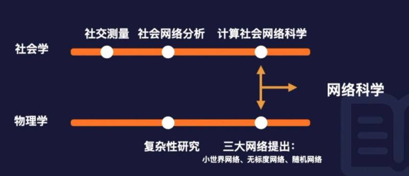
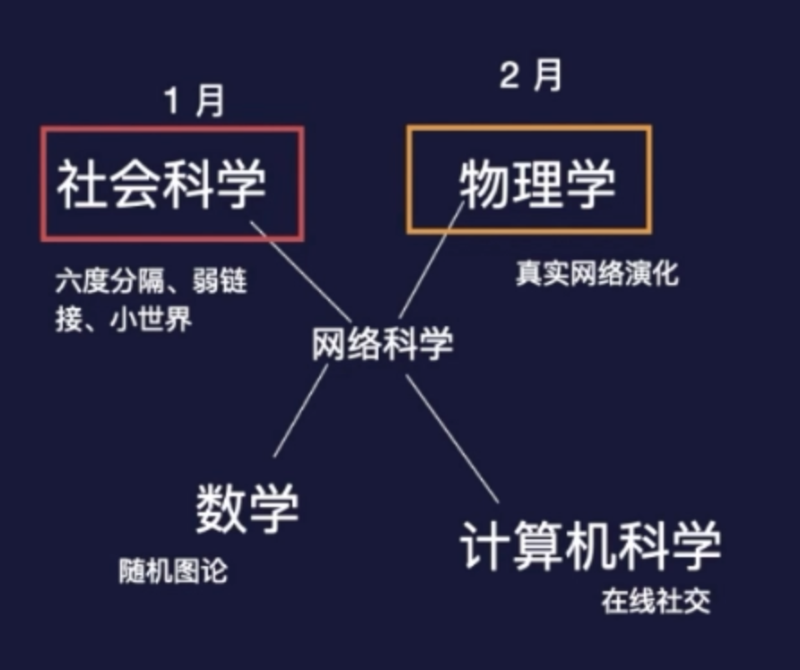

## 0201. 为什么是《网络》？

1 月，我们攻克了四星难度的《社会资本》。2 月，我们将一起学习《网络》。

为什么是牛津通识读本《网络》？为什么关注社会资本，要学习网络科学？

### 1.0 阅读建议

本月度阅读难度不大，作为刚入门接触网络科学的小萌新，建议全本阅读。英文水平不错的同学，建议中英文一起阅读。

阅读导读类图书，重点在于通读完毕后，头脑有一幅完整的知识图景，知道学科源头、学科重点，以及最新学科成果。

心有地图，再借助术语表和参考文献，有的放矢地深入挖掘这门学科。

阳志平老师将网络科学视作五大元学科之一，因为它的规则足够底层，足够兼容无穷大的差异，足够映射尽可能多的世界。日益复杂的当代，网络思维能帮助你化繁为简，用更系统和复杂性的视角去看世界。

### 1.1 回顾社会资本

回顾一下一月的知识，社会资本的定义。

作为概念：社会资本是通过「社会关系」获得的资本；是一种社会财产，它借助于行动者所在的「网络」或所在群体中的联系和资源起作用。

作为理论：对「社会关系网」的更多投入能带来更好的社会资源，这种资源反过来给投入者更多的回报。

回顾一下学术脉络图：社会资本其实是社会资源学派下的一个小分支，它背后的学科是社会网络分析。

换个视角：一月份我们其实是从社会学的角度，简单的接触了社会网络分析，为了更好的理解网络底层的规律，我们需要切换视角，变成从物理学的角度来去看，所以来到了二月份的《网络》。社会学、物理学，发展到现在，它们的交集就是网络科学。

### 1.2 为什么是《网络》

网络科学作为一门独立的学科，只有短短的 20 多年。但最近的 20 多年可以说是网络科学发展的黄金时期。在大约 2015 年，美国国家委员会在它的年度报告中，首次使用了网络科学一词，并且建议美国政府每年投入金费支持该领域的研究，同时也建议把这个领域看成新的独立学科。

网路科学是一门交叉学习，它背后涉及到数学、物理学、社会科学和计算机科学等，数学的随机图论滋润了网络科学的发展，而真实网络的一个演化，大多是通过物理学的角度来研究的。大家常听说的六度分隔、弱连接、小世界等等理论和现象，则来自于社会科学。计算机科学的贡献就更不用说了，提供了强大的研究工具，并且以计算机为代表的信息时代的现下，比如在线社会等等，都是网络科学的研究热门。毫不为过的说，网络科学是我们 21 世纪的学科。

《社会资本》是社会网络分析领域的一个集大成者，整合了格兰洛维特的弱联系、博特的结构洞等等。

在网络科学中，最好的导论是这本《网络》。为啥说它是最好的入门图书呢？近 20 年是网络科学的黄金期，近 20 年也出现了大量的论文和图书，比如《链接》、《大连接》、《社会网络分析》等。

先看下这本书的特点。首先，牛津通识读本是牛津大学出版社出版的一些列丛书，《网络》是关于网络科学主题下的其中一本，跟这个领域相关的还有很多本，比如约翰·霍兰德的《复杂性》、玛格丽特·博登的《人工智能》、凯文·肯尼的《散居者》（从历史学角度写的人口流动相关的）等。

牛津通识系列图书目前（2020-12）出了 600 多本书了。每一本都是关于一个小小的主题。如果在豆瓣以「牛津通识」为关键词你能找到很多该系列的书籍。牛津通识系列最大的特点是权威，由该领域公认的大牛写的。比如《网络》这边书，其中一位作者就是：无标度网络，适应度网络的提出者。圭多教授在网络科学、复杂系统领域是权威学者。

牛津通识系列还有以下特点：1）短小，上手快。2）全书 100 多页。3）双语，很方便去查询专有名词，对一些中文内容比较难理解的地方，结合英文是很有好处的。4）进一步阅读建议。因为定位就是导读，书里的会给出深度阅读的建议。

跟其他书籍的目录对比。1）《社会网络分析》，也是一本不错的导读类图书，它更加注重数据、测量方法，第 2 章是基本概念，4、5、6 都是从统计物理学的角度来介绍网络的。2）同是「牛津通识读本」的目录对比。选用对比的图书是《儿童心理学》，儿童心理学主要是从认知发展、认知情绪发展这两大主线讲的。

这是我目前能找到的关于这个问题的最好的入门书。我还读了该领域专家写的另外三本书。 Barabasi 写的《Linked》，Christakis 写的《Connected》，发现都很肤浅；还有 Kadushin 写的《Understanding Social Networks》，太密集了。我极力推荐这本书，因为它通俗易懂，清晰明了，内容丰富，涵盖面广。一一 美国亚马读者

### 1.3 作者地位

圭多·卡尔达雷利，意大利卢卡 IMT 高等研究院理论物理学教授、意大利国家研究委员会复杂系统研究所成员。主要研究领域为无标度网络、复杂网络以及自相似现象，特别是这些内容在金融和经济系统中的应用（提醒一下大家：在书中可以多留意这部分的案例和理论，比如第 6 章他跟其团队提出了一个模型，适应度模型，描述的是一个网络演化的重要机制，这个机制解释了在搜索领域中，后出现的 Google 能够打败占据优势的雅虎）。著有《无标度网络》（2007）、《数据科学与复杂网络》（2016，与亚历山德罗·凯萨合著）等书，并与人合编有《大尺度网络及复杂网络动力机制》（2007）一书。

我是 Ca' Foscari 的物理学全职教授，也是 LIMS 研究员。

我学习的是统计物理学，1992 年在罗马（La Sapienza）获得学位，1996 年在的里雅斯特（SISSA）获得博学位。在曼彻斯特和剑桥做博士后之后，我首先成为 INFM 的「研究助理」，其次成为 ISC-CNR 的「Primo Ricercatore」，在那里我仍然和许多朋友和同事一起工作。从 2012 年到 2020 年，我一直是卢卡 IMT 的教授。

2019 年，我已经是 SIFS 的创始人之一。

从 2018 年起，我担任复杂系统学会会长。（CSS-复杂系统协会 2018-2021）

从 2016 年开始，我在欧洲物理学会 SNP 分会的理事会中。

备注：CSS-复杂系统协会，创办于 2004 年，主要是欧洲的复杂系统领域的科学家，目的是为了推广复杂系统、复杂科学。

3『

看完书籍已经给圭多做了一张人名卡片。（2021-05-20）

Google 学术：[Guido Caldarelli - Google 学术搜索](https://scholar.google.com/citations?user=RZid9X8AAAAJ&hl=zh-CN)

他目前的 H 指数是 64。（2021-05-20）

个人网站：[Home](http://www.guidocaldarelli.com/)

I am Full Professor of Physics at Ca' Foscari, and a LIMS Fellow. I have studied Statistical Physics and I have got my degree in 1992 in Rome (La Sapienza), my PhD in 1996 in Trieste (SISSA). After Postdocs in Manchester and Cambridge I became firstly「Research Assistant」in INFM and secondly「Primo Ricercatore」at ISC-CNR where I am still working with many friends and colleagues. From 2012 to 2020 I have been Professor at IMT Lucca.

In 2019 I have been one of the founders of SIFS. From 2018 I am the President of the Complex Systems Society. From 2016 I am in the board of the SNP Division of European Physical Society.

Check Latest book SCIENZA DELLE RETI

意外收获的资源：[LIMS | London Institute for Mathematical Sciences](https://lims.ac.uk/)

意大利的圭多·卡尔达雷利教授，是网络科学领域的知名专家，在复杂网络研究中，特别是社会、经济网络的分析和应用中颇有建树。《网络》一书，结合许多生动有趣的案例，如六度分隔实验、空手道俱乐部、万维网、食物链网络、基因调控网络等，深入浅出地介绍了网络科学的发展历程、核心概念和最新进展。书中没有一个数学公式，但通过具体案例的解读，能够让大家科学准确地把握网络分析的基本概念，如小世界性质、无标度网络的异质性、网络中的社团结构、无标度网络的脆弱性和鲁棒性、网络结构与传播的关系等，展现了作者强大的学术功力。可以说，《网络》一书，是大家了解和进入网络科学领域的非常好的一本入门读物。

2『圭多·卡尔达雷利，已下载其著作「2021003Networks」、「2021001Data-Science-and-Complex-Networks」、「2021043Scale-Free-Networks」、「2021044Large-Scale-Structure-and-Dynamics-of-Complex-Networks」、「2021045Networks-in-Cell-Biology」。做一张人名卡片。（2021-02-09）』—— 已完成

』

米凯菜·卡坦扎罗，居于巴塞罗那的自由记者，为英国（《自然》《物理学世界》）、西班牙（《加泰罗尼亚日报》）、意大利（《科学》）等地的媒体撰稿。曾在加泰罗尼亚技术大学（巴塞罗那）获得复杂网络动力机制方向的博士学位。

#### 1.3.1 论文分析

| 题目 | 简单介绍 | 发表时间 | 引用数 |
| --- |  --- | --- | --- |
| Scale-free networks: complex webs in nature and technology | 本书介绍了这些「无标度网络」的实验证据，并为学生和研究人员提供了分析和理解这些特征的理论结果和算法的语料库。 | 2017-05-03 | 1290 |
| The spreading of misinformation online | 通过定量分析，解决制约错误信息传播的关键因素。尤其关注 Facebook 用户如何消费与两种不同叙事相关的信息：科学和阴谋新闻。 | 2016-01-19 | 1252 |
| Scale-Free Networks from varying vertex intrinsic fitness | 本论文提出了无尺度网络的新机制 —— 适应度。该机制显示，话应度更大的节点更容易成为枢纽。 | 2002 | 854 |
| Debtrank: Too central to fail? financial networks, the fed and systemic risk | 一篇关于金系统的违约风险分析。论文通过货款流动，画出了银行间的强连接图。 | 2012-08-02 | 702 |
| A network analysis of the Italian overnight money market | 本文的目的是通过应用于复杂网络的统计力学方法分析欧洲隔夜货币市场意大利部分的网络拓扑结构。 | 2008-01-01 | 587 |

表格中的数据更新时间：2021-05-20。

论文 3 比较重要的，适应度模型，《网络》中也有提到。

论文合著者的分析。

#### 1.3.2 作者擅长领域处于网络科学什么位置

| 网络科学的基本命题 | 作者擅长的知识领域 |
| --- | --- |
| 数据的获取与整理 | - |
| 整体层级指标分析 | - |
| 节点层级指标分析 | - |
| 复杂网络：涌现 | 复杂网络：涌现 |
| 三大网络：小世界网络、无标度网络、随机网络 | 无标度网络 |
| 网络的动态演化机制：适应机制、适应度 | 适应度 |

### 总结

1、通过牛津通识读本《网络》梳理学科重点。

2、演示阅读方法论。

3、通过导读类图书通往更广泛的阅读。