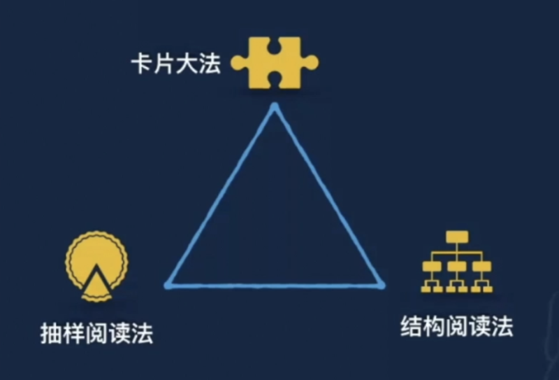

## 0101. 开智阅读方法论

### 01. 开智阅读方法论

你对阅读的所有认识是形成于 18 岁之前的，小学、初中、高中，但在成年人的时间里，你面对的阅读的文本、阅读的要求，和你 18 岁前的阅读习惯，几乎是处处冲突的，所以今天要成为一名好的阅读者，应该要掌握好的阅读方法论。

我之前 20 年在阅读上发了大力，目前家里收藏了 10W 本书籍，甚至买了几套房子去藏书。阅读 1K、1W、10W 本书它面临的数量很不一样，面临的方法论也很不一样。

之前我有提到过两种阅读方法：抽样阅读法和结构阅读法，还有卡片大法。

这三种方法都有其适用的边界条件。1）抽样阅读法特别适合于那种以获取信息为主的非虚构读物。图书有几种形式，第一种是教材、学科前言专著，还有一种是论文合集，还有一种是诗歌、散文、小说集，抽样阅读法特别不适合阅读诗歌散文小说，会非常影响你培养对文字的感觉。阅读诗歌散文小说的方法，我在阅读训练营里称之为「文本细读」。前面的前言专著、教材用抽样阅读法很合适。

### 02. 抽象阅读法三步走

1、理解作者自身审美偏好。

2、定位核心章节。

3、验证内容。

抽样阅读法很像去做科学实验，科学实验常用的方法：先给自己的研究下一个「定义」，接着围着这个定义提出一定的假设，接着再去收集一些列数据，看这些假设是成立了还是被证伪了。

抽样阅读法开始做的假设，对应于「理解作者自身审美偏好」。通过这些假设去找到相应的核心章节，再去想一下，作者的核心章节是验证了你的假设还是推翻了你的假设，这个时候千万不能先入为主的认为肯定是验证了你的假设，这是抽样阅读法执行时很多同学犯的错误。

04.30min

