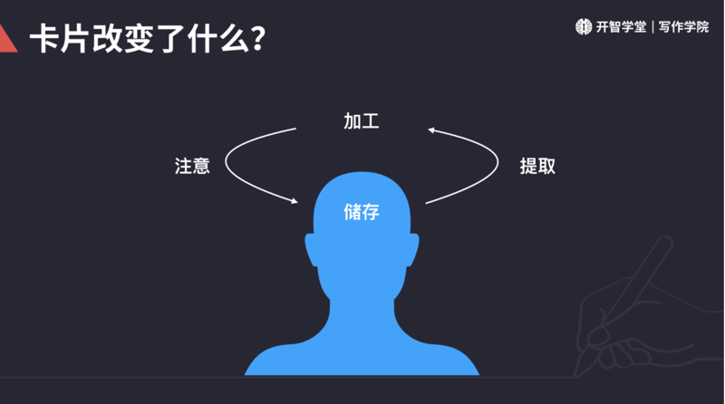

## 0201. 卡片大法初体验

### 汇总

#### 01. 一切皆卡片

你怎么理解「一切皆卡片」？你打算怎么使用卡片大法？

卡片符合人的认知过程，所以各种和积累、记忆、创作有关的工作，都可以尝试用卡片大法。比如完成演讲幻灯、制作音乐、设计、戏剧，甚至一些工厂的管理，人脉管理，都可以用上卡片大法。

#### 02. 众多伟大创作者都使用卡片大法

课程列举的，你印象最深的是哪位？对你有什么启发？

那些用卡片的人：

纳博科夫，二十世纪最伟大的作家之一，公认文体大师。

吴晗，大学三年抄卡片数十万字；一生撰写明史相关卡片 20 万张。

凡尔纳，19 世纪法国小说家，一生写了六十多部大大小小的科幻小说，被称为「科幻小说之父」。

卢曼，社会系统理论创新者。一生著书近 60 本书。写卡片 10 万张。

杰克·伦敦，写成长篇小说 19 部，短篇小说 150 多篇。

Dustin Lance Black，好莱坞金牌编剧，2008 年以《米尔克》一片得奥斯卡金像奖最佳原创剧本。

里根，美国第四十任总统，被誉为「伟大的沟通者」The Great  communicator。

#### 03. 卡片和笔记有什么区别？

卡片和笔记有什么区别？学完了课程视频，请你用自己的话回答，卡片是什么？卡片和笔记有什么区别？

卡片大法以卡片为单位的创作方法。一切封装为卡片，卡片拼接一切。

卡片和笔记有很多不同。一张卡片只写一件事，一件事情写完整，需要标记来源和引用。所以卡片可复用可拼接可溯源，能够把各种资料、各种灵感，任意组织、不断生发，产出作品。既有序又灵活。

笔记边界不清，写起来相对随意，也很少是为了「使用」而记录，最终很可能变成笔记的囤积。

### 04. 卡片改了什么？

卡片改了什么？你怎么理解「卡片改変了大脑注意、储存、提取、加工信息的全过程？」

人脑以组块的方式处理和记忆信息。人脑从长时记忆中调取一部分信息，用于当下的思考，就像是从柜子里把记忆拿到桌上来操作。但人脑工作记忆有限，同时只能处理四个组块的信息。零散、混乱、随机。卡片大法把思考的过程组块化、外化，让信息的输入、记忆、提取、加工效率更高。

专注卡片，降低认知负荷。

必要难度，提升记忆效率。

组块拼接，提高处理信息的量级。

远距联想，提高创意密度。

### 1.1 卡片大法简介

### 1.2 卡片大法初体验

### 1.3 卡片大法是什么

### 1.4 卡片为啥好用

建房子

VS

用卡片大法完成一个写作。已经完成的卡片如同一个个模块，让你可以用建筑师、设计师的视角来写作。

#### 01. 记忆存储和提取

记得快的东西很容易忘记。记得吃力的东西，提取的时候才会更容易。

#### 02. 怎么写卡片容易提取

1、写自己的观点。

2、写完整。

3、从未来能用的角度写。

#### 03. 组块拼接，提高处理信息的量级

工作记忆。人类舒服的工作记忆不超过 4 个组块。同样是 4 个组块，卡片能帮你处理更多的信息。

#### 04. 远距离联想，提高创意密度

人类大脑具有很强的联想能力，联想分为近距联想和远距联想。

距离指时间空间上的距离；也指语言

储存 => 提取 => 加工 => 

卡片还有什么应用场景？

一切皆卡片。

对杰克来说，世界上最最重要的

——《杰克伦敦传》

### 小结

卡片是一种创新装置。

卡片大法底层的认知科学原理：1）
