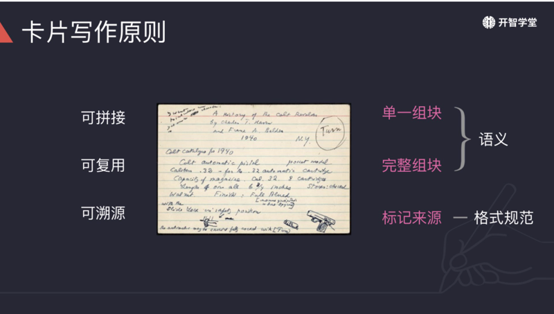
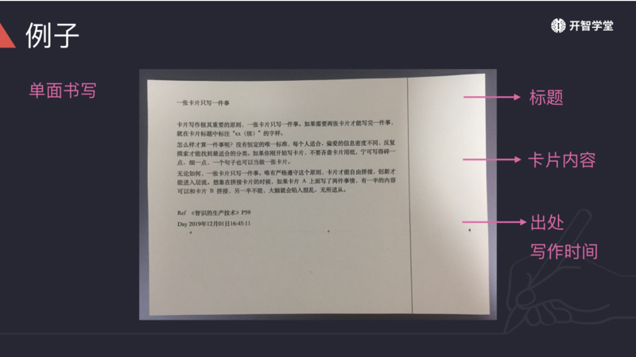
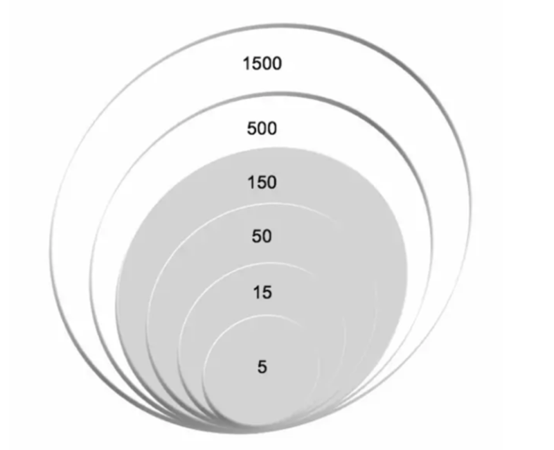
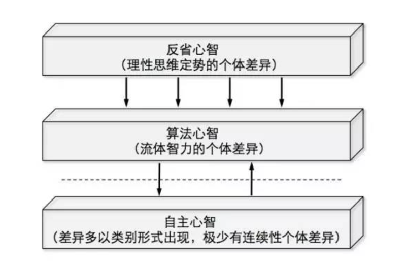

## 0202. 写一张卡片

### 汇总

#### 01. 三种其它卡片

学习完以上四种卡片，还有另外三种卡片，它们也较为常见。练习完前四种卡片后，也来挑战下这三种吧。1）图形卡。图形表征信息直观清晰透彻。2）人名卡。追寻前人道路紧跟时代脉搏。3）技巧卡。积累所学技巧用于实际生活。

#### 02. 人名卡

介绍阅读中出现过的人名，作者、作者推崇的人、作者同时代的人。注意他哪个时代出生的人物，大家会高估同一个时代天才的数量，却会低估人类历史上天才的智慧。

卡片示范：

罗伯特·艾伦·比约克（必要难度）

1994 年，美国心理学教授罗伯特·艾伦·比约克首次提出必要难度（Desirable Difficulty）理论。他是加州大学洛杉矶分校心理学教授，研究领域集中在学习记忆和正确教学的科学依据。著有多篇论文，多篇论文引用过千。

Ref Wikipedia、Google Scholar 和阳志平《聪明的学习者》。

Date 2019-12-10

#### 03. 卡片写作原则

卡片原则只需要单面书写。写卡片时应遵循以下原则：1）单一组块：一事一卡。对初学者，宁可将要点写得更加细致，更容易寻找到合适的表达范围。2）完整组块：使用完整的句子表达，间隔很久重读卡片，依旧能快速回顾。3）标记来源：便于追溯来源，尊重知识产权。

#### 04. 卡片格式规范

遵循一定的格式规范，会让卡片更易调用。回忆一下，好卡片应该遵循哪五个格式规范呢？哪一点需要格外注意。

好卡片应遵循的规范：1）取个标题。直接选取文中一句话也可。2）标注时间与出处。3）用 `>` 标记引用，区分他人观点与个人观点。4）系列编号。如果同一主题，写了多张卡片，可以用 n/N 的形式标注系列序号。比如系列共有 8 张，此为第 3 张，则标注 3/8；如果有两张，第二张可标记 xx（续）字样。5）单面书写。

应该格外注意第三点，区分原始数据与演绎数据。

1-2『自己之前竟然忘记了这一点，原始数据和演绎数据全部混在一起了，以后写卡片一定要分开。（2021-01-06）』

#### 05. 卡片的三个特点

观看完视频，请你回忆，一张好卡片会有哪些特点？

在运转良好的卡片系统里，一张好卡片会有以下特点：1）可拼接：卡片可以自由拼接成文章、幻灯、书信、演讲稿等；两张卡片可以碰撞出新的火花。2）可复用：在不同时间、空间，不同场景上，可以重复使用。3）可溯源：只要拿起卡片，就能快速回忆当时思路；可以根据标记的出处，追溯知识源头。

#### 06. 卡片的工具准备

卡片分为纸质与电子，纸质推荐使用京大型卡片（或开智大卡），电子以便于使用为主，MacOS 系统可使用自帯的笔记软件，安卓系统可使用印象笔记、为知笔记等工具。本章重点讲解单张卡片创作，后续章节会更详细介绍电子卡片与纸质卡片的区与使用。

#### 07. 卡片自由多样

为辅助你上手书写卡片，课程为你拆解出 4+3 中不同卡片类型写法。但注意，卡片自由多样，不必拘泥于这些类型，可自由发挥撰写各式卡片。不同卡片类型有不同信息结构。同样，这些信息结构只是为了辅助你将卡片写得更加充实，并非卡片最终形态。实际写卡片，应尽量完成可读性强的文字卡片，而非清单卡片。清单卡片不利于记忆，也不利于快速调用。

『

写可读性高的卡片。

技巧：给女朋友/男朋友/家人写信，可以提升社会意向性。

原理：给他人写信时，需要努力选择合适的表达，让对方能够不致误解。练习得多了，社会意向性就高了。

出处：阳志平老师《快写慢改训练营》一期答疑。

更改为：

如何提升社会意向性？阳老师介绍了一个方法，多给女朋友/男朋友/家人写信。给他人写信时，你需要努力选择合适的表达，让对方能够正确理解你的意思。练习得多了，你的社会意向性就提高了。

』

#### 08. 反常识卡

反常识卡：拓展认知边界。

每个时代的「常识」都是帮助人类降低认知负荷，提高社会运转效率，但是恰怡是这些「常识」也妨碍了你的认知。因此，你需要时不时借助鲜活证据来拓展认知边界。

信息结构：常识、反常识、例子、出处。

卡片示范：

教是更好的学

很多人认为，只有具备足够知识，才有资格去教別人；如果自己懂得不够多，不能确保自己理解足够正确，就不要去教别人；教只是属于老师的事情，学习者好好听讲就可以了。然而，《如何优化学习方法》告诉我们：教的过程会加强记忆提取强度，学习效率反而更高。

费曼也曾经介绍过这种学习技巧。设想一种场景，你正要向别人传授在白纸上写下你对某个概念的解释，就好像你正在教导一位新接触这个概念的学生一样。当你这样做的时候，你会更清楚地意识到关于这个概念你理解了多少，以及是否还存在理解不清的地方。

Ref《如何优化学习方法》P10 

Day 2019-12-10

#### 09. 四种重要卡片

了解完卡片写作原则和规范后，来学习不同类型卡片书写吧。接下来，你将学习以下四种卡片，它们更加常见，也更易上手。

反常识卡：提供鲜活证据，拓展认知边界。

术语卡：抵达知识源头，获取一手资料。

金句卡：收集性感句子，积攒优美表达。

行动卡：关注行动机会，实践形式知识。

#### 10. 图示卡

明确以图示形式出现的信息，或可以图示表征的信息。

信息结构：图示、理解、出处。

卡片示范：

邓巴数字

按照英国进化心理学家邓巴的研究，人类远古狩猎-采集时代到近代，你的社交网络始终由一系列层层包含的圏子构成，每个层次都比它相邻的内部层次大三倍。你可以按照亲疏远近，将这些圈子分为亲密朋友（最里层的 5 人）、最要好的朋友（15 人圏）、好朋友（50 人圏）、朋友（150 人圏）、认识的人（500 人圈）以及脸熟但叫不出名字的人（1500 人圏）。最为内部的四个层次（到 150 人圏），一半是家人半是朋友。超过 15 人之后，変为纯随机认识，没有ー人是家人。如下图所示。

Ref《全局学习法》P10 

Day 2019-12-10

2『中文书的电子目前没找到，只找到原文书籍，已下载书籍「2021017Making-Learning-Whole」。（2021-01-17）』

#### 11. 常用图示结构

图示化文字信息，有哪些常用的图形结构？以下「二三四五」四类图形结构，供你参考。

二：存在两个对比鲜明的要素。如：外部控制与自主性控制。

三：角形金字塔。如：三重心智模型，斯滕伯格爱情理论。

例 1：

例 2：

四：2x2 矩阵。如：道格拉斯的群格理论。

五、六：五边形、六边形。大五人格，霍兰德职业兴趣测试。

例 1：

例 2：

更多图示结构，可参考：麦肯锡图表模板。

2『已下载附件「0202附件1-麦肯锡图表模板」，存入专栏附件。（2021-01-07）』

#### 12. 技巧卡

书中介绍的行动小技巧。

信息结构：技巧、原理、出处。

卡片示范：

写信提升社会意向性

如何提升社会意向性？阳老师介绍了一个方法，多给女朋友/男朋友/家人写信。给他人写信时，你需要努力选择合适的表达，让对方能够正确理解你的意思。练习得多了，你的社会意向性就提高了。

Ref 阳志平老师《快写慢改训练营》一期答疑 

Day 2019-12-10

#### 13. 术语卡

阅读中出现过的学术术语或者作者特定黑话。你需要找到最原始的论文或者资料，知道是谁第一个提出这个术语，比如「元认知」、「自主心智」、「心智程序」等是谁提出来的，一旦养成这种习，就会增强你的独立思考能力。

信息结构：定义、理解、例子、出处。

卡片示范：

全局理解

帕金斯将二次元方程那些只适用于特定场景的知识称之为「利基理解」，与之相反的则是「全局理解」。「全局理解」具备四个特点：第一，它是跟行动关联的；第二，它提供了深刻见解，能够帮助我们理解物理、艺术、社会等不同世界的运作；第三，它能在不同场景下复用；第四，它追求真善美，传承人类美德。

你如何帮助宝宝构建「全局理解」？比如你想帮助孩子理解什么是「民主」。当孩子与朋友发生冲突时，不要直接告诉他应该怎么样，而是模拟民主的过程，父亲、母亲与孩子一起商量解決方案；反过来，当父母有矛盾，让孩子来仲裁，这就是「全局理解」的多场景、行动维度。

Ref《全局学习法》P10 

Day 2019-12-10

1『印象中，王烁就是这么教育他家孩子的。（2021-01-16）』

#### 14. 注意事项

初次上手写卡片，你可能遇到很多阻碍。这是一些小提醒。

1、信息点不是信息点：表达要点不够清晰，信息点价值不高。应对方法：提升信息品味；参考卡片类型择取信息，依据卡片类型对应的信息结构组织内容。

2、信息点边界不清：表述不清，将多件事混在一起说。应对方法：依据卡片类型对应的信息结构组织内容；使用图示厘清不同概念、不同层次、不同问题。

3、联想和应用不够：所写内容不够充实。应对方法：依据卡片类型信息结构多思考；思考知识在不同场景的运用；与他人交流。

4、没写就觉得拼接不起来。担心目前所写卡片未来无法拼接。应对：有这种感觉很正常，不用担心；只要跟着课程走，你也能体会到卡片拼接的快乐。

#### 15. 用图形化的方式表征信息

小贾在学过 3D 建模的小乙面前晃荡时，小乙看小贾可能是这样的：

小乙能够看到他的头发、皮肤、微笑，也能看到背后的结构 —— 双手双脚，脊柱是核心的支撑，从脖子后面直延伸到腰背以下。走路的时候，腓肠肌、比目鱼肌等肌肉互相配合，完成这个看似简单的动作。

在血肉之躯的背后，是抽象出来的结构。信息（文本）也是如此，一个个象形文字的背后，也潜藏着某种结构。《风格感觉》作者史蒂芬·平克曾说，「写作是将网状的思考，变成树状的结构，用线性的语言表达出来。」这暗示了，文本一般以线性的方式呈现，但背后可能有不同的结构。

比如《智识的生产技术》P57-58 有两段话：

再简短的论文也一定要加上「标题」。只要在卡片的顶上一栏写上标题，检索起来就十分方便。「标题」虽然也可以采用短小论文的标题，但是，倒不如选取所记载内容的一行文字当作标题更加直截了当。

剪切过的底片如果没有印上拍摄日期与顺序编号，其前后关系往往就会莫名其妙了。同样道理，卡片书写也应该养成标明日期的良好习。我采用的方式是，在卡片的左下角标注日期。另外，还有同事项接连占用很多张卡片的情況。届时，就要编写系列流水号。譬如，同一事项接连有 8 张卡片的时候，第三张卡片 就编号为 3/8。我是在卡片的右上角标出。

这两段话解释了一张卡片不同位置写什么内容。写成卡片时，如果绘制一个图示，上面的信息就一目了然。如图所示：

2『已下载书籍「2019920智识的生产技术」。这本书不厚的，感觉挺对自己胃口，抽时间研读。（2021-01-16）』——未完成

#### 16. 行动卡

从阅读中获得的行动启发。

信息结构：原理、行动、出处。

卡片示范：

实践卡片大法

相对传统的词汇、段落，卡片是更优越的组块。对它来进行记忆、创作与修改，而非对最原始的词汇进行记忆、创作与修改，是超一流作家普通掌握的写作秘笈。不同卡片拼接在一起，容易激发远距联想，产生新的创意。

最开始实践卡片大法，我给自己提了三个要求：1）随身携带纸质卡片，每天记录一个小观察；2）将不同来源的内容统一写成卡片，第一阶段先积累 100 张；3）统一存放，当写够 30 张、50 张、80 张、100 张时，从中抽取卡片，至少写出三篇不同的文章。

Ref 阳志平《纳博科夫的卡片》公众号「心智工具箱」

Day 2019-12-10

#### 17. 金句卡

文章中性感的表达，或点明主旨，或美感十足，或发人深省…...任何吸引你的句子。

信息结构：金句、赏析、出处。

卡片示范 1（纯摘抄）

世间好物不坚牢，彩云易散琉璃脆。

Ref 杨绛《我们仨》

Day 2019-12-10

卡片示范 2（附理解）

杨绛的丈夫、女儿都先自己而去，杨绛只道「世间好物不坚牢，彩云易散琉璃脆」。

世间好物，是飘荡的彩云，是晶莹的琉璃，也是他们相伴一世的温情。

Ref 杨绛《我们仨》

Day 2019-12-10

### 2.1 卡片写作工具

### 2.2 卡片写作原则

### 2.3 四种卡片

### 2.4 其他卡片

### 2.5 注意事项

