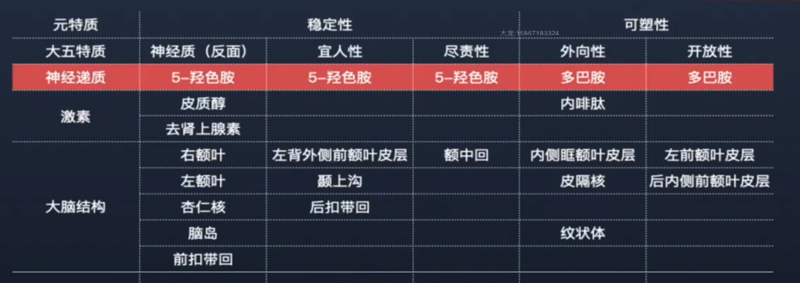

## 0202. 人格特质

本节说明：

人类究竟存在多少人格特质？在了解人性系统论的人格特质模型前，我们先穿越一段历史。这段历史关于心理学家对特质数量和种类的争论。

你将了解到：1）人格特质研究的历史演进。2）大五人格模型。3）大五人格模型的神经证据。

大五人格的神经科学证据：

1、与多巴胺相关的大五人格特质：外向性和开放性；

2、与 5-羟色胺相关的大五人格特质：神经质（情绪稳定性）、宜人性和尽责性。

旁白『

古典人格心理学认为：人格特质在人格心理学中扮演了无与伦比的作用。（已经被修正了）

』

本节说明：

在大五人格模型基础上，阳志平老师进一步修正与整合，提出人格特质的二五模型：什么是二五模型？

### 什么是人格特质

1、特质是用来描述某人的行为特点的描述词。

2、比如：内向的、外向的？情绪稳定的不容易发脾气的、情绪不稳定的容易发脾气的？做事负责的？做事不负责的？

旁白『

』

### 都有什么人格特质模型

人类究竟存在多少种人格特质？

奥尔波特：共同特质、人格特质（首要特质、中心特质、次要特质）。

卡特尔：人格 16 种因素模型。

艾森克：三因素 PEN 模型（神经质、外向性、精神质）

除此之外，当然还有其他很多。

### 人格特质研究的历史演进

目前学界达成广泛共识，人格的五因素，即神经质、外向性、尽责性、宜人性和开放性能够最有效地解释人格。

特质单元选用大五人格模型。

### 什么是大五人格模型

两种研究维度都指向了大五人格模型。

词汇学研究：

第一种研究路径是继承了奥尔波特卡特尔的词汇学研究取向。把英语词典中所有描述人的行为模式的词汇都找出来，再采取因素分析技术提炼因素，最终提炼出大五人格，再按罗马字母排序。

这是词汇学研究取向的大五人格模型。

理论学研究：

第二种研究取向是，麦克雷和科斯塔在艾森克的三因素基础之上，1983、1985 年，编制了 NEO 问卷测试神经质（N）、外向性（E）和开放性（O) (McCrae& Costa,1983,1985)。开放性和艾森克的精神质是接近的。

测试的过程中，他们发现还有两个非常重要的行为模式的描述，就是宜人性和尽责性。1992 年，他们加入测量宜人性（PI）和尽责性（R）问题（NEO-P-R; McCrae&Costa,1992），形成今天的五因素模型。

宜人性有时候也翻译成包容性、相容性，尽责性有时候也翻译成一致性。

### 大五人格模型的普遍存在

NEO-P-R 这个人格测量工具被大量使用后，心理学家发现一个有意思的现象，不同文化中都存在大五模型。

比如，中国大学生和美国大学生在《NEO 人格问卷（修订版）》中的表现几乎完全一样（AcCare, 1996）。同样，在德语、希伯来语、汉语、土耳其语的测试中，都发现人格结构的五个因素。

大五人格模型：OCEAN 模型（表格）

| 大类 | 人格 | 特点 | 高分典型描述 |
| --- | --- | --- | --- |
| Openness | - | - | - |
| Conscientiousness | - | - | - |
| Extraversion | - | - | - |
| - | - | - | - |
| - | - | - | - |

### 为什么选择大五人格模型

| 挑选标准 | 跨文化证据 | 神经科学证据 | 遗传学证据 |
| --- | --- | --- | --- |
| 大五人格模型 | 满足 | 满足 | 满足 |

旁白『

』

为什么选择大五人格模型：跨文化证据

无论是理论取向的五因素模型，还是词汇取向发现的大五人格，「两者的之间的相似性远远多于差异性」（麦克雷&科斯塔，1985，p.720）

大五人格模型具有跨文化存在证据，如中国大学生在《NEO 人格问卷（修订版）》与美国大学生几乎完全一样（McCare, 1996）；在德语、希伯来语、汉语、土耳其语的测试中，都发现大五的五个因素。

为什么选择大五人格模型：神经科学证据

外向性与内侧眶额叶皮层的体积共同变化，该区域主要参与处理奖赏信息。

尽责性与外侧前额叶皮层的体积共同变化。外侧前额叶是一个参与计划和自愿控制行为的区域。

旁白『

』

神经质与威胁、惩罚和负面影响相关的脑区区域体积共同变化。主要涉及到背内侧前额叶、扣带回/尾状核等几个脑区。

宜人性与社会脑相关，即处理他人意图和精神状态信息的区域有关，包括颞上沟、后扣带回皮层这些脑区。

开放性与大脑结构没有明显关系。

旁白『

为啥没明显关系？开放性的定义不清晰。

再来看看神经递质方面的神经科学证据。（详见视频中的图片）

』

注释：5-羟色胺是一种神经递质，对抑制行为冲动发挥重要作用。最早是从血清中发现的，又名血清素。

为什么选择大五人格模型：遗传学证据

5-羟色胺短缺会影响一些情绪障碍，包括从抑郁到焦虑和社交恐惧。5-HTT 基因影响 5-羟色胺，它具有两个变量，即长的和短的等位基因。拥有短等基因的个体在神经质测量中得分较高。（Canli, 2007)

COMT（catechol-O-methyltransferase，儿茶酚胺氧位甲基转移酶）的基因最近被发现与前额叶皮层的高多巴胺水平、外向性与推理能力有关。（Valker et al. 2012）—— 这个发现尤其令人激动，因为它表明基因、神经递质、人格特质和智力四者之间存在关联。（大卫·范德）

### 修正与整合：二五模型

与多巴胺相关的大五人格特质：外向性和开放性。

稳定性：

1、行为模式的一致性，不因人而异因时而异因情境而异，与 5-羟基胺紧密相关。

2、对自己的稳定性：神经质（情绪稳定性）。

3、对他人的稳定性：宜人性。

4、对观念的稳定性：尽责性。

可塑性：

1、行为模式的弹性（可变性），主动适应并调整，多与多巴胺紧密相关。

2、对人的可塑性：外向性（是否容易主动将别人纳入自己的行为模式）。

3、对观念的可塑性：开放性（是否容易将）

表格：

### 开智开发的有关二五模型的产品

人性卡牌是什么

人性卡牌：人格特质。

人格特质评估系统：例题

人格特质评估系统（Q 分类版）：例题

### 人格特质的 AB5C 模型

从单一特质到复合特质。

旁白『

我们人的人格特质不是单一的特质，是有多个特质组合在一起的。

』

两两组合不同的子维度：AB5C 模型。组合出来 45 种主要的特质。

### 从大五人格特质到人格障碍

1-3『这一小结的内容很多源自书籍「2022010极简个性心理学」。（2022-02-19）』

表格：

| 大五人格特质 | 极值 | 人格障碍 |
| --- | --- | --- |
| - | - | - |
| - | - | - |
| - | - | - |
| - | - | - |
| - | - | - |
| 神经质+开放性 | 高神经质+高开放性 | 分裂症 |

Top10 人格模型：对自己和他人的看法

小结：

