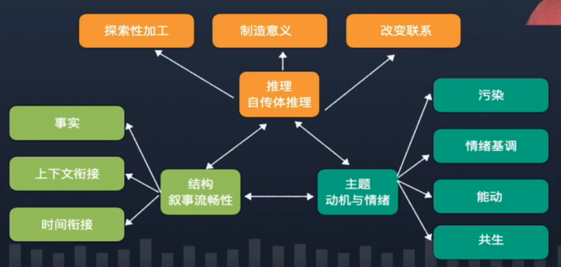
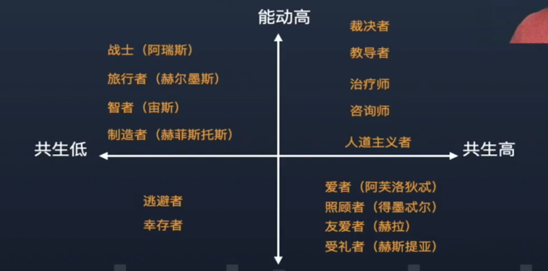
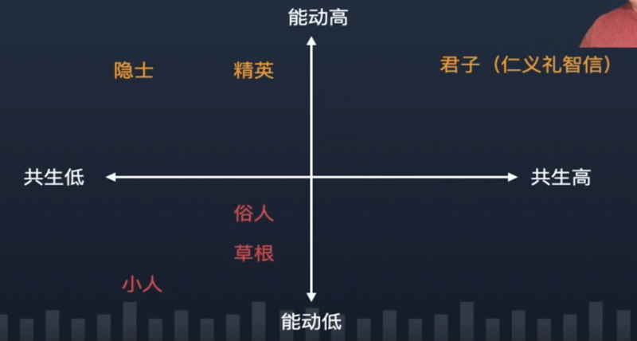

## 0301. 叙事同一性的形成

本节说明：地球上有多少个人，就有多少个人生故事。如何理解人生故事呢？这就是本节视频要探讨的内容：叙事同一性的形成。

旁白『

前面学习了叙事同一性的概念定义以及其背后的科学原理。叙事同一性指的是我们用讲故事的形式来回答「我是谁」。将自己的过去、现在和未来整合在一起。

』

### 前言

地球上有多少个人，就有多少个人生故事。

如何来理解人生故事呢？

理解人生故事我们有无数种视角。

### 2016 年的一篇论文总结

The Incremental Validity of Narrative Identity in Predicting Well-Being: A Review of the Field and Recommendations for the Fucture.

Adler at al, 2016

Agency, communion, valence, redemption, contamination, closure, coherence  (at least three kinds), exploratory processing, growth goals, integrative and intrinsic memories, positive and negative meaning-making, elaboration, sophistication, accommodative processing, differentiated processing, ending valence, affective processing, intimacy, foreshadowing, complexity  (see Adler et al.,2016).

主要的四类：affective themes, motivational themes, themes of integrative meaning, and structural elements.

这四类人生叙事对幸福感格外重要。

旁白『

论文是从语言学的结构的角度来理解人生故事的。

人生故事中，是什么样的叙事基调，语气是欢快还是悲伤，是积极还是消极，是高昂还是消沉。

还有一种语言学的结构特征，上下文是不是紧密联系在一起，情节是不是合理。

还有一种是主题上，它是关于权力的故事还是关于爱的故事，是关于能动的故事还是关于共生的故事。

上面论文把分析的角度分为 4 大类。1）情感主题（情绪主题）。2）动机主题。3）制造意义主题。4）结构因素主题。

这里是有一个「前置」知识的。什么样的叫情感主题，专指在救赎和污染序列里的。动机主题专指能动和共生主题里的。

』

这么多叙事分析角度，是否能像人格特质、认知能力、动机偏好一样简化呢？

答案是显而易见的。

### 人生叙事的「大三」模型

1、动机和情绪主题。1）你表达的自主性和与他人联结的程度；2）故事整体是积极的还是消极的；3）故事的走向：是一手好牌打烂，还是不尽人意条件下创造出圆满大结局。

2、自传体推理。故事提及的经历中，1）有多少反思。2）是否在发生的事情中找到意义。3）是否在已经改变和未改变的事件之间找到联系。

3、结构。根据时间线、事实和背景，故事在多大程度上能说得通。

旁白『

1、主题类的动机和情绪。一个人的自主性和与他人联结的程度，即能动和共生。故事的整体走向是积极还是消极。一手好牌打烂，偏污染，还是不尽人意条件下创造出圆满大结局（屌丝逆袭/救赎）。

2、自传体推理。前面说的探索性加工，创造意义，改变联系。

3、结构。

全世界最好的人生叙事领域的科学家，联合在一起，发表了一篇论文，拿实际的数据进行测试，发现了最重要的分析维度，整合之后，按照大三的模型来归类。

』

主题：动机和情绪。污染、情绪基调、能动、共生。

推理：自传体推理。探索加工、制造意义、改变联系。

结构：叙事流畅性。事实、上下文衔接、时间衔接。

#### 大三模型的优缺点

优点：

1、人生叙事研究领域最主要的实验室的联合出品，代表整个领域的初步共识。

2、通过三个研究，进行数据验证，最终确定了两个模型，一个称之为景观模型；一个称之为功能模型。

缺点：

1、理论与数据不能很好匹配，因此，出现了景观模型与功能模型的差异，景观模型总计包括 6+6+3=15 个子维度；功能模型总计包括：3+3+3=9 个子维度。

2、如果采用景观模型，太繁琐；如果采取功能模型，划分维度的理论依据开始丢失。

旁白『

大于 5 的模型都是过于繁琐，基本会被淘汰。

』

人生叙事的「大三」模型果然是初步工作。

#### 大三模型更严重的问题

四个层次的话题：

1、同一性的结构是什么？

2、人们是如何通过讲故事的方式形成同一性的？

3、人们是如何评价自己的人生故事（或叙事同一性）的？

4、人们是如何评价他人的人生故事（或叙事同一性）的？

旁白『

这些科学家没有注意到一个问题：他们做的工作其实是把人生叙事领域所有重要的工作都汇总到一起，使劲发问卷，试图拟合出一个很好的模型。这显然会出现测量时常见的垃圾数据进垃圾数据出的现象，他们收集的这些重要的分析人生叙事的指标，它来自四个不同的层次。

1、同一性的结构是什么？比如同一性结构，会涉及同一性的推理，又细分为自传体推理等细分。

2、人们是如何通过讲故事的方式形成同一性的？这涉及到讲故事时，有不同的故事主题，还有情绪的变化。

3、人们是如何评价自己的人生故事（或叙事同一性）的？

4、人们是如何评价他人的人生故事（或叙事同一性）的？这个时候会涉及到结构性的评价，比如说，我觉得这个故事他讲的太简单了，讲的太复杂了，他的故事听上去太假了，很难让人信服。他的故事太逼真，太感人了。

』

你既是传记作家，也是传记读者，还是文学评论家；你既是导演，也是演员，还是影评家。

上面不同的角色采取的评价体系是不同的。

### 人生叙事：一一模型

过去、现在、未来

我，还是，我

我们更关心人们是如何通过讲故事的方式形成同一性的？

#### 那些人性的变与不变

不变的：

1、生理指标：体重；性别。

2、人格特质：改变相对困难。

变的：

1、认知能功：理商。

2、动机偏好：变变变。

3、情绪/语言：变变变。

旁白『

认知能力里的感商变化难度比较大，智商到了 18 岁变化难度也比较大，理商的话可以不断提高的。

动机偏好我们是经常发生变化的，甚至大的动机偏好在 3 年内也出出现积极或者消极的变化。

情绪会随着情景的变化而变化；语言也会经常变化。

』

人的自我同一性，主要在知、情、意、言四条时间线上变化。

旁白『

知主要指认知。认知上主要通过变化和稳定来整合自己的同一性。多个可能的自我。

情主要指情绪。情绪上主要是通过光明和黑暗。

意主要指意图。动机上主要是通过能动和共生。

言主要指语言。语言上主要是通过生涩和流畅。

』

过去、现在、未来

我，还是我，但是更复杂（有趣/成熟/......）的我

#### 叙事同一性的形成：四种整合

1、认知整合。变化/稳定。

2、情绪整合。光明（积极、乐观）/黑暗（消极、悲观）

3、动机整合。能动/共生。

4、语言整合。生涩/流畅。

什么是动机整合？

动机整合是指你创作新的意象原型对同一性进行整合。

一个简单（无趣/幼稚......）的主角 => 一个复杂（有趣/成熟）的主角。

旁白『

过去的你，是一个简单（无趣/幼稚......）的自己。随着你年龄越来越大，经历的事越来越多，读的好书越来越多，做的大事越来越多。你会发现自己成为了传记，变为更复杂的角色。

』

枯藤老树昏鸦，小桥流水人家，古道西风瘦马。夕阳西下，断肠人在天涯。

#### 从意象到意象原型

意象（image）是你接触过某个事物后，它在你的脑海中的印象。比如，关于「我是谁？」，我们会留下大量意象：偏能动的，那么有爸妈的争吵；偏共生的，有人际和谐的。诸如此类不等。

意象原型是在诸多意象基础上，形成的一个拟人化的形象。以传记为隐喻，意象原型是一类高度概括的角色形象。简单来说，是你的人生故事的主角。

意象原型深受文化影响。

旁白『

』

西方文化流传的意象原型：

中国文化流传的意象原型：

1、儒家文化。君子还是小人？

2、道家文化。隐士还是俗人？

3、现代商业文明。精英还是草根？

旁白『

孔子。

孟子。

仁义礼智信。

道家更推崇逍遥。

庄子。

受西方文化（商业文明）影响的第三类。

精英可以是君子或小人。

两套并行的系统。

』

人性迷人之处在于相互冲突的地方，只有人可以兼容不同的动机冲突。

旁白『

』

